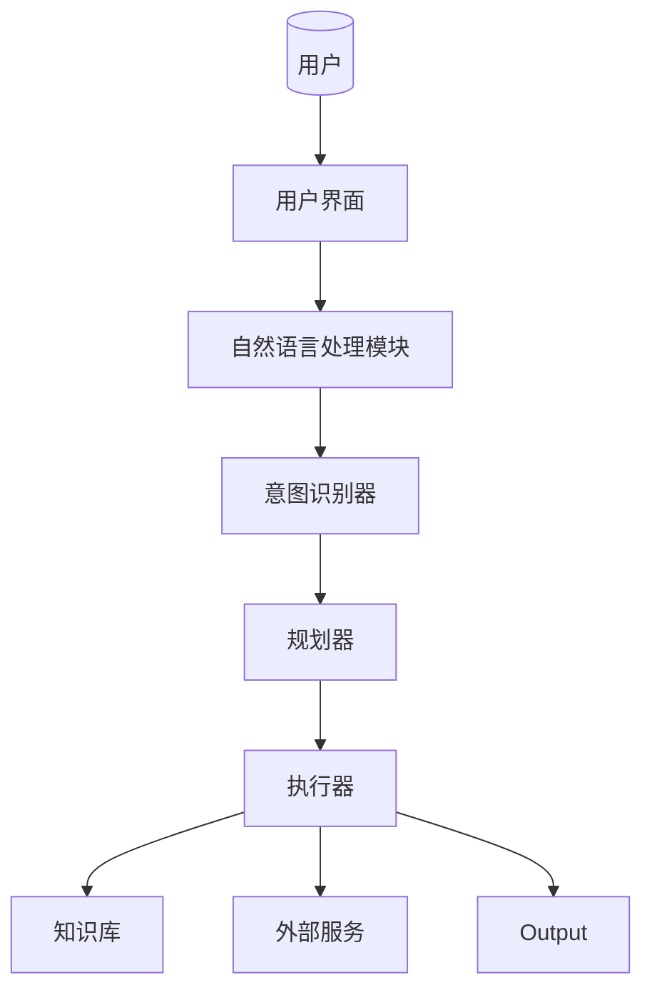
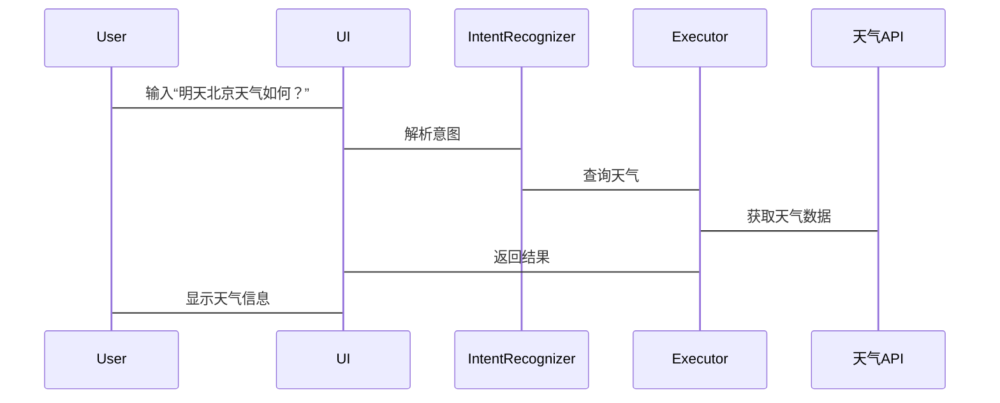

                 


# 虚拟助手 AI Agent：打造基于 LLM 的数字人

> 关键词：虚拟助手，AI Agent，LLM，大语言模型，数字人，人工智能，系统架构

> 摘要：本文将深入探讨如何基于大语言模型（LLM）打造虚拟助手 AI Agent。通过分析 AI Agent 的核心概念、算法原理、系统架构以及项目实战，结合丰富的案例和详细的代码实现，帮助读者全面理解并掌握基于 LLM 的数字人开发。

---

# 第一部分: 虚拟助手 AI Agent 的背景与概念

## 第1章: 虚拟助手 AI Agent 的定义与背景

### 1.1 虚拟助手的定义与分类

#### 1.1.1 虚拟助手的定义
虚拟助手是一种能够通过自然语言处理技术与用户进行交互的智能系统，能够理解和执行用户的指令，提供信息查询、任务执行等服务。虚拟助手可以以文本、语音或图形界面的形式呈现。

#### 1.1.2 虚拟助手的分类
- **基于规则的虚拟助手**：通过预定义的规则和关键词匹配来执行任务。
- **基于机器学习的虚拟助手**：利用机器学习模型（如自然语言处理模型）来理解和生成文本。
- **基于大语言模型（LLM）的虚拟助手**：结合大规模预训练语言模型，具备更强大的理解和生成能力。

#### 1.1.3 虚拟助手的应用场景
- 智能客服
- 个人助手（如 Siri、Alexa）
- 健康管理助手
- 教育辅助工具

### 1.2 AI Agent 的核心概念

#### 1.2.1 AI Agent 的定义
AI Agent 是一种智能体，能够感知环境、理解用户意图，并通过决策和行动来实现目标。AI Agent 可以是独立的实体，也可以是嵌入在其他系统中的模块。

#### 1.2.2 AI Agent 的核心特征
- **自主性**：能够独立决策和行动。
- **反应性**：能够实时感知环境并做出反应。
- **学习能力**：能够通过经验优化自身性能。
- **交互能力**：能够通过多种方式与用户或系统进行交互。

#### 1.2.3 AI Agent 与传统虚拟助手的区别
| 特性 | 传统虚拟助手 | AI Agent |
|------|----------------|------------|
| 决策能力 | 基于规则的简单决策 | 基于模型的复杂决策 |
| 学习能力 | 无或有限 | 强大的学习能力 |
| 适应性 | 固定功能 | 高度适应环境变化 |

### 1.3 大语言模型（LLM）在 AI Agent 中的作用

#### 1.3.1 LLM 的定义与特点
- **大语言模型**：一种基于深度学习的自然语言处理模型，通常使用Transformer架构，通过大量数据预训练而成。
- **特点**：
  - 大规模参数（如GPT-3的175B参数）。
  - 能够理解和生成自然语言文本。
  - 具备上下文理解能力。

#### 1.3.2 LLM 在 AI Agent 中的应用
- **意图识别**：通过LLM理解用户的输入，确定用户的意图。
- **对话生成**：基于LLM生成自然的对话回复。
- **知识问答**：利用LLM的知识库回答复杂问题。
- **任务执行**：通过LLM生成中间表示，执行复杂任务。

#### 1.3.3 LLM 与 AI Agent 的结合方式
- **端到端生成**：用户输入直接通过LLM生成响应。
- **分阶段处理**：LLM用于意图识别和任务规划，再由其他模块执行任务。

---

## 第2章: 虚拟助手 AI Agent 的技术基础

### 2.1 大语言模型（LLM）的核心原理

#### 2.1.1 LLM 的训练过程
- **预训练**：使用大规模数据（如书籍、网页）进行无监督学习，目标是预测文本中的下一个词。
- **微调**：在特定任务（如问答、对话）上使用小数据进行有监督学习。

#### 2.1.2 LLM 的推理机制
- **自注意力机制**：通过计算输入文本中各词之间的关系，生成上下文表示。
- **解码器**：根据输入生成输出序列。

#### 2.1.3 LLM 的模型结构
```mermaid
graph TD
    Input --> Tokenizer
    Tokenizer --> Embedding Layer
    Embedding Layer --> Transformer Blocks
    Transformer Blocks --> Output
```

### 2.2 AI Agent 的算法原理

#### 2.2.1 AI Agent 的任务分解
- **输入处理**：接收用户输入并解析意图。
- **决策规划**：根据意图生成行动计划。
- **任务执行**：执行计划中的任务并返回结果。

#### 2.2.2 AI Agent 的决策机制
- **基于规则的决策**：通过预定义的规则进行决策。
- **基于模型的决策**：利用机器学习模型进行预测和优化。

#### 2.2.3 AI Agent 的学习与优化
- **监督学习**：通过标注数据训练模型。
- **强化学习**：通过奖励机制优化模型性能。

### 2.3 虚拟助手 AI Agent 的数学模型

#### 2.3.1 基于概率的生成模型
- **条件概率**：给定输入 \( x \)，生成输出 \( y \) 的概率 \( P(y|x) \)。
- **损失函数**：交叉熵损失 \( \mathcal{L} = -\sum_{i=1}^{n} \log P(y_i|x) \)。

#### 2.3.2 基于规则的推理模型
- **规则集**：定义一组规则，如 \( \text{if } x \text{ 满足条件，执行 } y \)。
- **推理过程**：通过匹配规则生成输出。

#### 2.3.3 基于强化学习的优化模型
- **策略函数**：\( \pi(a|s) \)，表示在状态 \( s \) 下选择动作 \( a \) 的概率。
- **奖励函数**：\( R(s, a, s') \)，表示执行动作 \( a \) 后从状态 \( s \) 到 \( s' \) 的奖励。

---

## 第3章: AI Agent 的系统架构设计

### 3.1 系统功能模块划分

#### 3.1.1 用户交互模块
- 接收用户输入（文本或语音）。
- 生成输出响应（文本或语音）。

#### 3.1.2 意图识别模块
- 解析用户输入，确定意图。
- 提供意图表示（如槽位填充）。

#### 3.1.3 决策与执行模块
- 根据意图生成行动计划。
- 调用外部服务执行任务。

#### 3.1.4 学习与优化模块
- 监控系统性能。
- 优化模型参数。

### 3.2 系统架构图


### 3.3 系统接口设计

#### 3.3.1 用户输入接口
- **输入格式**：文本或语音。
- **输出格式**：文本或语音。

#### 3.3.2 外部服务调用接口
- **API 接口**：如天气查询、日历管理。
- **数据格式**：JSON 或 XML。

#### 3.3.3 知识库接口
- **查询接口**：根据意图查询知识库。
- **更新接口**：更新知识库数据。

---

## 第4章: AI Agent 的算法实现

### 4.1 大语言模型（LLM）的核心原理

#### 4.1.1 LLM 的训练过程
- **预训练**：使用大规模数据进行无监督学习。
- **微调**：在特定任务上进行有监督微调。

#### 4.1.2 LLM 的推理机制
- **自注意力机制**：计算输入序列中各词的注意力权重。
- **解码器**：生成输出序列。

### 4.2 AI Agent 的算法实现

#### 4.2.1 意图识别算法
- **基于关键词的识别**：通过匹配关键词确定意图。
- **基于模型的识别**：利用深度学习模型进行意图分类。

#### 4.2.2 任务规划算法
- **基于规则的规划**：根据预定义规则生成行动计划。
- **基于模型的规划**：利用强化学习优化任务规划。

### 4.3 系统交互流程

#### 4.3.1 用户输入
- 用户输入：例如，“明天北京天气如何？”
- **处理流程**：
  1. 用户交互模块接收输入。
  2. 意图识别模块确定意图（查询天气）。
  3. 规划器生成行动计划（调用天气API）。
  4. 执行器调用天气API获取数据。
  5. 输出模块返回结果。

#### 4.3.2 系统交互图


---

## 第5章: 项目实战

### 5.1 环境安装

#### 5.1.1 安装 Python 环境
- 使用虚拟环境：`virtualenv env`
- 激活环境：`source env/bin/activate`

#### 5.1.2 安装依赖库
- 安装必要的库：`pip install transformers`

### 5.2 核心代码实现

#### 5.2.1 意图识别模块
```python
from transformers import pipeline

nlp = pipeline("text-classification", model="bert-base-uncased")
intent_classifier = nlp("classify document")
```

#### 5.2.2 任务执行模块
```python
def execute_task(task, params):
    if task == "weather":
        return get_weather(params)
    elif task == "reminder":
        return set_reminder(params)
    else:
        return "未知任务"
```

### 5.3 代码解读与分析

#### 5.3.1 意图识别模块
- 使用预训练的BERT模型进行意图分类。
- 返回意图类别和置信度。

#### 5.3.2 任务执行模块
- 根据意图调用相应服务。
- 返回执行结果。

### 5.4 案例分析

#### 5.4.1 实际案例
- **案例**：用户输入“明天北京天气如何？”
- **处理流程**：
  1. 意图识别模块确定意图是查询天气。
  2. 调用天气API获取数据。
  3. 返回天气信息。

#### 5.4.2 代码实现
```python
from transformers import pipeline

intent_classifier = pipeline("text-classification", model="bert-base-uncased")

def get_weather(location):
    # 调用天气API
    return f"{location}的天气是晴朗的。"

user_input = "明天北京天气如何？"
result = intent_classifier(user_input)
print(result)  # 输出意图类别和置信度
```

---

## 第6章: 最佳实践与小结

### 6.1 最佳实践 tips

#### 6.1.1 系统设计
- 明确系统功能模块，确保模块间松耦合。
- 使用设计模式优化代码结构。

#### 6.1.2 算法优化
- 定期监控模型性能，进行再训练和优化。
- 使用分布式训练提升模型性能。

#### 6.1.3 代码规范
- 遵循PEP8编码规范。
- 使用版本控制工具管理代码。

### 6.2 小结

通过本文的详细讲解，我们了解了如何基于大语言模型（LLM）打造虚拟助手 AI Agent。从核心概念到系统架构，再到项目实战，我们一步步深入理解了 AI Agent 的实现过程。希望本文能为读者提供有价值的指导，帮助您更好地理解和实现基于 LLM 的数字人。

---

## 第7章: 注意事项与拓展阅读

### 7.1 注意事项

#### 7.1.1 数据隐私
- 确保用户数据的安全性和隐私性。
- 遵守相关法律法规。

#### 7.1.2 系统稳定性
- 定期进行系统维护和更新。
- 建立完善的错误处理机制。

#### 7.1.3 模型优化
- 定期监控模型性能。
- 优化模型参数和结构。

### 7.2 拓展阅读

#### 7.2.1 大语言模型
- 《Attention Is All You Need》
- 《BERT: Pre-training of Deep Bidirectional Transformers for NLP》

#### 7.2.2 AI Agent
- 《Autonomous Agents and Multi-Agent Systems》
- 《Reinforcement Learning for Autonomous Agents》

---

# 结语

通过本文的系统介绍，我们深入探讨了如何基于大语言模型（LLM）打造虚拟助手 AI Agent。从理论到实践，从概念到代码，我们一步步构建了一个完整的 AI Agent 系统。希望本文能为您提供有价值的参考，助您在 AI Agent 的开发道路上不断前行。

