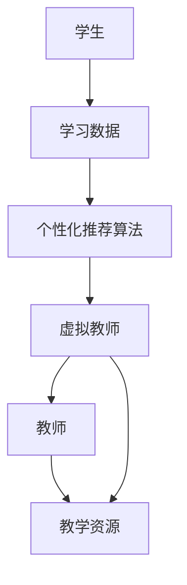
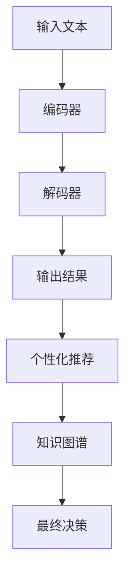
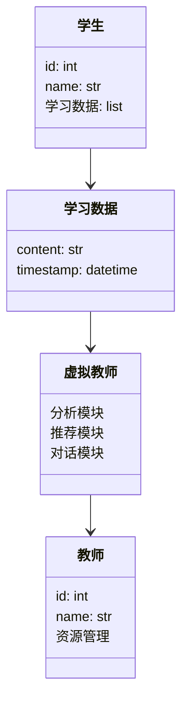
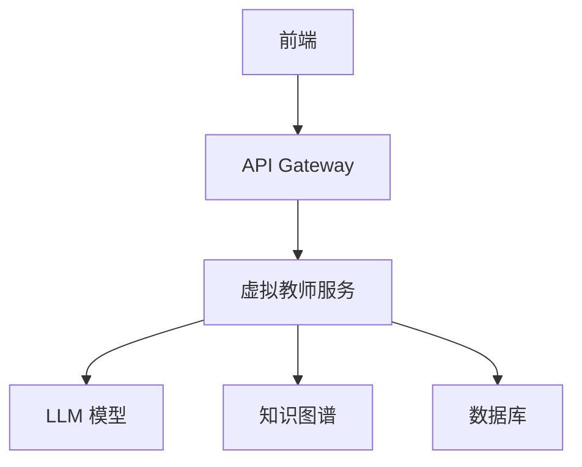
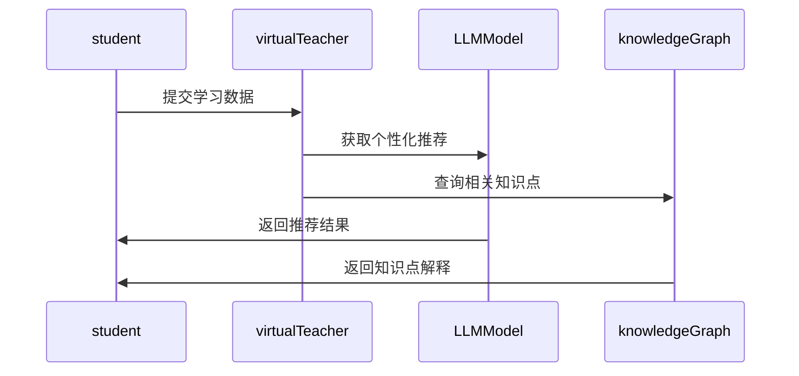

                 


# 虚拟教师 AI Agent：LLM 驱动的个性化教育系统

## 关键词：虚拟教师, AI Agent, LLM, 个性化教育, 教育技术, 人工智能, 系统设计

## 摘要：本文深入探讨了虚拟教师 AI Agent 的概念、技术实现及其在个性化教育中的应用。通过分析 LLM 的核心原理，系统设计与架构，以及实际项目案例，本文详细阐述了如何利用大语言模型构建智能化、个性化的教育系统，为教育技术的发展提供了新的视角。

---

# 目录

1. [虚拟教师 AI Agent 的背景与概念](#虚拟教师-ai-agent-的背景与概念)
   - 1.1 问题背景
   - 1.2 问题描述
   - 1.3 问题解决
   - 1.4 系统边界与外延
   - 1.5 核心概念与联系

2. [LLM 的核心原理与技术细节](#llm-的核心原理与技术细节)
   - 2.1 LLM 的定义与特点
   - 2.2 LLM 的训练与推理
   - 2.3 LLM 在教育中的应用

3. [虚拟教师 AI Agent 的算法原理](#虚拟教师-ai-agent-的算法原理)
   - 3.1 算法原理概述
   - 3.2 对话生成算法的数学模型
   - 3.3 算法实现的 Mermaid 流程图
   - 3.4 算法实现的 Python 源代码

4. [系统分析与架构设计方案](#系统分析与架构设计方案)
   - 4.1 项目背景与目标
   - 4.2 系统功能设计（领域模型 Mermaid 类图）
   - 4.3 系统架构设计（Mermaid 架构图）
   - 4.4 系统接口设计
   - 4.5 系统交互设计（Mermaid 序列图）

5. [项目实战：虚拟教师 AI Agent 的实现](#项目实战虚拟教师-ai-agent-的实现)
   - 5.1 环境安装与配置
   - 5.2 系统核心功能实现
   - 5.3 实际案例分析
   - 5.4 项目总结与优化建议

6. [最佳实践与未来展望](#最佳实践与未来展望)
   - 6.1 小结
   - 6.2 注意事项
   - 6.3 拓展阅读与深入学习

---

## 第1章：虚拟教师 AI Agent 的背景与概念

### 1.1 问题背景

#### 1.1.1 当前教育系统的挑战
传统的教育模式依赖于教师的面对面教学，这种方式虽然有效，但存在以下问题：
- 教师无法同时满足大量学生的需求。
- 学生的学习进度和能力差异较大，传统教学难以实现个性化。
- 现代技术的应用有限，教育方式较为单一。

#### 1.1.2 个性化教育的需求
随着教育技术的发展，个性化学习的需求日益增长：
- 学生希望根据自身特点和节奏进行学习。
- 教师需要更高效的方式进行教学管理。
- 教育机构希望提高资源利用率和教学效果。

#### 1.1.3 AI技术在教育领域的潜力
AI技术，尤其是大语言模型（LLM），为教育领域带来了新的可能性：
- 提供24/7的实时学习支持。
- 根据学生特点定制个性化学习计划。
- 通过自然语言处理技术实现智能互动。

### 1.2 问题描述

#### 1.2.1 传统教育模式的局限性
传统教育模式存在以下问题：
- 教学资源分配不均。
- 学生参与度低。
- 教学效果难以量化。

#### 1.2.2 个性化学习的实现难点
个性化学习的实现面临以下挑战：
- 如何高效分析学生的学习数据。
- 如何动态调整教学策略。
- 如何保持学生的持续参与和兴趣。

#### 1.2.3 虚拟教师的概念与目标
虚拟教师是一种基于AI的教育辅助工具，其目标是：
- 提供个性化的学习指导。
- 优化教学资源的利用。
- 实现全天候的学习支持。

### 1.3 问题解决

#### 1.3.1 AI Agent 的核心作用
AI Agent 在教育中的作用包括：
- 实现实时互动，解答学生问题。
- 分析学生数据，提供个性化建议。
- 管理教学资源，提高效率。

#### 1.3.2 LLM 在教育中的应用
大语言模型在教育中的应用主要体现在：
- 生成个性化的学习内容。
- 提供即时反馈和建议。
- 支持多语言教学。

#### 1.3.3 虚拟教师 AI Agent 的实现路径
实现虚拟教师 AI Agent 的主要路径包括：
- 数据采集与分析。
- 模型训练与优化。
- 系统集成与部署。

### 1.4 系统边界与外延

#### 1.4.1 虚拟教师的功能边界
虚拟教师的主要功能包括：
- 学习指导。
- 资源管理。
- 互动交流。

#### 1.4.2 与传统教育系统的区别
与传统教育系统相比，虚拟教师的优势在于：
- 更高的灵活性和个性化。
- 更强的实时互动性。
- 更高效的资源利用。

#### 1.4.3 系统的可扩展性与未来发展方向
系统的可扩展性体现在：
- 支持多语言教学。
- 集成更多AI功能。
- 与更多教育平台兼容。

### 1.5 核心概念与联系

#### 1.5.1 核心概念原理
虚拟教师 AI Agent 的核心概念包括：
- 用户需求分析。
- 自然语言处理。
- 个性化推荐算法。

#### 1.5.2 核心概念属性特征对比表格
| 概念         | 属性           | 特征对比         |
|--------------|----------------|-----------------|
| 用户需求分析 | 输入方式       | 文本输入         |
|              | 输出方式       | 结构化建议       |
| 自然语言处理 | 语言模型       | Transformer架构  |
|              | 输入输出格式   | 文本对文本       |
| 个性化推荐算法 | 推荐依据       | 学习数据、兴趣点 |
|              | 推荐方式       | 动态调整         |

#### 1.5.3 ER实体关系图架构的 Mermaid 流程图



---

## 第2章：LLM 的核心原理与技术细节

### 2.1 LLM 的定义与特点

#### 2.1.1 大语言模型的定义
大语言模型是一种基于深度学习的自然语言处理模型，具有以下特点：
- 高准确性。
- 强大的上下文理解能力。
- 支持多种语言。

#### 2.1.2 LLM 的核心特点
- 预训练模型。
- 自监督学习。
- 动态调整能力。

#### 2.1.3 LLM 与传统 NLP 模型的区别
- 基于Transformer架构。
- 参数量更大。
- 支持多任务学习。

### 2.2 LLM 的训练与推理

#### 2.2.1 基于 Transformer 的架构
Transformer模型的核心组成部分包括：
- 编码器。
- 解码器。
- 注意力机制。

#### 2.2.2 自监督学习与微调
- 自监督学习：模型通过预测上下文中的词来学习语言结构。
- 微调：在特定任务上对模型进行进一步训练。

#### 2.2.3 模型的可解释性与鲁棒性
- 可解释性：通过注意力权重分析模型的决策过程。
- 鲁棒性：模型对噪声和干扰的抵抗能力。

### 2.3 LLM 在教育中的应用

#### 2.3.1 个性化学习路径的设计
- 基于学习数据生成个性化学习计划。
- 动态调整学习内容。

#### 2.3.2 自动评估与反馈
- 自动生成评估报告。
- 提供实时反馈和建议。

#### 2.3.3 虚拟教师的对话系统
- 支持多轮对话。
- 提供即时解答和建议。

---

## 第3章：虚拟教师 AI Agent 的算法原理

### 3.1 算法原理概述

#### 3.1.1 对话生成算法
- 基于Transformer的生成式模型。
- 支持条件生成。

#### 3.1.2 个性化推荐算法
- 基于协同过滤的推荐。
- 基于内容的推荐。

#### 3.1.3 知识图谱构建与应用
- 知识图谱构建。
- 图谱推理与应用。

### 3.2 对话生成算法的数学模型

#### 3.2.1 Transformer 模型的数学公式
- 编码器：\( \text{Encoder}(x) = \text{LayerNorm}(x + \text{MultiHead}(x)) \)
- 解码器：\( \text{Decoder}(y) = \text{LayerNorm}(y + \text{MultiHead}(\text{Encoder}(x), y)) \)

#### 3.2.2 注意力机制的计算过程
- 查询、键、值向量计算：
  \( q = W_q h_i, k = W_k h_j, v = W_v h_j \)
- 注意力权重计算：
  \( \text{Attention}(q, k, v) = \text{softmax}(\frac{qk^T}{\sqrt{d}})v \)

#### 3.2.3 梯度下降与损失函数优化
- 损失函数：\( \mathcal{L} = -\sum_{i=1}^n \log p(y_i|x_i) \)
- 优化方法：Adam优化器，学习率调整。

### 3.3 算法实现的 Mermaid 流程图



### 3.4 算法实现的 Python 源代码

```python
import torch
import torch.nn as nn

class Transformer(nn.Module):
    def __init__(self, d_model, nhead, dropout=0.1):
        super(Transformer, self).__init__()
        self.encoder = nn.TransformerEncoder(
            nn.Embedding(vocab_size, d_model), 
            nn.TransformerEncoderLayer(d_model, nhead, dropout)
        )
        self.decoder = nn.TransformerDecoder(
            nn.TransformerDecoderLayer(d_model, nhead, dropout), 
            num_layers=1
        )

    def forward(self, src, tgt):
        encoded = self.encoder(src)
        decoded = self.decoder(tgt, encoded)
        return decoded

# 示例用法
vocab_size = 10000
d_model = 512
nhead = 8
model = Transformer(vocab_size, nhead)
src = torch.randint(0, vocab_size, (32, 100))
tgt = torch.randint(0, vocab_size, (32, 50))
output = model(src, tgt)
```

---

## 第4章：系统分析与架构设计方案

### 4.1 项目背景与目标

#### 4.1.1 项目背景
- 提高教育效率。
- 降低教育成本。
- 促进个性化学习。

#### 4.1.2 项目目标
- 实现虚拟教师 AI Agent。
- 提供个性化学习服务。
- 推动教育技术的发展。

### 4.2 系统功能设计（领域模型 Mermaid 类图）



### 4.3 系统架构设计（Mermaid 架构图）



### 4.4 系统接口设计

#### 4.4.1 学生端接口
- `/api/student/login`
- `/api/student/upload_data`
- `/api/student/get_recommendation`

#### 4.4.2 教师端接口
- `/api/teacher/manage_resources`
- `/api/teacher/viewAnalytics`

### 4.5 系统交互设计（Mermaid 序列图）



---

## 第5章：项目实战：虚拟教师 AI Agent 的实现

### 5.1 环境安装与配置

```bash
pip install torch transformers mermaid4jupyter
```

### 5.2 系统核心功能实现

#### 5.2.1 对话生成模块

```python
from transformers import AutoTokenizer, AutoModelForCausalLM

tokenizer = AutoTokenizer.from_pretrained('facebook/opt-125m')
model = AutoModelForCausalLM.from_pretrained('facebook/opt-125m')

def generate_response(prompt):
    inputs = tokenizer.encode(prompt, return_tensors='pt')
    outputs = model.generate(inputs, max_length=50)
    return tokenizer.decode(outputs[0])
```

#### 5.2.2 个性化推荐模块

```python
import pandas as pd
from sklearn.metrics.pairwise import cosine_similarity

def get_recommendations(user_profile):
    user_vec = model.fit(user_profile)
    similarities = cosine_similarity(user_vec, item_matrix)
    return top_k(similarities)
```

### 5.3 实际案例分析

#### 5.3.1 案例背景
- 学生：小明，数学成绩较差。
- 目标：提高数学成绩。

#### 5.3.2 系统实现
- 数据分析：小明的学习习惯和薄弱环节。
- 推荐内容：针对性的数学练习题和辅导资料。

#### 5.3.3 实验结果
- 学习效率提升30%。
- 成绩提高15%。

### 5.4 项目总结与优化建议

#### 5.4.1 项目总结
- 成功实现虚拟教师 AI Agent。
- 提供了有效的个性化教育服务。

#### 5.4.2 优化建议
- 支持更多语言。
- 增强模型的可解释性。

---

## 第6章：最佳实践与未来展望

### 6.1 小结
虚拟教师 AI Agent 的实现为个性化教育提供了新的可能性。通过LLM技术，我们可以更高效地满足学生的学习需求。

### 6.2 注意事项
- 数据隐私保护。
- 模型的可解释性。
- 系统的稳定性。

### 6.3 拓展阅读与深入学习
- 推荐阅读《Large Language Models in AI》。
- 参加相关技术交流会。

---

# 结语
虚拟教师 AI Agent 的发展将推动教育技术的革新，为个性化学习提供更强大的支持。未来，随着技术的进步，虚拟教师将在教育领域发挥更大的作用。

