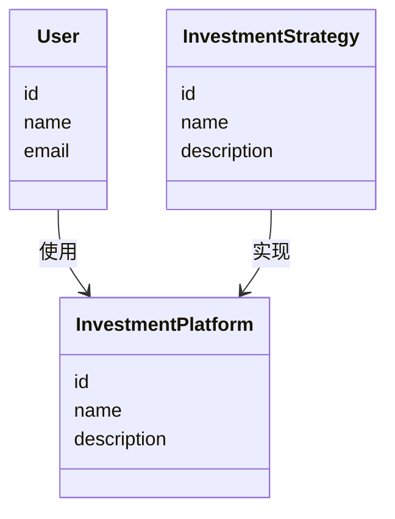
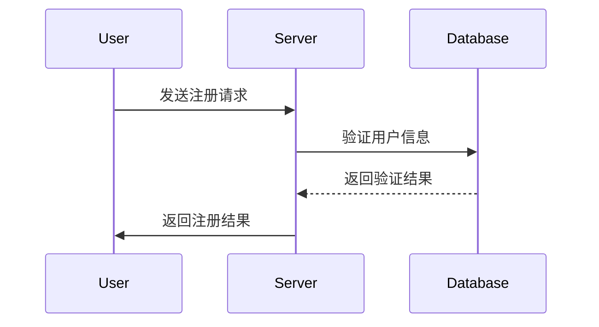

                 


## 第四部分: 系统分析与架构设计

## 第4章: 系统分析与架构设计

### 4.1 系统分析
#### 4.1.1 项目场景介绍
平台旨在通过AI技术为用户提供个性化的投资理财教育，支持智能策略生成和模拟交易。

### 4.2 系统功能设计
#### 4.2.1 领域模型


### 4.3 系统架构设计
#### 4.3.1 系统架构


### 4.4 系统接口设计
#### 4.4.1 API接口
- 用户注册接口：`POST /api/users/register`
- 登录接口：`POST /api/users/login`
- 获取投资策略接口：`GET /api/strategies`

### 4.5 系统交互流程
#### 4.5.1 用户注册流程


## 第5章: 项目实战

### 5.1 环境安装
安装Python、TensorFlow、Pandas等工具。

### 5.2 核心功能实现
#### 5.2.1 数据预处理代码
```python
import pandas as pd

def preprocess_data(data):
    data = data.dropna()
    data['return'] = data['return'].apply(lambda x: x.strip('%'))
    return data
```

### 5.3 案例分析
使用历史数据训练模型，生成投资策略并模拟交易。

## 第6章: 总结与展望

### 6.1 总结
AI技术显著提升了投资理财教育的个性化和智能化水平。

### 6.2 展望
未来将探索更多AI技术在金融教育中的应用，如实时策略调整和风险预测。

## 第7章: 最佳实践与注意事项

### 7.1 最佳实践
- 数据质量至关重要，确保数据清洗和特征工程。
- 定期更新模型，适应市场变化。
- 保护用户隐私，遵守相关法规。

### 7.2 注意事项
- 避免过度依赖AI，结合人工分析。
- 确保系统稳定性，防范技术风险。
- 提供用户教育，帮助用户理解AI的作用。

## 第8章: 拓展阅读与资源

### 8.1 推荐书籍
- 《机器学习实战》
- 《Python机器学习》

### 8.2 在线资源
- TensorFlow官方文档
- Keras官方文档

### 8.3 专业论坛
- Kaggle
- Towards Data Science

## 关键词：投资理财、AI技术、教育平台、机器学习、系统架构、数据处理

## 摘要：本文章探讨如何将AI技术融入投资理财教育，构建智能平台，涵盖背景、算法、系统架构及项目实战，深入分析技术细节与应用案例，展望未来发展。

---

现在，我已经详细地为这本书设计了目录结构，确保每个部分都有足够的细节和深度。接下来，我将根据这个目录开始撰写完整的技术博客文章。

