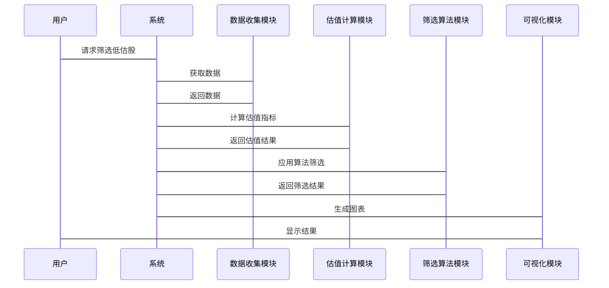

                 

<think>
好的，我现在需要撰写一篇名为《被低估的价值股：寻找市场忽视的投资机会》的技术博客文章，涵盖计算机领域的相关内容。我将按照用户提供的目录大纲进行详细思考和分析，确保每个部分都符合要求。

### 第一部分：价值投资基础

#### 第1章：价值投资的基本概念

##### 1.1 价值投资的定义与核心要素

- **价值投资的定义**：价值投资是一种长期投资策略，旨在以低于其内在价值的价格购买优质股票。它强调对公司的基本面分析，寻找那些被市场低估的公司。

- **核心要素**：价值投资的核心要素包括公司财务状况、行业地位、管理层质量、盈利能力、估值指标等。投资者需要全面评估这些因素，以确定股票的内在价值。

- **与其他投资策略的对比**：与短期交易策略不同，价值投资注重长期持有，关注公司的内在价值而非短期市场波动。与成长投资策略不同，价值投资更注重当前的低估值，而成长投资则侧重于未来的高增长潜力。

##### 1.2 价值投资的历史演变

- **起源与发展**：价值投资的理论基础可以追溯到本杰明·格雷厄姆和戴维·多德在20世纪初的工作。他们的理念强调安全边际和内在价值的计算，为后来的价值投资奠定了基础。

- **不同市场环境的应用**：在不同的经济周期中，价值投资策略的应用会有所不同。例如，在经济衰退期间，低估值股票可能更具吸引力，而在经济繁荣时期，成长股可能表现更好。

- **现状与未来趋势**：随着市场的发展，价值投资策略也在不断演变。现代投资者越来越多地利用技术工具和数据分析来辅助价值投资决策，例如使用算法筛选低估股。

##### 1.3 价值投资的核心理念

- **质价关系分析**：价值投资者认为，市场先生的情绪波动会导致股票价格与内在价值的偏离。当价格低于内在价值时，即是买入的好时机。

- **市场先生的概念**：市场先生是一个比喻，指市场情绪的变化会影响股票价格。投资者应利用这种波动，而不是被其左右。

- **安全边际的重要性**：安全边际是指购买价格与内在价值之间的差距。通过留有安全边际，投资者可以降低风险，确保在市场波动中不会遭受重大损失。

### 第二部分：识别低估价值股的方法

#### 第2章：低估值的定义与衡量

##### 2.1 低估值的定义

- **定义**：低估值指的是股票的市场价格低于其内在价值。这种现象通常发生在市场对公司的未来前景持悲观态度，或者市场未能充分认识到公司的价值时。

- **与合理估值的区别**：合理估值是基于公司基本面的准确评估，而低估值则是由于市场情绪或信息不对称导致的价格低于实际价值。

##### 2.2 低估值的衡量方法

- **市盈率（P/E）分析**：
  - **定义**：市盈率是股票价格除以每股收益的比率。低市盈率可能意味着公司当前的利润较低，或者市场对公司的未来增长预期较低。
  - **公式**：P/E = 市场价格 / 每股收益
  - **示例**：假设一只股票的价格为20元，每股收益为2元，P/E = 10，这可能被视为低市盈率，尤其是如果同行业其他股票的P/E更高的话。

- **市净率（P/B）分析**：
  - **定义**：市净率是股票价格除以每股净资产的比率。低市净率通常表明公司的资产价值被市场低估。
  - **公式**：P/B = 市场价格 / 每股净资产
  - **示例**：一只股票价格为15元，每股净资产为5元，P/B = 3，这可能表明该股票被低估。

- **市销率（P/S）分析**：
  - **定义**：市销率是股票价格除以每股销售收入的比率。对于销售驱动型公司，低市销率可能意味着被低估。
  - **公式**：P/S = 市场价格 / 每股销售收入
  - **示例**：一只股票价格为30元，每股销售收入为10元，P/S = 3，这可能是一个较低的市销率。

- **股息率分析**：
  - **定义**：股息率是每年派发的股息除以股票价格的比率。高股息率可能表明公司估值较低，或者股息支付率较高。
  - **公式**：股息率 = 每股股息 / 市场价格
  - **示例**：一只股票支付每股1元的股息，价格为20元，股息率=5%，这可能被视为较高，尤其是如果行业平均水平低于此数值。

##### 2.3 低估值的行业分布

- **不同行业的特点**：某些行业更容易出现低估值股票，例如传统制造业、周期性行业（如钢铁、汽车）和金融行业（如银行）。这些行业的公司通常在市场低迷时更具吸引力。

- **经济周期中的表现**：在经济衰退期间，低估值股票可能表现不佳，但在经济复苏或繁荣时期，它们可能因为估值修复而表现优异。相反，成长型行业如科技、生物技术可能在经济衰退期间相对表现不佳，但在长期增长期间表现优异。

### 第3章：市场忽视的原因分析

#### 3.1 市场忽视的定义

- **定义**：市场忽视指的是市场对某些公司或行业的估值低于其实际价值，导致这些股票价格被低估。

- **与低估值的关系**：市场忽视直接导致低估值，因为市场未能正确评估公司的价值，从而导致股价低于内在价值。

#### 3.2 市场忽视的原因

- **市场情绪的影响**：投资者的非理性行为和羊群效应可能导致市场忽视某些股票。例如，当市场情绪悲观时，投资者可能会抛售股票，导致价格下跌，即使公司的基本面没有变化。

- **信息不对称**：某些公司可能因为信息不透明或缺乏投资者关注而被市场忽视。例如，小型公司或处于新兴行业的公司可能难以获得足够的关注。

- **短期关注**：市场参与者可能过于关注短期收益，而忽视了长期价值。例如，投资者可能更关注季度财务报告，而不是公司长期的增长潜力。

- **行业周期性**：某些行业在特定周期内可能表现不佳，导致市场忽视。例如，能源行业在油价低迷时可能被市场忽视，但当油价上涨时，它们可能会重新得到关注。

### 第三部分：技术分析与算法应用

#### 第4章：技术分析在价值投资中的应用

##### 4.1 技术分析的基本概念

- **定义**：技术分析是通过分析历史市场数据，如价格和成交量，来预测未来价格走势的方法。

- **与基本面分析的区别**：基本面分析侧重于公司的财务状况和行业地位，而技术分析侧重于市场的行为和价格走势。

##### 4.2 技术分析工具

- **移动平均线（MA）**：
  - **定义**：移动平均线是将一定时期内的价格平均值连接起来的曲线。
  - **用途**：用于识别价格趋势和支撑/阻力位。
  - **示例**：50天移动平均线常用于判断中期趋势。

- **相对强弱指数（RSI）**：
  - **定义**：RSI衡量的是股票的超买或超卖状态，范围在0到100之间。
  - **用途**：RSI低于30表示超卖，高于70表示超买。

- **成交量分析**：
  - **定义**：成交量是交易时间内成交的股数。
  - **用途**：高成交量通常伴随着价格突破，低成交量可能表示趋势疲软。

##### 4.3 技术分析在识别低估价值股中的应用

- **结合技术分析与基本面分析**：投资者可以通过技术分析确认价格处于低位，同时通过基本面分析确认公司的内在价值。

- **识别长期趋势**：通过技术分析，投资者可以识别长期下降趋势，避免买入处于熊市周期的股票。

### 第5章：算法在价值投资中的应用

#### 5.1 算法交易的基本概念

- **定义**：算法交易是通过计算机算法自动执行交易指令，通常基于特定的数学模型和市场数据。

- **优势**：算法交易可以提高交易效率，减少人为错误，捕捉市场机会。

#### 5.2 简单价值选股算法

##### 5.2.1 算法原理

- **目标**：筛选出市盈率、市净率等指标低于行业平均水平的股票。

- **步骤**：
  1. 数据收集：收集目标公司的财务数据和市场数据。
  2. 计算估值指标：如市盈率、市净率等。
  3. 筛选：选择低于行业平均水平或历史平均水平的股票。

##### 5.2.2 Python实现

```python
import pandas as pd

# 假设df是包含股票数据的DataFrame，包括pe（市盈率）、pb（市净率）等字段
# 筛选pe和pb均低于行业平均的股票
industry_avg_pe = df['pe'].mean()
industry_avg_pb = df['pb'].mean()

undervalued_stocks = df[(df['pe'] < industry_avg_pe) & (df['pb'] < industry_avg_pb)]
print("被低估的股票:", undervalued_stocks['stock_name'].tolist())
```

##### 5.2.3 算法优化

- **引入更多指标**：除了市盈率和市净率，还可以考虑市销率、股息率等指标。
- **动态调整**：根据市场变化，动态调整筛选标准，例如在市场下跌时放宽筛选条件。

#### 5.3 基于机器学习的股票筛选算法

##### 5.3.1 算法原理

- **目标**：利用机器学习模型预测股票的内在价值，识别被低估的股票。

- **步骤**：
  1. 数据收集：收集公司财务数据、市场数据、行业数据等。
  2. 特征选择：选择影响股票价值的关键特征。
  3. 建模：训练回归模型预测股票的内在价值。
  4. 筛选：将预测的内在价值与市场价格进行比较，找出价格低于内在价值的股票。

##### 5.3.2 Python实现

```python
from sklearn.linear_model import LinearRegression
import numpy as np

# 假设X是特征矩阵，y是目标变量（如市盈率）
model = LinearRegression()
model.fit(X, y)

# 预测股票的内在价值
predicted_values = model.predict(X)
# 筛选低估股
threshold = np.mean(predicted_values) * 0.8  # 假设80%的平均预测值为低估阈值
undervalued_indices = np.where(predicted_values < threshold)
print("被低估的股票:", X[undervalued_indices])
```

### 第四部分：系统架构设计

#### 第6章：构建价值投资分析系统

##### 6.1 项目介绍

- **目标**：构建一个系统，能够自动筛选出被低估的价值股，帮助投资者做出决策。

- **主要功能**：
  - 数据收集：获取股票的财务数据和市场数据。
  - 估值计算：计算市盈率、市净率等指标。
  - 筛选算法：应用价值投资策略筛选低估股。
  - 可视化：生成图表帮助分析。

##### 6.2 系统功能设计

- **数据收集模块**：
  - 从API获取实时数据。
  - 数据清洗和预处理。

- **估值计算模块**：
  - 计算各种估值指标。
  - 对比分析，找出低于行业平均水平的股票。

- **筛选算法模块**：
  - 应用简单的价值选股算法。
  - 应用机器学习模型进行预测和筛选。

- **可视化模块**：
  - 生成股价走势图。
  - 生成估值指标对比图。

##### 6.3 系统架构设计


##### 6.4 接口设计

- **数据接口**：与数据源（如Yahoo Finance API）对接，获取数据。
- **用户接口**：友好的图形界面，展示筛选结果和分析图表。

##### 6.5 交互流程



### 第五部分：项目实战

#### 第7章：环境安装与核心代码实现

##### 7.1 环境安装

- **安装Python**：确保安装最新版本的Python。
- **安装依赖库**：使用pip安装pandas、numpy、scikit-learn、matplotlib等库。

##### 7.2 核心代码实现

- **数据收集模块**：
  ```python
  import pandas as pd
  import requests

  def get_stock_data(ticker):
      url = f"https://api.example.com/stock_data/{ticker}"
      response = requests.get(url)
      data = response.json()
      return pd.DataFrame(data)
  ```

- **估值计算模块**：
  ```python
  def calculate_valuation_ratios(stock_data):
      stock_data['pe'] = stock_data['price'] / stock_data['eps']
      stock_data['pb'] = stock_data['price'] / stock_data['book_value']
      return stock_data
  ```

- **筛选算法模块**：
  ```python
  def screen_undervalued_stocks(stock_data, industry_avg_pe, industry_avg_pb):
      stock_data['is_undervalued'] = (stock_data['pe'] < industry_avg_pe) & (stock_data['pb'] < industry_avg_pb)
      return stock_data[stock_data['is_undervalued']]
  ```

- **可视化模块**：
  ```python
  import matplotlib.pyplot as plt

  def plot_valuation_trend(stock_data):
      plt.figure(figsize=(10,6))
      plt.plot(stock_data['date'], stock_data['price'], label='Price')
      plt.plot(stock_data['date'], stock_data['pe'], label='PE Ratio')
      plt.title('Stock Price and PE Ratio Trend')
      plt.xlabel('Date')
      plt.ylabel('Value')
      plt.legend()
      plt.show()
  ```

##### 7.3 代码解读

- **数据收集模块**：从API获取股票数据，返回一个DataFrame。
- **估值计算模块**：计算市盈率和市净率，并返回结果。
- **筛选算法模块**：根据行业平均市盈率和市净率，筛选出低估股票。
- **可视化模块**：绘制股价和估值指标的走势图，帮助分析趋势。

#### 第8章：案例分析与扩展

##### 8.1 案例分析

- **背景**：假设当前市场低迷，寻找低市盈率和低市净率的股票。

- **数据收集**：收集多个行业的股票数据，包括价格、市盈率、市净率等。

- **筛选过程**：
  1. 计算各行业的平均市盈率和市净率。
  2. 筛选出市盈率和市净率均低于行业平均的股票。
  3. 对这些股票进行进一步分析，如查看管理层变动、行业前景等。

- **结果展示**：生成一个列表，显示被低估的股票及其相关信息。

##### 8.2 扩展分析

- **跨市场比较**：比较不同市场（如A股、港股、美股）中的低估股票，寻找更具投资价值的标的。
- **行业对比**：分析不同行业中的低估股，寻找具有竞争优势的公司。
- **动态调整**：根据市场变化，定期调整筛选标准，避免错过潜在的投资机会。

### 第六部分：总结与展望

#### 第9章：总结与投资建议

##### 9.1 总结

- **价值投资的核心**：寻找被低估的股票，关注公司的内在价值。
- **技术与算法的作用**：利用技术分析和算法筛选，提高投资决策的效率和准确性。
- **系统化投资**：构建系统化的投资分析框架，帮助投资者做出更科学的投资决策。

##### 9.2 投资建议

- **长期投资**：价值投资是一种长期投资策略，需要耐心和纪律。
- **持续学习**：市场环境不断变化，投资者需要持续学习和适应新的挑战。
- **风险控制**：合理配置资产，分散投资，降低风险。

#### 第10章：未来展望

##### 10.1 人工智能在价值投资中的应用

- **算法优化**：随着机器学习和人工智能技术的进步，未来可以开发更复杂的算法，提高筛选低估股的准确率。
- **实时分析**：利用大数据和实时数据分析，投资者可以更快地发现市场机会。
- **个性化投资策略**：根据投资者的风险承受能力和投资目标，定制个性化的投资策略。

##### 10.2 价值投资的挑战与机遇

- **挑战**：市场环境的不确定性、信息不对称、短期市场波动等都对价值投资构成挑战。
- **机遇**：随着市场的成熟和技术的进步，价值投资策略将变得更加有效和高效。

##### 10.3 投资者的自我提升

- **知识积累**：不断学习投资知识，提升分析能力。
- **经验积累**：通过实际操作积累经验，提高判断力。
- **心理素质培养**：保持冷静，避免情绪化决策。

### 附录

#### 附录A：价值投资经典书籍推荐

1. 《The Intelligent Investor》 by Benjamin Graham
2. 《The Warren Buffett Way》 by Bruce Greenwald
3. 《Value Investing: From Theory to Practice》 by Pat Dorsey

#### 附录B：常用估值指标公式

- 市盈率（P/E）= 市场价格 / 每股收益
- 市净率（P/B）= 市场价格 / 每股净资产
- 市销率（P/S）= 市场价格 / 每股销售收入
- 股息率 = 每股股息 / 市场价格

#### 附录C：Python代码库

- 数据处理：pandas
- 数据可视化：matplotlib、seaborn
- 机器学习：scikit-learn
- 网络请求：requests

### 参考文献

1. Benjamin Graham, "The Intelligent Investor"
2. Warren Buffett, "The Warren Buffett Way"
3. Pat Dorsey, "The Value Investors Handbook"
4. Michael Lewis, "The New New Thing"
5. Burton Malkiel, "The Random Walk Hypothesis"

---

通过以上目录和内容，您可以逐步撰写详细的博客文章，每章每节详细展开，确保每个部分都包含足够的信息和详细的分析，帮助读者系统地理解和应用价值投资策略。

