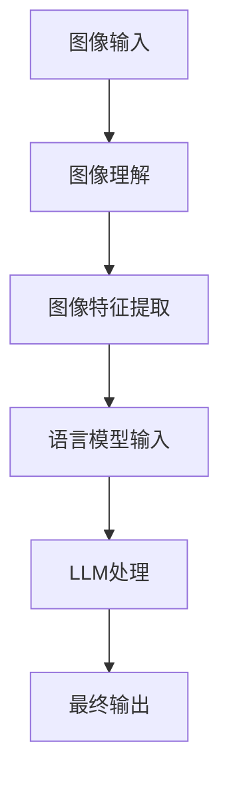
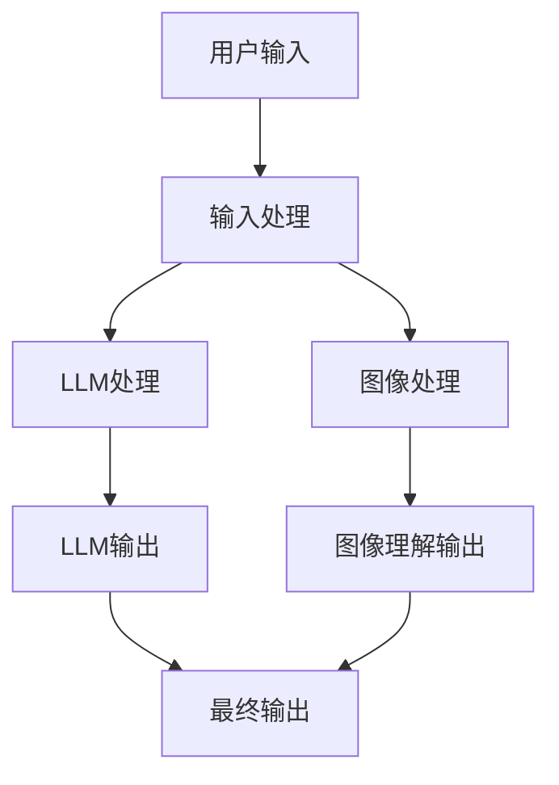

                 


# 视觉-语言AI Agent：整合LLM与图像理解

**关键词**：视觉-语言AI Agent, LLM, 图像理解, 多模态模型, 协同机制

**摘要**：  
视觉-语言AI Agent是一种结合了大型语言模型（LLM）和图像理解技术的多模态人工智能代理。本文将深入探讨视觉-语言AI Agent的背景、核心概念、算法原理、系统架构以及实际应用。通过分析LLM与图像理解的整合，揭示其在多模态交互中的潜力，并展示如何通过协同机制实现更高效的视觉-语言任务处理。本文还将提供实际项目案例，帮助读者理解如何在实际场景中应用这些技术。

---

## 第一部分：视觉-语言AI Agent的背景与问题描述

### 第1章：视觉-语言AI Agent的背景与问题描述

#### 1.1 多模态AI的发展历程
多模态人工智能（Multi-modal AI）是指能够处理和整合多种数据形式（如文本、图像、语音、视频等）的AI系统。近年来，随着深度学习技术的快速发展，多模态AI在各个领域取得了显著进展。视觉-语言AI Agent作为多模态AI的重要分支，结合了语言理解和图像处理的能力，能够实现更复杂和自然的交互方式。

#### 1.2 LLM与图像理解的结合趋势
大型语言模型（LLM）如GPT系列在自然语言处理领域取得了巨大成功。然而，LLM的能力主要局限于文本处理，无法直接理解和处理图像信息。图像理解技术（如目标检测、图像分割、图像描述生成等）则专注于处理视觉信息。将LLM与图像理解技术结合，可以充分发挥两者的优势，实现更强大的多模态交互能力。

#### 1.3 当前技术的挑战与机遇
尽管LLM与图像理解技术各有优势，但它们的结合仍然面临许多挑战。例如，如何实现跨模态信息的有效融合、如何设计高效的协同机制、如何处理多模态数据的异构性等。这些挑战也为技术创新提供了巨大的机遇，推动了视觉-语言AI Agent的发展。

---

### 第2章：视觉-语言AI Agent的核心概念与外延

#### 2.1 视觉-语言AI Agent的定义
视觉-语言AI Agent是一种能够同时理解和处理视觉和语言信息的人工智能代理。它能够通过图像理解技术处理视觉输入，通过LLM处理语言输入，并通过协同机制实现跨模态的信息交互和任务处理。

#### 2.2 核心概念的对比分析
以下是多模态模型、LLM和图像理解技术的核心概念对比：

| **概念**         | **描述**                                                                 |
|------------------|--------------------------------------------------------------------------|
| 多模态模型        | 能够处理多种数据形式（如文本、图像、语音）的模型，注重跨模态信息的整合与协同。               |
| LLM              | 专注于自然语言处理的大型语言模型，擅长理解和生成人类语言。                                |
| 图像理解技术      | 专注于图像数据的处理技术，包括目标检测、图像分割、图像描述生成等。                         |

#### 2.3 技术的边界与应用场景
视觉-语言AI Agent的应用场景包括图像描述生成、图像问答、视觉对话、多模态检索等。以下是应用场景的实体关系图：



---

## 第二部分：视觉-语言AI Agent的核心概念与联系

### 第3章：多模态模型的基本原理

#### 3.1 多模态数据的处理方式
多模态数据的处理通常包括以下几个步骤：
1. 数据预处理：将不同模态的数据（如图像、文本）转换为统一的表示形式。
2. 特征提取：提取每种模态的特征（如图像的视觉特征、文本的语义特征）。
3. 跨模态融合：将不同模态的特征进行融合，生成全局表示。

#### 3.2 多模态模型的分类与特点
多模态模型可以分为以下几类：
- **基于编码器-解码器的模型**：如BERT（文本）、ViT（图像）。
- **基于注意力机制的模型**：如Transformer架构。
- **基于对比学习的模型**：如CLIP。

#### 3.3 多模态模型的训练方法
多模态模型的训练通常采用以下策略：
- **联合训练**：同时优化多模态数据的表示。
- **跨模态对齐**：通过对比学习等方法对齐不同模态的特征。

---

### 第4章：LLM与图像理解的整合

#### 4.1 LLM在语言处理中的作用
LLM通过大规模预训练掌握了丰富的语言知识，能够生成连贯的文本、回答问题、进行对话等。在视觉-语言AI Agent中，LLM主要负责处理语言输入和输出。

#### 4.2 图像理解的关键技术
图像理解技术包括目标检测、图像分割、图像描述生成等。这些技术能够提取图像中的视觉信息，并将其转化为可供LLM处理的文本形式。

#### 4.3 两者的协同机制
LLM与图像理解技术的协同机制可以通过以下步骤实现：
1. **图像理解**：对输入图像进行目标检测或图像描述生成，提取视觉信息。
2. **语言处理**：将提取的视觉信息输入LLM，生成自然语言的输出。
3. **反馈优化**：根据用户的反馈优化模型的输出。

---

## 第三部分：视觉-语言AI Agent的算法原理

### 第5章：多模态模型的算法流程

#### 5.1 数据预处理与特征提取
1. **图像预处理**：将图像缩放到固定大小，归一化处理。
2. **文本预处理**：将文本转换为嵌入向量。

#### 5.2 模型的联合训练策略
多模态模型的训练通常采用以下策略：
- **联合优化**：同时优化图像和文本的表示。
- **对比学习**：通过对比损失函数对齐图像和文本的特征。

#### 5.3 输出结果的生成机制
多模态模型的输出通常通过以下步骤生成：
1. **特征融合**：将图像和文本的特征向量进行融合。
2. **生成结果**：根据融合的特征生成最终的输出（如图像描述、问答答案）。

---

### 第6章：算法原理的数学模型

#### 6.1 LLM的训练目标函数
$$ \mathcal{L}_{\text{LLM}} = -\sum_{i=1}^{n} \log p(x_i | x_{<i}) $$

#### 6.2 图像理解的损失函数
$$ \mathcal{L}_{\text{image}} = \lambda_1 \mathcal{L}_{\text{classify}} + \lambda_2 \mathcal{L}_{\text{recon}} $$

---

## 第四部分：系统架构与设计

### 第7章：系统架构概述

#### 7.1 整体架构图


#### 7.2 功能模块设计
1. **输入模块**：接收用户的输入（如文本或图像）。
2. **图像处理模块**：对图像进行预处理和特征提取。
3. **LLM处理模块**：将图像特征输入LLM进行语言处理。
4. **输出模块**：生成最终的输出结果。

---

## 第五部分：项目实战

### 第8章：环境安装与核心代码实现

#### 8.1 环境安装
- 安装Python和相关库（如TensorFlow、PyTorch、OpenCV）。
- 安装LLM库（如Hugging Face的Transformers库）。

#### 8.2 核心代码实现
以下是图像描述生成的代码示例：

```python
import torch
from transformers import ViTFeatureExtractor, BartForConditionalGeneration

# 加载图像处理模型
image_processor = ViTFeatureExtractor.from_pretrained('google/vit-base-patch16-224')
model = BartForConditionalGeneration.from_pretrained('facebook/bart-large')

def generate_image_description(image_path):
    # 加载图像
    image = open(image_path, 'rb').read()
    inputs = image_processor(images=image, return_tensors='pt')
    pixel_values = inputs['pixel_values'].to(torch.device('cuda' if torch.cuda.is_available() else 'cpu'))

    # 生成图像描述
    outputs = model.generate(pixel_values, max_length=50, do_sample=True)
    description = model.decode(outputs[0], skip_special_tokens=True)
    return description

# 示例
print(generate_image_description('image.jpg'))
```

---

## 第六部分：最佳实践

### 第9章：小结与注意事项

#### 9.1 小结
视觉-语言AI Agent通过整合LLM和图像理解技术，实现了更强大的多模态交互能力。本文详细探讨了其背景、核心概念、算法原理和系统架构，并通过实际案例展示了其应用潜力。

#### 9.2 注意事项
- 在实际应用中，需注意模型的训练数据质量和多样性。
- 跨模态信息的融合需要设计高效的协同机制。
- 模型的可解释性和实时性也是重要的优化方向。

---

## 第七部分：拓展阅读

### 第10章：拓展阅读

#### 10.1 相关论文与书籍
- "CLIP: Connecting Text and Image"（OpenAI）
- "Vision-language Pre-training: A Survey"（CVPR 2023）

#### 10.2 技术博客与开源项目
- Hugging Face的多模态模型库。
- GitHub上的视觉-语言AI Agent开源项目。

---

**结语**  
视觉-语言AI Agent的整合应用为人工智能的发展开辟了新的方向。通过本文的详细探讨，读者可以深入了解其技术原理和实际应用，为未来的研究和实践提供有价值的参考。

