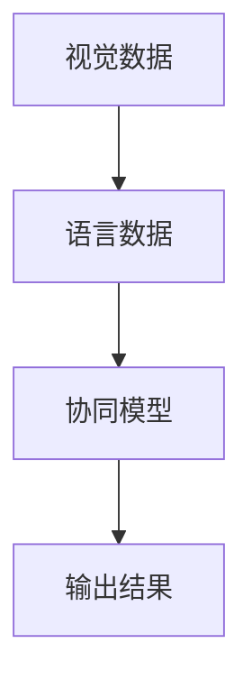

                 


# 视觉-语言协同AI Agent：LLM与计算机视觉的深度融合

> 关键词：视觉-语言协同，LLM，计算机视觉，多模态模型，对比学习，自注意力机制，端到端训练

> 摘要：本文深入探讨了视觉-语言协同AI Agent的技术基础、核心算法和实际应用。通过分析多模态数据的融合方法、对比学习算法、自注意力机制以及端到端训练方法，详细阐述了视觉-语言模型的构建过程。结合系统架构设计和项目实战，展示了如何实现高效的视觉-语言协同系统，为相关领域的研究和应用提供了理论和实践参考。

---

## 第一部分: 视觉-语言协同AI Agent概述

### 第1章: 视觉-语言协同AI Agent的背景与概念

#### 1.1 问题背景
- **1.1.1 当前AI技术的发展现状**
  - 人工智能技术的快速发展，尤其是LLM（大语言模型）和计算机视觉技术的成熟，为多模态AI应用提供了坚实的基础。
  - 当前，AI系统主要专注于单一模态（如文本或图像）的任务，但在实际应用中，多模态数据的协同处理需求日益增长。

- **1.1.2 LLM与计算机视觉的结合需求**
  - 实际场景中，信息通常是多模态的，例如图像配文字描述、视频加语音等。
  - 单一模态模型难以满足复杂场景的需求，而多模态模型能够更全面地理解用户意图。

- **1.1.3 视觉-语言协同的现实意义**
  - 提高AI系统的理解和响应能力，使其能够处理更复杂的任务。
  - 在智能客服、图像描述生成、视频理解等领域具有广泛的应用前景。

#### 1.2 问题描述
- **1.2.1 视觉与语言协同的核心问题**
  - 如何有效地将视觉信息和语言信息进行融合，以实现跨模态的理解和生成。
  - 研究如何在不同模态之间建立有效的关联和交互。

- **1.2.2 当前技术的局限性**
  - 视觉模型和语言模型的训练目标不同，难以直接协同工作。
  - 数据模态之间的异构性导致融合难度大。

- **1.2.3 视觉-语言协同的目标与边界**
  - 目标：构建能够理解并处理视觉和语言信息的AI系统。
  - 边界：聚焦于视觉和语言的协同，不涉及其他模态（如音频、视频等）。

#### 1.3 问题解决
- **1.3.1 视觉-语言协同的实现路径**
  - 通过多模态模型实现数据融合。
  - 利用对比学习和自注意力机制实现模态间的交互。

- **1.3.2 LLM与CV融合的关键技术**
  - 对比学习：通过对比同一内容在不同模态上的表示，增强模态间的关联性。
  - 自注意力机制：捕捉模态间的长程依赖关系。

- **1.3.3 视觉-语言协同的应用场景**
  - 图像描述生成：根据图像生成文字描述。
  - 视频理解：通过视觉和语言信息共同理解视频内容。
  - 智能问答：结合图像和文本信息回答问题。

#### 1.4 核心概念与边界
- **1.4.1 视觉-语言协同的核心要素**
  - 视觉数据：图像、视频等。
  - 语言数据：文本、语音等。
  - 协同模型：多模态模型，负责融合视觉和语言信息。

- **1.4.2 技术边界与外延**
  - 边界：专注于视觉和语言的协同，不涉及其他模态。
  - 外延：多模态协同技术的扩展，如加入音频、视频等。

- **1.4.3 概念结构与核心要素组成**
  - 数据输入：视觉数据和语言数据。
  - 数据处理：多模态特征提取、融合。
  - 模型输出：协同结果（如描述、回答）。

---

## 第二部分: 视觉-语言协同的核心概念与联系

### 第2章: 多模态模型的基本原理

#### 2.1 多模态数据的表示方法
- **2.1.1 模态间特征提取**
  - 视觉模态：通过卷积神经网络（CNN）提取图像特征。
  - 语言模态：通过Transformer提取文本特征。
- **2.1.2 跨模态注意力机制**
  - 使用自注意力机制捕捉模态间的关联。
  - 通过交叉注意力机制实现模态间的交互。

#### 2.2 视觉与语言的特征融合
- **2.2.1 模态间特征对齐**
  - 通过对比学习对齐视觉和语言特征。
  - 使用对比损失函数优化特征表示。
- **2.2.2 融合策略**
  - 线性融合：将视觉和语言特征线性组合。
  - 加性融合：通过加性操作融合特征。

#### 2.3 ER实体关系图架构


---

## 第三部分: 视觉-语言协同的算法原理

### 第3章: 对比学习算法

#### 3.1 对比学习的基本原理
- **对比学习的目标**
  - 通过对比同一内容在不同模态上的表示，增强模态间的关联性。
- **对比损失函数**
  $$ L = \frac{1}{N} \sum_{i=1}^{N} \text{CE}(\text{sim}(x_i, y_i), 1) + \text{CE}(\text{sim}(x_i, y_j), 0) $$
  其中，sim表示相似度计算，CE表示交叉熵损失。

#### 3.2 对比学习在视觉-语言中的应用
- **图像-文本对比**
  - 使用图像特征和文本特征计算相似度，优化特征表示。
- **文本-图像生成**
  - 基于对比学习优化生成模型。

#### 3.3 对比学习的代码实现
```python
import torch
import torch.nn as nn

class ContrastiveLoss(nn.Module):
    def __init__(self, temperature=0.1):
        super(ContrastiveLoss, self).__init__()
        self.temperature = temperature
    
    def forward(self, features, labels):
        # 计算相似度
        sim = torch.exp(torch.mm(features, features.T) / self.temperature)
        # 计算正样本和负样本的损失
        pos_loss = torch.mean(torch.log(sim * labels + 1e-10))
        neg_loss = torch.mean(torch.log(1 - sim * (1 - labels) + 1e-10))
        # 总损失
        total_loss = - (pos_loss + neg_loss)
        return total_loss
```

---

### 第4章: 自注意力机制

#### 4.1 自注意力机制的原理
- **自注意力机制的计算公式**
  $$ \text{Attention}(Q, K, V) = \text{softmax}\left( \frac{QK^T}{\sqrt{d_k}} \right)V $$
  其中，$Q$、$K$、$V$分别为查询、键、值向量，$d_k$为键的维度。

#### 4.2 自注意力机制在视觉-语言中的应用
- **视觉模态的自注意力**
  - 在图像特征提取中，使用自注意力机制增强图像的上下文信息。
- **语言模态的自注意力**
  - 在文本处理中，使用自注意力机制捕捉语言的语法和语义信息。

#### 4.3 自注意力机制的代码实现
```python
import torch
import torch.nn as nn

class SelfAttention(nn.Module):
    def __init__(self, embed_dim):
        super(SelfAttention, self).__init__()
        self.embed_dim = embed_dim
        self.query = nn.Linear(embed_dim, embed_dim)
        self.key = nn.Linear(embed_dim, embed_dim)
        self.value = nn.Linear(embed_dim, embed_dim)
    
    def forward(self, x):
        # 计算query、key、value
        query = self.query(x)
        key = self.key(x)
        value = self.value(x)
        
        # 计算相似度
        attention_scores = torch.softmax(torch.bmm(query, key.transpose(-2, -1)) / torch.sqrt(torch.tensor(self.embed_dim, dtype=torch.float32)), dim=-1)
        # 加权求和
        output = torch.bmm(attention_scores, value)
        return output
```

---

## 第四部分: 系统分析与架构设计

### 第5章: 系统架构设计

#### 5.1 应用场景介绍
- **图像描述生成**
  - 用户上传图像，系统生成描述文本。
- **视频理解**
  - 系统分析视频内容并生成总结或标签。

#### 5.2 系统功能设计
- **领域模型设计**
  ```mermaid
  classDiagram
      class 视觉数据处理模块 {
          输入：图像/视频
          输出：视觉特征
      }
      class 语言数据处理模块 {
          输入：文本
          输出：语言特征
      }
      class 协同模型 {
          输入：视觉特征、语言特征
          输出：协同结果
      }
      视觉数据处理模块 --> 协同模型
      语言数据处理模块 --> 协同模型
  ```

#### 5.3 系统架构设计
- **整体架构图**
  ```mermaid
  graph TD
      A[用户输入] --> B[视觉数据处理模块]
      A --> C[语言数据处理模块]
      B --> D[协同模型]
      C --> D
      D --> E[输出结果]
  ```

#### 5.4 接口设计与交互流程
- **接口设计**
  - 输入接口：接收视觉和语言数据。
  - 输出接口：返回协同处理结果。
- **交互流程**
  ```mermaid
  sequenceDiagram
      User -> 视觉数据处理模块: 上传图像
      User -> 语言数据处理模块: 输入文本
      视觉数据处理模块 -> 协同模型: 提交视觉特征
      语言数据处理模块 -> 协同模型: 提交语言特征
      协同模型 -> User: 返回协同结果
  ```

---

## 第五部分: 项目实战

### 第6章: 项目实战

#### 6.1 环境安装
- 安装必要的库和框架：
  ```bash
  pip install torch torchvision matplotlib
  ```

#### 6.2 系统核心实现源代码
- **对比学习模型代码**
  ```python
  import torch
  import torch.nn as nn
  import torch.optim as optim

  class VisualLanguageModel(nn.Module):
      def __init__(self, embed_dim, vocab_size):
          super(VisualLanguageModel, self).__init__()
          self.visual_feature_extractor = nn.Sequential(
              nn.Conv2d(3, 64, kernel_size=3, stride=1, padding=1),
              nn.ReLU(),
              nn.MaxPool2d(2, 2)
          )
          self.language_processor = nn.Transformer(embed_dim, embed_dim, num_layers=2)
          self.classifier = nn.Linear(embed_dim, vocab_size)
      
      def forward(self, image, text):
          # 处理视觉数据
          visual_features = self.visual_feature_extractor(image)
          # 处理语言数据
          language_features = self.language_processor(text)
          # 融合特征
          features = torch.cat((visual_features, language_features), dim=-1)
          # 分类
          output = self.classifier(features)
          return output

  # 初始化模型
  model = VisualLanguageModel(embed_dim=512, vocab_size=1000)
  # 定义损失函数和优化器
  criterion = nn.CrossEntropyLoss()
  optimizer = optim.Adam(model.parameters(), lr=0.001)
  ```

#### 6.3 代码应用解读与分析
- **模型训练流程**
  1. 加载数据集：加载图像和对应的文本描述。
  2. 前向传播：将图像和文本输入模型，得到预测结果。
  3. 计算损失：使用交叉熵损失函数计算损失。
  4. 反向传播：优化模型参数。

#### 6.4 案例分析和详细讲解
- **图像描述生成案例**
  - 输入：一张猫的图片。
  - 输出：生成描述文本“这只猫正在睡觉”。

#### 6.5 项目小结
- **代码实现的关键点**
  - 对比学习的引入提高了模型的特征对齐能力。
  - 自注意力机制增强了模态间的交互能力。

---

## 第六部分: 最佳实践

### 第7章: 最佳实践

#### 7.1 小结
- 通过对比学习和自注意力机制，实现了视觉和语言的协同处理。
- 系统架构设计保证了模型的高效性和可扩展性。

#### 7.2 注意事项
- **数据预处理**：确保数据的多样性和平衡性。
- **模型调优**：合理设置超参数，如学习率、批次大小等。
- **性能优化**：使用并行计算加速训练。

#### 7.3 拓展阅读
- 推荐阅读相关领域的最新论文和技术博客，关注视觉-语言协同技术的最新进展。

---

## 总结

本文从视觉-语言协同AI Agent的背景、核心概念、算法原理、系统架构设计到项目实战，全面阐述了这一技术的实现过程和应用潜力。通过对比学习和自注意力机制，构建了高效的视觉-语言协同模型，并通过实际案例展示了其应用价值。未来，随着技术的不断发展，视觉-语言协同AI Agent将在更多领域发挥重要作用。

