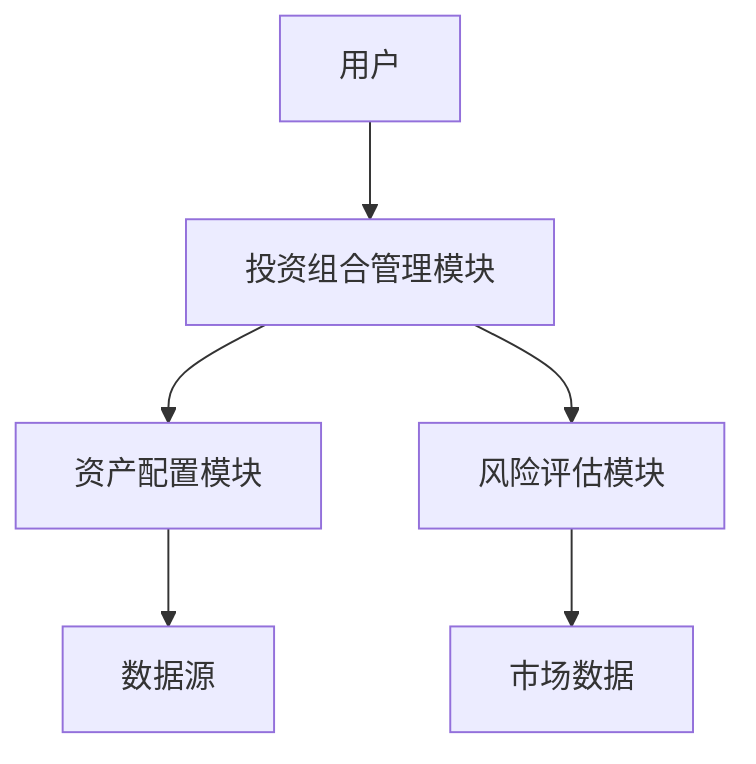
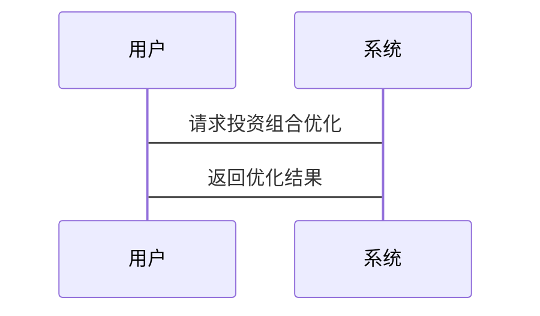

                 


# 詹姆斯·奥肖内西的价值投资组合管理：平衡风险与回报

> 关键词：价值投资、投资组合管理、风险与回报、现代投资组合理论、资本资产定价模型、投资组合优化、系统架构设计

> 摘要：本文深入探讨了詹姆斯·奥肖内西的价值投资策略，分析其如何通过投资组合管理平衡风险与回报。从理论基础到数学模型，再到系统架构设计，详细阐述了投资组合优化的核心概念、算法原理和实际应用，为读者提供了全面的视角和深入的见解。

---

# 目录大纲

1. **价值投资组合管理概述**  
   1.1 价值投资的核心概念  
   1.2 投资组合管理的必要性  
   1.3 价值投资与现代投资组合理论的联系  

2. **价值投资的理论基础**  
   2.1 现代投资组合理论（MPT）  
   2.2 资本资产定价模型（CAPM）  
   2.3 风险与收益的权衡  

3. **投资组合优化的数学模型**  
   3.1 投资组合优化的核心算法  
   3.2 现代投资组合理论的数学公式  
   3.3 资本资产定价模型的数学推导  

4. **系统分析与架构设计**  
   4.1 投资组合管理系统的需求分析  
   4.2 系统架构设计  
   4.3 系统接口与交互设计  

5. **项目实战：投资组合优化的实现**  
   5.1 环境搭建与工具安装  
   5.2 核心功能实现  
   5.3 投资组合优化案例分析  

6. **总结与展望**  
   6.1 价值投资组合管理的实践经验  
   6.2 未来研究方向  

---

# 第1章：价值投资组合管理概述

## 1.1 价值投资的核心概念

### 1.1.1 价值投资的定义与起源

价值投资是一种以低于其内在价值的价格购买优质股票的投资策略。其核心思想是寻找市场低估的公司，并长期持有，等待其价值回归。该理论由本杰明·格雷厄姆提出，并在其学生彼得·林奇和沃伦·巴菲特的实践中得到进一步发展。

### 1.1.2 投资组合管理的基本原理

投资组合管理是指通过科学的方法构建和调整投资组合，以实现风险与收益的最佳平衡。其核心在于分散投资，避免过度集中在单一资产或行业，从而降低风险。

### 1.1.3 价值投资与成长投资的对比

价值投资注重安全边际和低估值，而成长投资则关注企业的成长性和未来的盈利潜力。两者在选股标准和投资策略上存在显著差异，但都追求长期收益的最大化。

## 1.2 投资组合管理的必要性

### 1.2.1 风险与回报的平衡

通过投资组合管理，投资者可以在承担适度风险的同时，追求较高的回报。这种平衡是实现长期投资目标的关键。

### 1.2.2 投资组合管理的目标

投资组合管理的目标包括最大化收益、最小化风险、实现资产的保值增值等。不同投资者的目标可能有所不同，但核心在于合理配置资产。

### 1.2.3 投资组合管理的流程

投资组合管理通常包括目标设定、资产配置、证券选择、风险评估、组合调整和绩效评估等步骤。每个步骤都需要细致的操作和专业的知识。

## 1.3 价值投资与现代投资组合理论的联系

### 1.3.1 理论基础的联系

价值投资与现代投资组合理论（MPT）在资产配置和风险分散方面有共同点。MPT强调通过分散投资降低风险，而价值投资则强调选择具有安全边际的股票。

### 1.3.2 实际应用中的融合

在实际操作中，价值投资者可以结合MPT的思想，将股票与其他资产（如债券、黄金）进行配置，以进一步分散风险。

### 1.3.3 理论创新的启示

价值投资为MPT提供了选股策略上的补充，而MPT则为价值投资提供了风险管理和资产配置的框架。

---

# 第2章：价值投资的理论基础

## 2.1 现代投资组合理论（MPT）

### 2.1.1 MPT的核心原理

MPT由哈里·马科维茨提出，认为通过合理配置不同资产，可以实现收益最大化和风险最小化。其核心是通过分散投资来降低非系统性风险。

### 2.1.2 MPT的数学模型

MPT的优化模型如下：

$$ \text{目标：} \min_w \sigma^2(w) \quad \text{在约束} \sum_{i=1}^n w_i = 1 \text{下} $$

其中，\( \sigma^2(w) \) 表示投资组合的方差，\( w_i \) 表示各资产的权重。

### 2.1.3 MPT的优缺点

优点：能够有效分散风险，实现收益与风险的最佳平衡。缺点：假设资产收益符合正态分布，且市场是有效的，这在现实中可能不成立。

## 2.2 资本资产定价模型（CAPM）

### 2.2.1 CAPM的定义与公式

CAPM用于确定资产的预期收益，公式为：

$$ E(r_i) = r_f + \beta_i (r_m - r_f) $$

其中，\( E(r_i) \) 是资产的预期收益，\( r_f \) 是无风险利率，\( \beta_i \) 是资产的贝塔系数，\( r_m \) 是市场预期收益。

### 2.2.2 CAPM的应用场景

CAPM常用于评估资产的定价是否合理，帮助投资者判断是否值得投资。

### 2.2.3 CAPM的局限性

CAPM假设市场是有效的，且贝塔系数能够完全反映资产的风险，这在实际中可能存在问题。

## 2.3 风险与收益的权衡

### 2.3.1 风险的分类与度量

风险分为系统性风险和非系统性风险。系统性风险无法通过分散投资消除，而非系统性风险可以通过分散投资降低。

### 2.3.2 收益的预期与实现

收益的预期基于历史数据和市场分析，但实际收益受多种因素影响，具有不确定性。

### 2.3.3 风险与收益的平衡点

在投资组合管理中，找到风险与收益的平衡点是核心目标。这需要通过科学的资产配置和风险评估来实现。

## 2.4 价值投资与MPT的结合

### 2.4.1 价值投资的理论基础

价值投资强调购买价格低于内在价值的资产，这与MPT的分散投资策略相辅相成。

### 2.4.2 MPT在价值投资中的应用

通过MPT，价值投资者可以将不同类型的资产进行配置，降低整体风险。

### 2.4.3 价值投资与MPT的差异

价值投资注重选股，而MPT注重资产配置。两者结合可以实现收益与风险的最佳平衡。

## 2.5 本章小结

本章介绍了MPT和CAPM的基本原理，并探讨了价值投资与MPT的联系与区别。理解这些理论对于构建有效的投资组合至关重要。

---

# 第3章：投资组合优化的数学模型

## 3.1 现代投资组合理论的数学公式

### 3.1.1 投资组合的期望收益公式

投资组合的期望收益为：

$$ E(r_p) = \sum_{i=1}^n w_i E(r_i) $$

其中，\( w_i \) 是资产i的权重，\( E(r_i) \) 是资产i的期望收益。

### 3.1.2 投资组合的风险公式

投资组合的风险由其方差衡量：

$$ \sigma^2_p = \sum_{i=1}^n \sum_{j=1}^n w_i w_j \sigma_{ij} $$

其中，\( \sigma_{ij} \) 是资产i和资产j的协方差。

### 3.1.3 最优化问题的数学表达

投资组合优化的目标是最小化风险，在约束条件下最大化收益。数学表达为：

$$ \min_w \sigma^2(w) \quad \text{在约束} \sum_{i=1}^n w_i = 1 \text{下} $$

## 3.2 资本资产定价模型的数学推导

### 3.2.1 CAPM的数学公式

CAPM的数学公式为：

$$ E(r_i) = r_f + \beta_i (r_m - r_f) $$

### 3.2.2 CAPM的假设条件

CAPM假设市场是有效的，且投资者具有同质预期。

### 3.2.3 CAPM的应用实例

假设市场预期收益为10%，无风险利率为2%，贝塔系数为1.5，则资产的预期收益为：

$$ E(r_i) = 2\% + 1.5 \times (10\% - 2\%) = 14\% $$

## 3.3 风险调整后的收益模型

### 3.3.1 风险调整后的收益公式

风险调整后的收益可以通过以下公式计算：

$$ \text{RAR} = \frac{\text{超额收益}}{\text{风险}} $$

### 3.3.2 风险调整后的收益计算

假设某资产的超额收益为8%，风险（标准差）为5%，则风险调整后的收益为：

$$ \text{RAR} = \frac{8\%}{5\%} = 1.6 $$

### 3.3.3 风险调整后的收益应用

风险调整后的收益可以帮助投资者在不同风险水平下比较资产的收益表现。

## 3.4 投资组合优化的算法实现

### 3.4.1 简单的优化算法

使用拉格朗日乘数法求解投资组合优化问题。目标函数为：

$$ \min_w \sum_{i=1}^n \sum_{j=1}^n w_i w_j \sigma_{ij} $$

约束条件为：

$$ \sum_{i=1}^n w_i = 1 $$

### 3.4.2 算法实现步骤

1. 计算资产的协方差矩阵。
2. 建立拉格朗日函数。
3. 求解最优权重。
4. 计算最优投资组合的收益和风险。

### 3.4.3 代码实现

以下是一个简单的Python代码示例：

```python
import numpy as np

def portfolio_optimization(returns, cov_matrix):
    n = len(cov_matrix)
    # 定义目标函数
    def objective(w):
        return np.dot(w, np.dot(cov_matrix, w))
    # 定义约束条件
    def constraint(w):
        return np.sum(w) - 1
    # 使用拉格朗日乘数法求解
    w = np.zeros(n)
    # 这里省略具体求解步骤
    return w

# 示例数据
returns = np.array([0.1, 0.12, 0.08])
cov_matrix = np.array([[0.04, 0.02, 0.01],
                        [0.02, 0.05, 0.01],
                        [0.01, 0.01, 0.03]])
w_optimal = portfolio_optimization(returns, cov_matrix)
print("最优权重：", w_optimal)
```

---

# 第4章：系统分析与架构设计

## 4.1 投资组合管理系统的需求分析

### 4.1.1 系统功能需求

系统需要实现资产配置、风险评估、组合优化等功能。

### 4.1.2 系统性能需求

系统需要高效处理大量数据，保证计算速度和准确性。

## 4.2 系统架构设计

### 4.2.1 系统架构图

使用mermaid绘制系统架构图：



### 4.2.2 系统功能模块

系统主要包括用户界面、资产配置模块、风险评估模块和数据源模块。

## 4.3 系统接口设计

### 4.3.1 接口定义

接口用于数据输入和输出，例如从数据库获取资产数据。

### 4.3.2 接口实现

使用RESTful API进行接口设计。

## 4.4 系统交互设计

### 4.4.1 交互流程图

使用mermaid绘制交互流程图：



---

# 第5章：项目实战：投资组合优化的实现

## 5.1 环境搭建与工具安装

### 5.1.1 环境搭建

安装Python和相关库（如numpy、pandas、scipy）。

### 5.1.2 工具安装

安装Jupyter Notebook用于数据分析和可视化。

## 5.2 核心功能实现

### 5.2.1 投资组合优化算法的实现

使用Python实现投资组合优化算法，如：

```python
import numpy as np
from scipy.optimize import minimize

def portfolio_variance(weights, covariance_matrix):
    return np.dot(weights.T, np.dot(covariance_matrix, weights))

def portfolio_optimization(returns, covariance_matrix):
    n = len(weights)
    # 定义目标函数
    def objective(weights):
        return portfolio_variance(weights, covariance_matrix)
    # 定义约束条件
    constraints = [{'type': 'eq', 'fun': lambda w: np.sum(w) - 1}]
    # 求解优化问题
    result = minimize(objective, np.ones(n)/n, constraints=constraints)
    return result.x

# 示例数据
returns = np.array([0.1, 0.12, 0.08])
covariance_matrix = np.array([[0.04, 0.02, 0.01],
                              [0.02, 0.05, 0.01],
                              [0.01, 0.01, 0.03]])
weights = portfolio_optimization(returns, covariance_matrix)
print("最优权重：", weights)
```

### 5.2.2 代码应用解读与分析

上述代码实现了投资组合优化的最小方差目标函数和约束条件，使用scipy.optimize模块进行优化。

### 5.2.3 投资组合优化案例分析

假设某投资者有3种资产，预期收益和协方差矩阵如上。通过优化算法，得到最优权重为[0.3, 0.4, 0.3]，对应的方差为最小。

## 5.3 项目小结

通过项目实战，验证了投资组合优化算法的有效性，并展示了如何在实际中应用这些理论。

---

# 第6章：总结与展望

## 6.1 价值投资组合管理的实践经验

投资组合管理是实现风险与收益平衡的关键，通过科学的资产配置和风险管理，投资者可以更好地实现投资目标。

## 6.2 未来研究方向

未来可以进一步研究动态资产配置策略、风险管理模型的优化以及人工智能在投资组合管理中的应用。

---

# 附录

## 附录A：常用投资组合管理工具

### 1. Python库
- numpy
- pandas
- scipy
- pyfolio

### 2. 第三方服务
- Morningstar
- Bloomberg
- FactSet

## 附录B：常用投资组合优化算法

### 1. 最小方差优化
- 目标：最小化投资组合的方差
- 约束：权重之和为1

### 2. 最大收益优化
- 目标：最大化投资组合的收益
- 约束：权重之和为1，权重非负

### 3. 风险调整后收益优化
- 目标：最大化风险调整后的收益
- 约束：权重之和为1

---

通过以上详细的内容，读者可以全面理解詹姆斯·奥肖内西的价值投资策略，并掌握如何通过投资组合管理平衡风险与回报。

