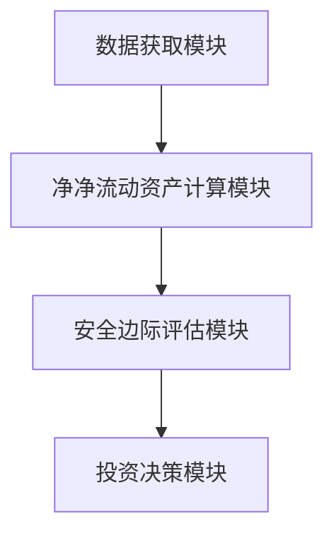
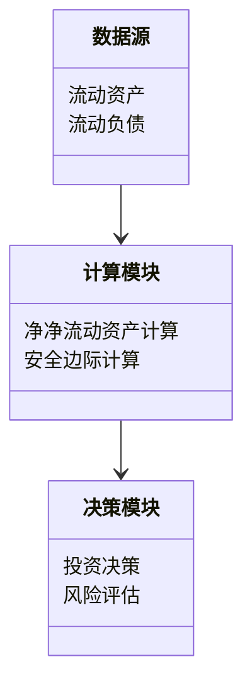

                 


# 净净流动资产价值投资：极端安全边际

## 关键词
- 价值投资
- 净净流动资产
- 极端安全边际
- 投资策略
- 系统设计

## 摘要
净净流动资产价值投资是一种以极端安全边际为核心的投资策略，通过精确计算和分析企业的净净流动资产，识别具有长期投资价值的标的。本文从背景、理论、数学模型、系统设计和项目实战等方面详细阐述这一投资策略，帮助投资者在复杂市场中做出明智决策。

---

# 第1章 净净流动资产价值投资的背景与核心概念

## 1.1 价值投资的历史发展
- 1.1.1 价值投资的起源与发展
- 1.1.2 净净流动资产投资的兴起
- 1.1.3 蒙蒂尔的贡献与独特性

## 1.2 净净流动资产的定义与计算
- 1.2.1 净净流动资产的定义
- 1.2.2 净净流动资产的计算公式
- 1.2.3 净净流动资产与传统价值投资的区别

## 1.3 净净流动资产投资的核心原则
- 1.3.1 极端安全边际的重要性
- 1.3.2 蒙蒂尔的投资策略
- 1.3.3 净净流动资产投资的适用场景

---

# 第2章 净净流动资产的数学模型与公式

## 2.1 净净流动资产的计算公式
- 净净流动资产 = 流动资产 - 流动负债
- $$\text{净净流动资产} = \text{流动资产} - \text{流动负债}$$

## 2.2 投资安全边际的计算
- $$\text{安全边际} = \text{内在价值} - \text{市场价格}$$

## 2.3 净净流动资产与企业价值的关系
- $$\text{企业价值} = \text{净净流动资产} \times \text{安全边际倍数}$$

---

# 第3章 净净流动资产投资的系统分析与架构设计

## 3.1 投资系统概述
- 3.1.1 系统目标：最大化投资收益与风险控制
- 3.1.2 系统组成：数据获取、计算模块、决策模块

## 3.2 系统功能设计


## 3.3 系统架构设计


---

# 第4章 净净流动资产投资的项目实战

## 4.1 环境安装与数据准备
- 数据源获取：上市公司财务报表
- 数据清洗：处理缺失值和异常值

## 4.2 核心算法实现
```python
def calculate_net_net_assets(流动资产, 流动负债):
    return 流动资产 - 流动负债

def calculate_margin_of_safety(内在价值, 市场价格):
    return 内在价值 - 市场价格
```

## 4.3 代码实现与解读
- 数据准备：加载财务数据
- 计算模块：应用上述函数
- 决策模块：根据结果生成投资建议

## 4.4 案例分析与结果展示
- 案例分析：某公司净流动资产计算
- 结果展示：安全边际与投资决策

---

# 第5章 总结与最佳实践

## 5.1 本章小结
- 净净流动资产投资的关键点：精确计算、极端安全边际

## 5.2 最佳实践 tips
- 定期更新数据
- 结合市场环境调整策略
- 保持长期视角

## 5.3 拓展阅读
- 推荐书籍：价值投资经典文献
- 进一步学习：投资组合优化

---

通过以上目录结构，本书将系统地介绍净净流动资产价值投资的理论与实践，帮助投资者在复杂市场中找到安全边际高的投资机会。

