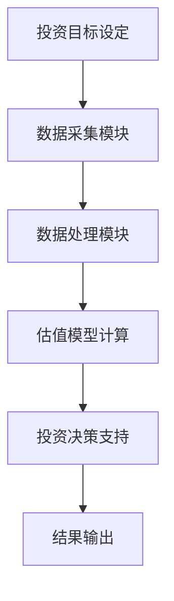

                 


好的，我明白您的需求。以下是根据您的要求构建的文章目录大纲：

---

# 詹姆斯·蒙蒂尔的净净股投资：回归格雷厄姆的根源

> **关键词**：净净股投资、价值投资、詹姆斯·蒙蒂尔、本杰明·格雷厄姆、投资策略、安全边际、企业估值

---

## 摘要

本文将深入探讨詹姆斯·蒙蒂尔的净净股投资理念，回归其理论根源——本杰明·格雷厄姆的价值投资体系。通过分析净净股投资的核心概念、数学模型、算法原理以及实战应用，结合技术语言和逻辑推理，帮助读者全面理解这一投资策略。文章还将结合实际案例和系统架构设计，为投资者提供实用的工具和方法。

---

### 目录

# 第一部分：引言

## 第1章：价值投资与净净股投资概述  
### 1.1 本杰明·格雷厄姆与价值投资的起源  
### 1.2 詹姆斯·蒙蒂尔的净净股投资理念  
### 1.3 净净股投资的核心目标：发现被低估的企业  

---

# 第二部分：净净股投资的核心概念

## 第2章：净净股投资的理论基础  
### 2.1 净净收益的定义与计算方法  
### 2.2 净净股价值的数学模型  
### 2.3 净净股投资与市场估值的对比  

## 第3章：安全边际的原理与应用  
### 3.1 安全边际的定义与重要性  
### 3.2 安全边际的计算公式与实例分析  
### 3.3 如何通过安全边际筛选优质股票  

## 第4章：净净股投资与传统投资的区别  
### 4.1 传统投资方法的局限性  
### 4.2 净净股投资的独特优势  
### 4.3 投资策略的选择与优化  

---

# 第三部分：净净股投资的数学模型与算法原理

## 第5章：企业估值的数学模型  
### 5.1 净现值法（DCF模型）的公式推导  
### 5.2 净现值法的优缺点分析  
### 5.3 通过Python代码实现DCF模型  

## 第6章：安全边际的计算与优化  
### 6.1 安全边际的计算公式  
### 6.2 通过Python代码计算安全边际  
### 6.3 实例分析：如何利用安全边际筛选股票  

---

# 第四部分：净净股投资的系统架构与技术实现

## 第7章：净净股投资的系统设计  
### 7.1 系统功能模块设计  
### 7.2 系统架构图（Mermaid）  
### 7.3 系统接口设计与交互流程  

## 第8章：净净股投资的实战工具  
### 8.1 数据分析工具的安装与配置  
### 8.2 数据建模与估值模型的实现  
### 8.3 投资决策支持系统的优化  

---

# 第五部分：案例分析与经验总结

## 第9章：净净股投资的实战案例  
### 9.1 案例背景与目标  
### 9.2 数据分析与模型实现  
### 9.3 投资决策与结果分析  

## 第10章：经验总结与最佳实践  
### 10.1 投资策略的优化与调整  
### 10.2 小结：如何在实际投资中应用净净股理念  
### 10.3 注意事项与拓展阅读  

---

### 示例代码（DCF模型实现）

```python
import pandas as pd
import numpy as np

# 示例数据：企业自由现金流
cash_flows = [100, 150, 200, 250]
discount_rate = 0.08

# 计算净现值
npv = 0
for year, cash_flow in enumerate(cash_flows, 1):
    npv += cash_flow / (1 + discount_rate) ** year

print(f"净现值（NPV）为：{npv}")
```

---

### Mermaid图表（系统架构图）



---

通过以上目录大纲，文章将从理论到实践，系统地讲解净净股投资的核心概念、数学模型、系统架构与实战应用，帮助读者全面掌握这一投资策略。

