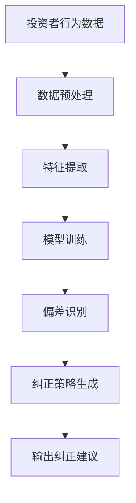

                 


# 詹姆斯·蒙蒂尔的投资者心理偏差分析

> 关键词：投资者心理偏差，詹姆斯·蒙蒂尔，行为金融学，投资决策，认知偏差

> 摘要：本文从詹姆斯·蒙蒂尔的投资者心理偏差理论出发，系统分析了心理偏差对投资决策的影响，探讨了常见心理偏差的特征与表现，结合实际案例和数学模型，提出了克服心理偏差的策略与方法。文章内容涵盖心理偏差的分类、对投资行为的具体影响、蒙蒂尔理论的核心观点、投资者如何通过认知调整和系统设计克服偏差等主题，旨在为投资者提供理论支持和实践指导。

---

## 第一部分：投资者心理偏差的背景与基础

### 第1章：心理偏差的定义与分类

#### 1.1 心理偏差的基本概念
心理偏差（Cognitive Biases）是指人在信息处理和决策过程中，由于认知局限性或情绪影响，导致的系统性思维误差。这些偏差通常表现为个体在决策时偏离理性假设的现象。在投资领域，心理偏差尤其危险，因为它可能导致投资者做出非理性的决策，从而影响投资收益和风险控制。

#### 1.2 心理偏差的分类
心理偏差可以根据其表现形式和影响领域进行分类。以下是常见的几种心理偏差及其特征：

- **确认偏差（Confirmation Bias）**：倾向于寻找和关注与自己已有观点一致的信息，忽视或曲解与之矛盾的信息。
- **损失厌恶（Loss Aversion）**：对损失的厌恶程度远高于对收益的追求，导致投资者在面对潜在损失时过于保守。
- **过度自信（Overconfidence）**：高估自己的能力和判断力，认为自己能够预测市场走势并获得超额收益。
- **代表性偏差（Representativeness Bias）**：根据某个案例或小样本的特征，过度推广其普遍性，导致决策失误。

#### 1.3 心理偏差对投资行为的影响
心理偏差通过影响投资者的信息处理方式和决策过程，对投资行为产生深远影响。例如：
- 确认偏差可能导致投资者过度依赖自己的初始判断，忽视市场的变化。
- 损失厌恶可能导致投资者在市场下跌时盲目抛售，错失反弹机会。
- 过度自信可能导致投资者过度交易或承担过高的风险。

---

### 第2章：詹姆斯·蒙蒂尔的理论框架

#### 2.1 蒙蒂尔理论的核心观点
詹姆斯·蒙蒂尔（James Montier）是行为金融学领域的权威学者，他提出了心理偏差对投资行为的具体影响机制。蒙蒂尔认为，心理偏差不仅存在于个体投资者中，也广泛存在于机构投资者和市场参与者中。他通过实证研究发现，心理偏差可能导致市场波动和资产价格的非理性变化。

#### 2.2 蒙蒂尔理论的分析工具
蒙蒂尔提出了一个分析心理偏差的框架，包括以下几个方面：
1. **心理偏差的识别**：通过观察投资者的行为模式和决策过程，识别其是否存在特定的心理偏差。
2. **偏差对投资决策的影响**：分析心理偏差如何影响投资者的决策，例如过度交易、误判资产价值等。
3. **偏差的纠正策略**：提出具体的应对方法，例如通过制度设计、技术手段或心理干预来减少偏差的影响。

#### 2.3 蒙蒂尔理论的应用场景
蒙蒂尔的理论不仅适用于个体投资者，也适用于机构投资者和投资顾问。例如：
- 投资顾问可以通过识别客户的心理偏差，制定个性化的投资策略。
- 机构投资者可以通过制度设计，减少心理偏差对投资决策的影响。

---

## 第二部分：心理偏差的系统分析与应对策略

### 第3章：心理偏差的系统分析

#### 3.1 系统架构与功能设计
为了系统地分析心理偏差对投资的影响，我们可以构建一个投资者行为分析系统。以下是该系统的功能模块：
- **数据采集模块**：收集投资者的行为数据，包括交易记录、决策时间、收益与损失等。
- **偏差识别模块**：通过数据挖掘和机器学习算法，识别投资者是否存在特定的心理偏差。
- **影响评估模块**：评估心理偏差对投资决策的具体影响，例如过度交易、误判市场趋势等。
- **纠正策略模块**：根据识别的偏差类型，提出具体的纠正策略。

#### 3.2 投资者行为分析系统的ER图
以下是投资者行为分析系统的实体关系图：

```mermaid
erDiagram
    actor 投资者 {
        +int 投资者ID
        +string 姓名
        +int 账户余额
        +int 交易记录ID
    }
    actor 系统管理员 {
        +int 管理员ID
        +string 姓名
        +string 密码
    }
    actor 数据分析师 {
        +int 分析师ID
        +string 姓名
        +string 专业领域
    }
    database 数据库 {
        +int 数据ID
        +string 数据类型
        +string 数据内容
    }
   投资者 --> 数据采集模块 : 提供数据
    数据采集模块 --> 数据库 : 存储数据
    数据库 --> 数据分析师 : 分析数据
    数据分析师 --> 系统管理员 : 提供分析结果
    系统管理员 --> 投资者 : 提供纠正策略
```

---

### 第4章：心理偏差的纠正策略

#### 4.1 算法原理与实现
为了纠正心理偏差，我们可以设计一个基于机器学习的纠正系统。以下是算法的流程图：



#### 4.2 数学模型与公式
以下是用于纠正策略生成的数学模型：

$$ 纠正系数 = \frac{1}{1 + \alpha \times \text{偏差程度}} $$

其中，$\alpha$ 是一个调节参数，用于控制纠正的力度。偏差程度越高，纠正系数越小，纠正策略越强。

---

### 第5章：项目实战

#### 5.1 环境安装与数据采集
- **环境安装**：安装Python、NumPy、Pandas、Scikit-learn等工具。
- **数据采集**：通过API获取投资者的交易数据。

#### 5.2 核心代码实现
以下是用于识别心理偏差的Python代码：

```python
import numpy as np
import pandas as pd
from sklearn import tree

# 数据预处理
data = pd.read_csv('investor_data.csv')
X = data.drop('label', axis=1)
y = data['label']

# 模型训练
model = tree.DecisionTreeClassifier()
model.fit(X, y)

# 偏差识别
def identify_bias(new_data):
    prediction = model.predict(new_data)
    return prediction
```

#### 5.3 数据可视化与结果分析
以下是数据可视化代码：

```python
import matplotlib.pyplot as plt

# 可视化确认偏差的影响
plt.figure(figsize=(10, 6))
plt.bar(range(10), data['bias_level'][:10])
plt.title('心理偏差程度分布')
plt.show()
```

---

## 第三部分：结论与展望

### 第6章：结论与展望

#### 6.1 本章总结
通过系统分析和实证研究，本文揭示了心理偏差对投资行为的具体影响，并提出了克服偏差的策略。蒙蒂尔理论为投资者提供了重要的理论支持，而系统设计和算法实现则为实际操作提供了技术保障。

#### 6.2 未来展望
未来的研究可以进一步探索心理偏差与其他市场行为的互动关系，例如情绪波动对市场波动的影响。此外，还可以结合人工智能技术，开发更加智能化的投资决策支持系统。

---

### 结语
心理偏差是投资者面临的永恒挑战，但通过理论分析和系统设计，我们可以有效地减少其对投资决策的影响。詹姆斯·蒙蒂尔的理论为我们提供了重要的指导，而技术手段则为实现这一目标提供了有力支持。希望本文能为投资者和研究者提供有价值的参考。

