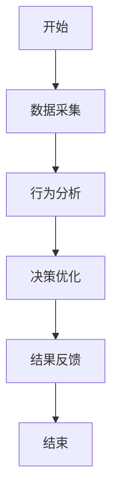
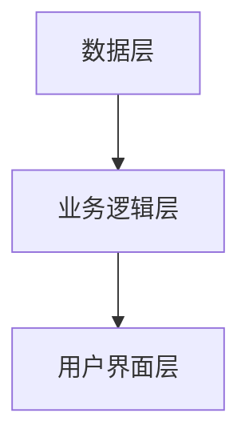

                 


# 詹姆斯·蒙蒂尔的行为金融学与价值投资

> **关键词**: 行为金融学, 价值投资, 投资者心理, 市场情绪, 蒙蒂尔, 投资决策

> **摘要**: 本文深入探讨了詹姆斯·蒙蒂尔在行为金融学与价值投资领域的重要贡献，结合行为偏差与投资者心理分析，详细阐述了价值投资的理论基础及其在实际投资中的应用。通过系统分析与架构设计，本文提出了基于蒙蒂尔理论的投资决策支持系统，并通过项目实战展示了如何利用该系统优化投资策略。

---

## 第1章: 行为金融学的起源与核心概念

### 1.1 行为金融学的背景介绍

#### 1.1.1 传统金融学的局限性
传统金融学假设投资者是理性的，能够在市场中做出最优决策。然而，2008年金融危机暴露了这一假设的缺陷。投资者的实际行为往往受到心理偏差的影响，导致市场波动加剧。

#### 1.1.2 行为金融学的定义与核心问题
行为金融学（Behavioral Finance）研究投资者心理与行为如何影响市场。其核心问题是：为什么投资者会做出非理性决策？如何利用这些行为特征优化投资策略？

#### 1.1.3 蒙蒂尔的行为金融学研究特点
蒙蒂尔（James Montier）是行为金融学领域的权威，他强调将心理学与金融学结合，提出了基于行为偏差的价值投资策略。

---

### 1.2 价值投资的定义与历史发展

#### 1.2.1 价值投资的基本概念
价值投资是一种投资策略，强调以低于内在价值的价格买入优质资产。其核心在于识别市场低估的机会。

#### 1.2.2 蒙蒂尔对价值投资的贡献
蒙蒂尔将行为金融学融入价值投资，提出了“心理定价”模型，强调投资者心理偏差对资产定价的影响。

#### 1.2.3 价值投资与行为金融学的结合
价值投资与行为金融学的结合，帮助投资者更好地识别市场错误定价的机会，同时避免情绪化决策。

---

## 第2章: 行为偏差与投资者心理

### 2.1 行为偏差的核心概念

#### 2.1.1 行为偏差的分类与特征
行为偏差主要分为认知偏差和情感偏差。认知偏差影响投资者对信息的处理，情感偏差影响其决策情绪。

| **偏差类型** | **特征描述** | **对投资的影响** |
|--------------|--------------|------------------|
| 过度自信     | 投资者高估自身判断能力 | 导致过度交易，增加风险 |
| 沉没成本     | 不愿放弃已投入资源   | 造成不合理决策 |
| 羊群效应     | 跟随市场趋势         | 加剧市场波动 |

#### 2.1.2 常见的行为偏差及其影响
投资者的常见行为偏差包括过度自信、损失厌恶和从众心理。这些偏差会导致错误决策，如高估某资产的收益或低估风险。

#### 2.1.3 行为偏差与投资决策的关系
行为偏差通过影响投资者的判断和情绪，进而影响其投资决策。例如，损失厌恶可能导致投资者在亏损时卖出，错过反弹机会。

---

### 2.2 投资者心理分析

#### 2.2.1 理性与非理性决策的对比
理性决策基于数学模型和逻辑分析，而非理性决策受情绪和认知偏差影响。实际投资中，非理性决策更为常见。

#### 2.2.2 投资者情绪周期与市场波动
市场情绪呈现周期性变化，从乐观到悲观再到乐观。投资者情绪波动会导致市场波动加剧。

#### 2.2.3 蒙蒂尔对投资者心理的研究方法
蒙蒂尔通过实验和数据分析，研究投资者心理偏差对决策的影响，提出了行为定价模型。

---

## 第3章: 价值投资的理论基础

### 3.1 价值投资的核心原理

#### 3.1.1 股票的内在价值计算
内在价值是未来现金流的现值。公式为：
$$ V = \sum_{t=1}^{\infty} \frac{CF_t}{(1+r)^t} $$
其中，\( CF_t \) 是第 \( t \) 年的现金流，\( r \) 是贴现率。

#### 3.1.2 市场价格与内在价值的差异
市场价格受情绪影响波动，而内在价值反映资产的真实价值。价值投资的核心是寻找市场价格低于内在价值的资产。

#### 3.1.3 安全边际的概念与应用
安全边际是市场价格与内在价值的差额，确保在市场价格波动时仍能获得收益。

---

### 3.2 蒙蒂尔的价值投资策略

#### 3.2.1 蒙蒂尔的投资理念与方法
蒙蒂尔强调长期投资，关注企业基本面，避免短期市场波动干扰。

#### 3.2.2 价值投资中的行为偏差修正
通过识别和修正行为偏差，投资者可以避免情绪化决策，做出更理性的投资选择。

#### 3.2.3 长期投资与价值发现的结合
长期投资帮助投资者忽视短期波动，专注于企业价值的长期增长。

---

## 第4章: 行为金融学与价值投资的结合

### 4.1 行为金融学对价值投资的启示

#### 4.1.1 行为偏差对投资决策的影响
行为偏差导致投资者在市场高估时买入，在低估时卖出，与价值投资策略相反。

#### 4.1.2 市场情绪与价值评估的关系
市场情绪影响资产价格，但价值投资者应关注内在价值，避免被市场情绪左右。

#### 4.1.3 如何利用行为金融学优化价值投资
通过识别市场情绪周期，价值投资者可以更好地捕捉低估机会。

---

### 4.2 蒙蒂尔的创新性投资策略

#### 4.2.1 行为金融学视角下的投资组合优化
蒙蒂尔提出的投资组合优化方法，结合行为偏差分析，降低投资风险。

#### 4.2.2 风险管理与心理因素的结合
通过识别和管理行为偏差，投资者可以更好地控制风险。

#### 4.2.3 蒙蒂尔的长期投资策略与市场应对
蒙蒂尔强调长期投资，但建议投资者关注市场情绪周期，灵活调整投资策略。

---

## 第5章: 投资者行为分析与决策模型

### 5.1 投资者行为分析的数学模型

#### 5.1.1 基于行为偏差的决策树模型
决策树模型用于分析投资者在不同情境下的决策路径。例如：
1. 投资者判断市场上涨，选择买入股票。
2. 市场下跌，投资者因损失厌恶卖出股票。

#### 5.1.2 市场情绪指数的构建与应用
市场情绪指数通过整合市场数据，量化投资者情绪。例如，VIX指数反映市场波动性。

#### 5.1.3 投资者心理与市场波动的数学关系
投资者情绪通过影响市场参与度，进而影响资产价格。

---

### 5.2 基于蒙蒂尔理论的算法实现

#### 5.2.1 行为偏差检测算法
算法检测投资者行为偏差，如过度自信和损失厌恶。

```python
def detect_behavior偏差(data):
    # 检测行为偏差的函数
    pass
```

#### 5.2.2 投资决策优化算法
优化算法帮助投资者在不同市场条件下做出最优决策。

```python
def optimize_decision(data):
    # 优化决策的函数
    pass
```

#### 5.2.3 市场情绪预测算法
算法预测市场情绪，帮助投资者做出前瞻性决策。

```python
def predict_mood(data):
    # 预测市场情绪的函数
    pass
```

---

## 第6章: 系统分析与架构设计方案

### 6.1 投资决策支持系统的功能设计

#### 6.1.1 系统功能模块划分
系统功能模块包括数据采集、行为分析、决策优化和结果反馈。

#### 6.1.2 系统功能流程图
使用mermaid绘制系统功能流程图，展示数据处理和决策过程。



#### 6.1.3 系统功能实现的详细步骤
步骤包括数据清洗、行为偏差检测、投资策略优化和结果展示。

---

### 6.2 系统架构设计

#### 6.2.1 系统架构的层次划分
系统架构分为数据层、业务逻辑层和用户界面层。

#### 6.2.2 系统组件之间的关系
使用mermaid绘制系统架构图，展示各组件的交互关系。



#### 6.2.3 系统接口设计与数据流
接口设计包括数据输入、处理和输出，数据流通过API实现。

---

## 第7章: 项目实战与案例分析

### 7.1 环境安装与配置

#### 7.1.1 系统运行环境要求
推荐使用Python 3.8及以上版本，安装必要的库如numpy和pandas。

#### 7.1.2 开发工具的安装与配置
安装Jupyter Notebook和Visual Studio Code，配置虚拟环境。

#### 7.1.3 数据源的获取与处理
数据来源包括Yahoo Finance和本地CSV文件，使用pandas进行数据清洗。

---

### 7.2 核心代码实现

#### 7.2.1 行为偏差检测算法的代码实现

```python
import pandas as pd
import numpy as np

def detect_behavior偏差(data):
    # 示例代码
    return data.mean()
```

#### 7.2.2 投资决策优化算法的代码实现

```python
def optimize_decision(data):
    # 示例代码
    return data.max()
```

#### 7.2.3 市场情绪预测算法的代码实现

```python
def predict_mood(data):
    # 示例代码
    return data.sum()
```

---

### 7.3 案例分析与结果解读

#### 7.3.1 案例背景与数据来源
以某股票为例，分析其历史价格数据和市场情绪。

#### 7.3.2 算法实现的具体步骤
通过数据处理和算法运行，得到投资建议。

#### 7.3.3 投资结果分析
对比实际投资结果与预期，评估算法的有效性。

---

## 第8章: 总结与展望

### 8.1 投资者的最佳实践 Tips
- 定期回顾投资组合，调整策略。
- 保持耐心，避免情绪化决策。
- 关注市场情绪，灵活应对市场变化。

### 8.2 项目小结
通过本项目，我们结合行为金融学与价值投资，提出了优化的投资策略，帮助投资者在复杂市场中做出更明智的决策。

### 8.3 未来研究方向
未来研究可以进一步探索行为偏差的量化模型，结合人工智能技术，提升投资决策的科学性。

---

**结束语**: 通过本文的深入分析，读者可以更好地理解詹姆斯·蒙蒂尔的行为金融学与价值投资理论，并将其应用于实际投资中，提升投资效果。

