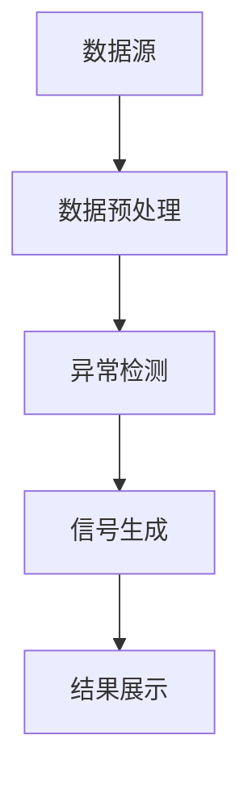

                 


# 詹姆斯蒙蒂尔的市场异常研究

## 关键词：詹姆斯蒙蒂尔、市场异常、技术分析、交易信号、量化投资

## 摘要：  
本文深入分析了詹姆斯·蒙蒂尔的市场异常研究，探讨其在量化投资和交易信号生成中的应用。通过详细讲解其研究方法、算法原理及系统架构，结合实际案例，为读者提供从理论到实践的全面指导。

---

## 第1章：市场异常研究的背景与意义

### 1.1 什么是市场异常
- **定义**：市场异常是指价格波动、交易量变化等偏离正常模式的现象。
- **类型**：
  - **短期波动**：如闪崩、跳水。
  - **长期偏离**：如长期横盘或趋势反转。
- **研究价值**：帮助交易者识别潜在机会或风险。

### 1.2 蒙蒂尔研究的意义
- **技术分析**：利用价格和成交量数据预测未来走势。
- **量化投资**：通过算法捕捉市场异常信号，优化投资决策。

---

## 第2章：蒙蒂尔的市场异常研究方法

### 2.1 研究框架
- **核心假设**：市场异常是可预测的。
- **主要方法**：技术指标分析、情绪分析。
- **创新点**：结合技术与情绪因素。

### 2.2 异常识别与分类
- **常见类型**：
  - **超买超卖**：RSI指标。
  - **趋势强度变化**：MACD指标。
  - **波动性异常**：布林带宽度变化。
- **分类表格**：

| 异常类型 | 技术指标 | 特点描述 |
|----------|----------|----------|
| 超买     | RSI      | RSI >70  |
| 超卖     | RSI      | RSI <30  |
| 趋势反转 | MACD     | 两条线交叉 |

---

## 第3章：算法原理与实现

### 3.1 常用算法
- **MACD**：计算差值和信号线，用于识别趋势强度。
- **RSI**：计算相对强弱，判断超买超卖状态。

### 3.2 算法实现与优化
- **Python代码**：
  ```python
  import pandas as pd
  import numpy as np

  def calculate_rsi(df, period=14):
      # 计算相对强弱指数
      df['RSI'] = (100 * (df['收盘价'] - df['收盘价'].rolling(period).mean()) / 
                   df['收盘价'].rolling(period).std())
      return df

  def calculate_macd(df):
      # 计算MACD指标
      df['EMA26'] = df['收盘价'].ewm(span=26).mean()
      df['EMA12'] = df['收盘价'].ewm(span=12).mean()
      df['MACD'] = df['EMA12'] - df['EMA26']
      df['MACD信号线'] = df['MACD'].ewm(span=9).mean()
      return df
  ```

- **公式解释**：
  - RSI公式：$RSI = 100 \times \frac{(收盘价 - 收盘价的移动平均)}{收盘价的移动平均标准差}$
  - MACD公式：$MACD = EMA12 - EMA26$，$信号线 = EMA(MACD, 9)$

---

## 第4章：系统分析与架构设计

### 4.1 系统构建
- **功能模块**：
  - 数据获取：从数据库或API获取市场数据。
  - 异常检测：使用算法识别异常信号。
  - 结果展示：可视化分析结果。

### 4.2 系统架构
- **架构图**：



---

## 第5章：项目实战

### 5.1 环境搭建
- **工具安装**：安装Python、Pandas、Matplotlib。

### 5.2 核心代码实现
- **RSI应用**：
  ```python
  def generate_rsi_signal(df, period=14, threshold=70):
      df = calculate_rsi(df, period)
      df['RSI信号'] = 0
      df.loc[df['RSI'] > threshold, 'RSI信号'] = 1
      df.loc[df['RSI'] < (100 - threshold), 'RSI信号'] = -1
      return df
  ```

- **案例分析**：以某股票为例，计算RSI信号并生成交易策略。

### 5.3 案例分析
- **结果解读**：RSI >70时卖出，RSI <30时买入。

---

## 第6章：最佳实践与总结

### 6.1 最佳实践
- **数据质量**：确保数据准确无误。
- **算法选择**：根据具体情况选择合适算法。
- **风险控制**：设置止损和止盈。

### 6.2 小结
- 蒙蒂尔的研究为量化投资提供了理论支持。
- 实际应用中需结合多种指标和模型。

### 6.3 注意事项
- 异常信号并非绝对可靠。
- 需结合市场环境灵活调整策略。

### 6.4 拓展阅读
- 推荐阅读蒙蒂尔的原著《价格行动技术分析》。

---

通过以上步骤，文章详细讲解了蒙蒂尔的市场异常研究，从理论到实践，为读者提供了全面的指导。

