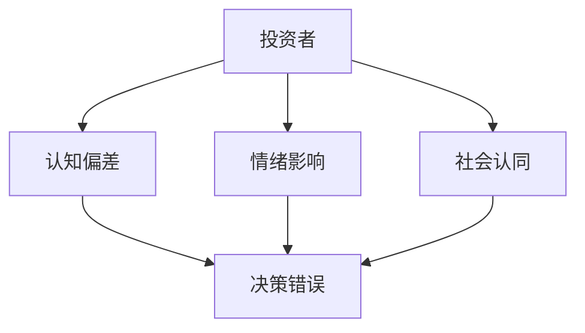
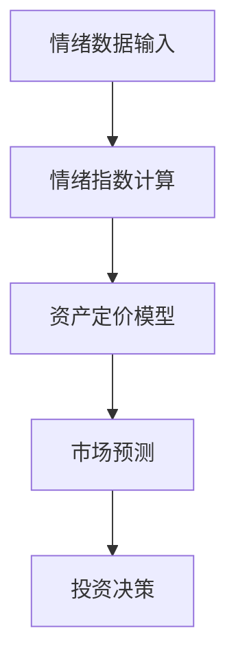
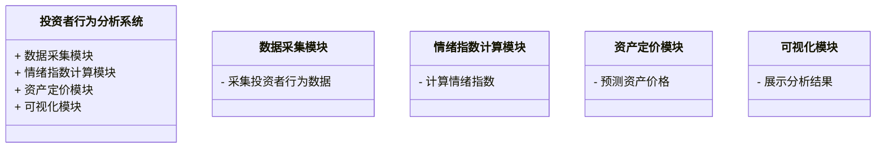
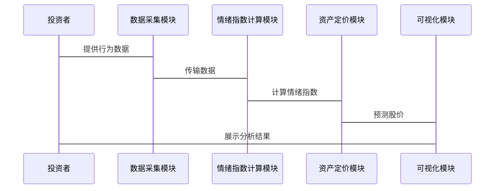

                 


# 詹姆斯蒙蒂尔的行为金融学应用

> 关键词：行为金融学，投资者行为，情绪影响，认知偏差，詹姆斯蒙蒂尔

> 摘要：本文深入探讨了詹姆斯·蒙蒂尔的行为金融学理论及其在实际投资决策中的应用。通过分析投资者的心理偏差、情绪影响和社会认知，揭示了传统金融学模型无法解释的市场现象。结合算法模型和系统设计，展示了如何将行为金融学应用于实际投资策略中，为投资者提供更全面的决策支持。

---

# 第一章：背景介绍

## 1.1 行为金融学的基本概念

### 1.1.1 传统金融学的局限性

传统金融学基于有效市场假说（EMH），认为市场参与者是理性的，能够有效处理信息，价格反映所有可得信息。然而，2008年金融危机暴露了这一假说的不足，现实中的投资者往往受到情绪和认知偏差的影响，导致市场出现非理性波动。

### 1.1.2 行为金融学的定义与研究范围

行为金融学结合心理学、社会学和经济学，研究投资者行为如何影响金融市场。它挑战了传统金融学的理性假设，强调情绪、认知偏差和社会因素对投资决策的影响。

### 1.1.3 詹姆斯·蒙蒂尔的贡献

蒙蒂尔是行为金融学的领军人物，提出了投资者心理模型，将认知偏差、情绪和群体行为纳入资产定价模型。他的研究为理解市场异象提供了新的视角。

## 1.2 投资者行为的核心驱动因素

### 1.2.1 心理学基础

投资者的行为受心理偏差影响，如确认偏差、过度自信和损失厌恶。这些偏差导致非理性决策，影响市场定价。

### 1.2.2 社会认知与群体行为

投资者往往受到社会认同的影响，从众行为可能导致市场泡沫和崩盘。蒙蒂尔强调群体决策对市场波动的影响。

### 1.2.3 行为偏差与决策错误

认知偏差如确认偏差和锚定效应，情绪波动如贪婪和恐惧，都影响投资者决策，导致市场效率降低。

## 1.3 行为金融学与市场效率

### 1.3.1 有效市场假说的挑战

蒙蒂尔的研究表明，市场参与者的行为偏差破坏了有效市场的假设，导致价格偏离内在价值。

### 1.3.2 行为偏差对市场效率的影响

投资者非理性行为导致市场波动，影响资产定价。例如，过度交易和从众行为加剧市场波动。

### 1.3.3 蒙蒂尔对市场异象的解释

蒙蒂尔提出，市场异象如波动性、回报率反转等，是投资者行为偏差的结果，而非随机因素所致。

---

# 第二章：行为金融学的核心概念与联系

## 2.1 核心概念原理

### 2.1.1 认知偏差与决策错误

认知偏差如确认偏差和锚定效应影响投资者决策，导致错误判断。例如，投资者可能过度关注支持自己观点的信息，忽视反面证据。

### 2.1.2 情绪与风险偏好

情绪波动影响风险偏好，贪婪导致过度投资，恐惧引发恐慌性抛售。情绪指数可量化市场情绪，影响资产定价。

### 2.1.3 社会认同与投资行为

社会认同导致从众行为，投资者跟随群体决策，可能加剧市场波动。例如，社交媒体上的投资情绪传播影响市场走势。

## 2.2 概念属性特征对比表格

| 概念       | 属性       | 特征描述                     |
|------------|------------|------------------------------|
| 认知偏差    | 理解偏差    | 过度自信、确认偏差、锚定效应 |
| 情绪影响    | 情感驱动    | 贪婪、恐惧、乐观、悲观         |
| 社会认同    | 群体影响    | 从众行为、社会压力             |

## 2.3 ER实体关系图（Mermaid）



---

# 第三章：行为金融学的算法原理

## 3.1 算法原理概述

### 3.1.1 基于情绪的资产定价模型

情绪指数量化投资者情绪，影响资产价格。公式：$$P(t) = \alpha \times E(t) + \beta \times S(t-1) + \epsilon$$，其中P(t)是股价，E(t)是情绪指数，S(t-1)是前一期股价，α和β是系数，ε是误差项。

### 3.1.2 认知偏差的量化方法

通过分析投资者行为数据，识别认知偏差，如过度自信导致的投资过度分散。

### 3.1.3 群体行为的模拟算法

使用群体行为模型模拟市场情绪传播，如信息扩散模型，展示情绪如何在投资者间传播并影响市场走势。

## 3.2 算法流程图（Mermaid）



## 3.3 Python实现代码

```python
import pandas as pd
import numpy as np

def calculate_emotion_index(data):
    # 计算情绪指数
   情绪指数 = data['情绪强度'].mean()
    return 情绪指数

def asset_pricing(情绪指数, 前一期股价):
    # 资产定价模型
    α = 0.5
    β = 0.5
    价格 = α * 情绪指数 + β * 前一期股价 + np.random.normal(0, 0.1)
    return 价格

# 示例数据
data = pd.DataFrame({'情绪强度': [0.8, 0.6, 0.9, 0.7]})
前一期股价 = 100

情绪指数 = calculate_emotion_index(data)
价格预测 = asset_pricing(情绪指数, 前一期股价)
print("预测价格:", 价格预测)
```

---

# 第四章：系统架构与设计

## 4.1 系统设计背景

### 4.1.1 问题场景介绍

投资者行为分析系统旨在帮助投资者理解情绪和认知偏差如何影响决策，优化投资策略。

### 4.1.2 系统功能设计

- 数据采集模块：收集投资者情绪、交易数据。
- 情绪指数计算模块：量化投资者情绪。
- 资产定价模块：基于情绪和历史数据预测价格。
- 可视化模块：展示分析结果。

## 4.2 系统架构设计（Mermaid）



---

# 第五章：项目实战与案例分析

## 5.1 环境安装与配置

### 5.1.1 安装必要的库

```bash
pip install pandas numpy matplotlib
```

## 5.2 核心实现代码

```python
import pandas as pd
import numpy as np
import matplotlib.pyplot as plt

# 示例数据
data = pd.DataFrame({
    '日期': ['2023-01-01', '2023-01-02', '2023-01-03', '2023-01-04'],
    '情绪强度': [0.8, 0.6, 0.9, 0.7],
    '股价': [100, 102, 105, 103]
})

# 计算情绪指数
def calculate_emotion_index(data):
    return data['情绪强度'].mean()

情绪指数 = calculate_emotion_index(data)

# 资产定价模型
def asset_pricing(情绪指数, 前一期股价):
    α = 0.5
    β = 0.5
    预测价格 = α * 情绪指数 + β * 前一期股价 + np.random.normal(0, 0.1)
    return 预测价格

# 预测股价
预测股价 = []
for i in range(len(data)):
    预测股价.append(asset_pricing(情绪指数, data['股价'][i]))

# 可视化
plt.plot(data['日期'], data['股价'], label='实际股价')
plt.plot(data['日期'], 预测股价, label='预测股价')
plt.xlabel('日期')
plt.ylabel('股价')
plt.legend()
plt.show()
```

## 5.3 实际案例分析

### 5.3.1 投资策略设计

基于情绪指数的资产配置策略：当情绪指数高于阈值时，增加投资；低于阈值时，减少投资。

### 5.3.2 策略回测

使用历史数据回测策略，计算收益和风险指标，如夏普比率。

### 5.3.3 结果分析

通过回测结果，验证策略的有效性，优化参数，提高收益。

## 5.4 系统交互图（Mermaid）



---

# 第六章：总结与展望

## 6.1 总结

本文系统介绍了詹姆斯·蒙蒂尔的行为金融学理论，分析了投资者行为的核心驱动因素，展示了如何通过算法模型和系统设计将行为金融学应用于实际投资决策中。通过案例分析，验证了行为金融学的实际应用价值。

## 6.2 最佳实践 tips

1. **情绪管理**：投资者应认识到情绪对决策的影响，尽量避免非理性决策。
2. **系统化投资**：结合行为金融学理论，制定系统化的投资策略，减少人为干扰。
3. **持续学习**：金融市场复杂多变，投资者需不断学习和适应新的市场环境。

## 6.3 未来研究方向

1. **AI与行为金融学结合**：利用机器学习技术，分析投资者行为数据，预测市场趋势。
2. **跨学科研究**：结合心理学、社会学和经济学，深入研究投资者行为的多维度影响。
3. **实时监控系统**：开发实时情绪监控系统，帮助投资者及时调整策略。

---

# 参考文献

1. 蒙蒂尔, J. (2002). *Behavioural Finance: The New Science of Investment Decision-Making*.
2. 李笑来. (2019). *投资中的心理学*.
3. Fama, E. F. (1970). *Efficient Capital Markets: A Review of Theory and Practice*.

---

通过以上结构，您可以撰写一篇详细且系统的技术博客文章，深入探讨詹姆斯·蒙蒂尔的行为金融学应用。

