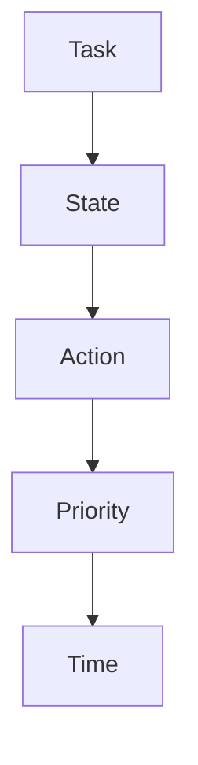
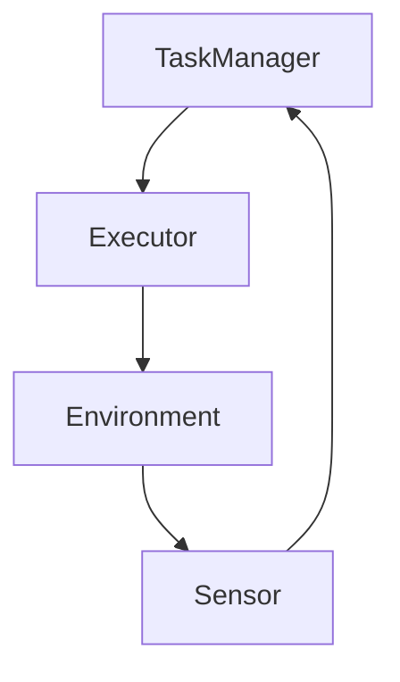
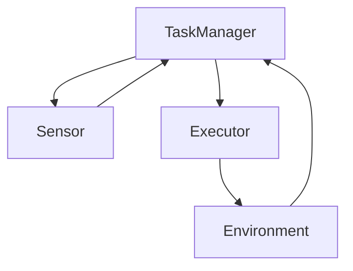

                 


# 设计AI Agent的动态任务规划与执行系统

> 关键词：AI Agent, 动态任务规划, 执行系统, 任务分解, 优先级排序, 多智能体协作

> 摘要：本文详细探讨了AI Agent的动态任务规划与执行系统的构建过程，从核心概念到算法实现，再到系统架构设计，最后结合实际案例进行深入分析。文章内容涵盖动态任务规划的背景、核心算法、系统架构、项目实战以及最佳实践，旨在为读者提供一个全面且系统的指导。

---

# 第1章: AI Agent与动态任务规划概述

## 1.1 AI Agent的基本概念

### 1.1.1 AI Agent的定义与特点
- **AI Agent**：智能体（Agent）是一个能够感知环境并采取行动以实现目标的实体。
- **特点**：
  - 自主性：能够自主决策。
  - 反应性：能够实时感知环境并做出反应。
  - 目标导向：所有行为都围绕实现特定目标展开。

### 1.1.2 动态任务规划的核心概念
- **动态环境**：环境是不断变化的，任务目标和条件可能实时更新。
- **任务规划**：在动态环境中，智能体需要动态调整任务的优先级和执行顺序。

### 1.1.3 问题背景与解决方案
- **问题背景**：在动态环境中，任务的优先级和可行性可能发生变化，传统的静态任务规划方法无法适应。
- **解决方案**：引入动态任务规划算法，实时更新任务优先级和执行顺序。

## 1.2 动态任务规划的核心概念与联系

### 1.2.1 实体关系图


### 1.2.2 核心概念对比
| 概念 | 描述 |
|------|------|
| 任务分解 | 将复杂任务分解为简单子任务 |
| 优先级排序 | 根据任务的重要性和紧急性排序 |
| 动态更新 | 根据环境变化实时更新任务状态 |

## 1.3 动态任务规划的数学模型

### 1.3.1 状态空间
$$S = \{s_1, s_2, ..., s_n\}$$

### 1.3.2 动作空间
$$A = \{a_1, a_2, ..., a_m\}$$

### 1.3.3 优先级函数
$$f(s_i) = \sum_{j=1}^{k} w_j \cdot p_j(s_i)$$
其中，$w_j$是权重，$p_j(s_i)$是第$j$个属性在状态$s_i$下的值。

---

# 第2章: 动态任务规划算法原理

## 2.1 任务优先级排序算法

### 2.1.1 Dijkstra算法实现

#### Dijkstra算法流程
```mermaid
graph TD
    start --> initialize
    initialize --> priority_queue
    priority_queue --> while_not_empty
    while_not_empty --> dequeue_min
    dequeue_min --> process_task
    process_task --> enqueue_neighbors
    enqueue_neighbors --> end
```

### 2.1.2 代码实现
```python
import heapq

def dijkstra(graph, start):
    dist = {node: float('infinity') for node in graph}
    dist[start] = 0
    heap = []
    heapq.heappush(heap, (0, start))
    
    while heap:
        current_dist, current_node = heapq.heappop(heap)
        if current_dist > dist[current_node]:
            continue
        for neighbor, weight in graph[current_node].items():
            if dist[neighbor] > current_dist + weight:
                dist[neighbor] = current_dist + weight
                heapq.heappush(heap, (dist[neighbor], neighbor))
    return dist
```

## 2.2 任务分解算法

### 2.2.1 A*算法实现

#### A*算法流程
```mermaid
graph TD
    start --> initialize
    initialize --> open_set
    open_set --> while_not_empty
    while_not_empty --> select_min_cost
    select_min_cost --> process_task
    process_task --> generate_neighbors
    generate_neighbors --> add_to_open_set
    add_to_open_set --> end
```

### 2.2.2 代码实现
```python
import heapq

def a_star(graph, start, goal):
    open_set = {start}
    came_from = {}
    g_score = {node: float('infinity') for node in graph}
    g_score[start] = 0
    f_score = {node: float('infinity') for node in graph}
    f_score[start] = 0
    heap = []
    heapq.heappush(heap, (0, start))
    
    while heap:
        current_f, current_node = heapq.heappop(heap)
        if current_node == goal:
            break
        if current_f > f_score[current_node]:
            continue
        for neighbor, weight in graph[current_node].items():
            tentative_g = g_score[current_node] + weight
            if tentative_g < g_score[neighbor]:
                came_from[neighbor] = current_node
                g_score[neighbor] = tentative_g
                f_score[neighbor] = g_score[neighbor] + heuristic(neighbor, goal)
                heapq.heappush(heap, (f_score[neighbor], neighbor))
    return came_from, g_score
```

---

# 第3章: 动态任务规划与执行系统架构设计

## 3.1 系统功能模块设计

### 3.1.1 功能模块划分
- **任务管理模块**：负责任务的分解、优先级排序和动态更新。
- **执行模块**：负责任务的实际执行，与环境交互。
- **感知模块**：负责实时感知环境变化，更新任务状态。

## 3.2 系统架构图


## 3.3 接口设计与交互流程

### 3.3.1 接口设计
- **任务管理接口**：提供任务分解、优先级排序等功能。
- **执行接口**：接收任务并执行动作。
- **感知接口**：获取环境状态信息。

### 3.3.2 交互流程图


---

# 第4章: 项目实战与案例分析

## 4.1 项目环境安装

### 4.1.1 安装依赖
```bash
pip install numpy pandas scikit-learn
```

## 4.2 核心代码实现

### 4.2.1 任务优先级排序代码
```python
import pandas as pd
import numpy as np

def calculate_priority(tasks, weights):
    priority = []
    for task in tasks:
        p = np.dot(weights, task.attributes)
        priority.append(p)
    return priority
```

### 4.2.2 动态更新代码
```python
def update_tasks(tasks, environment):
    for task in tasks:
        if environment.is_task_possible(task):
            task.priority = calculate_priority([task], task.weights)
```

## 4.3 案例分析
- **案例背景**：一个多智能体协作的动态任务分配问题。
- **解决方案**：使用动态任务规划算法，实时更新任务优先级。
- **结果分析**：通过仿真实验验证算法的有效性。

---

# 第5章: 总结与展望

## 5.1 总结
- 动态任务规划与执行系统的核心在于实时感知和动态调整。
- 通过任务分解、优先级排序和多智能体协作，可以实现高效的动态任务执行。

## 5.2 展望
- **强化学习**：未来可以结合强化学习，提升任务规划的智能性。
- **多智能体协作**：进一步研究多智能体协作的任务分配方法。
- **动态环境适应**：优化系统在极端动态环境下的鲁棒性。

---

通过本文的详细讲解，读者可以全面了解AI Agent的动态任务规划与执行系统的构建过程，并能够在实际项目中应用这些方法和技巧。

