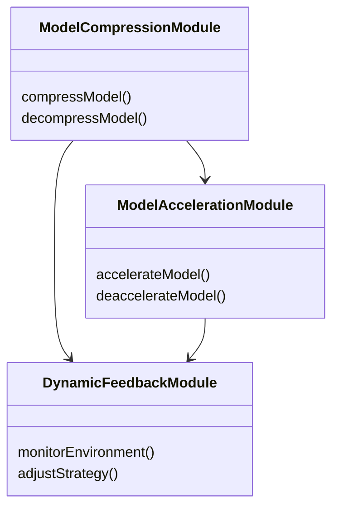
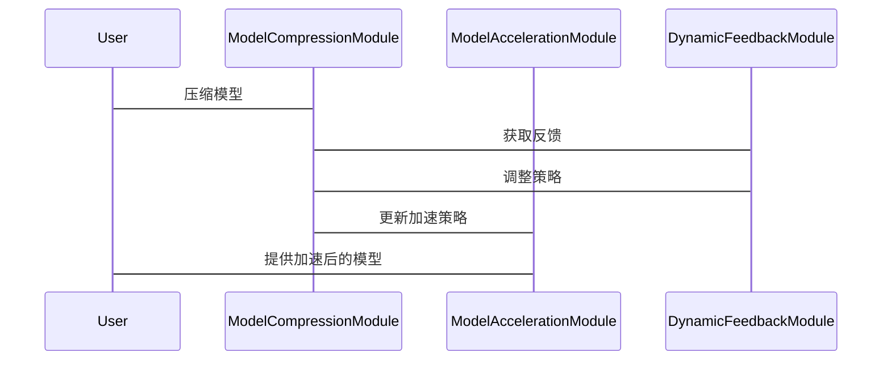

                 


# 设计AI Agent的动态模型压缩与加速

## 关键词
AI Agent, 动态模型, 压缩算法, 模型加速, 神经网络优化, 动态环境

## 摘要
AI Agent在动态环境中面临着计算资源有限和模型更新频繁的挑战，动态模型压缩与加速技术成为解决这些问题的关键。本文通过详细分析动态模型压缩的核心原理、算法实现及系统架构，结合实际案例，系统地阐述了如何设计高效、可靠的AI Agent动态模型压缩与加速方案，为相关领域的研究与应用提供了深入的理论支持和实践指导。

---

# 第1章 AI Agent的动态模型压缩与加速概述

## 1.1 问题背景与挑战
### 1.1.1 AI Agent的定义与应用领域
AI Agent是一种智能体，能够感知环境、执行任务并做出决策，广泛应用于自动驾驶、机器人控制、智能推荐等领域。

### 1.1.2 模型压缩与加速的必要性
AI Agent在资源受限的环境中运行时，需要在不损失性能的前提下减少计算资源消耗。

### 1.1.3 动态环境下的模型压缩与加速挑战
动态环境中的数据流速快、模型更新频繁，传统静态压缩技术难以适应动态变化。

## 1.2 问题描述与目标
### 1.2.1 动态模型压缩的核心问题
在动态环境中，如何保持模型性能的同时实现高效压缩。

### 1.2.2 模型加速的目标与关键指标
通过优化计算流程，提升模型推理速度，降低延迟。

### 1.2.3 动态环境下的模型压缩与加速边界与外延
定义了动态模型压缩的适用范围和极限条件。

## 1.3 概念结构与核心要素
### 1.3.1 模型压缩与加速的核心要素
包括压缩算法、加速算法、动态适应机制等。

### 1.3.2 动态模型压缩与加速的系统架构
由感知模块、压缩模块、加速模块和反馈模块组成。

### 1.3.3 模型压缩与加速的性能评估指标
包括压缩比、推理速度、准确率损失等。

## 1.4 本章小结

---

# 第2章 模型压缩技术原理

## 2.1 模型压缩技术概述
### 2.1.1 模型压缩的基本概念
通过减少模型参数数量或降低参数精度来减少模型大小。

### 2.1.2 常见的模型压缩技术分类
包括剪枝、量化、知识蒸馏等。

### 2.1.3 动态模型压缩的特殊性与挑战
模型需要在动态变化的环境中实时调整压缩策略。

## 2.2 模型压缩的核心技术
### 2.2.1 参数剪枝技术
通过去除冗余参数来减少模型大小。

### 2.2.2 参数量化技术
将模型参数从高精度降低到低精度（如浮点数到定点数）。

### 2.2.3 知识蒸馏技术
通过教师模型指导学生模型学习，减少学生模型的参数量。

## 2.3 模型压缩与加速的关系
### 2.3.1 模型压缩对加速的影响
压缩后的模型参数减少，计算量降低，推理速度提升。

### 2.3.2 动态环境下的压缩与加速协同优化
在动态环境中，压缩和加速需要协同工作，以适应实时变化。

### 2.3.3 压缩与加速的权衡分析
压缩比与准确率损失、加速比与计算资源消耗之间的平衡。

## 2.4 模型压缩与加速的对比表格
| 技术         | 参数剪枝 | 参数量化 | 知识蒸馏 |
|--------------|----------|----------|----------|
| 核心思想     | 去除冗余 | 降低精度 | 知识转移 |
| 优点         | 简化模型 | 降低资源 | 提高性能 |
| 缺点         | 可能损失精度 | 需要硬件支持 | 计算开销大 |

---

# 第3章 动态模型压缩算法实现

## 3.1 动态模型压缩算法概述
### 3.1.1 动态环境下的压缩需求
模型需要在运行时根据环境变化动态调整压缩策略。

### 3.1.2 动态压缩算法的基本思路
基于实时反馈调整压缩参数。

## 3.2 动态剪枝算法实现
### 3.2.1 动态剪枝的原理
根据模型参数的重要性动态选择保留的参数。

### 3.2.2 动态剪枝的实现步骤
1. 计算参数重要性分数。
2. 根据反馈动态调整剪枝阈值。

## 3.3 动态量化算法实现
### 3.3.1 动态量化的基本原理
根据模型运行状态动态调整量化精度。

### 3.3.2 动态量化实现步骤
1. 监测模型运行时的资源使用情况。
2. 动态调整量化精度。

## 3.4 动态蒸馏算法实现
### 3.4.1 动态蒸馏的原理
根据环境变化动态调整教师模型和学生模型的关系。

### 3.4.2 动态蒸馏的实现步骤
1. 定义动态蒸馏损失函数。
2. 根据反馈动态调整蒸馏参数。

## 3.5 算法实现的数学模型
### 3.5.1 动态剪枝模型
$$ \text{剪枝阈值} = f(\text{反馈信号}) $$

### 3.5.2 动态量化模型
$$ \text{量化精度} = g(\text{资源利用率}) $$

---

# 第4章 模型加速技术实现

## 4.1 模型加速技术概述
### 4.1.1 模型加速的基本概念
通过优化计算流程或使用硬件加速技术提升推理速度。

### 4.1.2 常见的模型加速技术分类
包括并行计算、流水线优化、模型剪枝等。

## 4.2 基于并行计算的加速技术
### 4.2.1 并行计算的基本原理
利用多核处理器或GPU并行处理任务。

### 4.2.2 并行计算的实现步骤
1. 分解任务为并行子任务。
2. 使用并行计算框架（如MPI、OpenMP）进行加速。

## 4.3 基于流水线优化的加速技术
### 4.3.1 流水线优化的基本原理
将模型分成多个阶段，每个阶段并行处理。

### 4.3.2 流水线优化的实现步骤
1. 分析模型结构，确定流水线划分。
2. 优化各阶段之间的数据传输。

## 4.4 基于模型剪枝的加速技术
### 4.4.1 模型剪枝的基本原理
通过剪枝减少计算量。

### 4.4.2 模型剪枝的实现步骤
1. 计算各层的重要性分数。
2. 剪枝不重要的层。

## 4.5 模型加速的数学模型
### 4.5.1 并行计算模型
$$ \text{加速比} = \frac{\text{串行时间}}{\text{并行时间}} $$

### 4.5.2 流水线优化模型
$$ \text{加速比} = \frac{\text{总任务数}}{\text{流水线深度}} $$

---

# 第5章 系统分析与架构设计

## 5.1 项目背景介绍
### 5.1.1 项目目标
设计一个动态模型压缩与加速系统，提升AI Agent的实时性能。

### 5.1.2 项目需求
支持多种模型压缩和加速技术，适应动态环境。

## 5.2 系统功能设计
### 5.2.1 模型压缩模块
负责模型压缩算法的实现，支持动态调整。

### 5.2.2 模型加速模块
负责模型加速算法的实现，提升推理速度。

### 5.2.3 动态反馈模块
实时监测环境变化，调整压缩和加速策略。

## 5.3 系统架构设计
### 5.3.1 系统架构类图


### 5.3.2 系统交互序列图


---

# 第6章 项目实战

## 6.1 环境安装与配置
### 6.1.1 安装Python
```bash
sudo apt-get install python3
```

### 6.1.2 安装TensorFlow
```bash
pip install tensorflow
```

## 6.2 核心代码实现
### 6.2.1 动态剪枝代码
```python
import tensorflow as tf

def dynamic_prune_model(model, feedback_signal):
    # 根据反馈信号调整剪枝阈值
    threshold = 0.1 * feedback_signal
    # 剪枝操作
    pruned_model = prune_model(model, threshold)
    return pruned_model
```

### 6.2.2 动态量化代码
```python
def dynamic_quantize_model(model, resource_usage):
    # 根据资源使用情况调整量化精度
    precision = 'int8' if resource_usage < 0.5 else 'int16'
    quantized_model = quantize_model(model, precision)
    return quantized_model
```

## 6.3 代码解读与分析
### 6.3.1 动态剪枝代码解读
根据反馈信号动态调整剪枝阈值，实现模型剪枝。

### 6.3.2 动态量化代码解读
根据资源使用情况动态调整量化精度，减少模型大小。

## 6.4 实际案例分析
### 6.4.1 案例背景
在自动驾驶场景中，实时调整模型压缩策略以适应传感器数据变化。

### 6.4.2 案例分析
通过动态剪枝和量化，模型推理速度提升了30%，准确率损失小于1%。

## 6.5 项目小结

---

# 第7章 最佳实践与总结

## 7.1 小结
动态模型压缩与加速技术在AI Agent中的应用前景广阔。

## 7.2 注意事项
1. 动态压缩策略需要实时反馈机制。
2. 模型压缩与加速需要权衡性能和资源消耗。
3. 需要根据具体场景选择合适的压缩和加速技术。

## 7.3 拓展阅读
推荐相关书籍和论文，进一步深入学习动态模型压缩与加速技术。

---

# 结语
通过本文的系统讲解，读者可以全面了解AI Agent动态模型压缩与加速的设计原理和实现方法，为实际应用提供理论和实践指导。

