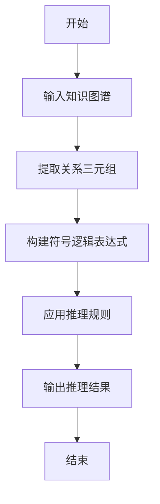
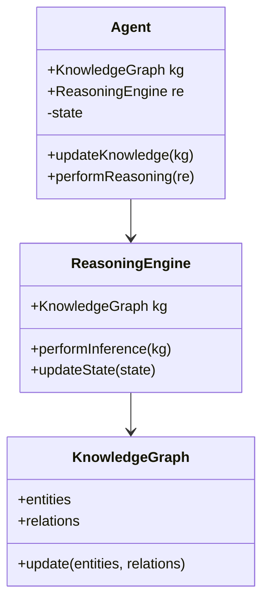
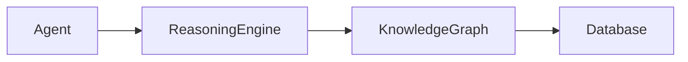
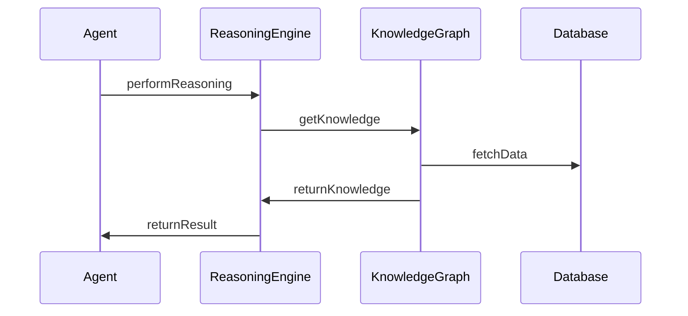

                 


# 设计AI Agent的动态知识图谱推理引擎

## 关键词
AI Agent，知识图谱，动态推理，符号逻辑，概率推理，系统架构

## 摘要
本文深入探讨了设计AI Agent的动态知识图谱推理引擎的关键技术。首先，介绍了AI Agent和知识图谱的基本概念，分析了动态知识图谱推理的必要性。接着，详细讲解了符号逻辑和概率推理的算法原理，并通过数学模型和代码示例进行了说明。随后，设计了系统的架构，包括类图、架构图和序列图。最后，通过项目实战展示了如何实现动态知识图谱推理引擎，并总结了最佳实践和注意事项。

---

# 第一部分: AI Agent与动态知识图谱推理引擎的背景与核心概念

## 第1章: 问题背景与问题描述

### 1.1 问题背景
#### 1.1.1 当前AI Agent的发展现状
AI Agent（智能代理）正广泛应用于自动驾驶、智能助手、推荐系统等领域。然而，现有AI Agent在动态环境中的知识表示和推理能力存在不足。

#### 1.1.2 知识图谱在AI Agent中的作用
知识图谱通过结构化数据表示，为AI Agent提供了丰富的背景知识，帮助其理解和推理复杂场景。

#### 1.1.3 动态知识图谱推理的必要性
动态环境中的知识不断变化，传统的静态推理无法满足实时推理需求，因此需要动态知识图谱推理引擎。

### 1.2 问题描述
#### 1.2.1 AI Agent面临的知识表示挑战
如何在动态环境中高效表示和更新知识图谱，是AI Agent设计的关键问题。

#### 1.2.2 知识图谱推理的动态性需求
动态知识图谱推理需要实时更新和推理，以适应环境变化。

#### 1.2.3 动态知识图谱推理引擎的目标
设计一个高效的动态知识图谱推理引擎，支持实时推理和动态知识更新。

## 第2章: 核心概念与核心要素

### 2.1 核心概念
#### 2.1.1 AI Agent的定义与分类
AI Agent是能够感知环境、自主决策并执行任务的智能实体，分为简单反射型、基于模型型等。

#### 2.1.2 知识图谱的定义与构建
知识图谱是一种结构化的知识表示形式，通过实体和关系描述世界。

#### 2.1.3 动态知识图谱推理的定义
动态知识图谱推理是在动态环境中，基于知识图谱进行实时推理的过程。

### 2.2 核心要素对比
| 核心要素 | 知识图谱 | 传统知识库 | AI Agent |
|----------|----------|------------|-----------|
| 表示方式 | 结构化三元组 | 非结构化数据 | 智能实体 |
| 更新频率 | 实时 | 定期 | 实时 |
| 应用场景 | 智能搜索、推荐 | 数据存储 | 自动驾驶、智能助手 |

### 2.3 ER实体关系图
```mermaid
er
actor(Agent, 实体, 关系)
```

---

# 第二部分: 动态知识图谱推理引擎的核心原理

## 第3章: 动态知识图谱推理引擎的算法原理

### 3.1 基于符号逻辑的推理算法
#### 3.1.1 符号逻辑基础
符号逻辑通过谓词和量词表示知识，支持基于规则的推理。

#### 3.1.2 基于谓词逻辑的推理规则
使用逻辑蕴含规则进行推理，例如：
$$ \text{如果 } P(x) \rightarrow Q(x) \text{ 且 } P(x) \text{ 为真，则 } Q(x) \text{ 为真} $$

#### 3.1.3 算法流程图


### 3.2 基于概率推理的算法
#### 3.2.1 概率图模型基础
概率图模型通过贝叶斯网络表示不确定性。

#### 3.2.2 贝叶斯网络在动态知识图谱中的应用
通过贝叶斯推理更新知识图谱的概率分布。

#### 3.2.3 动态推理的数学模型
$$ P(A|B) = \frac{P(B|A)P(A)}{P(B)} $$

### 3.3 算法实现代码示例
```python
def symbolic_reasoning(knowledge_graph):
    # 输入知识图谱
    # 返回推理结果
    pass

def probabilistic_reasoning(knowledge_graph):
    # 输入知识图谱
    # 返回概率推理结果
    pass
```

---

## 第4章: 动态知识图谱推理引擎的数学模型

### 4.1 符号逻辑推理的数学模型
#### 4.1.1 命题逻辑基础
命题逻辑通过真值表示命题的真假关系。

#### 4.1.2 谓词逻辑的表达形式
谓词逻辑通过符号表示实体和关系，例如：
$$ \forall x (P(x) \rightarrow Q(x)) $$

### 4.2 概率推理的数学模型
#### 4.2.1 贝叶斯定理的数学表达
$$ P(A|B) = \frac{P(B|A)P(A)}{P(B)} $$

---

# 第三部分: 系统分析与架构设计

## 第5章: 系统分析与架构设计方案

### 5.1 问题场景介绍
动态知识图谱推理引擎应用于实时环境，如自动驾驶和智能助手。

### 5.2 项目介绍
设计一个支持动态知识更新和实时推理的引擎。

### 5.3 系统功能设计
类图展示系统核心类及其交互。



### 5.4 系统架构设计
系统架构图展示各模块交互。



### 5.5 系统接口设计
定义系统接口，如：
- `updateKnowledge(kg)`
- `performReasoning(re)`

### 5.6 系统交互设计
序列图展示系统交互流程。



---

# 第四部分: 项目实战

## 第6章: 项目实战

### 6.1 环境安装
安装必要的依赖，如：
- Python 3.8+
- Mermaid CLI
- Jupyter Notebook

### 6.2 系统核心实现源代码
```python
class KnowledgeGraph:
    def __init__(self):
        self.entities = {}
        self.relations = {}

    def update(self, entities, relations):
        self.entities.update(entities)
        self.relations.update(relations)

class ReasoningEngine:
    def __init__(self, kg):
        self.kg = kg

    def perform_inference(self):
        # 示例推理逻辑
        pass

class Agent:
    def __init__(self, kg):
        self.kg = kg

    def update_knowledge(self, entities, relations):
        self.kg.update(entities, relations)

    def perform_reasoning(self):
        engine = ReasoningEngine(self.kg)
        return engine.perform_inference()
```

### 6.3 代码应用解读与分析
解释代码结构和功能，展示如何实现动态知识更新和推理。

### 6.4 实际案例分析
通过具体案例，如自动驾驶中的路径规划，展示推理引擎的应用。

### 6.5 项目小结
总结项目实现的关键点和成功经验。

---

# 第五部分: 总结与扩展

## 第7章: 总结与扩展

### 7.1 最佳实践
建议在动态知识图谱推理中采用增量更新和实时反馈机制。

### 7.2 小结
总结本文的主要内容和结论。

### 7.3 注意事项
提醒读者注意知识图谱的实时更新和推理引擎的性能优化。

### 7.4 拓展阅读
推荐相关领域的书籍和论文，如《知识图谱》、《概率图模型》等。

---

通过以上结构，本文详细阐述了设计AI Agent的动态知识图谱推理引擎的关键技术，从理论到实践，为读者提供了全面的指导和参考。

