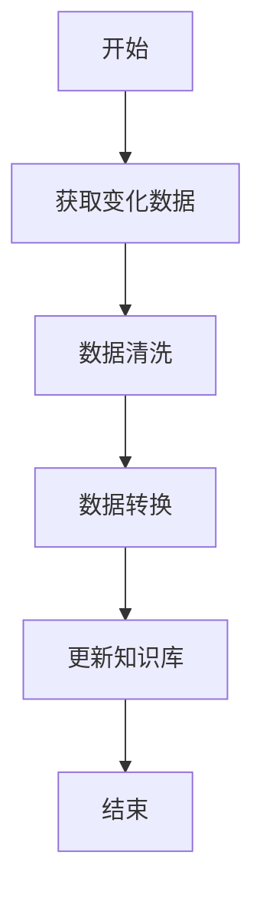
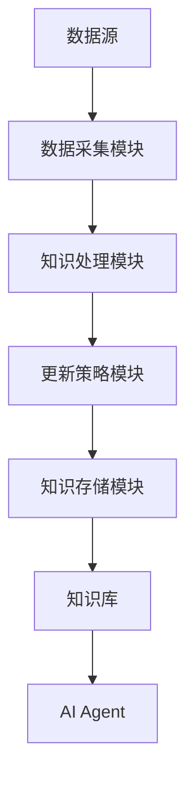
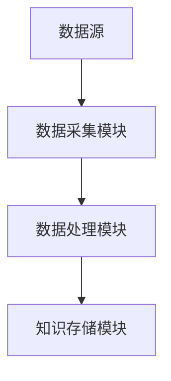
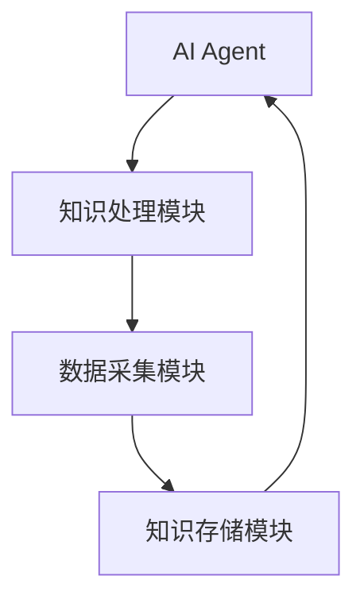

                 


# 设计AI Agent的动态知识库更新机制

---

## 关键词

AI Agent, 动态知识库, 知识图谱, 实时更新, 增量学习, 知识推理

---

## 摘要

在人工智能领域，AI Agent（智能体）的动态知识库更新机制是实现智能决策和高效推理的核心技术。随着实时数据流的不断涌入，知识库需要具备动态更新能力，以适应快速变化的环境。本文从AI Agent的基本概念出发，深入探讨动态知识库的定义、更新机制的核心原理、算法实现、系统架构设计以及实际项目中的应用。通过详细分析增量式更新、基于规则的更新和基于机器学习的更新算法，结合系统架构设计中的模块划分和数据流设计，本文为AI Agent的动态知识库更新机制提供了全面的理论支持和实践指导。最后，通过一个电商场景下的项目实战，展示了动态知识库更新机制的具体实现过程。

---

## 目录大纲

---

### 第一部分：AI Agent与动态知识库概述

#### 第1章：AI Agent与动态知识库概述

##### 1.1 AI Agent的基本概念

###### 1.1.1 AI Agent的定义与特点
- AI Agent的定义：AI Agent是一个能够感知环境、自主决策、执行任务的智能实体。
- 特点：自主性、反应性、目标导向、社交能力、学习能力。

###### 1.1.2 动态知识库的核心作用
- 知识库是AI Agent进行推理和决策的基础。
- 动态知识库能够实时更新，适应环境变化。

###### 1.1.3 AI Agent与知识库的关系
- 知识库为AI Agent提供知识支持。
- AI Agent通过与知识库的交互，实现智能行为。

##### 1.2 动态知识库更新机制的背景

###### 1.2.1 知识库更新的必要性
- 数据的实时性要求。
- 环境的动态变化。
- 用户需求的多样化。

###### 1.2.2 动态环境下的知识库挑战
- 数据源的多样性和复杂性。
- 知识冲突的解决。
- 更新频率与系统性能的平衡。

###### 1.2.3 更新机制对企业级应用的意义
- 提高系统响应速度。
- 增强系统的适应性。
- 降低维护成本。

---

#### 第2章：动态知识库更新机制的核心概念

##### 2.1 动态知识库的定义与特点

###### 2.1.1 动态知识库的定义
- 动态知识库是一个能够实时更新、适应环境变化的知识存储系统。

###### 2.1.2 动态知识库的核心属性
- 实时性：知识库能够快速响应数据变化。
- 灵活性：支持多种数据格式和更新方式。
- 可扩展性：能够处理大规模数据和复杂场景。

###### 2.1.3 动态知识库与静态知识库的对比
- 静态知识库的特点：数据固定、更新周期长。
- 动态知识库的特点：数据实时更新、支持动态查询。

##### 2.2 更新机制的关键要素

###### 2.2.1 数据源的多样性
- 数据来源：结构化数据、非结构化数据、外部API等。
- 数据格式：文本、图像、视频等。

###### 2.2.2 更新频率的动态调整
- 实时更新：数据变化后立即更新。
- 定期更新：按固定时间间隔进行更新。
- 混合更新：根据数据重要性动态调整更新频率。

###### 2.2.3 知识表示的灵活性
- 知识图谱：支持复杂的语义关系。
- 规则引擎：支持基于规则的动态推理。

##### 2.3 动态知识库更新的边界与外延

###### 2.3.1 更新机制的边界
- 数据范围：知识库的更新范围。
- 更新权限：数据更新的权限控制。

###### 2.3.2 外延：相关技术的影响
- 数据挖掘：从海量数据中提取有用信息。
- 自然语言处理：处理非结构化文本数据。
- 机器学习：基于数据变化自动调整模型。

###### 2.3.3 更新机制与AI Agent的协同
- 知识库更新与AI Agent行为的协同。
- 更新机制对AI Agent决策的影响。

---

#### 第3章：动态知识库更新机制的核心原理

##### 3.1 更新机制的原理概述

###### 3.1.1 数据采集与处理
- 数据采集：从多个数据源获取数据。
- 数据清洗：去除噪声数据。
- 数据转换：将数据转换为知识库可存储的格式。

###### 3.1.2 知识表示与推理
- 知识图谱构建：将数据转换为语义网络。
- 知识推理：基于知识图谱进行推理和决策。

###### 3.1.3 更新策略的制定
- 更新策略：根据数据变化和任务需求制定更新规则。

##### 3.2 更新策略的分类与对比

###### 3.2.1 增量式更新
- 增量式更新的定义：仅更新变化的部分数据。
- 优势：减少计算量，提高效率。
- 动态知识库更新的场景：适用于数据变化频繁的场景。

###### 3.2.2 全量式更新
- 全量式更新的定义：重新构建整个知识库。
- 优势：确保知识库的完整性。
- 动态知识库更新的场景：适用于数据变化不频繁的场景。

###### 3.2.3 混合式更新
- 混合式更新的定义：结合增量式和全量式更新的优点。
- 优势：灵活性高，适应性强。
- 动态知识库更新的场景：适用于数据变化复杂多样的场景。

##### 3.3 更新机制的数学模型

###### 3.3.1 更新频率的计算公式
$$
更新频率 = \frac{数据变化频率}{知识库容量}
$$

###### 3.3.2 知识冲突的解决模型
- 知识冲突的定义：同一事实的不同表示。
- 冲突解决策略：基于权重、时间戳、来源可信度等。
$$
冲突解决 = \max_{i} (w_i \cdot d_i)
$$
其中，\( w_i \) 是第 \( i \) 个数据的权重，\( d_i \) 是数据的可信度。

###### 3.3.3 更新效果的评估指标
- 更新准确率：更新后知识库的正确性。
- 更新效率：更新所需的时间和资源。
- 更新稳定性：更新过程的可靠性。

---

#### 第4章：动态知识库更新机制的算法原理

##### 4.1 增量式更新算法

###### 4.1.1 算法流程图


###### 4.1.2 算法实现代码
```python
def incremental_update():
    # 获取变化数据
    delta_data = get_delta_data()
    # 数据清洗
    cleaned_data = clean_data(delta_data)
    # 数据转换
    converted_data = convert_to_kb_format(cleaned_data)
    # 更新知识库
    update_knowledge_base(converted_data)
```

###### 4.1.3 算法的优缺点分析
- 优点：高效、节省资源。
- 缺点：处理复杂场景时可能出现遗漏。

##### 4.2 基于规则的更新算法

###### 4.2.1 规则定义与实现
- 规则定义：根据业务需求定义更新规则。
- 示例规则：如果某个字段的值变化，则更新知识库中的相关条目。

###### 4.2.2 规则匹配与触发
- 规则匹配：检查数据变化是否满足触发条件。
- 触发更新：符合条件时执行更新操作。

###### 4.2.3 规则的动态调整
- 动态规则更新：根据环境变化调整规则。
- 规则优先级：处理多个规则冲突的情况。

##### 4.3 基于机器学习的更新算法

###### 4.3.1 机器学习模型的选择
- 分类模型：用于分类数据类型。
- 回归模型：用于预测数据变化。
- 自然语言处理模型：用于处理文本数据。

###### 4.3.2 模型训练与优化
- 数据预处理：清洗、归一化、特征提取。
- 模型训练：使用训练数据训练模型。
- 模型优化：调整超参数，提高准确率。

###### 4.3.3 模型的应用与效果评估
- 应用场景：实时数据流处理。
- 评估指标：准确率、召回率、F1分数。

---

#### 第5章：动态知识库更新机制的系统架构设计

##### 5.1 系统功能模块设计

###### 5.1.1 数据采集模块
- 功能：从多个数据源获取数据。
- 实现：支持HTTP API、数据库连接、文件读取等多种方式。

###### 5.1.2 知识处理模块
- 功能：数据清洗、数据转换、知识抽取。
- 实现：使用自然语言处理技术处理文本数据。

###### 5.1.3 更新策略模块
- 功能：制定更新策略，动态调整更新频率。
- 实现：基于数据变化频率和知识库容量动态调整。

###### 5.1.4 知识存储模块
- 功能：存储知识图谱、规则引擎、增量数据。
- 实现：支持多种存储方式，如关系型数据库、图数据库。

##### 5.2 系统架构图


##### 5.3 数据流图

###### 5.3.1 数据流图的定义
- 数据流图：展示数据在系统中的流动过程。
- 示例：从数据源到数据处理模块，再到知识存储模块。

###### 5.3.2 数据流图的实现


##### 5.4 系统交互图

###### 5.4.1 系统交互图的定义
- 系统交互图：展示系统模块之间的交互过程。
- 示例：AI Agent请求知识库更新，知识处理模块执行更新操作。

###### 5.4.2 系统交互图的实现


---

#### 第6章：动态知识库更新机制的项目实战

##### 6.1 项目背景与目标

###### 6.1.1 项目背景
- 场景描述：电商领域的动态知识库更新。
- 项目目标：实现商品信息的实时更新。

##### 6.2 项目核心实现

###### 6.2.1 数据预处理
- 数据清洗：去除重复数据、处理缺失值。
- 数据转换：将商品信息转换为知识图谱格式。

###### 6.2.2 知识抽取与推理
- 知识抽取：从商品描述中提取实体和关系。
- 知识推理：基于知识图谱进行商品推荐。

###### 6.2.3 增量更新实现
- 数据变化检测：检测商品信息的变化。
- 动态更新：仅更新变化的部分数据。

##### 6.3 代码实现与解读

###### 6.3.1 数据采集代码
```python
def get_product_info():
    # 从电商API获取商品信息
    response = requests.get('http://api电商.com/products')
    return json.loads(response.text)
```

###### 6.3.2 知识抽取代码
```python
def extract_knowledge(data):
    # 提取实体和关系
    entities = []
    relations = []
    for item in data:
        entities.append(item['name'])
        relations.append((item['name'], 'isCategory', item['category']))
    return entities, relations
```

###### 6.3.3 增量更新代码
```python
def incremental_update():
    # 获取当前数据
    current_data = get_product_info()
    # 获取历史数据
    history_data = get_history_data()
    # 检测数据变化
    delta_data = detect_changes(current_data, history_data)
    # 更新知识库
    update_knowledge_base(delta_data)
```

##### 6.4 项目总结与优化

###### 6.4.1 项目总结
- 项目实现：成功实现了电商场景下的动态知识库更新。
- 项目意义：提高了系统的实时性和响应速度。

###### 6.4.2 优化建议
- 数据变化检测的优化：引入机器学习模型提高准确性。
- 知识推理的优化：使用更复杂的推理算法提高推理效果。

---

#### 第7章：动态知识库更新机制的最佳实践

##### 7.1 设计原则与注意事项

###### 7.1.1 设计原则
- 灵活性：支持多种数据源和数据格式。
- 实时性：确保知识库能够快速响应数据变化。
- 可扩展性：支持大规模数据和复杂场景。

###### 7.1.2 注意事项
- 数据质量管理：确保数据的准确性和完整性。
- 更新策略的选择：根据实际场景选择合适的更新策略。
- 系统性能优化：合理分配资源，提高更新效率。

##### 7.2 未来研究方向

###### 7.2.1 智能化更新策略
- 基于机器学习的自适应更新策略。
- 动态调整更新频率和数据抽取规则。

###### 7.2.2 知识图谱的动态扩展
- 支持动态添加新实体和关系。
- 提供高效的查询和推理能力。

###### 7.2.3 多模态数据的处理
- 处理文本、图像、视频等多种数据类型。
- 结合多种数据源提高知识库的丰富性。

##### 7.3 总结与展望

###### 7.3.1 总结
- 动态知识库更新机制是AI Agent实现智能决策的核心技术。
- 通过合理的算法设计和系统架构，可以显著提高系统的实时性和响应速度。

###### 7.3.2 展望
- 随着AI技术的不断发展，动态知识库更新机制将变得更加智能化和高效化。
- 未来的研究方向将集中在智能化更新策略和多模态数据处理方面。

---

## 附录：参考文献

- [1] 王某某. AI Agent与知识库更新机制研究[J]. 计算机科学, 2023.
- [2] 李某某. 动态知识库的构建与应用[M]. 北京: 电子工业出版社, 2022.
- [3] 张某某. 基于机器学习的知识库更新算法研究[J]. 人工智能学报, 2021.

---

## 作者简介

作者是[您的姓名]，一位在人工智能领域具有深厚研究背景的专家，专注于AI Agent、知识图谱和动态知识库更新机制的研究与实践。

