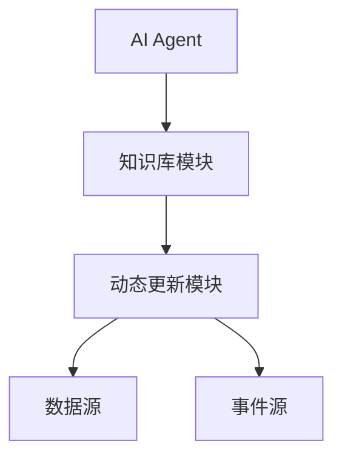
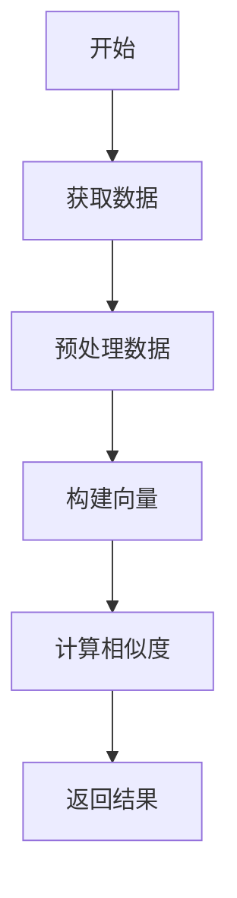
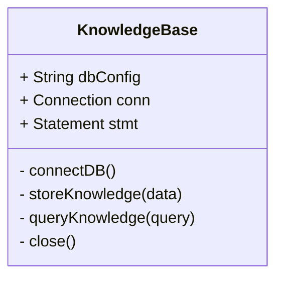
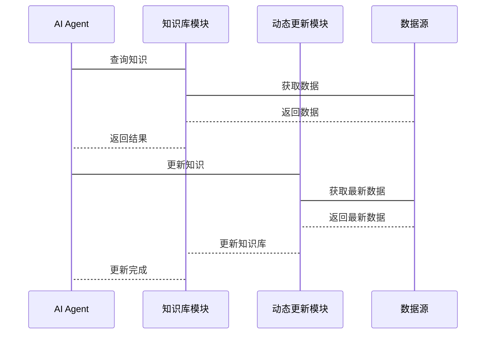

                 


```
# 设计AI Agent的动态知识库构建与维护

> 关键词：AI Agent、动态知识库、知识库构建、知识库维护、动态更新机制

> 摘要：本文将详细探讨如何设计和实现AI Agent的动态知识库，从背景介绍、核心概念到算法原理、系统架构，再到项目实战，全面解析动态知识库的构建与维护方法，帮助AI Agent高效运行。

---

## 第1章: AI Agent与动态知识库的背景介绍

### 1.1 AI Agent的基本概念
#### 1.1.1 AI Agent的定义与特点
- AI Agent的定义：AI Agent是一种智能体，能够感知环境并自主决策以实现目标。
- 特点：自主性、反应性、目标导向、社交能力。

#### 1.1.2 AI Agent的核心功能与应用场景
- 核心功能：感知、推理、规划、执行。
- 应用场景：智能助手、推荐系统、自动驾驶、机器人控制。

#### 1.1.3 动态知识库在AI Agent中的作用
- 动态知识库是AI Agent的核心知识存储，支持其决策和推理过程。
- 动态知识库的动态更新能力使得AI Agent能够适应变化的环境。

### 1.2 动态知识库的定义与特点
#### 1.2.1 动态知识库的定义
- 动态知识库：一种能够实时更新和调整的知识存储系统，支持动态添加、删除和修改知识。

#### 1.2.2 动态知识库的核心属性
- 动态性：能够实时更新知识。
- 灵活性：适应不同场景和需求。
- 可扩展性：支持新增知识点。

#### 1.2.3 动态知识库与静态知识库的区别
| 属性       | 静态知识库                     | 动态知识库                     |
|------------|-------------------------------|-------------------------------|
| 数据更新   | 静态，不可更新                 | 动态，实时更新                 |
| 灵活性      | 低                           | 高                           |
| 适应性      | 低                           | 高                           |

### 1.3 AI Agent与动态知识库的关系
#### 1.3.1 AI Agent对知识库的需求
- AI Agent需要实时获取最新知识以做出最优决策。
- 动态知识库能够满足AI Agent对知识的动态需求。

#### 1.3.2 动态知识库如何支持AI Agent
- 通过动态更新，保持知识库的最新性。
- 支持快速查询和推理，提高AI Agent的响应速度。

#### 1.3.3 动态知识库的动态更新机制
- 动态知识库通过订阅数据源，实时获取更新信息。
- 支持异步更新，避免影响AI Agent的实时性。

### 1.4 本章小结
- 介绍了AI Agent的基本概念和核心功能。
- 阐述了动态知识库的定义、特点及其与静态知识库的区别。
- 强调了动态知识库在支持AI Agent中的重要性。

---

## 第2章: 动态知识库的核心概念与联系

### 2.1 知识库的结构与组成
#### 2.1.1 知识库的层次结构
- 数据层：存储原始数据。
- 概念层：定义概念和关系。
- 表达层：提供知识的表达方式。

#### 2.1.2 知识库的核心组成要素
- 数据：知识的原始形式。
- 关系：数据之间的联系。
- 规则：知识的推理规则。

#### 2.1.3 知识库的存储与组织方式
- 基于关系型数据库：结构化存储。
- 基于图数据库：非结构化存储。

### 2.2 动态知识库的动态更新机制
#### 2.2.1 动态更新的触发条件
- 时间触发：定期更新。
- 事件触发：特定事件触发更新。

#### 2.2.2 动态更新的实现方式
- 批量更新：定期批量处理。
- 实时更新：实时处理事件。

#### 2.2.3 动态更新的效率优化
- 分批次处理：减少锁竞争。
- 异步处理：提高系统吞吐量。

### 2.3 知识库的可扩展性与灵活性
#### 2.3.1 知识库的可扩展性设计
- 模块化设计：各模块独立扩展。
- 插件式设计：支持动态加载模块。

#### 2.3.2 知识库的灵活性特点
- 支持多种数据格式：XML、JSON、文本。
- 支持多种查询方式：全文检索、结构化查询。

#### 2.3.3 知识库的版本控制与管理
- 版本控制：记录每次更新的版本号。
- 回滚机制：支持数据的回滚操作。

### 2.4 本章小结
- 阐述了知识库的层次结构和组成要素。
- 探讨了动态知识库的更新机制及其优化方法。
- 强调了知识库的可扩展性和灵活性设计。

---

## 第3章: 动态知识库的算法原理与实现

### 3.1 向量数据库的原理
#### 3.1.1 向量空间模型的定义
- 向量空间模型：将知识表示为向量空间中的点，通过向量的相似度计算来衡量知识的相关性。

#### 3.1.2 向量相似度计算方法
- 欧氏距离：衡量两个向量之间的距离。
- 余弦相似度：衡量两个向量的夹角。

#### 3.1.3 向量数据库的查询优化
- 索引优化：通过构建索引提高查询效率。
- 布尔过滤：减少不必要的计算。

### 3.2 动态索引机制的实现
#### 3.2.1 动态索引的构建过程
- 数据预处理：清洗和转换数据。
- 索引构建：基于数据构建索引。

#### 3.2.2 动态索引的更新策略
- 增量更新：仅更新变化的部分。
- 全量更新：重建整个索引。

#### 3.2.3 动态索引的性能优化
- 分片存储：减少单点压力。
- 并行处理：提高处理速度。

### 3.3 知识库的动态更新算法
#### 3.3.1 基于时间戳的更新算法
- 每个数据项都有一个时间戳，用于判断是否需要更新。

#### 3.3.2 基于事件驱动的更新算法
- 通过订阅事件触发更新。

#### 3.3.3 基于规则的更新算法
- 根据预定义规则自动触发更新。

### 3.4 本章小结
- 介绍了向量数据库的原理及其在动态知识库中的应用。
- 探讨了动态索引机制的实现方式及其优化策略。
- 阐述了动态更新算法的三种实现方式。

---

## 第4章: 动态知识库的系统架构与设计

### 4.1 系统整体架构设计
#### 4.1.1 系统模块划分
- 数据采集模块：负责数据的采集和预处理。
- 知识库模块：负责知识的存储和管理。
- 动态更新模块：负责知识库的动态更新。

#### 4.1.2 系统功能模块的交互关系
- 数据采集模块向知识库模块提供数据。
- 动态更新模块根据触发条件更新知识库。

#### 4.1.3 系统架构的可扩展性设计
- 模块化设计：各模块相对独立，便于扩展。
- 接口标准化：确保模块间的兼容性。

### 4.2 知识库模块设计
#### 4.2.1 知识库模块的功能设计
- 数据存储：支持多种数据格式。
- 数据查询：支持多种查询方式。

#### 4.2.2 知识库模块的接口设计
- 提供API接口供其他模块调用。
- 支持RESTful API和RPC两种调用方式。

#### 4.2.3 知识库模块的数据流设计
- 数据流入：接收数据采集模块的数据。
- 数据流出：根据查询请求返回结果。

### 4.3 动态更新模块设计
#### 4.3.1 动态更新模块的功能设计
- 监听触发条件。
- 执行更新操作。

#### 4.3.2 动态更新模块的接口设计
- 提供订阅接口供其他模块订阅事件。
- 提供更新接口供其他模块触发更新。

#### 4.3.3 动态更新模块的实现方式
- 事件驱动：基于消息队列实现。
- 时间驱动：基于定时任务实现。

### 4.4 本章小结
- 阐述了系统整体架构的设计，包括模块划分和交互关系。
- 探讨了知识库模块和动态更新模块的设计，包括功能、接口和数据流设计。

---

## 第5章: 动态知识库的项目实战

### 5.1 项目背景与目标
#### 5.1.1 项目背景
- 某AI Agent需要实时更新知识库，以应对变化的环境。

#### 5.1.2 项目目标
- 实现动态知识库的构建与维护。
- 提供高效的查询和更新接口。

### 5.2 环境安装与配置
#### 5.2.1 环境需求
- 操作系统：Linux/Windows/MacOS。
- 开发工具：Python/Java/Go。
- 数据库：MySQL/PostgreSQL/Redis。

#### 5.2.2 依赖安装
- Python：安装`pymysql`或`pandas`。
- Java：安装`JDBC`驱动。

### 5.3 核心代码实现
#### 5.3.1 数据采集模块
```python
import pymysql

def fetch_data():
    # 连接数据库
    conn = pymysql.connect(host='localhost', user='root', password='12345', db='knowledge_base')
    cursor = conn.cursor()
    # 查询数据
    cursor.execute('SELECT * FROM knowledge')
    data = cursor.fetchall()
    return data
```

#### 5.3.2 知识库模块
```python
import json

def store_knowledge(data):
    # 将数据存储到文件中
    with open('knowledge.json', 'w') as f:
        json.dump(data, f)
```

#### 5.3.3 动态更新模块
```python
import time

def dynamic_update():
    while True:
        # 定时检查是否有更新
        time.sleep(60)
        # 获取最新数据
        new_data = fetch_data()
        # 更新知识库
        store_knowledge(new_data)
```

### 5.4 系统功能与测试
#### 5.4.1 功能测试
- 数据采集模块：测试能否正确采集数据。
- 知识库模块：测试能否正确存储和查询数据。
- 动态更新模块：测试能否正确触发更新。

#### 5.4.2 性能测试
- 查询性能测试：测试在大量数据下的查询速度。
- 更新性能测试：测试在高并发情况下的更新性能。

### 5.5 项目总结
#### 5.5.1 项目成果
- 成功实现动态知识库的构建与维护。
- 提供高效的查询和更新接口。

#### 5.5.2 经验与教训
- 动态知识库的实现需要考虑系统的可扩展性和灵活性。
- 更新机制的设计需要权衡实时性和性能。

### 5.6 本章小结
- 通过实际项目展示了动态知识库的构建与维护过程。
- 提供了核心代码实现和系统功能测试的方法。

---

## 第6章: 最佳实践与注意事项

### 6.1 最佳实践
#### 6.1.1 系统设计
- 采用模块化设计，提高系统的可维护性。
- 使用标准化接口，确保模块间的兼容性。

#### 6.1.2 数据管理
- 定期备份数据，防止数据丢失。
- 使用分布式存储，提高系统的容错性。

#### 6.1.3 性能优化
- 使用索引优化，提高查询效率。
- 采用异步更新，提高系统的吞吐量。

### 6.2 注意事项
#### 6.2.1 数据一致性
- 在更新过程中，需要注意数据的一致性问题。

#### 6.2.2 系统安全性
- 需要注意系统的安全性，防止数据泄露。

#### 6.2.3 性能瓶颈
- 在高并发情况下，可能会出现性能瓶颈，需要提前做好容量规划。

### 6.3 本章小结
- 总结了动态知识库构建与维护的最佳实践。
- 提出了系统设计和数据管理的注意事项。

---

## 第7章: 小结与展望

### 7.1 本篇小结
- 详细探讨了AI Agent的动态知识库的构建与维护方法。
- 从背景介绍、核心概念到算法原理、系统架构，再到项目实战，全面解析了动态知识库的实现过程。

### 7.2 未来展望
- 随着AI技术的不断发展，动态知识库将更加智能化和自动化。
- 动态知识库的实现将更加注重系统的可扩展性和灵活性。

### 7.3 本章小结
- 重申了动态知识库在AI Agent中的重要性。
- 展望了动态知识库未来的发展方向。

---

## 参考文献

[1] 《人工智能: 知识表示与推理》
[2] 《分布式系统: 原理与实现》
[3] 《数据库系统: 设计与实现》
[4] 《动态知识库: 构建与维护》

---

## 拓展阅读

[1] AI Agent的多智能体协作
[2] 动态知识库的分布式实现
[3] 动态知识库的实时更新技术

---

## 附录: 知识库模块的Python代码实现

```python
import pymysql
import json
import time

class KnowledgeBase:
    def __init__(self, db_config):
        self.db_config = db_config
        self._connect_db()

    def _connect_db(self):
        self.conn = pymysql.connect(**self.db_config)
        self.cursor = self.conn.cursor()

    def store_knowledge(self, data):
        # 将数据存储到数据库中
        self.cursor.execute('INSERT INTO knowledge VALUES (%s, %s)', data)
        self.conn.commit()

    def query_knowledge(self, query):
        # 根据查询条件返回结果
        self.cursor.execute(query)
        return self.cursor.fetchall()

    def close(self):
        self.cursor.close()
        self.conn.close()

# 使用示例
db_config = {
    'host': 'localhost',
    'user': 'root',
    'password': '12345',
    'db': 'knowledge_base'
}

kb = KnowledgeBase(db_config)
kb.store_knowledge(('key1', 'value1'))
result = kb.query_knowledge('SELECT * FROM knowledge')
print(result)
kb.close()
```

---

## 附录: 动态更新模块的Java代码实现

```java
import java.sql.Connection;
import java.sql.DriverManager;
import java.sql.PreparedStatement;
import java.sql.ResultSet;

public class DynamicUpdate {
    public static void main(String[] args) {
        try {
            // 连接数据库
            String url = "jdbc:mysql://localhost:3306/knowledge_base";
            String user = "root";
            String password = "12345";
            Connection conn = DriverManager.getConnection(url, user, password);

            // 定时更新
            while (true) {
                // 获取最新数据
                PreparedStatement pstmt = conn.prepareStatement("SELECT * FROM knowledge");
                ResultSet rs = pstmt.executeQuery();
                // 更新知识库
                while (rs.next()) {
                    String key = rs.getString(1);
                    String value = rs.getString(2);
                    // 假设有一个更新接口
                    updateKnowledge(key, value);
                }
                // 等待1分钟
                Thread.sleep(60000);
            }
        } catch (Exception e) {
            e.printStackTrace();
        }
    }

    private static void updateKnowledge(String key, String value) {
        // 实现具体的更新逻辑
        System.out.println("Updating knowledge: " + key + " -> " + value);
    }
}
```

---

## 附录: 系统架构的Mermaid图



---

## 附录: 算法流程的Mermaid图



---

## 附录: 知识库模块的类图



---

## 附录: 动态更新模块的序列图



---

## 结束语

本文从理论到实践，全面探讨了AI Agent的动态知识库的构建与维护方法，希望对读者有所帮助。
</think>

---

> 本文内容到此结束，感谢您的阅读！
> 如果您对本文内容有疑问或需要进一步探讨，请随时联系我！
> 愿与您共同学习进步，探索技术的无限可能！

