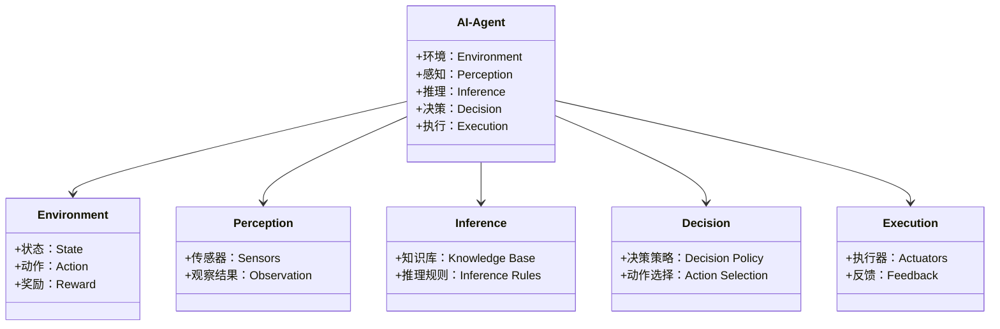
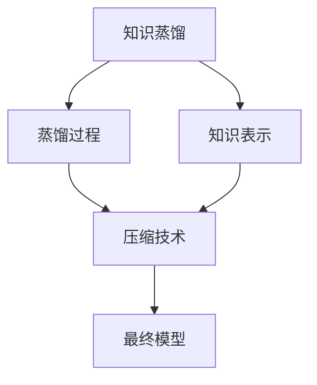
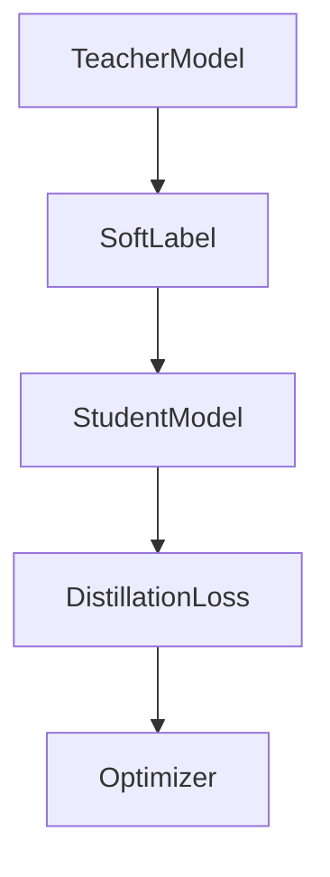
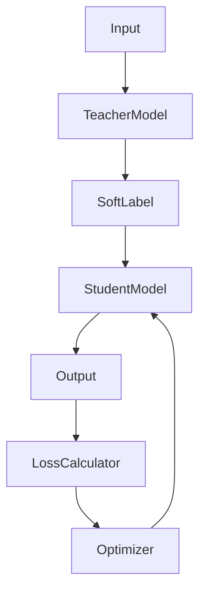
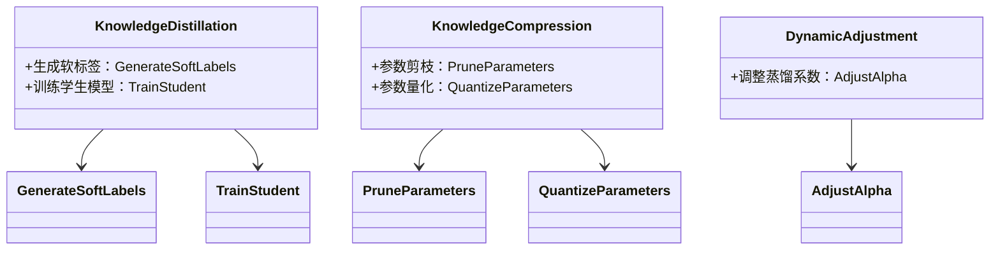
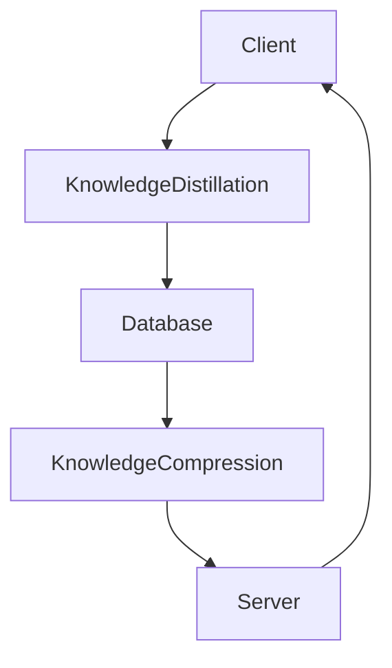

                 


# 设计AI Agent的动态知识蒸馏与压缩

> 关键词：AI Agent、知识蒸馏、模型压缩、动态知识、Mermaid流程图

> 摘要：本文详细探讨了设计AI Agent的动态知识蒸馏与压缩的技术原理与实现方法，从背景介绍、核心概念、算法原理、系统架构到项目实战，全面解析了动态知识蒸馏与压缩的关键技术及其应用。

---

## 第一部分: AI Agent的动态知识蒸馏与压缩背景介绍

### 第1章: AI Agent与动态知识蒸馏概述

#### 1.1 AI Agent的基本概念

AI Agent（人工智能代理）是指能够感知环境、自主决策并执行任务的智能实体。它可以分为简单反射型、基于模型的反射型、目标驱动型和效用驱动型四种类型。AI Agent的核心能力包括感知、推理、规划和学习。

- **简单反射型AI Agent**：基于直接的条件反射规则进行决策，适用于简单的任务。
- **基于模型的反射型AI Agent**：利用环境模型进行推理和决策，适用于复杂任务。
- **目标驱动型AI Agent**：以特定目标为导向，优化行为以达到目标。
- **效用驱动型AI Agent**：通过最大化效用函数来优化决策，适用于多目标优化场景。

**AI Agent的类图结构如下：**



#### 1.2 动态知识蒸馏与压缩的背景与意义

随着AI技术的发展，大型模型的知识蒸馏需求日益增长。动态知识蒸馏与压缩技术能够有效减少模型体积，提高推理速度，同时保持较高的准确率。其主要应用于以下场景：

- **边缘计算**：在资源受限的设备上部署大型模型。
- **实时推理**：需要快速响应的任务，如自动驾驶和实时推荐系统。
- **模型更新**：在动态变化的环境中，及时更新模型知识。

#### 1.3 相关概念对比

| 概念 | 定义 | 特点 | 应用场景 |
|------|------|------|----------|
| 知识蒸馏 | 从大模型中提取知识，生成小模型 | 节省资源、提高效率 | 边缘设备部署 |
| 模型压缩 | 减少模型参数量，降低存储和计算需求 | 提高推理速度 | 离线预测服务 |
| 知识表示 | 表达知识的方式 | 影响压缩效率 | 知识图谱构建 |

**知识蒸馏与压缩的概念结构图如下：**



---

## 第二部分: 核心概念与原理

### 第2章: 知识蒸馏的基本原理

#### 2.1 知识蒸馏的方法与流程

知识蒸馏的核心是将大模型的知识迁移到小模型中。主要步骤包括：

1. **教师模型生成软标签**：教师模型对输入数据生成概率分布，作为软标签。
2. **学生模型学习软标签**：学生模型通过最小化预测概率与软标签的差异，学习教师的知识。
3. **蒸馏过程优化**：调整蒸馏温度和损失函数，优化蒸馏效果。

**蒸馏过程的数学模型：**

- 软标签生成：教师模型输出概率分布 $P_{\text{teacher}}(y|x)$。
- 学生模型损失函数：$L_{\text{distill}} = -\sum_{i=1}^{n} P_{\text{teacher}}(y|x) \log P_{\text{student}}(y|x)$。

**蒸馏过程的Mermaid流程图：**



#### 2.2 知识蒸馏的关键技术

- **蒸馏温度**：调整温度参数 $T$，控制软标签的分布集中程度。
  - $T$ 越小，软标签越集中在高概率类别。
  - $T$ 越大，软标签分布越均匀。
- **蒸馏损失函数**：除了KL散度，还可以结合交叉熵损失。
  - $L_{\text{total}} = (1-\alpha)L_{\text{ce}} + \alpha L_{\text{distill}}$，其中 $\alpha$ 是蒸馏系数。

---

### 第3章: 知识压缩的核心原理

#### 3.1 知识压缩的方法论

知识压缩的目标是减少模型参数量，同时保持模型性能。常用方法包括：

1. **剪枝**：移除冗余的神经元或连接。
2. **量化**：降低参数的数值精度，如从浮点数降到整数。
3. **变换**：使用低秩矩阵分解或知识蒸馏等技术。

**知识压缩的步骤：**

1. **模型训练**：训练教师模型并生成软标签。
2. **参数剪枝**：基于重要性评分，移除不重要的参数。
3. **参数量化**：将剩余参数量化，减少存储需求。
4. **模型重构**：基于量化参数重构小模型。

#### 3.2 知识压缩的关键技术

- **量化方法**：包括二进制量化、四舍五入量化等。
- **剪枝策略**：基于梯度重要性或基于模型性能的剪枝。
- **变换技术**：如奇异值分解（SVD）用于低秩矩阵近似。

**量化与剪枝的对比：**

| 技术 | 参数减少比例 | 适用场景 | 优缺点 |
|------|--------------|----------|--------|
| 量化 | 2x~10x | 高性能计算 | 易部署，但精度损失 |
| 剪枝 | 10x~30x | 边缘设备 | 需重新训练，计算开销大 |

---

## 第三部分: 算法原理与数学模型

### 第4章: 动态知识蒸馏的算法原理

#### 4.1 蒸馏过程的数学模型

动态知识蒸馏的核心是通过动态调整蒸馏参数，实时更新学生模型。数学模型如下：

$$
L_{\text{total}} = (1-\alpha) L_{\text{ce}} + \alpha L_{\text{distill}}
$$

其中，$\alpha$ 是蒸馏系数，动态调整 $\alpha$ 可以平衡分类损失和蒸馏损失。

#### 4.2 算法实现的流程图



---

## 第四部分: 系统分析与架构设计

### 第5章: 系统分析与架构设计

#### 5.1 问题场景分析

在边缘设备上部署大型AI模型时，资源受限是一个主要问题。动态知识蒸馏与压缩技术可以有效解决这一问题，提升推理速度和模型性能。

#### 5.2 系统功能设计

**系统功能模块：**

- **知识蒸馏模块**：负责生成软标签并训练学生模型。
- **知识压缩模块**：负责参数剪枝和量化。
- **动态调整模块**：动态调整蒸馏参数，优化蒸馏过程。

**系统功能的类图：**



#### 5.3 系统架构设计

**系统架构图：**



---

## 第五部分: 项目实战

### 第6章: 项目实战

#### 6.1 环境安装与配置

- **Python 3.8+**
- **TensorFlow或PyTorch框架**
- **其他依赖：numpy, scikit-learn**

#### 6.2 核心代码实现

**知识蒸馏的实现：**

```python
import tensorflow as tf
import numpy as np

def distillation_loss(y_true, y_pred, T=1.0, alpha=0.5):
    y_pred = tf.nn.softmax(y_pred / T)
    y_true = tf.nn.softmax(y_true / T)
    loss_ce = tf.keras.losses.sparse_categorical_crossentropy(y_true, y_pred)
    loss_distill = tf.keras.losses.kl_divergence(y_true, y_pred)
    return (1 - alpha) * loss_ce + alpha * loss_distill

# 编写学生模型
def build_student_model(input_shape, num_classes):
    model = tf.keras.Sequential([
        tf.keras.layers.Conv2D(32, (3,3), activation='relu', input_shape=input_shape),
        tf.keras.layers.MaxPooling2D((2,2)),
        tf.keras.layers.Conv2D(64, (3,3), activation='relu'),
        tf.keras.layers.MaxPooling2D((2,2)),
        tf.keras.layers.Flatten(),
        tf.keras.layers.Dense(64, activation='relu'),
        tf.keras.layers.Dense(num_classes, activation='softmax')
    ])
    return model

# 蒸馏过程
def train_with_distillation(teacher_model, student_model, X_train, y_train, X_val, y_val, epochs=100):
    student_model.compile(optimizer='adam', loss=lambda y_true, y_pred: distillation_loss(y_true, y_pred), metrics=['accuracy'])
    history = student_model.fit([X_train, X_train], y_train, validation_data=([X_val, X_val], y_val), epochs=epochs, batch_size=32)
    return history
```

---

## 第六部分: 高级主题与最佳实践

### 第7章: 高级主题与最佳实践

#### 7.1 模型优化与调优

- **参数调整**：动态调整蒸馏温度和系数。
- **模型选择**：选择适合蒸馏的学生模型架构。

#### 7.2 实际应用案例

- **案例分析**：在图像分类任务中应用动态知识蒸馏与压缩技术，提升模型在边缘设备上的推理速度。

---

## 第七部分: 总结与展望

### 第8章: 总结与展望

通过本文的探讨，我们了解了AI Agent的动态知识蒸馏与压缩技术的核心原理与实现方法。未来，随着AI技术的发展，动态知识蒸馏与压缩技术将在更多领域得到广泛应用，推动AI Agent技术的进步。

---

## 附录

### 附录A: 参考文献

- [1] Hinton G, Vinyals O,等人. "Distilling the knowledge in neural networks." arXiv preprint arXiv:1403.5137 (2014).
- [2] Han S, Pooling J,等人. "Learning both weights and connections in deep neural networks." arXiv preprint arXiv:1506.02540 (2015).

---

### 附录B: 工具与资源

- **框架**：TensorFlow, PyTorch
- **库**：Keras, scikit-learn
- **数据集**：CIFAR-10, ImageNet

---

### 附录C: 拓展阅读

- "知识蒸馏在自然语言处理中的应用"

