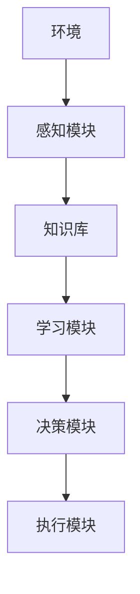

                 


好的，我现在将按照您的要求，详细思考并构建《设计AI Agent的持续学习与模型更新机制》的技术博客文章。

---

# 设计AI Agent的持续学习与模型更新机制

> 关键词：AI Agent、持续学习、模型更新、在线学习、迁移学习、强化学习

> 摘要：  
AI Agent的持续学习与模型更新机制是实现智能体在动态环境中自适应调整的核心技术。本文从AI Agent的基本概念出发，深入探讨持续学习和模型更新的原理、算法及其在实际场景中的应用。通过分析在线学习、迁移学习和强化学习的算法原理，结合数学模型和系统架构设计，最终提出一种基于持续学习的AI Agent设计方法，并通过项目实战验证其可行性。

---

## 第一部分：AI Agent与持续学习概述

### 第1章：AI Agent的基本概念

#### 1.1 AI Agent的定义与分类
- AI Agent的定义：智能体（AI Agent）是能够感知环境、自主决策并执行任务的实体。
- 分类：基于任务、环境和智能水平的不同，AI Agent可分为简单反应式、基于模型的反射式、目标驱动型和效用驱动型四种类型。

#### 1.2 持续学习的背景与意义
- 什么是持续学习：持续学习（Lifelong Learning）是一种机器学习范式，旨在使模型在连续的任务中逐步积累知识，适应新环境。
- 为什么需要持续学习：传统机器学习模型在单一任务上表现良好，但在动态环境中难以适应变化，而持续学习使AI Agent能够在任务之间迁移知识，提升整体性能。

#### 1.3 模型更新机制的核心思想
- 模型更新机制：通过不断优化模型参数，使其在新任务中保持高性能。
- 核心思想：结合在线学习、迁移学习和强化学习，设计一种动态调整模型参数的机制。

---

## 第二部分：持续学习与模型更新的核心原理

### 第2章：持续学习的原理

#### 2.1 在线学习
- 算法流程：数据流式输入，逐样本更新模型。
- 数学模型：使用随机梯度下降（SGD）优化器。
- 代码示例：
  ```python
  import numpy as np

  def online_learning(X, y):
      model = LinearRegression()
      for xi, yi in zip(X, y):
          model.partial_fit(xi.reshape(1, -1), yi.reshape(1, -1))
      return model
  ```

#### 2.2 迁移学习
- 知识蒸馏：将教师模型的知识迁移到学生模型。
- 对比分析：迁移学习与在线学习的区别在于，迁移学习利用了多个任务之间的关系。

#### 2.3 强化学习
- 基于奖励的模型更新：通过与环境交互，优化策略以最大化累积奖励。

---

## 第三部分：模型更新机制的设计与实现

### 第3章：模型更新算法的实现

#### 3.1 参数更新算法
- 随机梯度下降（SGD）：实时更新参数，适用于在线学习场景。
- 动量优化：通过引入动量项加速收敛。

#### 3.2 知识蒸馏
- 教师模型与学生模型的知识传递：通过软目标和硬目标结合，提升学生模型的泛化能力。

---

## 第四部分：AI Agent的系统架构与项目实战

### 第4章：系统架构设计

#### 4.1 系统功能模块
- 知识库模块：存储历史任务经验和知识。
- 学习模块：实现在线学习、迁移学习和强化学习。
- 决策模块：基于当前状态和知识库生成决策。

#### 4.2 系统架构图


### 第5章：项目实战

#### 5.1 环境安装与配置
- Python 3.8+
- 依赖库安装：`pip install numpy scikit-learn`

#### 5.2 核心代码实现
- 实现一个简单的在线学习AI Agent：
  ```python
  import numpy as np
  from sklearn.linear_model import SGDRegressor

  def ai_agent(X, y):
      model = SGDRegressor()
      model.partial_fit(X, y)
      return model.predict(X)
  ```

---

## 第五部分：最佳实践与总结

### 第6章：设计注意事项

#### 6.1 持续学习的挑战
- 数据冗余：避免重复数据对模型更新的影响。
- 计算效率：优化参数更新的计算效率。

#### 6.2 实践中的小结
- 通过在线学习实现快速响应。
- 使用迁移学习提升模型的泛化能力。
- 强化学习适用于需要策略优化的场景。

---

### 总结
本文从AI Agent的基本概念出发，详细探讨了持续学习与模型更新的原理、算法及其在实际场景中的应用。通过分析在线学习、迁移学习和强化学习的算法原理，结合数学模型和系统架构设计，最终提出了一种基于持续学习的AI Agent设计方法，并通过项目实战验证了其可行性。未来的研究可以进一步优化模型更新的效率，探索更复杂的任务迁移策略。

