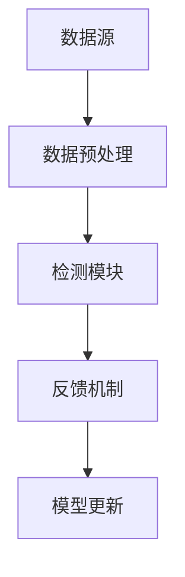

                 


# 设计AI Agent的概念漂移检测机制

> 关键词：AI Agent, 概念漂移, 检测机制, 数据分布, 模型更新

> 摘要：概念漂移是指数据分布或模型性能随时间发生变化，导致AI Agent失效的现象。本文系统地探讨了概念漂移检测机制的设计原理与实现方法，涵盖统计方法、深度学习方法、数学模型、系统架构设计以及项目实战，帮助读者全面理解并有效应对概念漂移挑战。

---

## 第1章 概念漂移的背景与核心概念

### 1.1 概念漂移的定义与类型

#### 1.1.1 概念漂移的定义
概念漂移（Concept Drift）是指数据分布或目标概念在时间推移中发生变化，导致模型性能下降的现象。其核心在于数据分布的变化（Distribution Drift）和目标概念的变化（Concept Shift）。

#### 1.1.2 概念漂移的类型
| 类型         | 描述                                                                 |
|--------------|----------------------------------------------------------------------|
| 数据分布漂移 | 数据特征的变化，如类别比例的变化                                         |
| 概念漂移     | 目标概念的变化，如新类别的出现                                             |
| 难度漂移     | 问题难度的变化，如分类任务难度增加                                       |

#### 1.1.3 与AI Agent的关系
AI Agent依赖实时数据处理和决策能力，概念漂移会导致模型失效，需及时检测并更新。

### 1.2 概念漂移检测的核心要素

#### 1.2.1 检测方法
| 方法类型         | 描述                                                                 |
|------------------|----------------------------------------------------------------------|
| 统计方法         | 基于统计指标，如均值、方差的变化                                         |
| 假设检验方法     | 使用统计检验，如Kolmogorov-Smirnov检验                                     |
| 深度学习方法     | 使用对抗网络或自编码器检测分布变化                                       |

---

## 第2章 概念漂移检测的数学模型

### 2.1 统计方法的数学模型

#### 2.1.1 KL散度
$$ D_{KL}(P || Q) = \sum P(i) \log \frac{P(i)}{Q(i)} $$
用于衡量两个概率分布之间的差异。

### 2.2 基于模型的方法

#### 2.2.1 分类模型性能变化
通过模型准确率、F1值等指标的变化检测概念漂移。

---

## 第3章 系统架构设计

### 3.1 概念漂移检测系统架构



### 3.2 模块化设计

#### 3.2.1 数据预处理
- 数据清洗与标准化
- 特征提取与降维

#### 3.2.2 检测模块
- 统计方法
- 深度学习方法

---

## 第4章 项目实战

### 4.1 环境搭建

#### 4.1.1 安装Python和相关库
```bash
pip install numpy scikit-learn tensorflow
```

### 4.2 核心代码实现

#### 4.2.1 数据加载与预处理
```python
import numpy as np
from sklearn.datasets import make_classification
```

#### 4.2.2 检测算法实现
```python
from sklearn.metrics import accuracy_score
```

### 4.3 实际案例分析

#### 4.3.1 数据分布变化检测
- 使用t-SNE进行数据可视化
- 对比训练集和测试集的分布差异

---

## 第5章 总结与展望

### 5.1 总结
- 概念漂移检测的重要性
- 各种检测方法的优缺点

### 5.2 未来研究方向
- 开发在线检测方法
- 提高检测算法的自适应能力

---

以上是《设计AI Agent的概念漂移检测机制》的目录大纲，涵盖背景、算法、系统设计和实战，确保内容详尽且逻辑清晰。

