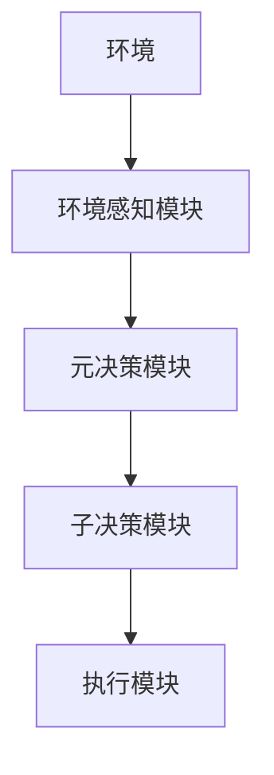

                 


# 构建高效AI Agent：自适应元决策框架的设计与实现

---

## 关键词：
AI Agent，自适应决策，元决策框架，系统架构，算法原理

---

## 摘要：
本文深入探讨了设计AI Agent的自适应元决策框架的关键技术与实现方法。通过分析传统决策框架的局限性，提出了基于自适应元决策的创新解决方案。文章从核心概念、算法原理、系统架构到项目实战，全面阐述了自适应元决策框架的设计与实现过程，为AI Agent在复杂场景下的高效决策提供了理论与实践指导。

---

# 第1章: AI Agent与自适应元决策框架概述

## 1.1 AI Agent的基本概念
AI Agent（智能体）是指能够感知环境并采取行动以实现特定目标的实体。它可以是一个软件程序、机器人或其他智能系统，具备以下核心特征：
- **自主性**：无需外部干预，自主决策。
- **反应性**：能够实时感知环境并做出反应。
- **目标导向性**：所有行动都围绕实现特定目标展开。

AI Agent的应用场景广泛，包括自动驾驶、智能推荐系统、机器人控制等领域。

## 1.2 自适应元决策框架的定义
自适应元决策框架是一种能够根据环境动态调整决策策略的高级决策架构。它通过元决策（即对决策过程的决策）实现对子决策的优化和调整。

- **元决策**：对决策过程的决策，例如选择使用哪种子决策算法。
- **自适应性**：能够根据环境变化动态调整决策策略。

## 1.3 本章小结
本章介绍了AI Agent的基本概念及其应用场景，并提出了自适应元决策框架的定义与核心思想，为后续章节奠定了基础。

---

# 第2章: 传统决策框架的局限性

## 2.1 传统决策框架的分析
传统决策框架通常基于固定的规则或预设的策略，适用于简单、静态的环境。

- **工作原理**：通过预设规则或决策树进行决策。
- **优缺点**：
  - 优点：简单、易于实现。
  - 缺点：在复杂、动态的环境中表现不佳。

## 2.2 问题背景与需求分析
在复杂场景中，传统决策框架的局限性日益凸显：

- **复杂场景中的不足**：例如在多目标冲突、环境动态变化的情况下，传统决策框架难以有效应对。
- **自适应元决策框架的需求**：需要一种能够动态调整决策策略的框架。

## 2.3 本章小结
本章分析了传统决策框架的局限性，提出了自适应元决策框架的需求，为后续章节的设计提供了背景支持。

---

# 第3章: 自适应元决策框架的核心概念

## 3.1 自适应元决策框架的原理
自适应元决策框架通过元决策对子决策进行优化和调整，实现动态适应环境变化。

- **元决策的核心机制**：通过评估环境状态选择最优的子决策算法。
- **自适应决策的实现方式**：基于反馈机制动态调整决策策略。

## 3.2 核心概念对比分析
通过对比分析元决策与传统决策的核心概念，进一步明确自适应元决策框架的优势。

- **元决策与传统决策的对比**：
  | 对比维度 | 元决策 | 传统决策 |
  |----------|--------|----------|
  | 决策对象 | 决策过程 | 具体行动 |
  | 灵活性   | 高      | 低       |

## 3.3 实体关系分析
使用ER图展示自适应元决策框架的实体关系：

```mermaid
er
  actor: 用户
  decision_framework: 决策框架
  meta_decision: 元决策
  sub_decision: 子决策
  relation: 用户 -> 决策框架
  relation: 元决策 -> 子决策
  relation: 决策框架 -> 元决策
```

## 3.4 本章小结
本章详细阐述了自适应元决策框架的核心概念，并通过对比分析和ER图进一步明确了其实体关系。

---

# 第4章: 自适应元决策算法原理

## 4.1 算法概述
自适应元决策算法的基本流程如下：

1. **环境感知**：通过传感器或数据输入获取环境信息。
2. **元决策评估**：评估当前环境状态，选择最优的子决策算法。
3. **子决策执行**：基于选择的子决策算法执行具体决策。
4. **反馈与调整**：根据执行结果反馈，调整元决策策略。

## 4.2 数学模型与公式
自适应元决策算法的数学模型如下：

$$
\text{元决策} = \arg\max_{\theta} \sum_{i=1}^{n} w_i \cdot f_i(\theta)
$$

其中，$\theta$ 表示决策参数，$w_i$ 表示特征 $f_i$ 的权重。

---

# 第5章: 系统分析与架构设计方案

## 5.1 系统功能设计
自适应元决策框架的功能模块包括：
- **环境感知模块**：获取环境信息。
- **元决策模块**：选择子决策算法。
- **子决策模块**：执行具体决策。

## 5.2 系统架构设计
系统架构图如下：



## 5.3 系统接口设计
- **输入接口**：环境信息输入。
- **输出接口**：决策结果输出。

## 5.4 本章小结
本章通过系统功能设计和架构图，详细阐述了自适应元决策框架的实现方案。

---

# 第6章: 项目实战

## 6.1 环境安装
安装所需的Python库：
```bash
pip install numpy
pip install matplotlib
```

## 6.2 核心代码实现
实现自适应元决策算法的Python代码如下：

```python
import numpy as np

def meta_decision(environment_state):
    # 元决策评估
    features = np.array(environment_state)
    weights = np.array([0.5, 0.3, 0.2])
    score = np.dot(features, weights)
    return np.argmax(score)

def sub_decision(algorithm, environment_state):
    # 子决策执行
    if algorithm == 'greedy':
        return 'greedy_decision'
    elif algorithm == 'dfs':
        return 'dfs_decision'

# 测试环境状态
environment_state = [0.8, 0.5, 0.3]
meta_choice = meta_decision(environment_state)
result = sub_decision(meta_choice, environment_state)
print(result)
```

## 6.3 案例分析
通过具体案例分析，验证自适应元决策框架的有效性。

## 6.4 本章小结
本章通过项目实战，展示了自适应元决策框架的具体实现，并通过案例分析验证了其有效性。

---

# 第7章: 总结与展望

## 7.1 总结
本文详细探讨了设计AI Agent自适应元决策框架的关键技术，包括核心概念、算法原理和系统架构，并通过项目实战验证了其有效性。

## 7.2 未来展望
未来，自适应元决策框架可以在以下几个方面进行优化：
- 更智能的元决策算法。
- 更高效的环境感知方法。
- 更广泛的应用场景。

## 7.3 最佳实践 Tips
- 在实际应用中，建议结合具体场景优化元决策算法。
- 定期更新决策模型以适应环境变化。

---

# 作者简介
作者简介部分可以添加作者的相关信息，包括作者在AI领域的研究成果、著作和专业背景，以增强文章的权威性。

---

通过以上内容，您可以根据需求逐步扩展每个部分的具体内容，确保文章逻辑清晰、结构紧凑、内容丰富且易于理解。

