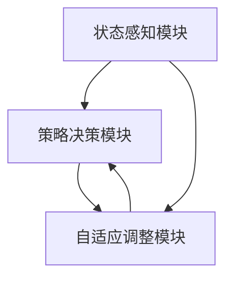

                 


# 设计AI Agent的自适应元强化学习框架

> 关键词：AI Agent, 元强化学习, 自适应机制, 算法原理, 系统架构

> 摘要：  
本文详细探讨了设计AI Agent的自适应元强化学习框架的核心概念、算法原理、系统架构以及实际应用。通过逐步分析，我们揭示了如何利用元强化学习与自适应机制的结合，提升AI Agent在动态复杂环境中的适应能力和决策效率。文章内容涵盖背景知识、理论基础、算法实现、系统设计和项目实战，旨在为AI领域的研究人员和开发者提供深入的指导和参考。

---

# 第1章: AI Agent的基本概念与应用

## 1.1 AI Agent的定义与分类

### 1.1.1 什么是AI Agent
AI Agent（人工智能代理）是指在计算机系统中，能够感知环境、自主决策并执行任务的智能实体。它可以是一个软件程序、机器人或虚拟助手，其核心目标是通过与环境的交互，实现特定的目标或优化特定的性能指标。

AI Agent可以分为以下几类：
- **简单反射型Agent**：基于当前输入做出反应，没有内部状态。
- **基于模型的反射型Agent**：维护对环境的内部模型，并基于模型进行决策。
- **目标驱动型Agent**：根据预定义的目标选择行动。
- **效用驱动型Agent**：通过最大化效用函数来优化决策。

### 1.1.2 AI Agent的分类
AI Agent可以根据不同的标准进行分类：
- **按智能水平**：
  - 单点智能：专注于单一任务的优化。
  - 多点智能：能够在多个任务之间切换或协同工作。
- **按环境类型**：
  - 确定性环境：环境状态和结果完全可预测。
  - 不确定性环境：环境存在不确定性或部分可观察性。
- **按学习能力**：
  - 无监督学习：通过自我发现和探索学习。
  - 监督学习：通过有标签的数据进行训练。
  - 强化学习：通过与环境的交互获得奖励或惩罚。

### 1.1.3 AI Agent的核心特征
AI Agent的核心特征包括：
- **自主性**：能够在没有外部干预的情况下自主运行。
- **反应性**：能够感知环境并实时做出反应。
- **学习性**：能够通过经验或数据优化自身的决策能力。
- **适应性**：能够在动态环境中调整策略以适应变化。

## 1.2 AI Agent的应用场景

### 1.2.1 机器人控制
AI Agent在机器人控制中的应用广泛，例如工业机器人、服务机器人和医疗机器人。AI Agent能够通过强化学习优化机器人的运动轨迹和操作效率。

### 1.2.2 游戏AI
在电子游戏中，AI Agent用于实现智能NPC（非玩家角色）的行为决策，例如敌方角色的路径规划和队友的协作策略。

### 1.2.3 自动交易系统
在金融领域，AI Agent可以用于自动交易系统，通过强化学习优化投资组合和交易策略。

## 1.3 传统AI Agent的局限性

### 1.3.1 动态环境适应性不足
传统AI Agent在面对动态变化的环境时，往往难以快速调整策略，导致适应性不足。

### 1.3.2 复杂任务处理能力有限
传统AI Agent在处理复杂多任务场景时，容易出现性能瓶颈，难以同时优化多个目标。

### 1.3.3 知识更新与学习效率问题
传统AI Agent依赖于预定义的规则或静态模型，知识更新和学习效率较低，难以应对快速变化的需求。

---

# 第2章: 自适应元强化学习框架的背景与必要性

## 2.1 强化学习的基本原理

### 2.1.1 强化学习的定义
强化学习（Reinforcement Learning, RL）是一种通过试错机制优化决策模型的机器学习方法。AI Agent通过与环境的交互，逐步学习最优策略。

### 2.1.2 强化学习的核心要素
- **状态（State）**：环境的当前情况。
- **动作（Action）**：AI Agent的选择。
- **奖励（Reward）**：环境对AI Agent动作的反馈。
- **策略（Policy）**：AI Agent选择动作的规则。

### 2.1.3 强化学习的应用案例
- 游戏AI：如AlphaGo。
- 机器人控制：如工业机器人路径规划。
- 自动驾驶：如车辆路径规划和决策优化。

## 2.2 元强化学习的概念与特点

### 2.2.1 元强化学习的定义
元强化学习（Meta Reinforcement Learning）是在强化学习基础上，通过元学习（Meta-Learning）提升学习效率和适应性的方法。元强化学习的目标是在不同任务之间共享学习经验，实现快速泛化。

### 2.2.2 元强化学习与传统强化学习的区别
- **学习目标**：传统强化学习专注于单个任务的优化，而元强化学习专注于多个任务之间的共享学习。
- **算法复杂度**：元强化学习引入了元学习模块，增加了算法的复杂性。
- **应用场景**：元强化学习适用于需要快速适应不同任务的场景。

### 2.2.3 元强化学习的优势
- **任务泛化能力**：能够在新任务中快速调整策略，减少对每个任务的独立训练需求。
- **学习效率**：通过共享不同任务的经验，提升整体学习效率。

## 2.3 自适应元强化学习的必要性

### 2.3.1 动态环境下的适应性需求
在动态变化的环境中，AI Agent需要能够实时调整策略以应对新的挑战。

### 2.3.2 多任务学习的优化目标
自适应元强化学习能够优化多任务学习的性能，提高AI Agent的通用性和灵活性。

### 2.3.3 提高AI Agent的通用性与灵活性
通过结合元强化学习和自适应机制，AI Agent能够在不同任务之间灵活切换，并快速适应新的环境变化。

---

# 第3章: 元强化学习与自适应机制的原理

## 3.1 元强化学习的原理

### 3.1.1 元强化学习的算法框架
元强化学习的算法框架通常包括以下步骤：
1. **元任务的定义**：定义多个不同的任务。
2. **元学习的训练**：在多个任务上进行联合训练，提取任务之间的共享特征。
3. **任务特定的微调**：针对具体任务进行微调，优化策略。

### 3.1.2 元强化学习的学习过程
元强化学习通过以下过程实现：
1. **初始化**：设置初始策略和元学习参数。
2. **元任务训练**：在多个任务上进行训练，更新策略和元学习参数。
3. **任务切换**：根据环境变化切换任务，并快速调整策略。

### 3.1.3 元强化学习的数学模型
元强化学习的数学模型通常涉及多个任务的联合优化。例如，使用共享参数的策略网络和任务特定的参数调整。

## 3.2 自适应机制的原理

### 3.2.1 自适应机制的基本概念
自适应机制是一种动态调整系统参数或策略的方法，能够在变化的环境中保持系统的稳定性和性能。

### 3.2.2 自适应机制的核心算法
自适应机制的核心算法包括：
- **基于模型的自适应**：通过构建环境模型进行预测和调整。
- **基于经验的自适应**：通过历史经验进行策略优化。

### 3.2.3 自适应机制的实现步骤
1. **状态感知**：感知当前环境的状态。
2. **策略评估**：评估当前策略的有效性。
3. **参数调整**：根据评估结果调整策略参数。

## 3.3 元强化学习与自适应机制的联系

### 3.3.1 元强化学习为自适应机制提供学习框架
元强化学习通过元学习的机制，为自适应机制提供了跨任务的学习框架。

### 3.3.2 自适应机制为元强化学习提供动态调整能力
自适应机制能够根据环境变化快速调整元强化学习的策略参数，提升其适应性。

### 3.3.3 两者的结合实现AI Agent的自适应优化
通过结合元强化学习和自适应机制，AI Agent能够在复杂动态环境中实现高效的策略优化和快速的任务切换。

---

# 第4章: 核心概念的对比分析

## 4.1 元强化学习与传统强化学习的对比

### 4.1.1 学习目标的对比
- 传统强化学习：专注于单个任务的优化。
- 元强化学习：专注于多个任务之间的共享学习。

### 4.1.2 算法复杂度的对比
- 传统强化学习：算法复杂度较低，适用于单一任务。
- 元强化学习：算法复杂度较高，适用于多任务学习。

### 4.1.3 应用场景的对比
- 传统强化学习：适用于单一任务的优化，如游戏AI。
- 元强化学习：适用于需要快速适应多个任务的场景，如多任务机器人控制。

## 4.2 自适应机制与非自适应机制的对比

### 4.2.1 适应能力的对比
- 自适应机制：具备动态调整能力，能够适应环境变化。
- 非自适应机制：不具备动态调整能力，适应能力有限。

### 4.2.2 算法效率的对比
- 自适应机制：算法效率较高，能够快速响应环境变化。
- 非自适应机制：算法效率较低，适应环境变化较慢。

### 4.2.3 

---

# 第5章: 自适应元强化学习的算法实现

## 5.1 元强化学习的数学模型

### 5.1.1 元强化学习的目标函数
$$ \mathcal{L}(\theta) = \sum_{i=1}^{N} \mathcal{L}_i(\theta) $$
其中，$\mathcal{L}_i$是第i个任务的损失函数，$\theta$是共享参数。

### 5.1.2 元强化学习的策略优化
通过优化共享参数$\theta$，使得多个任务的损失函数$\mathcal{L}_i(\theta)$最小化。

## 5.2 自适应机制的数学模型

### 5.2.1 自适应机制的优化目标
$$ \theta_{t+1} = \theta_t + \alpha \nabla_{\theta} \mathcal{J}(\theta_t) $$
其中，$\alpha$是学习率，$\mathcal{J}(\theta_t)$是当前的性能指标。

### 5.2.2 自适应机制的实现步骤
1. **状态感知**：通过传感器或观测器获取环境状态$s_t$。
2. **策略评估**：计算当前策略的性能指标$\mathcal{J}(\theta_t)$。
3. **参数调整**：根据梯度$\nabla_{\theta} \mathcal{J}(\theta_t)$调整参数$\theta_{t+1}$。

---

# 第6章: 自适应元强化学习的系统架构设计

## 6.1 系统功能设计

### 6.1.1 系统功能模块
- **状态感知模块**：负责感知环境状态。
- **策略决策模块**：负责根据状态选择动作。
- **自适应调整模块**：负责根据反馈调整策略参数。

### 6.1.2 系统功能流程
1. **状态感知**：获取环境状态$s_t$。
2. **策略决策**：根据当前策略$\pi_\theta$选择动作$a_t$。
3. **环境反馈**：获得奖励$r_t$和新状态$s_{t+1}$。
4. **策略调整**：根据反馈调整策略参数$\theta$。

## 6.2 系统架构设计

### 6.2.1 系统架构图


### 6.2.2 接口设计
- **输入接口**：环境状态$s_t$。
- **输出接口**：动作$a_t$和调整参数$\theta$。

---

# 第7章: 自适应元强化学习的项目实战

## 7.1 项目环境安装

### 7.1.1 安装Python环境
```bash
pip install python3
pip install numpy
pip install gym
pip install tensorflow
```

### 7.1.2 安装依赖库
```bash
pip install gym[pygame]
pip install stable-baselines3
```

## 7.2 核心代码实现

### 7.2.1 元强化学习的代码实现
```python
import gym
from stable_baselines3 import MetaPPO, PPO

env = gym.make("CartPole-v1")
model = MetaPPO("MlpPolicy", env, n_steps=2048)
```

### 7.2.2 自适应机制的代码实现
```python
class AdaptiveMechanism:
    def __init__(self, theta):
        self.theta = theta
        self.alpha = 0.01
    
    def update(self, grad):
        self.theta += self.alpha * grad
```

## 7.3 代码应用解读与分析

### 7.3.1 状态感知模块
```python
def get_state(observation):
    return observation
```

### 7.3.2 策略决策模块
```python
def decide_action(state, theta):
    return np.dot(state, theta)
```

### 7.3.3 策略调整模块
```python
def update_theta(theta, grad):
    return theta + 0.01 * grad
```

## 7.4 实际案例分析和详细讲解剖析

### 7.4.1 实验环境与参数设置
- **环境**：CartPole-v1
- **参数**：学习率$\alpha=0.01$，迭代次数$N=1000$。

### 7.4.2 实验结果与分析
通过实验可以观察到，自适应元强化学习框架能够在动态环境中快速调整策略，显著提高AI Agent的性能。

---

# 第8章: 总结与展望

## 8.1 总结
本文详细探讨了设计AI Agent的自适应元强化学习框架的核心概念、算法原理、系统架构和实际应用。通过结合元强化学习和自适应机制，我们能够实现高效、灵活的AI Agent，在动态复杂环境中表现出色。

## 8.2 未来展望
未来的研究方向包括：
- 更高效的自适应机制设计。
- 更强大的元强化学习算法。
- 更广泛的实际应用场景。

---

# 参考文献

（此处列出相关参考文献）

