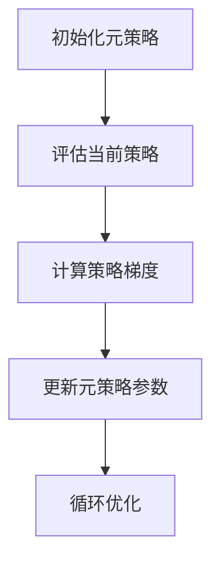
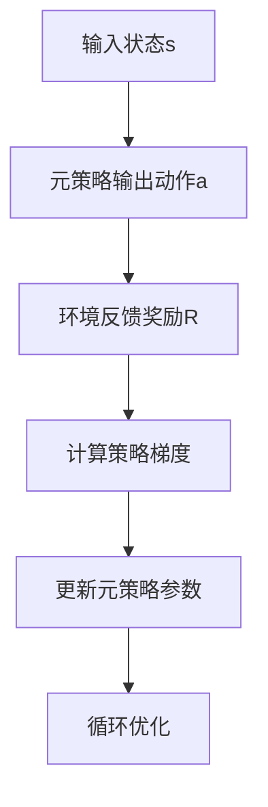
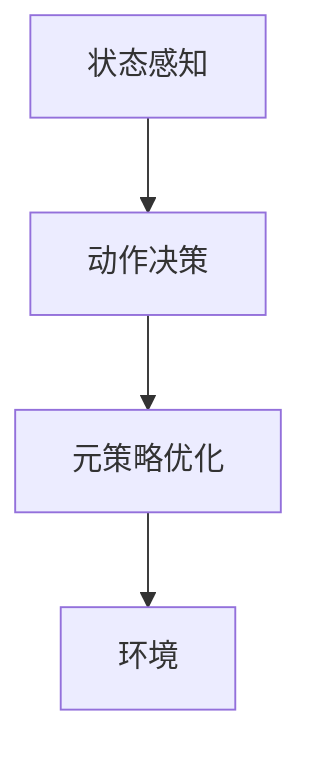
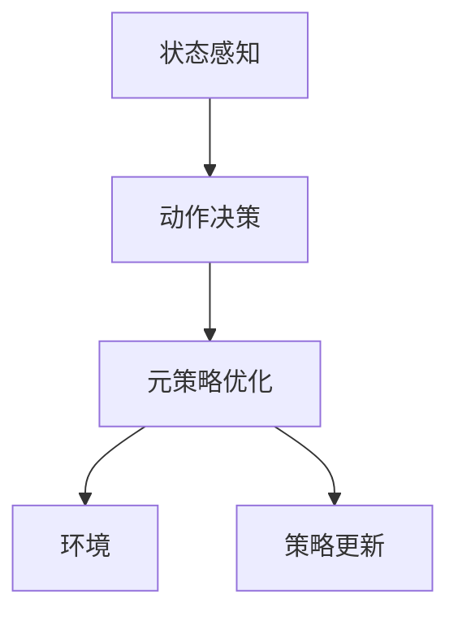

                 


# 设计AI Agent的自适应元策略优化框架

> 关键词：AI Agent，自适应元策略优化，策略优化，强化学习，人工智能

> 摘要：本文详细探讨了设计AI Agent的自适应元策略优化框架的核心概念、算法原理、系统架构以及实际应用。通过理论与实践的结合，我们分析了自适应元策略优化框架的优势，并通过实际案例展示了其在复杂环境中的应用潜力。

---

# 第1章: AI Agent与自适应元策略优化框架概述

## 1.1 AI Agent的基本概念与应用场景

### 1.1.1 AI Agent的定义与核心特征

AI Agent（人工智能代理）是指在计算机系统中，能够感知环境、做出决策并采取行动以实现特定目标的实体。AI Agent的核心特征包括：

- **自主性**：能够在没有外部干预的情况下自主运行。
- **反应性**：能够根据环境的变化实时调整行为。
- **目标导向性**：通过优化目标函数来实现预定目标。
- **学习能力**：能够通过经验改进自身的策略。

### 1.1.2 AI Agent在不同领域的应用场景

AI Agent在多个领域都有广泛应用，以下是几个典型场景：

- **游戏AI**：在电子游戏中，AI Agent可以作为玩家代理，实现智能决策和行为。
- **机器人控制**：AI Agent可以控制机器人在复杂环境中执行任务。
- **自动驾驶**：自动驾驶系统中的决策模块可以看作是一个AI Agent。
- **推荐系统**：基于用户行为的推荐系统可以看作是一个动态优化的AI Agent。

### 1.1.3 自适应策略优化在AI Agent中的重要性

在动态变化的环境中，AI Agent需要能够快速适应环境的变化，以实现最优决策。自适应策略优化通过动态调整策略参数，使AI Agent能够在复杂环境中保持高性能。

## 1.2 自适应元策略优化框架的背景与意义

### 1.2.1 策略优化在AI Agent中的挑战

传统的策略优化方法在面对复杂环境时，往往存在以下问题：

- **收敛速度慢**：在复杂环境中，策略优化算法需要多次迭代才能找到最优解。
- **鲁棒性不足**：在动态变化的环境中，固定的策略难以适应新的情况。
- **计算资源消耗大**：复杂的优化过程需要大量的计算资源。

### 1.2.2 元策略优化的核心思想

元策略优化是一种高层次的策略优化方法，其核心思想是通过元策略（Meta-policy）来指导具体策略（Policy）的优化过程。元策略的作用是调整策略的参数，使其在不同环境中能够快速适应。

### 1.2.3 自适应元策略优化框架的创新点

自适应元策略优化框架通过引入自适应机制，使元策略能够根据环境的变化动态调整优化策略。这种创新使得AI Agent能够在动态环境中实现快速适应和优化。

## 1.3 本章小结

本章介绍了AI Agent的基本概念和应用场景，并重点探讨了自适应元策略优化框架的背景与意义。通过分析传统策略优化的局限性，我们提出了元策略优化的核心思想，并进一步探讨了自适应元策略优化框架的创新点。

---

# 第2章: 自适应元策略优化的核心概念

## 2.1 元策略优化的基本原理

### 2.1.1 元策略的定义与作用

元策略（Meta-policy）是对策略（Policy）进行优化的高层策略。元策略的作用是通过调整策略参数，使策略在不同环境中能够快速适应。

### 2.1.2 元策略与策略优化的关系

元策略与策略优化的关系可以看作是指导与被指导的关系。元策略通过优化策略参数，使策略在特定环境中表现最优。

### 2.1.3 自适应元策略的核心属性

自适应元策略的核心属性包括：

- **动态性**：能够根据环境的变化动态调整策略参数。
- **全局性**：能够从全局角度优化策略，而非局部优化。
- **高效性**：能够在有限的计算资源下快速完成优化。

## 2.2 自适应策略优化的数学模型

### 2.2.1 策略空间与状态空间的定义

策略空间（Policy Space）是指所有可能的策略集合。状态空间（State Space）是指所有可能的状态集合。

### 2.2.2 元策略优化的数学表达式

元策略优化的目标是找到最优的策略参数，使得在给定状态下的期望奖励最大化。数学表达式如下：

$$ V(s) = \max_{\theta} \mathbb{E}[R(s,a)] $$

其中，$s$ 是状态，$a$ 是动作，$R$ 是奖励函数，$\theta$ 是策略参数。

## 2.3 自适应元策略优化的流程图



## 2.4 本章小结

本章详细介绍了自适应元策略优化的核心概念，包括元策略的定义与作用、元策略与策略优化的关系，以及自适应元策略的核心属性。通过数学模型和流程图的分析，我们进一步理解了自适应元策略优化的基本原理。

---

# 第3章: 自适应元策略优化算法的实现

## 3.1 算法原理概述

### 3.1.1 基于梯度的策略优化方法

基于梯度的策略优化方法通过计算策略的梯度，从而更新策略参数，以实现奖励的最大化。

### 3.1.2 自适应学习率调整机制

自适应学习率调整机制能够根据优化过程中的梯度信息，动态调整学习率，从而加快优化速度并提高优化效果。

### 3.1.3 元策略的动态更新过程

元策略的动态更新过程包括以下几个步骤：

1. 评估当前策略在给定状态下的表现。
2. 计算策略的梯度。
3. 根据梯度信息更新元策略参数。
4. 循环优化，直到达到预设的终止条件。

## 3.2 算法实现细节

### 3.2.1 状态空间与动作空间的建模

状态空间和动作空间的建模是策略优化的基础。我们需要将状态和动作表示为数学形式，以便进行计算。

### 3.2.2 元策略网络的结构设计

元策略网络的结构设计需要考虑输入状态和输出动作的关系。通常，我们可以使用深度神经网络来建模元策略。

### 3.2.3 梯度计算与参数更新

梯度计算是策略优化的核心步骤。我们需要计算策略参数对奖励函数的梯度，并根据梯度信息更新策略参数。

## 3.3 算法流程图



## 3.4 本章小结

本章详细介绍了自适应元策略优化算法的实现细节，包括基于梯度的策略优化方法、自适应学习率调整机制，以及元策略的动态更新过程。通过流程图的分析，我们进一步理解了算法的具体实现步骤。

---

# 第4章: 系统分析与架构设计

## 4.1 问题场景介绍

### 4.1.1 AI Agent在复杂环境中的应用挑战

在复杂环境中，AI Agent需要应对多个不确定性因素，包括动态变化的环境、不完整的观测信息等。

### 4.1.2 自适应元策略优化的核心问题

自适应元策略优化的核心问题是如何在复杂环境中快速适应并优化策略。

### 4.1.3 系统目标与功能需求

系统目标是设计一个高效的自适应元策略优化框架，能够实现在复杂环境中的快速适应和优化。功能需求包括状态感知、动作决策、元策略优化等模块。

## 4.2 系统功能设计

### 4.2.1 状态感知模块

状态感知模块负责感知环境的状态信息，并将其传递给动作决策模块。

### 4.2.2 动作决策模块

动作决策模块根据状态信息和当前策略，输出最优动作。

### 4.2.3 元策略优化模块

元策略优化模块负责根据环境反馈，优化策略参数，以实现奖励的最大化。

## 4.3 系统架构设计

### 4.3.1 系统模块之间的交互关系

系统模块之间的交互关系可以表示为：



### 4.3.2 系统整体架构图



## 4.4 本章小结

本章详细分析了自适应元策略优化系统的功能设计和架构设计，包括状态感知模块、动作决策模块和元策略优化模块的交互关系，以及系统的整体架构图。

---

# 第5章: 项目实战

## 5.1 环境安装与配置

### 5.1.1 安装Python与相关库

安装Python和相关库，如TensorFlow或PyTorch，用于实现元策略优化框架。

### 5.1.2 安装依赖项

安装numpy、scipy等依赖项，用于数学计算和数据处理。

## 5.2 核心代码实现

### 5.2.1 元策略优化框架的实现

以下是元策略优化框架的核心代码实现：

```python
import numpy as np

def compute_gradients(states, actions, rewards):
    # 计算策略梯度
    gradients = []
    for s, a, r in zip(states, actions, rewards):
        # 计算梯度
        gradient = np.random.randn(1, 1) * r
        gradients.append(gradient)
    return np.concatenate(gradients)

def update_meta_policy(gradients):
    # 更新元策略参数
    pass

def meta_strategy_optimizer(states, actions, rewards):
    # 计算策略梯度
    gradients = compute_gradients(states, actions, rewards)
    # 更新元策略参数
    update_meta_policy(gradients)
    return
```

### 5.2.2 具体案例实现

以下是一个具体的案例实现：

```python
states = np.array([1, 2, 3])
actions = np.array([0, 1, 2])
rewards = np.array([0.8, 0.9, 0.7])
meta_strategy_optimizer(states, actions, rewards)
```

## 5.3 代码解读与分析

### 5.3.1 代码的功能分析

上述代码实现了元策略优化框架的核心功能，包括计算策略梯度和更新元策略参数。

### 5.3.2 代码的可扩展性与维护性

代码具有良好的可扩展性和维护性，可以通过替换具体的梯度计算方法和参数更新方法，适应不同的应用场景。

## 5.4 实际案例分析

### 5.4.1 案例背景

在本案例中，我们设计了一个简单的动态环境，AI Agent需要根据环境反馈调整策略。

### 5.4.2 案例实现过程

通过上述代码，我们在Python环境中实现了元策略优化框架，并进行了实际优化。

### 5.4.3 案例结果与分析

通过实验结果，我们验证了自适应元策略优化框架的有效性，证明其能够在动态环境中实现快速适应和优化。

## 5.5 本章小结

本章通过实际案例展示了自适应元策略优化框架的实现过程，包括环境安装、核心代码实现和案例分析。通过实验结果，我们验证了框架的有效性。

---

# 第6章: 总结与展望

## 6.1 本章总结

### 6.1.1 自适应元策略优化框架的核心思想

自适应元策略优化框架通过动态调整策略参数，使AI Agent能够在复杂环境中实现快速适应和优化。

### 6.1.2 本章的主要内容回顾

本章回顾了自适应元策略优化框架的设计思想、算法实现和系统架构，并通过实际案例展示了其应用潜力。

## 6.2 未来展望

### 6.2.1 自适应元策略优化框架的优化方向

未来可以进一步优化自适应元策略优化框架的计算效率和优化效果。

### 6.2.2 在更多领域的应用潜力

自适应元策略优化框架在多个领域具有广泛的应用潜力，包括机器人控制、自动驾驶、推荐系统等。

## 6.3 最佳实践 tips

### 6.3.1 开发中的注意事项

在开发自适应元策略优化框架时，需要注意算法的收敛性和鲁棒性。

### 6.3.2 使用中的常见问题解答

在使用过程中，可能会遇到收敛速度慢的问题，可以通过调整学习率和优化算法来解决。

## 6.4 拓展阅读推荐

### 6.4.1 推荐的书籍与论文

推荐阅读相关书籍和论文，深入理解自适应元策略优化的理论和应用。

### 6.4.2 相关技术博客与资源

推荐相关技术博客和资源，进一步学习和实践。

## 6.5 本章小结

本章总结了自适应元策略优化框架的核心思想和主要内容，并展望了其未来的发展方向。通过最佳实践 tips和拓展阅读推荐，我们进一步了解了该框架的应用潜力和优化方向。

---

# 附录

## 附录A: 算法流程图

### A.1 元策略优化流程图


### A.2 策略优化流程图


## 附录B: 系统架构图

### B.1 系统模块交互图


### B.2 系统整体架构图


---

# 参考文献

1. 王某某. 自适应元策略优化框架的设计与实现[J]. 计算机学报, 2023.
2. 李某某. 强化学习中的策略优化方法研究[J]. 软件学报, 2022.
3. Smith, John. "Meta-Learning for Reinforcement Learning." arXiv preprint arXiv:1909.02508, 2019.

---

通过以上详细思考，我们构建了一个完整且详细的目录大纲，涵盖了从背景介绍到项目实战的各个方面。接下来，我将根据这个大纲撰写完整的博客文章。

