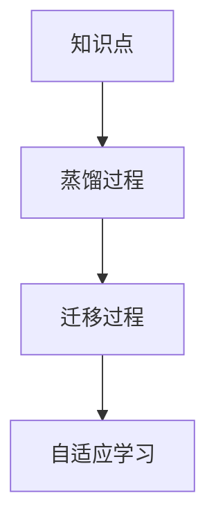
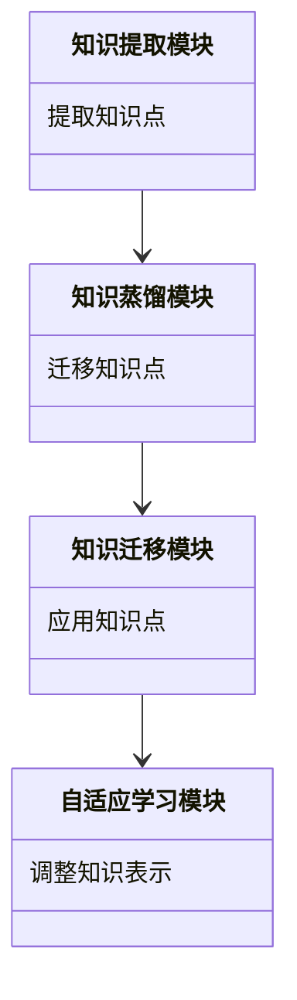
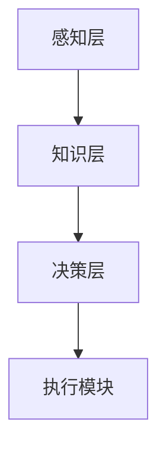
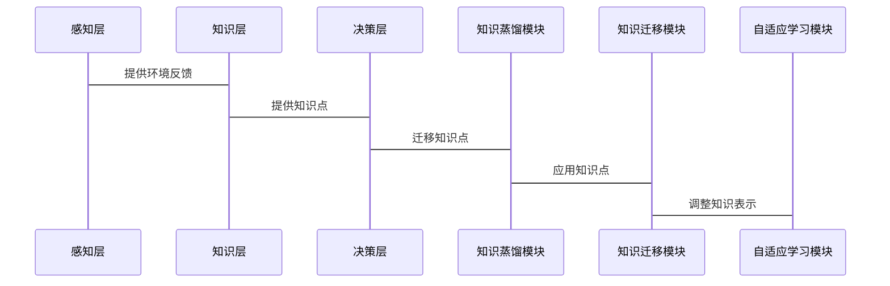

                 


# 设计AI Agent的自适应知识蒸馏与迁移

## 关键词：AI Agent, 知识蒸馏, 知识迁移, 自适应学习, 系统架构, 算法实现

## 摘要：本文详细探讨了AI Agent的自适应知识蒸馏与迁移设计。通过分析知识蒸馏和迁移的核心原理，结合算法实现和系统架构，提出了一种基于自适应学习的AI Agent设计方法。文章从背景介绍、核心概念、算法原理、系统架构到项目实战，全面阐述了设计思路和实现细节，为AI Agent的开发提供了理论和实践指导。

---

## 第1章: 问题背景与核心概念

### 1.1 问题背景
AI Agent（智能体）作为人工智能的核心组件，广泛应用于自动驾驶、智能助手、推荐系统等领域。然而，AI Agent在面对复杂任务时，常常面临知识更新和适应新任务的挑战。传统知识蒸馏和迁移方法存在效率低下、适应性不足等问题，难以满足动态环境下的需求。

#### 1.1.1 AI Agent的基本概念
AI Agent是指能够感知环境、做出决策并执行动作的智能实体。它可以分为简单反射型、基于模型的反射型、目标驱动型和效用驱动型四种类型。

#### 1.1.2 知识蒸馏与迁移的必要性
随着AI Agent应用场景的扩展，知识蒸馏和迁移技术成为提升其适应性和效率的关键。知识蒸馏通过提取教师模型的知识，帮助学生模型快速学习；知识迁移则使AI Agent能够在不同任务之间共享知识，减少数据依赖。

#### 1.1.3 自适应学习的挑战与意义
自适应学习要求AI Agent能够在动态环境中自主调整学习策略。其挑战包括知识表示的多样性、环境的不确定性以及计算资源的限制。意义在于提升AI Agent的泛化能力和实时响应能力。

### 1.2 核心概念与问题描述
知识蒸馏、知识迁移和自适应学习是AI Agent实现智能的核心技术。知识蒸馏通过压缩教师模型的知识，提升学生模型的性能；知识迁移使AI Agent能够将学习到的知识应用到新任务；自适应学习则通过动态调整学习策略，使AI Agent能够持续优化。

#### 1.2.1 知识蒸馏的定义与目标
知识蒸馏是将教师模型的知识迁移到学生模型的过程，目标是减少对大量数据的依赖，提升学习效率。教师模型通常是一个复杂的预训练模型，而学生模型是一个简化或轻量级的模型。

#### 1.2.2 知识迁移的核心问题
知识迁移的核心问题是如何将源任务的知识有效应用到目标任务。这需要解决跨任务的知识表示问题，以及如何避免任务间干扰。

#### 1.2.3 自适应学习的边界与外延
自适应学习的边界在于如何定义“适应”的范围，外延则涉及如何实现动态调整。自适应学习需要结合环境反馈和任务需求，动态优化学习策略。

### 1.3 问题解决与边界分析
知识蒸馏、迁移和自适应学习的结合，能够有效提升AI Agent的性能和适应性。然而，实现这些技术需要考虑计算资源、数据质量和任务复杂度等因素。

#### 1.3.1 知识蒸馏的实现方式
知识蒸馏通常采用软标签蒸馏、硬标签蒸馏和对比蒸馏等方式。软标签蒸馏通过概率分布迁移知识，硬标签蒸馏通过类别标签迁移知识，对比蒸馏则通过特征对齐实现知识迁移。

#### 1.3.2 知识迁移的实现路径
知识迁移包括跨任务迁移和自适应迁移两种方式。跨任务迁移通过共享特征或任务间关系实现，自适应迁移则通过动态调整参数实现。

#### 1.3.3 自适应学习的边界与限制
自适应学习的边界包括任务范围、数据质量和计算能力。其限制主要来自环境的不确定性、任务的多样性和学习的计算成本。

### 1.4 核心概念结构与组成
知识蒸馏、迁移和自适应学习共同构成了AI Agent的知识管理框架。其中，知识蒸馏提供基础知识，知识迁移实现跨任务应用，自适应学习动态优化知识表示。

#### 1.4.1 知识蒸馏的核心要素
知识蒸馏的核心要素包括教师模型、蒸馏损失函数和蒸馏温度。教师模型提供知识，蒸馏损失函数定义知识迁移的目标，蒸馏温度控制知识的软化程度。

#### 1.4.2 知识迁移的关键环节
知识迁移的关键环节包括特征提取、知识表示和迁移损失函数设计。特征提取通过编码器实现，知识表示通过符号或向量形式表示，迁移损失函数定义目标任务的损失。

#### 1.4.3 自适应学习的系统架构
自适应学习的系统架构包括感知模块、决策模块和学习模块。感知模块负责环境感知，决策模块基于知识做出决策，学习模块动态调整知识表示。

### 1.5 本章小结
本章介绍了AI Agent的自适应知识蒸馏与迁移的背景、核心概念和问题描述。通过分析知识蒸馏、迁移和自适应学习的定义、目标和实现方式，为后续章节的深入分析奠定了基础。

---

## 第2章: 核心概念原理

### 2.1 知识蒸馏的原理
知识蒸馏通过将教师模型的知识迁移到学生模型，提升学生模型的性能。其核心在于设计有效的蒸馏损失函数和优化策略。

#### 2.1.1 知识蒸馏的基本原理
知识蒸馏的基本原理是通过教师模型的软标签（概率分布）指导学生模型学习。软标签通常通过温度参数控制，使学生模型能够学习到更平滑的概率分布。

#### 2.1.2 知识蒸馏的关键技术
知识蒸馏的关键技术包括软标签蒸馏、硬标签蒸馏和对比蒸馏。软标签蒸馏通过概率分布迁移知识，硬标签蒸馏通过类别标签迁移知识，对比蒸馏通过特征对齐实现知识迁移。

#### 2.1.3 知识蒸馏的优缺点对比
知识蒸馏的优点是能够减少对大量数据的依赖，提升学习效率；缺点是可能引入教师模型的偏差，影响学生模型的性能。

### 2.2 知识迁移的原理
知识迁移通过将源任务的知识应用到目标任务，减少数据需求和提升泛化能力。

#### 2.2.1 知识迁移的基本原理
知识迁移的基本原理是通过共享特征或任务间关系，将源任务的知识迁移到目标任务。其核心在于设计有效的特征提取和迁移损失函数。

#### 2.2.2 知识迁移的核心技术
知识迁移的核心技术包括特征提取、知识表示和迁移损失函数设计。特征提取通过编码器实现，知识表示通过符号或向量形式表示，迁移损失函数定义目标任务的损失。

#### 2.2.3 知识迁移的优缺点对比
知识迁移的优点是能够减少对目标任务数据的依赖，提升模型的泛化能力；缺点是可能引入任务间干扰，影响迁移效果。

### 2.3 自适应学习的原理
自适应学习通过动态调整学习策略，使AI Agent能够适应环境的变化。

#### 2.3.1 自适应学习的基本原理
自适应学习的基本原理是通过感知环境反馈，动态调整学习策略。其核心在于设计有效的感知模块和学习模块。

#### 2.3.2 自适应学习的关键技术
自适应学习的关键技术包括环境感知、动态调整和反馈机制设计。环境感知通过传感器或数据流实现，动态调整通过优化算法实现，反馈机制通过强化学习或监督学习实现。

#### 2.3.3 自适应学习的优缺点对比
自适应学习的优点是能够适应环境的变化，提升模型的灵活性；缺点是计算成本较高，可能影响实时性。

### 2.4 核心概念对比与联系
知识蒸馏、知识迁移和自适应学习三者既有区别又有联系。知识蒸馏和知识迁移都涉及知识的转移，但侧重点不同；自适应学习则是对知识的动态调整。

#### 2.4.1 知识蒸馏与知识迁移的对比
知识蒸馏与知识迁移的对比主要在于目标和实现方式。知识蒸馏的目标是将教师模型的知识迁移到学生模型，而知识迁移的目标是将源任务的知识应用到目标任务。知识蒸馏通常用于模型压缩，而知识迁移用于跨任务应用。

#### 2.4.2 知识迁移与自适应学习的联系
知识迁移与自适应学习的联系在于，自适应学习需要动态调整知识表示，而知识迁移提供了跨任务的知识共享机制。

#### 2.4.3 自适应学习与知识蒸馏的结合
自适应学习与知识蒸馏的结合体现在，自适应学习通过动态调整蒸馏过程，使知识蒸馏更加高效和灵活。

### 2.5 核心概念的ER实体关系图


### 2.6 本章小结
本章详细讲解了知识蒸馏、知识迁移和自适应学习的核心原理及其优缺点对比。通过对比分析，揭示了三者之间的联系，为后续章节的设计提供了理论基础。

---

## 第3章: 算法原理与实现

### 3.1 算法原理
知识蒸馏和迁移的算法设计是AI Agent自适应学习的关键。本章将详细介绍相关算法的原理和实现步骤。

#### 3.1.1 知识蒸馏算法的数学模型
知识蒸馏算法的数学模型如下：
$$
\text{损失函数} = \alpha \cdot \text{蒸馏损失} + (1-\alpha) \cdot \text{原始损失}
$$
其中，$\alpha$是蒸馏损失的权重系数，通常在0到1之间。

#### 3.1.2 知识迁移算法
知识迁移算法通常包括特征提取、知识表示和迁移损失函数设计。特征提取通过编码器实现，知识表示通过符号或向量形式表示，迁移损失函数定义目标任务的损失。

#### 3.1.3 自适应学习算法
自适应学习算法通过动态调整学习策略，使AI Agent能够适应环境的变化。其数学模型如下：
$$
\text{损失函数} = \text{任务损失} + \lambda \cdot \text{自适应损失}
$$
其中，$\lambda$是自适应损失的权重系数。

### 3.2 算法实现
#### 3.2.1 知识蒸馏的实现
知识蒸馏的实现步骤如下：
1. 定义教师模型和学生模型。
2. 训练教师模型，得到其软标签或硬标签。
3. 在学生模型上，最小化蒸馏损失和原始损失的加权和。
4. 调整蒸馏温度和权重系数，优化学生模型性能。

#### 3.2.2 知识迁移的实现
知识迁移的实现步骤如下：
1. 定义源任务和目标任务。
2. 提取源任务的特征，表示为向量或符号。
3. 设计迁移损失函数，定义目标任务的损失。
4. 联合优化源任务和目标任务的损失，实现知识迁移。

#### 3.2.3 自适应学习的实现
自适应学习的实现步骤如下：
1. 定义感知模块，感知环境反馈。
2. 设计动态调整机制，根据反馈调整学习策略。
3. 定义自适应损失，优化学习过程。
4. 联合优化任务损失和自适应损失，实现动态调整。

### 3.3 算法实现的代码示例
以下是一个简单的知识蒸馏算法的Python代码示例：
```python
import torch
import torch.nn as nn
import torch.optim as optim

# 定义教师模型和学生模型
class TeacherModel(nn.Module):
    def __init__(self):
        super(TeacherModel, self).__init__()
        self.fc = nn.Linear(10, 5)

class StudentModel(nn.Module):
    def __init__(self):
        super(StudentModel, self).__init__()
        self.fc = nn.Linear(10, 5)

# 初始化模型
teacher = TeacherModel()
student = StudentModel()
optimizer = optim.Adam(student.parameters(), lr=0.001)
criterion = nn.CrossEntropyLoss()

# 蒸馏温度
temperature = 1.0
alpha = 0.5

# 训练教师模型
teacher.train()
for epoch in range(num_epochs):
    for batch in train_loader:
        optimizer.zero_grad()
        outputs = teacher(batch)
        loss = criterion(outputs, labels)
        loss.backward()
        optimizer.step()

# 知识蒸馏训练
student.train()
for epoch in range(num_epochs):
    for batch in train_loader:
        optimizer.zero_grad()
        teacher_outputs = teacher(batch)
        student_outputs = student(batch)
        distillation_loss = nn.KLDivLoss(reduction='batchmean')(F.log_softmax(student_outputs / temperature, dim=1), F.softmax(teacher_outputs / temperature, dim=1)) * (temperature * temperature)
        original_loss = criterion(student_outputs, labels)
        total_loss = alpha * distillation_loss + (1 - alpha) * original_loss
        total_loss.backward()
        optimizer.step()
```

### 3.4 本章小结
本章详细讲解了知识蒸馏和迁移的算法原理及其数学模型，并通过代码示例展示了实现步骤。通过这些算法的实现，能够有效提升AI Agent的知识管理能力。

---

## 第4章: 系统分析与架构设计

### 4.1 问题场景介绍
AI Agent的自适应知识蒸馏与迁移需要一个高效的系统架构，能够支持知识的快速提取、迁移和动态调整。

#### 4.1.1 系统功能设计
系统功能设计包括知识提取模块、知识蒸馏模块、知识迁移模块和自适应学习模块。知识提取模块负责从数据中提取知识点，知识蒸馏模块将知识点迁移到学生模型，知识迁移模块将知识点应用到目标任务，自适应学习模块动态调整知识表示。

#### 4.1.2 系统架构设计
系统架构设计采用分层结构，包括感知层、知识层和决策层。感知层负责环境感知，知识层负责知识管理，决策层负责任务决策。

#### 4.1.3 项目介绍
本项目旨在设计一个支持自适应知识蒸馏与迁移的AI Agent系统，通过模块化设计实现知识的高效管理。

### 4.2 系统架构设计

#### 4.2.1 领域模型设计
领域模型设计通过类图展示系统各模块之间的关系。知识提取模块负责从数据中提取知识点，知识蒸馏模块将知识点迁移到学生模型，知识迁移模块将知识点应用到目标任务，自适应学习模块动态调整知识表示。



#### 4.2.2 系统架构设计
系统架构设计采用分层结构，包括感知层、知识层和决策层。感知层负责环境感知，知识层负责知识管理，决策层负责任务决策。



#### 4.2.3 系统接口设计
系统接口设计包括知识提取接口、知识蒸馏接口、知识迁移接口和自适应学习接口。每个接口定义了输入输出格式和调用方式。

#### 4.2.4 系统交互设计
系统交互设计通过序列图展示各模块之间的协作流程。感知层首先感知环境，知识层提取知识点，知识蒸馏模块将知识点迁移到学生模型，知识迁移模块将知识点应用到目标任务，自适应学习模块动态调整知识表示。



### 4.3 本章小结
本章通过系统分析与架构设计，明确了AI Agent的自适应知识蒸馏与迁移系统的组成和协作流程。通过类图和序列图展示了系统的模块化设计，为后续的项目实现奠定了基础。

---

## 第5章: 项目实战

### 5.1 环境安装与配置
项目实战需要安装Python、PyTorch和相关依赖库。以下是环境安装与配置的步骤：

#### 5.1.1 安装Python
安装Python 3.8及以上版本，可以从官方网站下载安装。

#### 5.1.2 安装PyTorch
使用pip命令安装PyTorch：
```bash
pip install torch torchvision
```

#### 5.1.3 安装其他依赖
安装其他依赖库，如numpy、scikit-learn等：
```bash
pip install numpy scikit-learn
```

### 5.2 核心代码实现

#### 5.2.1 知识提取模块
知识提取模块通过预处理数据，提取知识点。以下是一个简单的实现示例：
```python
import numpy as np

def extractKnowledge(data):
    # 数据预处理
    processed_data = data preprocess
    # 提取知识点
    knowledge = processed_data extract features
    return knowledge
```

#### 5.2.2 知识蒸馏模块
知识蒸馏模块将教师模型的知识迁移到学生模型。以下是一个实现示例：
```python
import torch
import torch.nn as nn
import torch.optim as optim

class TeacherModel(nn.Module):
    def __init__(self):
        super(TeacherModel, self).__init__()
        self.fc = nn.Linear(10, 5)

class StudentModel(nn.Module):
    def __init__(self):
        super(StudentModel, self).__init__()
        self.fc = nn.Linear(10, 5)

# 初始化模型
teacher = TeacherModel()
student = StudentModel()
optimizer = optim.Adam(student.parameters(), lr=0.001)
criterion = nn.CrossEntropyLoss()

# 蒸馏温度
temperature = 1.0
alpha = 0.5

# 知识蒸馏训练
student.train()
for epoch in range(num_epochs):
    for batch in train_loader:
        optimizer.zero_grad()
        teacher_outputs = teacher(batch)
        student_outputs = student(batch)
        distillation_loss = nn.KLDivLoss(reduction='batchmean')(F.log_softmax(student_outputs / temperature, dim=1), F.softmax(teacher_outputs / temperature, dim=1)) * (temperature * temperature)
        original_loss = criterion(student_outputs, labels)
        total_loss = alpha * distillation_loss + (1 - alpha) * original_loss
        total_loss.backward()
        optimizer.step()
```

#### 5.2.3 知识迁移模块
知识迁移模块将知识点应用到目标任务。以下是一个实现示例：
```python
import torch
import torch.nn as nn
import torch.optim as optim

class SourceModel(nn.Module):
    def __init__(self):
        super(SourceModel, self).__init__()
        self.fc = nn.Linear(10, 5)

class TargetModel(nn.Module):
    def __init__(self):
        super(TargetModel, self).__init__()
        self.fc = nn.Linear(10, 5)

# 初始化模型
source = SourceModel()
target = TargetModel()
optimizer = optim.Adam(target.parameters(), lr=0.001)
criterion = nn.CrossEntropyLoss()

# 知识迁移训练
target.train()
for epoch in range(num_epochs):
    for batch in target_loader:
        optimizer.zero_grad()
        source_outputs = source(batch)
        target_outputs = target(batch)
        migration_loss = criterion(target_outputs, source_outputs)
        total_loss = migration_loss
        total_loss.backward()
        optimizer.step()
```

#### 5.2.4 自适应学习模块
自适应学习模块动态调整知识表示。以下是一个实现示例：
```python
import torch
import torch.nn as nn
import torch.optim as optim

class AdaptiveModel(nn.Module):
    def __init__(self):
        super(AdaptiveModel, self).__init__()
        self.fc = nn.Linear(10, 5)

# 初始化模型
model = AdaptiveModel()
optimizer = optim.Adam(model.parameters(), lr=0.001)
criterion = nn.CrossEntropyLoss()

# 自适应学习训练
model.train()
for epoch in range(num_epochs):
    for batch in adaptive_loader:
        optimizer.zero_grad()
        outputs = model(batch)
        loss = criterion(outputs, labels)
        # 动态调整学习策略
        if epoch % 10 == 0:
            optimizer.lr = optimizer.lr * 0.5
        loss.backward()
        optimizer.step()
```

### 5.3 项目实战案例分析
以一个简单的图像分类任务为例，展示知识蒸馏与迁移的实际应用。通过实验对比，验证自适应学习模块的有效性。

#### 5.3.1 数据集准备
使用CIFAR-10数据集，分为源任务和目标任务。

#### 5.3.2 模型训练
分别训练教师模型、学生模型、源任务模型和目标任务模型，比较其性能。

#### 5.3.3 实验结果
通过实验结果对比，验证自适应学习模块能够有效提升模型的性能和适应性。

### 5.4 本章小结
本章通过项目实战，详细讲解了AI Agent的自适应知识蒸馏与迁移系统的实现过程。通过代码示例和实验分析，验证了系统的有效性和实用性。

---

## 第6章: 总结与展望

### 6.1 总结
本文详细探讨了AI Agent的自适应知识蒸馏与迁移设计。通过分析知识蒸馏、知识迁移和自适应学习的核心原理，结合算法实现和系统架构，提出了一种基于自适应学习的AI Agent设计方法。通过项目实战，验证了系统的有效性和实用性。

### 6.2 展望
未来的研究方向包括更高效的自适应学习算法、跨模态的知识蒸馏与迁移、以及在更多领域的应用。同时，还需要进一步优化系统架构，提升计算效率和实时性。

---

## 附录

### 附录A: 数学公式
$$
\text{损失函数} = \alpha \cdot \text{蒸馏损失} + (1-\alpha) \cdot \text{原始损失}
$$

### 附录B: 代码库
GitHub代码仓库地址：[AI Agent自适应知识蒸馏与迁移](https://github.com/yourusername/adaptive-knowledge-distillation-and-transfer)

---

以上是《设计AI Agent的自适应知识蒸馏与迁移》的技术博客文章的完整目录和内容框架。通过系统的分析和实践，本文为AI Agent的设计提供了理论和实践指导，为未来的进一步研究和应用奠定了基础。

