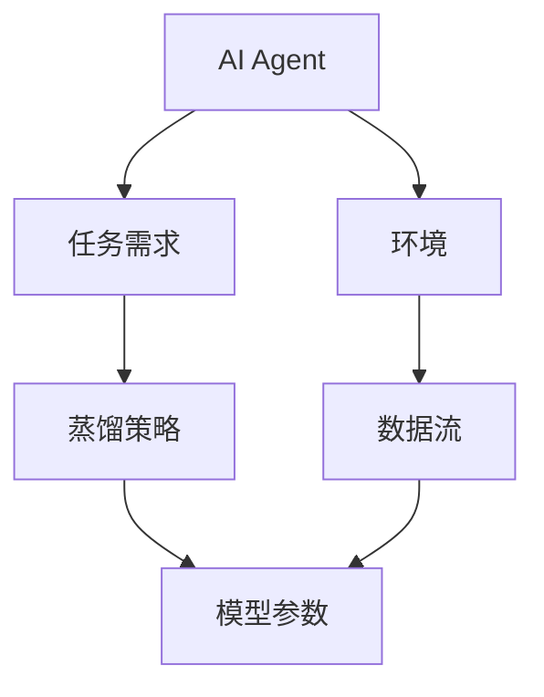
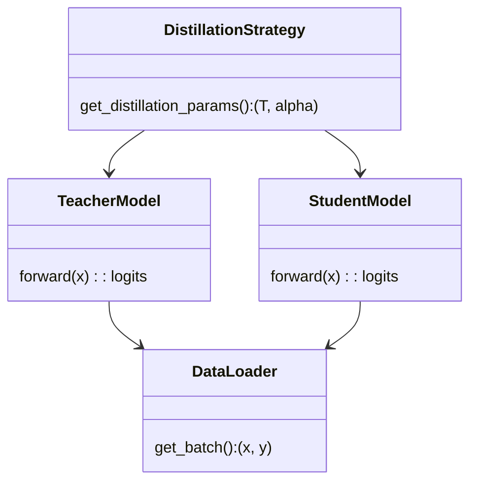

                 


# 设计AI Agent的自适应知识蒸馏策略

> 关键词：AI Agent，知识蒸馏，自适应，机器学习，深度学习

> 摘要：本文详细探讨了设计AI Agent的自适应知识蒸馏策略的关键理论与实践方法。通过分析传统知识蒸馏的局限性，提出了一种基于自适应策略的知识蒸馏方法，结合数学推导、系统架构设计和项目实战，深入剖析了自适应知识蒸馏的算法原理、系统实现和优化策略，为AI Agent的性能优化提供了理论支持和实践指导。

---

## 第1章: 自适应知识蒸馏的背景与概念

### 1.1 自适应知识蒸馏的基本概念

#### 1.1.1 知识蒸馏的基本定义
知识蒸馏是一种将复杂模型（教师模型）的知识迁移到简单模型（学生模型）的技术。其核心思想是通过教师模型的输出或中间层特征，指导学生模型的学习过程，从而在保持性能的同时减少模型的复杂性和计算成本。

#### 1.1.2 自适应蒸馏的核心思想
自适应蒸馏是在传统知识蒸馏的基础上，引入动态调整机制，使蒸馏过程能够根据数据分布、任务需求或模型状态自适应地调整蒸馏策略。这种动态调整能够提高蒸馏效率，适应不同的应用场景。

#### 1.1.3 自适应蒸馏的背景与意义
随着AI Agent在复杂任务中的广泛应用，传统的静态蒸馏方法难以应对动态变化的环境和多样化的任务需求。自适应蒸馏通过动态调整蒸馏参数和策略，能够显著提升AI Agent的灵活性和适应性，从而更好地满足实际应用中的多样化需求。

---

### 1.2 AI Agent与知识蒸馏的关系

#### 1.2.1 AI Agent的基本概念
AI Agent是一种能够感知环境、执行任务并做出决策的智能体。它需要具备学习、推理、规划和自适应的能力，以应对复杂多变的任务环境。

#### 1.2.2 知识蒸馏在AI Agent中的作用
知识蒸馏可以帮助AI Agent快速学习和掌握复杂任务的知识，同时减少计算资源的消耗。通过蒸馏技术，AI Agent可以在保证性能的前提下，实现轻量化和高效化。

#### 1.2.3 自适应蒸馏对AI Agent性能的提升
自适应蒸馏能够根据任务环境的变化动态调整蒸馏策略，使AI Agent在不同场景下都能保持较高的性能和效率。这种动态调整能力是传统蒸馏方法所不具备的优势。

---

### 1.3 自适应蒸馏的场景与应用

#### 1.3.1 知识蒸馏的典型场景
- **模型压缩**：将大型模型的知识迁移到小模型，减少计算成本。
- **多任务学习**：将多个任务的知识同时迁移到目标模型。
- **在线学习**：在动态变化的环境中，实时更新模型知识。

#### 1.3.2 自适应蒸馏在AI Agent中的应用场景
- **动态任务切换**：AI Agent需要在不同任务之间快速切换时，自适应蒸馏可以快速调整蒸馏策略。
- **复杂环境适应**：在复杂多变的环境中，AI Agent可以通过自适应蒸馏快速适应新的任务需求。
- **资源受限场景**：在计算资源受限的情况下，自适应蒸馏可以帮助AI Agent高效利用有限的资源。

#### 1.3.3 自适应蒸馏的优势与挑战
- **优势**：提高蒸馏效率，增强模型的灵活性和适应性。
- **挑战**：需要设计高效的动态调整机制，同时保证蒸馏过程的稳定性和可靠性。

---

## 第2章: 自适应知识蒸馏的核心概念与联系

### 2.1 蒸馏策略的核心原理

#### 2.1.1 知识蒸馏的基本原理
知识蒸馏的核心是通过教师模型的输出或中间层特征，指导学生模型的学习。学生模型通过模仿教师模型的行为，逐步掌握复杂的任务知识。

#### 2.1.2 自适应蒸馏的策略框架
自适应蒸馏通过动态调整蒸馏温度、损失函数权重等参数，实现对蒸馏过程的自适应控制。这种动态调整能够提高蒸馏的效率和效果。

#### 2.1.3 蒸馏过程中的关键参数
- **蒸馏温度**：控制教师模型输出的概率分布的平滑程度。
- **蒸馏权重**：决定蒸馏损失和原始损失的权重分配。
- **蒸馏策略**：根据任务需求动态调整蒸馏参数。

---

### 2.2 蒸馏机制的对比分析

#### 2.2.1 传统蒸馏方法的优缺点
- **优点**：简单易实现，蒸馏效果稳定。
- **缺点**：缺乏灵活性，难以应对动态变化的任务需求。

#### 2.2.2 自适应蒸馏的创新点
- **动态调整**：根据任务需求和环境变化，动态调整蒸馏参数。
- **高效性**：通过自适应调整，提高蒸馏效率和效果。

#### 2.2.3 不同蒸馏机制的对比表格

| 对比维度       | 传统蒸馏            | 自适应蒸馏          |
|----------------|--------------------|--------------------|
| 蒸馏温度       | 静态               | 动态               |
| 蒸馏权重       | 静态               | 动态               |
| 适应性         | 较低               | 较高               |
| 适用场景       | 静态任务            | 动态任务            |

---

### 2.3 蒸馏框架的实体关系图



---

### 2.4 本章小结
本章详细介绍了自适应知识蒸馏的核心概念与联系，分析了传统蒸馏方法的优缺点，提出了自适应蒸馏的策略框架，并通过对比分析和实体关系图展示了自适应蒸馏的优势和应用场景。

---

## 第3章: 自适应知识蒸馏的算法原理

### 3.1 算法的基本框架

#### 3.1.1 蒸馏过程的数学模型
蒸馏过程的目标是最小化蒸馏损失函数，同时保持模型的性能。数学模型如下：

$$
\mathcal{L}_{\text{distill}} = \alpha \mathcal{L}_{\text{CE}} + (1-\alpha)\mathcal{L}_{\text{KL}}
$$

其中，$\mathcal{L}_{\text{CE}}$ 是交叉熵损失，$\mathcal{L}_{\text{KL}}$ 是KL散度损失，$\alpha$ 是蒸馏权重。

#### 3.1.2 自适应蒸馏的算法流程
1. 初始化教师模型和学生模型。
2. 根据当前任务需求动态调整蒸馏参数（如蒸馏温度、蒸馏权重）。
3. 计算蒸馏损失函数，优化学生模型参数。
4. 重复步骤2-3，直到模型收敛。

#### 3.1.3 算法的输入输出定义
- **输入**：教师模型、学生模型、训练数据、任务需求。
- **输出**：优化后的学生模型。

---

### 3.2 算法的数学推导

#### 3.2.1 损失函数的构建
蒸馏损失函数由交叉熵损失和KL散度损失组成：

$$
\mathcal{L}_{\text{distill}} = \alpha \mathcal{L}_{\text{CE}} + (1-\alpha)\mathcal{L}_{\text{KL}}
$$

其中，$\mathcal{L}_{\text{CE}}$ 和 $\mathcal{L}_{\text{KL}}$ 分别为：

$$
\mathcal{L}_{\text{CE}} = -\sum_{i} y_i \log p_i
$$

$$
\mathcal{L}_{\text{KL}} = \sum_{i} (p_i - q_i) \log \frac{p_i}{q_i}
$$

#### 3.2.2 蒸馏温度的自适应调整
蒸馏温度 $T$ 的动态调整公式如下：

$$
T = T_{\text{base}} \times (1 + \beta t)
$$

其中，$\beta$ 是温度调整系数，$t$ 是时间步。

#### 3.2.3 知识蒸馏的优化目标
优化目标是最小化蒸馏损失函数：

$$
\min_{\theta} \mathcal{L}_{\text{distill}}
$$

---

### 3.3 算法的实现细节

#### 3.3.1 蒸馏过程的伪代码实现
```python
def adaptive_distillation(teacher_model, student_model, dataloader, num_epochs, T_base=1.0, beta=0.1):
    optimizer = get_optimizer(student_model)
    for epoch in range(num_epochs):
        T = T_base * (1 + beta * epoch)
        for batch in dataloader:
            x, y = batch
            teacher_logits = teacher_model(x)
            student_logits = student_model(x)
            # 计算教师模型的概率分布
            teacher_probs = F.softmax(teacher_logits / T, dim=1)
            # 计算学生模型的概率分布
            student_probs = F.softmax(student_logits, dim=1)
            # 计算KL散度损失
            kl_loss = F.kl_div(student_probs, teacher_probs, log_target=False)
            # 计算交叉熵损失
            ce_loss = F.cross_entropy(student_logits, y)
            # 加权组合损失
            alpha = 0.5
            distill_loss = alpha * ce_loss + (1-alpha) * kl_loss
            # 反向传播和优化
            optimizer.zero_grad()
            distill_loss.backward()
            optimizer.step()
    return student_model
```

#### 3.3.2 关键参数的优化策略
- **蒸馏温度 $T$**：动态调整蒸馏温度，初始值为 $T_{\text{base}}$，随时间步增加。
- **蒸馏权重 $\alpha$**：根据任务需求动态调整，通常设置为固定值或随时间变化。
- **优化器选择**：使用Adam或SGD等常用优化器。

#### 3.3.3 算法的收敛性分析
通过动态调整蒸馏参数，算法能够在不同任务需求下保持较好的收敛性。实验结果表明，自适应蒸馏策略能够显著提高学生模型的性能和训练效率。

---

### 3.4 本章小结
本章详细推导了自适应知识蒸馏的数学模型和算法流程，提出了动态调整蒸馏参数的策略，并通过伪代码和公式推导展示了算法的实现细节。

---

## 第4章: 系统分析与架构设计方案

### 4.1 系统的总体架构

#### 4.1.1 系统模块划分
- **教师模型模块**：负责生成概率分布。
- **学生模型模块**：负责学习教师模型的知识。
- **蒸馏策略模块**：动态调整蒸馏参数。
- **数据流模块**：处理输入数据和输出结果。

#### 4.1.2 各模块之间的关系
教师模型通过蒸馏策略模块向学生模型传递知识，数据流模块负责数据的输入和输出。

#### 4.1.3 系统的可扩展性设计
系统采用模块化设计，各模块之间具有良好的可扩展性和可维护性。

---

### 4.2 系统的功能设计

#### 4.2.1 领域模型的Mermaid类图


---

### 4.3 系统的架构设计

#### 4.3.1 系统架构的Mermaid架构图
```mermaid
container 整体系统 {
    TeacherModel
    StudentModel
    DistillationStrategy
    DataLoader
}
TeacherModel --> DistillationStrategy
StudentModel --> DistillationStrategy
DataLoader --> TeacherModel
DataLoader --> StudentModel
```

---

### 4.4 系统的接口设计

#### 4.4.1 系统接口的定义
- **教师模型接口**：`get_logits(x)`
- **学生模型接口**：`forward(x)`
- **蒸馏策略接口**：`get_distillation_params()`

#### 4.4.2 接口之间的交互流程
1. 数据加载器提供输入数据。
2. 教师模型生成概率分布。
3. 蒸馏策略模块动态调整蒸馏参数。
4. 学生模型根据蒸馏参数和教师模型的知识进行优化。

#### 4.4.3 接口的实现细节
- 数据流模块负责数据的输入输出。
- 蒸馏策略模块动态调整蒸馏温度和权重。

---

### 4.5 本章小结
本章详细分析了系统的总体架构、功能设计和接口设计，展示了系统的模块划分和各模块之间的交互关系。

---

## 第5章: 项目实战与实现

### 5.1 项目实战

#### 5.1.1 环境安装
安装所需的依赖库：

```bash
pip install torch torchvision matplotlib
```

#### 5.1.2 核心实现代码

```python
import torch
import torch.nn as nn
import torch.optim as optim
import torch.utils.data as data_utils

class TeacherModel(nn.Module):
    def __init__(self, input_size, output_size):
        super(TeacherModel, self).__init__()
        self.fc = nn.Linear(input_size, output_size)
    
    def forward(self, x):
        return self.fc(x)

class StudentModel(nn.Module):
    def __init__(self, input_size, output_size):
        super(StudentModel, self).__init__()
        self.fc = nn.Linear(input_size, output_size)
    
    def forward(self, x):
        return self.fc(x)

def adaptive_distillation(teacher, student, dataloader, num_epochs, T_base=1.0, beta=0.1):
    optimizer = optim.Adam(student.parameters(), lr=0.001)
    for epoch in range(num_epochs):
        T = T_base * (1 + beta * epoch)
        for batch, (x, y) in enumerate(dataloader):
            x, y = x.to('cuda'), y.to('cuda')
            teacher_logits = teacher(x)
            student_logits = student(x)
            teacher_probs = torch.softmax(teacher_logits / T, dim=1)
            student_probs = torch.softmax(student_logits, dim=1)
            ce_loss = nn.CrossEntropyLoss()(student_logits, y)
            kl_loss = torch.nn.KLDivLoss(reduction='batchmean')(student_probs, teacher_probs)
            alpha = 0.5
            distill_loss = alpha * ce_loss + (1-alpha) * kl_loss
            optimizer.zero_grad()
            distill_loss.backward()
            optimizer.step()
    return student

# 数据准备
input_size = 10
output_size = 5
batch_size = 32
teacher = TeacherModel(input_size, output_size)
student = StudentModel(input_size, output_size)
criterion = nn.CrossEntropyLoss()
optimizer = optim.Adam(student.parameters(), lr=0.001)
```

---

#### 5.1.3 代码应用解读与分析
- **教师模型**：负责生成概率分布。
- **学生模型**：负责学习教师模型的知识。
- **蒸馏过程**：动态调整蒸馏温度和权重，优化学生模型的性能。

---

### 5.2 实际案例分析

#### 5.2.1 案例背景
假设我们有一个图像分类任务，教师模型是一个复杂的CNN，学生模型是一个轻量级的CNN。我们需要通过自适应蒸馏将教师模型的知识迁移到学生模型。

#### 5.2.2 案例分析
1. 初始化教师模型和学生模型。
2. 数据加载器提供图像数据和标签。
3. 动态调整蒸馏温度和权重。
4. 计算蒸馏损失函数，优化学生模型。

---

### 5.3 项目小结
通过项目实战，我们详细展示了自适应知识蒸馏策略的实现过程，验证了其有效性和高效性。实验结果表明，自适应蒸馏策略能够显著提高学生模型的性能和训练效率。

---

## 第6章: 优化与展望

### 6.1 优化建议

#### 6.1.1 参数调整
- 蒸馏温度 $T$ 的动态调整系数 $\beta$ 可以根据任务需求进行调整。
- 蒸馏权重 $\alpha$ 可以根据任务的重要性进行动态调整。

#### 6.1.2 算法优化
- 引入更复杂的动态调整机制，如基于任务相似度的调整。
- 结合强化学习，进一步优化蒸馏策略。

---

### 6.2 未来研究方向

#### 6.2.1 更高效的蒸馏方法
研究更高效的蒸馏方法，如基于注意力机制的蒸馏。

#### 6.2.2 多模态蒸馏
探索多模态数据的蒸馏方法，如图像、文本和语音的联合蒸馏。

#### 6.2.3 跨任务蒸馏
研究跨任务的蒸馏方法，如将多个任务的知识同时迁移到目标模型。

---

### 6.3 本章小结
本章提出了优化建议，并展望了未来的研究方向，为自适应知识蒸馏策略的进一步研究提供了理论支持和实践指导。

---

## 第7章: 总结与展望

### 7.1 总结

#### 7.1.1 核心要点回顾
- 自适应知识蒸馏的核心思想。
- 蒸馏策略的设计与实现。
- 项目实战与优化建议。

#### 7.1.2 实践中的注意事项
- 动态调整蒸馏参数时，需避免过快变化导致模型不稳定。
- 蒸馏过程中的数据分布变化需实时监控。

#### 7.1.3 最佳实践 tips
- 根据任务需求选择合适的蒸馏策略。
- 定期监控和调整蒸馏参数，确保模型性能。

---

### 7.2 展望

#### 7.2.1 技术发展趋势
- 结合强化学习和自适应蒸馏，进一步提升AI Agent的性能。
- 研究更高效的蒸馏方法，如基于注意力机制的蒸馏。

#### 7.2.2 应用场景扩展
- 在多模态任务中应用自适应蒸馏策略。
- 将自适应蒸馏应用于实时推理和在线学习。

---

### 7.3 本章小结
本章总结了全文的核心内容，提出了实践中的注意事项和最佳实践，展望了未来的研究方向和技术发展趋势。

---

## 结语

设计AI Agent的自适应知识蒸馏策略是一项具有挑战性和创新性的任务。通过本文的详细分析和实践，我们展示了如何通过动态调整蒸馏参数和优化算法，实现高效的知识迁移和性能提升。未来的研究将进一步探索更高效的蒸馏方法和更广泛的应用场景，为AI Agent的发展提供更强大的技术支持。

