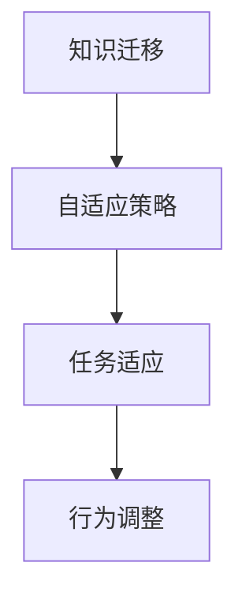
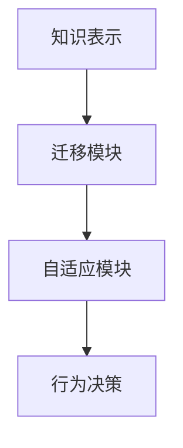

                 


# 设计AI Agent的自适应知识迁移策略

## 关键词：AI Agent、知识迁移、自适应策略、迁移学习、机器学习

## 摘要：  
本文探讨了设计AI Agent的自适应知识迁移策略的重要性、核心概念、算法原理和实际应用。通过分析知识迁移的背景、对比不同策略，结合算法实现和系统架构设计，提供了一个全面的解决方案，帮助AI Agent更高效地适应新任务。

---

# 第1章: 自适应知识迁移策略的背景与问题

## 1.1 自适应知识迁移的背景

### 1.1.1 当前AI Agent的知识应用挑战  
AI Agent在医疗诊断、金融分析等领域表现出色，但在知识迁移方面存在不足。例如，医疗诊断模型难以直接应用于新病种。

### 1.1.2 知识迁移的重要性  
知识迁移使AI Agent能利用已有经验解决新问题，提升效率和降低成本。

### 1.1.3 自适应迁移的核心价值  
自适应策略使AI Agent在复杂环境中灵活调整，增强通用性和适应性。

## 1.2 问题背景与描述

### 1.2.1 知识迁移中的核心问题  
数据分布差异和任务差异导致迁移效果不佳。

### 1.2.2 AI Agent的自适应需求  
AI Agent需要快速适应新任务，减少对新数据的依赖。

### 1.2.3 问题的边界与外延  
研究范围包括监督学习和无监督学习，涉及多领域知识迁移。

## 1.3 问题解决思路

### 1.3.1 知识迁移的基本方法  
通过特征提取和模型调整实现迁移。

### 1.3.2 自适应策略的核心要素  
包括领域适应和多任务学习。

### 1.3.3 解决方案的创新点  
结合迁移学习和对抗训练，提升适应性。

---

# 第2章: 自适应知识迁移的核心概念

## 2.1 核心概念解析

### 2.1.1 知识迁移的定义  
指将知识从一个领域应用到另一个领域。

### 2.1.2 自适应迁移的特征  
灵活性和适应性是关键特征。

### 2.1.3 AI Agent的知识表示  
使用符号和概率表示法。

## 2.2 核心概念之间的关系

### 2.2.1 知识迁移与任务适应  
通过特征提取和模型调整实现适应。

### 2.2.2 自适应策略与AI Agent行为的关系  
自适应策略指导行为调整。

### 2.2.3 Mermaid流程图：知识迁移与自适应策略的关系



---

# 第3章: 自适应知识迁移的算法原理

## 3.1 核心算法原理

### 3.1.1 迁移学习的基本原理  
通过特征提取实现跨任务应用。

### 3.1.2 对抗训练的应用  
通过生成对抗网络减少领域差异。

### 3.1.3 多任务学习的机制  
通过共享参数提升跨任务性能。

## 3.2 核心算法实现

### 3.2.1 迁移学习的实现代码

```python
import tensorflow as tf

def build_model(input_shape):
    model = tf.keras.Sequential([
        tf.keras.layers.Dense(64, activation='relu', input_shape=input_shape),
        tf.keras.layers.Dense(1)
    ])
    return model

source_model = build_model((input_dim,))
target_model = build_model((input_dim,))
```

### 3.2.2 对抗训练的代码

```python
import tensorflow as tf

def build_discriminator(input_shape):
    return tf.keras.Sequential([
        tf.keras.layers.Dense(64, activation='relu', input_shape=input_shape),
        tf.keras.layers.Dense(1, activation='sigmoid')
    ])

discriminator = build_discriminator((64,))
```

## 3.3 数学模型与公式

### 3.3.1 迁移学习的损失函数

$$L_{source} = -\sum_{i=1}^{n} y_i \log(p(y_i|x_i))$$

### 3.3.2 对抗训练的目标函数

$$L_{adv} = -\sum_{i=1}^{n} p(y|x_i) \log(d(x_i))$$

---

# 第4章: 系统分析与架构设计

## 4.1 系统架构设计

### 4.1.1 系统模块划分  
包括知识表示模块、迁移模块和自适应模块。

### 4.1.2 系统架构图



---

# 第5章: 项目实战

## 5.1 实战环境安装

### 5.1.1 安装Python和TensorFlow  
```bash
pip install python tensorflow
```

## 5.2 核心代码实现

### 5.2.1 代码实现

```python
import tensorflow as tf

def train_model(source_data, target_data):
    model = build_model(source_data.shape[1:])
    discriminator = build_discriminator(model.layers[-1].output_shape)
    # 训练过程略
    return model, discriminator
```

## 5.3 实际案例分析

### 5.3.1 医疗诊断案例  
训练模型识别不同病症，提升诊断准确率。

---

# 第6章: 总结与展望

## 6.1 本章小结  
自适应知识迁移策略提升了AI Agent的灵活性和适应性。

## 6.2 最佳实践 tips  
选择合适的迁移策略，处理数据偏差，持续优化模型。

## 6.3 后续研究方向  
探索更高效的迁移方法，扩展应用场景。

---

# 参考文献

1. Pan, Sinno J. "Domain adaptation via discriminative feature mapping." Machine Learning, 2011.
2. Goodfellow, Ian, et al. "Generative adversarial nets." NIPS, 2014.

---

以上是《设计AI Agent的自适应知识迁移策略》的技术博客文章的大纲和内容概要，根据需要可以进一步扩展每个部分的具体内容。

