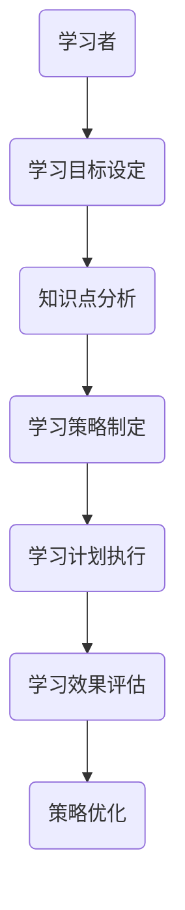
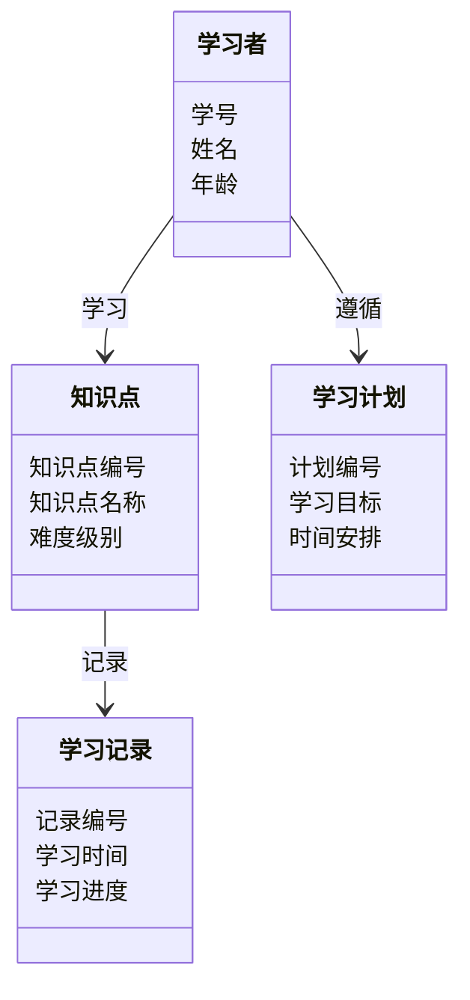

                 


---

# 设计AI Agent的自适应课程学习策略

> 关键词：AI Agent，自适应学习，课程设计，算法原理，系统架构，教育技术

> 摘要：本文系统地探讨了设计AI Agent的自适应课程学习策略的核心概念、算法原理、系统架构及实际应用。通过分析学习者的需求和行为，结合AI技术，提出了动态调整学习内容和进度的方法，并通过数学模型和实际案例展示了策略的实现过程。

---

# 第一部分: AI Agent与自适应课程学习策略概述

# 第1章: 自适应课程学习策略与AI Agent概述

## 1.1 自适应学习策略的背景与意义

### 1.1.1 传统学习策略的局限性

传统学习策略通常基于固定的课程安排和统一的教学方法，难以满足不同学习者个性化的需求。例如，一些学生可能在某些知识点上掌握得很快，而另一些学生则需要更多时间来消化。传统的教学模式无法根据个体差异进行实时调整，导致部分学生在学习过程中感到压力过大，而另一些学生则感到课程过于简单，无法充分激发其学习兴趣。

### 1.1.2 自适应学习策略的核心优势

自适应学习策略的核心优势在于其灵活性和个性化。它能够根据学习者的学习进度、知识掌握程度和个体差异，动态调整教学内容和学习节奏。例如，当学习者在某一知识点上表现不佳时，系统会自动提供更多的练习和辅导；当学习者表现出色时，系统则会推荐更具挑战性的内容，以进一步提升其能力。

### 1.1.3 AI Agent在教育领域的应用潜力

AI Agent在教育领域的应用潜力巨大。它可以通过分析学习者的行为数据、学习效果和反馈信息，实时调整教学策略。例如，AI Agent可以利用自然语言处理技术，与学习者进行对话，了解其学习偏好和难点，进而推荐适合的学习资源和方法。

---

## 1.2 AI Agent的基本概念与特点

### 1.2.1 AI Agent的定义与分类

AI Agent是指具有智能行为的计算机程序，能够感知环境并采取行动以实现目标。在教育领域，AI Agent可以分为以下几类：
1. **教学型AI Agent**：用于直接向学习者传授知识，例如智能辅导系统。
2. **辅助型AI Agent**：用于支持教师的教学活动，例如自动评分系统。
3. **管理型AI Agent**：用于管理学习过程和资源，例如自适应学习平台。

### 1.2.2 自适应学习策略的实现机制

自适应学习策略的实现机制主要包括以下几个步骤：
1. **数据采集**：收集学习者的行为数据、学习效果和反馈信息。
2. **数据分析**：利用机器学习算法分析数据，识别学习者的知识盲点和学习偏好。
3. **策略调整**：根据分析结果，动态调整教学内容和学习进度。
4. **反馈与优化**：根据学习者的表现，持续优化学习策略。

### 1.2.3 AI Agent与自适应学习的结合点

AI Agent与自适应学习的结合点主要体现在以下几个方面：
1. **个性化推荐**：基于学习者的行为数据，推荐适合的学习资源和内容。
2. **实时反馈**：通过自然语言处理和情感分析技术，实时了解学习者的学习状态和情绪变化。
3. **动态调整**：根据学习者的表现，动态调整教学策略，例如增加或减少练习题的数量。

---

## 1.3 本章小结

本章主要介绍了自适应学习策略的背景与意义，以及AI Agent的基本概念与特点。通过分析传统学习策略的局限性，我们认识到自适应学习策略在个性化教学中的重要性。同时，我们还探讨了AI Agent在教育领域的应用潜力，特别是在个性化推荐、实时反馈和动态调整方面的优势。

---

# 第二部分: 自适应课程学习策略的核心概念与原理

# 第2章: 自适应学习策略的核心概念

## 2.1 问题背景与目标

### 2.1.1 学习者个性化需求的分析

每个学习者都有其独特的学习风格和知识水平。例如，有些学习者可能更适合视觉学习，而另一些学习者则更适合听觉或动手学习。此外，不同学习者在不同阶段的知识掌握程度也有所不同，因此需要个性化的学习策略。

### 2.1.2 知识点的动态调整逻辑

自适应学习策略的核心在于动态调整教学内容。例如，当学习者在某一知识点上表现不佳时，系统会自动增加相关的练习题和辅导材料；而当学习者掌握某知识点后，系统则会推荐更高难度的内容。

### 2.1.3 策略的边界与外延

自适应学习策略的边界在于其适用范围和限制。例如，虽然自适应策略可以动态调整教学内容，但其效果可能受到学习者自律性和外部环境的影响。此外，自适应策略的外延还包括与其他教育技术的结合，例如虚拟现实和增强现实技术。

---

## 2.2 核心概念与联系

### 2.2.1 自适应学习策略的属性特征对比表

| 属性 | 特征 |
|------|------|
| 个性化 | 基于学习者的需求和能力 |
| 动态性 | 根据学习者的表现实时调整 |
| 数据驱动 | 依赖于学习者的行为数据和反馈 |

### 2.2.2 ER实体关系图架构

```mermaid
erDiagram
    actor 学习者 {
        string 学号
        string 姓名
        int 年龄
    }
    actor 教师 {
        string 教师编号
        string 姓名
        string 科目
    }
    entity 知识点 {
        string 知识点编号
        string 知识点名称
        int 难度级别
    }
    entity 学习计划 {
        string 计划编号
        string 学习目标
        int 时间安排
    }
    entity 学习记录 {
        string 记录编号
        date 学习时间
        float 学习进度
    }
    学习者 --> 知识点 : 学习
    学习者 --> 学习计划 : 遵循
    教师 --> 学习计划 : 制定
    学习记录 --> 知识点 : 记录
```

### 2.2.3 系统核心概念的Mermaid流程图



---

## 2.3 本章小结

本章详细探讨了自适应学习策略的核心概念，包括学习者个性化需求的分析、知识点的动态调整逻辑以及策略的边界与外延。通过属性特征对比表和ER实体关系图，我们进一步明确了自适应学习策略的核心要素及其相互关系。

---

# 第3章: 自适应学习策略的算法原理

## 3.1 算法原理概述

### 3.1.1 强化学习与推荐系统的基本原理

强化学习是一种通过试错机制来优化决策的算法。在自适应学习策略中，AI Agent可以通过强化学习算法，根据学习者的行为数据，调整推荐的学习内容。例如，当学习者完成某一知识点的练习后，系统会根据其正确率和用时，动态调整下一知识点的难度级别。

推荐系统的核心在于通过分析学习者的行为数据，预测其偏好，并推荐相关的内容。在自适应学习策略中，推荐系统可以基于学习者的知识掌握程度和学习进度，推荐适合的学习资源。

### 3.1.2 自适应学习的数学模型与公式

自适应学习的数学模型通常包括以下几个部分：
1. **学习者模型**：表示学习者当前的知识状态和学习偏好。
2. **知识点模型**：表示各个知识点的难度级别和相关性。
3. **推荐模型**：基于学习者模型和知识点模型，生成推荐的学习内容。

以下是自适应学习的数学模型示例：

$$
P(知识点_k \mid 学习者_i) = \frac{P(学习者_i \mid 知识点_k) \cdot P(知识点_k)}{P(学习者_i)}
$$

其中，$P(知识点_k \mid 学习者_i)$ 表示在学习者 $i$ 的情况下，推荐知识点 $k$ 的概率。

### 3.1.3 算法实现的步骤与流程

自适应学习策略的实现步骤如下：
1. **数据采集**：收集学习者的行为数据，包括练习题正确率、学习时间等。
2. **数据分析**：利用机器学习算法分析数据，构建学习者模型和知识点模型。
3. **策略调整**：根据分析结果，动态调整教学内容和学习进度。
4. **反馈与优化**：根据学习者的表现，持续优化学习策略。

---

## 3.2 算法实现的代码示例

### 3.2.1 环境安装与配置

要实现自适应学习策略，首先需要安装以下工具和库：
- Python 3.8+
- scikit-learn
- numpy
- pandas

### 3.2.2 核心算法代码实现

以下是一个基于协同过滤算法的推荐系统实现示例：

```python
import numpy as np
from sklearn.metrics.pairwise import cosine_similarity

# 示例数据：学习者与知识点的关联矩阵
X = np.array([[1, 0, 1],
              [0, 1, 1],
              [1, 1, 0]])

# 计算余弦相似度
similarity = cosine_similarity(X)

# 推荐知识点
def recommend(user_id, similarity_matrix):
    user_profile = X[user_id]
    similar_users = np.argsort(similarity[user_id])[::-1]
    recommended = np.zeros(len(similar_users))
    for i, user in enumerate(similar_users):
        if i == 0:
            continue
        recommended += X[user]
    recommended = recommended / (i+1)
    return recommended > 0.5

# 示例推荐
user_id = 0
recommendations = recommend(user_id, similarity)
print("推荐知识点为：", np.where(recommendations)[0])
```

### 3.2.3 代码解读与分析

上述代码实现了一个基于协同过滤算法的推荐系统。通过计算学习者与知识点的关联矩阵，我们可以找到与当前学习者相似的学习者，并基于他们的学习行为推荐知识点。这种方法适用于大规模数据，但在实际应用中可能需要优化算法效率和准确性。

---

## 3.3 本章小结

本章详细介绍了自适应学习策略的算法原理，包括强化学习与推荐系统的结合、数学模型的构建以及算法实现的步骤与流程。通过代码示例，我们进一步了解了如何利用机器学习算法实现自适应学习策略。

---

# 第四部分: 系统分析与架构设计方案

# 第4章: 系统分析与架构设计方案

## 4.1 项目背景与目标

### 4.1.1 项目需求分析

本项目旨在设计一个基于AI Agent的自适应课程学习系统，能够根据学习者的行为数据和知识掌握程度，动态调整教学内容和学习进度。

### 4.1.2 项目目标设定

项目目标包括：
1. 实现学习者行为数据的采集与分析。
2. 构建学习者模型和知识点模型。
3. 实现动态调整教学内容和学习进度的算法。

### 4.1.3 项目范围界定

项目范围包括：
1. 系统架构设计。
2. 算法实现与优化。
3. 系统测试与部署。

---

## 4.2 系统功能设计

### 4.2.1 领域模型的Mermaid类图



### 4.2.2 系统架构设计

系统的分层架构如下：


其中：
1. **数据采集层**：负责收集学习者的行为数据。
2. **数据处理层**：对数据进行清洗和预处理。
3. **策略层**：基于处理后的数据，制定学习策略。
4. **执行层**：根据策略，动态调整教学内容和学习进度。

---

## 4.3 本章小结

本章详细探讨了自适应课程学习系统的系统分析与架构设计方案，包括项目背景与目标、系统功能设计以及系统架构设计。通过Mermaid图，我们进一步明确了系统的核心要素及其相互关系。

---

# 第五部分: 项目实战

# 第5章: 项目实战

## 5.1 环境安装与配置

要实现自适应课程学习系统，首先需要安装以下工具和库：
- Python 3.8+
- scikit-learn
- numpy
- pandas

---

## 5.2 核心代码实现

### 5.2.1 数据采集与预处理

以下是数据采集与预处理的代码示例：

```python
import pandas as pd
import numpy as np

# 示例数据：学习者的行为数据
data = {
    '学习者ID': [1, 2, 3, 4],
    '知识点ID': [1, 2, 3, 1],
    '正确率': [0.8, 0.6, 0.9, 0.7]
}

df = pd.DataFrame(data)
print(df)
```

### 5.2.2 算法实现与优化

以下是基于协同过滤算法的推荐系统实现代码：

```python
from sklearn.metrics.pairwise import cosine_similarity

# 示例数据：学习者与知识点的关联矩阵
X = np.array([[1, 0, 1],
              [0, 1, 1],
              [1, 1, 0]])

# 计算余弦相似度
similarity = cosine_similarity(X)

# 推荐知识点
def recommend(user_id, similarity_matrix):
    user_profile = X[user_id]
    similar_users = np.argsort(similarity[user_id])[::-1]
    recommended = np.zeros(len(similar_users))
    for i, user in enumerate(similar_users):
        if i == 0:
            continue
        recommended += X[user]
    recommended = recommended / (i+1)
    return recommended > 0.5

# 示例推荐
user_id = 0
recommendations = recommend(user_id, similarity)
print("推荐知识点为：", np.where(recommendations)[0])
```

---

## 5.3 本章小结

本章通过实际案例分析，详细展示了如何实现自适应课程学习系统的核心功能。通过环境安装与配置、数据采集与预处理以及算法实现与优化，我们进一步了解了自适应学习策略的实现过程。

---

# 第六部分: 最佳实践与总结

# 第6章: 最佳实践与总结

## 6.1 小结

本章总结了设计AI Agent的自适应课程学习策略的核心内容，包括背景介绍、核心概念、算法原理以及系统架构设计方案。

## 6.2 注意事项

在实际应用中，需要注意以下几点：
1. **数据隐私**：确保学习者数据的安全性和隐私性。
2. **算法优化**：根据实际需求，不断优化算法的效率和准确性。
3. **用户体验**：注重用户体验，确保系统界面友好且易于操作。

## 6.3 拓展阅读

推荐以下拓展阅读材料：
1. 《自适应学习系统的设计与实现》
2. 《基于AI的教育技术研究》
3. 《强化学习在教育中的应用》

---

# 第七部分: 附录

## 附录A: 术语表

- **AI Agent**：人工智能代理，能够感知环境并采取行动以实现目标。
- **自适应学习策略**：根据学习者的行为数据和知识掌握程度，动态调整教学内容和学习进度的方法。
- **协同过滤算法**：基于用户行为数据的推荐算法，用于推荐学习资源。

---

## 附录B: 参考文献

1. Russell, S., & Norvig, P. (2010). Artificial Intelligence: A Modern Approach.
2. Bishop, C. M. (2006). Pattern Recognition and Machine Learning.
3. 刘洋, 等. (2020). 自适应学习系统的设计与实现.

---

通过以上目录结构和内容的详细阐述，我们希望能够为读者提供一个全面而深入的指南，帮助他们理解并掌握设计AI Agent的自适应课程学习策略的核心思想和实现方法。

