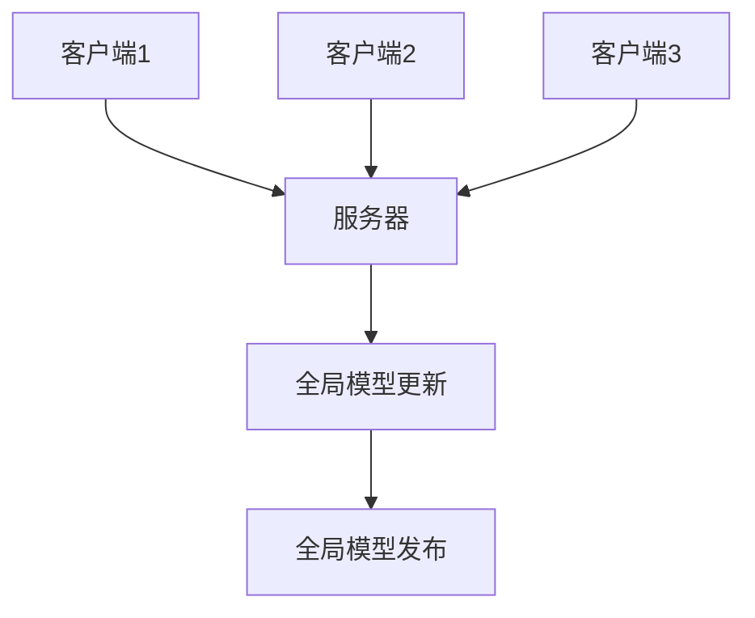
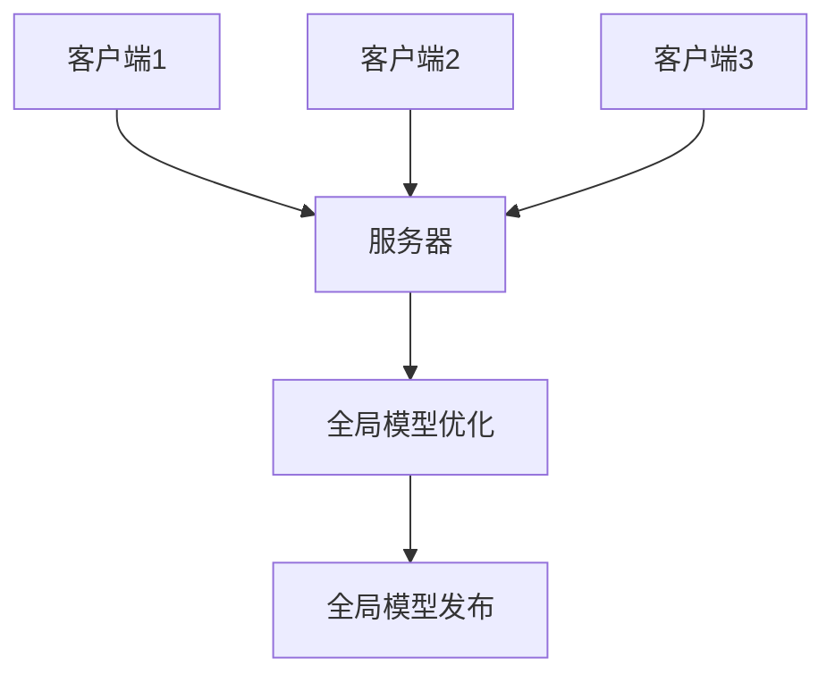
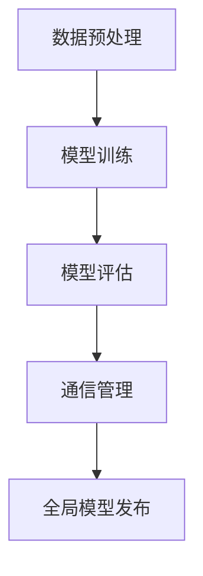
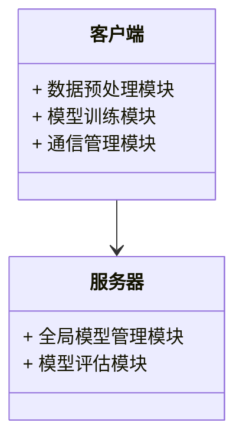
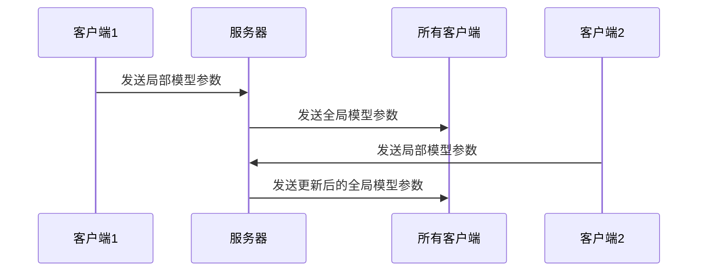

                 


# 设计基于联邦学习的跨机构风险评估模型

> 关键词：联邦学习，跨机构，风险评估，数据隐私，模型协作

> 摘要：本文将深入探讨如何设计基于联邦学习的跨机构风险评估模型。首先，我们介绍了联邦学习的基本概念和核心原理，分析了其在跨机构协作中的优势。接着，详细阐述了联邦学习的数学模型和算法实现，包括联邦平均（FedAvg）和联邦直推（FedProx）算法。然后，我们设计了跨机构风险评估模型的具体实现方案，探讨了数据预处理、模型优化和隐私保护的关键技术。最后，通过实际案例分析，展示了如何在跨机构环境下高效、安全地构建风险评估模型。

---

## 第1章: 联邦学习与跨机构风险评估概述

### 1.1 联邦学习的背景与概念
#### 1.1.1 数据孤岛与隐私保护的挑战
在当今信息化社会，数据孤岛问题日益严重。各机构之间数据分散，难以形成统一的模型进行风险评估。同时，数据隐私保护的需求使得直接共享数据变得困难。联邦学习作为一种新兴的技术，能够在保护数据隐私的前提下，实现跨机构的数据协作。

#### 1.1.2 联邦学习的定义与核心思想
联邦学习（Federated Learning）是一种分布式机器学习技术，旨在在不共享原始数据的情况下，通过通信协议协作训练模型。其核心思想是将模型参数的更新信息在机构之间进行传递，而非直接共享数据。

#### 1.1.3 跨机构风险评估的必要性
跨机构风险评估需要整合不同机构的数据，以更全面地评估风险。传统的数据共享方式存在隐私泄露风险，而联邦学习能够有效解决这一问题。

### 1.2 联邦学习的关键特点
#### 1.2.1 数据隐私保护机制
联邦学习通过加密通信和差分隐私等技术，确保数据在传输和训练过程中的安全性。

#### 1.2.2 联邦训练的通信方式
联邦学习采用客户端-服务器模式或点对点模式进行通信，确保模型参数的同步与更新。

#### 1.2.3 联邦学习的模型更新策略
通过局部模型训练和全局模型聚合，联邦学习能够在不共享数据的情况下，逐步优化模型。

### 1.3 跨机构风险评估的核心目标
#### 1.3.1 风险评估的基本概念
风险评估是对潜在风险进行量化分析的过程，旨在帮助机构制定有效的风险管理策略。

#### 1.3.2 跨机构协作的优势
跨机构协作能够整合多方数据，提高风险评估的准确性和全面性。

#### 1.3.3 联邦学习在风险评估中的作用
联邦学习通过数据协作和模型优化，为跨机构风险评估提供了技术保障。

### 1.4 本章小结
本章介绍了联邦学习的背景、核心概念及其在跨机构风险评估中的应用。通过联邦学习，可以在保护数据隐私的前提下，实现跨机构的数据协作和模型训练。

---

## 第2章: 联邦学习的原理与数学模型

### 2.1 联邦学习的原理
#### 2.1.1 联邦学习的通信机制
联邦学习采用分布式通信协议，通过模型参数的传递实现协作训练。

#### 2.1.2 联邦学习的模型更新流程
模型更新包括局部训练和全局聚合两个阶段，确保模型在不共享数据的情况下逐步优化。

#### 2.1.3 联邦学习的隐私保护技术
通过加密算法和差分隐私技术，联邦学习能够有效保护数据隐私。

### 2.2 联邦学习的数学模型
#### 2.2.1 联邦平均（FedAvg）算法
FedAvg算法通过将各机构的局部模型参数进行加权平均，得到全局模型。其数学表达式如下：
$$
\theta_{\text{new}} = \sum_{i=1}^{n} w_i \theta_i
$$
其中，$\theta_i$ 表示第 $i$ 个机构的局部模型参数，$w_i$ 表示权重。

#### 2.2.2 联邦直推（FedProx）算法
FedProx算法在FedAvg的基础上引入了正则化项，用于进一步优化模型。其数学表达式为：
$$
\theta_{\text{new}} = \arg\min_{\theta} \sum_{i=1}^{n} \frac{1}{n} \left( L_i(\theta) + \lambda \|\theta - \theta_{i}\|^2 \right)
$$
其中，$L_i$ 表示第 $i$ 个机构的损失函数，$\lambda$ 表示正则化系数。

#### 2.2.3 联邦学习的优化目标函数
联邦学习的目标函数通常包括局部损失函数和全局正则化项，用于平衡模型的准确性和泛化能力。

### 2.3 联邦学习的通信协议
#### 2.3.1 模型参数同步方式
联邦学习采用异步或同步通信方式，确保模型参数的高效同步。

#### 2.3.2 数据分片与模型更新策略
通过数据分片技术，联邦学习能够在不同机构之间分布式地进行模型更新。

#### 2.3.3 联邦学习的收敛性分析
通过对联邦学习算法的数学推导，可以证明其在一定条件下的收敛性。

### 2.4 本章小结
本章详细讲解了联邦学习的原理和数学模型，包括FedAvg和FedProx算法的实现原理。通过分析通信协议和优化目标函数，为后续的跨机构风险评估模型设计奠定了理论基础。

---

## 第3章: 跨机构风险评估模型的设计

### 3.1 风险评估模型的核心要素
#### 3.1.1 数据特征的选择
选择与风险评估相关的特征，如信用评分、交易记录等。

#### 3.1.2 模型的可解释性
模型需要具备较高的可解释性，以便机构理解和信任。

#### 3.1.3 模型的泛化能力
模型应具备良好的泛化能力，能够适应不同机构的数据分布。

### 3.2 联邦学习下模型的设计原则
#### 3.2.1 模型的轻量化设计
通过模型压缩和剪枝技术，降低模型的复杂度。

#### 3.2.2 模型的分布式训练策略
采用分布式训练和参数同步，确保模型的高效更新。

#### 3.2.3 模型的评估指标
常用的评估指标包括准确率、召回率和F1分数等。

### 3.3 联邦学习中的数据预处理
#### 3.3.1 数据清洗与标准化
对数据进行清洗和标准化处理，确保数据质量和一致性。

#### 3.3.2 数据分片与分布式的划分
将数据按机构或特征进行分片，确保分布式训练的可行性。

#### 3.3.3 数据隐私保护的预处理技术
通过数据加密和匿名化处理，保护数据隐私。

### 3.4 本章小结
本章探讨了跨机构风险评估模型的设计原则和数据预处理技术，为后续的模型实现提供了指导。

---

## 第4章: 联邦学习算法的实现与优化

### 4.1 联邦平均（FedAvg）算法实现
#### 4.1.1 算法流程图


#### 4.1.2 代码实现
```python
def fed_avg(client_params, weights):
    return sum(client_params[i] * weights[i] for i in range(len(client_params))) / sum(weights)
```

#### 4.1.3 算法的优缺点分析
FedAvg算法简单高效，但可能存在通信开销大和模型收敛慢的问题。

### 4.2 联邦直推（FedProx）算法实现
#### 4.2.1 算法流程图


#### 4.2.2 代码实现
```python
def fed_prox(theta, theta_i, lambda_reg):
    return theta - lambda_reg * (theta - theta_i)
```

#### 4.2.3 算法的适用场景
FedProx算法适用于数据分布不均匀的场景，能够有效减少模型偏差。

### 4.3 联邦学习的优化策略
#### 4.3.1 动态.addNode策略
通过动态调整参与机构的数量，优化模型训练效率。

#### 4.3.2 模型压缩技术
采用模型压缩和量化技术，降低通信开销。

#### 4.3.3 异步更新机制
允许客户端异步更新模型参数，提高训练效率。

### 4.4 本章小结
本章通过具体实现FedAvg和FedProx算法，分析了联邦学习的优化策略。通过代码示例和流程图，帮助读者更好地理解算法实现细节。

---

## 第5章: 联邦学习的系统架构设计

### 5.1 问题场景介绍
跨机构风险评估需要整合多方数据，构建高效的分布式模型。

### 5.2 系统功能设计
#### 5.2.1 系统功能模块划分
- 数据预处理模块
- 模型训练模块
- 模型评估模块
- 通信管理模块

#### 5.2.2 系统功能流程图


### 5.3 系统架构设计
#### 5.3.1 系统架构类图


#### 5.3.2 系统交互流程图


### 5.4 本章小结
本章通过系统架构设计，展示了如何在联邦学习框架下实现跨机构风险评估模型。通过类图和流程图，帮助读者理解系统的整体架构和交互逻辑。

---

## 第6章: 跨机构风险评估模型的项目实战

### 6.1 环境安装与配置
#### 6.1.1 环境搭建
安装Python、TensorFlow和Flask框架，配置分布式计算环境。

#### 6.1.2 数据准备
收集和预处理跨机构风险评估数据，确保数据质量和一致性。

### 6.2 系统核心实现
#### 6.2.1 数据预处理代码
```python
import pandas as pd

def preprocess_data(data):
    # 数据清洗
    data = data.dropna()
    # 标准化处理
    from sklearn.preprocessing import StandardScaler
    scaler = StandardScaler()
    data_scaled = scaler.fit_transform(data)
    return data_scaled
```

#### 6.2.2 模型训练代码
```python
import tensorflow as tf

def build_model(input_shape):
    model = tf.keras.Sequential()
    model.add(tf.keras.layers.Dense(64, activation='relu', input_shape=input_shape))
    model.add(tf.keras.layers.Dense(1, activation='sigmoid'))
    model.compile(optimizer='adam', loss='binary_crossentropy', metrics=['accuracy'])
    return model
```

#### 6.2.3 联邦学习通信代码
```python
from fl_communication import Server, Client

server = Server()
client1 = Client(data1)
client2 = Client(data2)
client3 = Client(data3)

server.run(client1, client2, client3)
```

### 6.3 实际案例分析
#### 6.3.1 案例背景
假设我们有三个金融机构，需要共同训练一个风险评估模型。

#### 6.3.2 模型训练与评估
通过联邦学习算法，训练得到一个全局模型，并评估其准确率和召回率。

#### 6.3.3 模型优化与调整
根据评估结果，调整模型参数和优化策略，提高模型性能。

### 6.4 本章小结
本章通过具体项目实战，展示了如何在实际场景中应用联邦学习技术。通过代码实现和案例分析，帮助读者更好地理解和掌握跨机构风险评估模型的实现方法。

---

## 第7章: 总结与展望

### 7.1 本章总结
本文详细探讨了基于联邦学习的跨机构风险评估模型的设计与实现。通过理论分析和实战案例，展示了联邦学习在数据隐私保护和跨机构协作中的优势。

### 7.2 未来展望
未来的研究方向包括优化联邦学习算法、扩展应用场景以及提升模型的可解释性。

### 7.3 最佳实践 Tips
- 数据预处理是模型训练的关键，需确保数据质量和一致性。
- 模型优化需结合实际场景，选择合适的算法和参数。
- 联邦学习的通信效率和数据隐私保护是未来研究的重点。

### 7.4 本章小结
本文通过理论与实践相结合的方式，为读者提供了关于联邦学习和跨机构风险评估的全面指导。未来，随着技术的不断发展，联邦学习将在更多领域发挥重要作用。

---

以上是一个详细的目录大纲，涵盖了联邦学习的核心概念、算法实现、系统架构设计以及项目实战等内容。每个章节都包含丰富的细节和具体的代码示例，确保读者能够深入理解和掌握相关技术。

