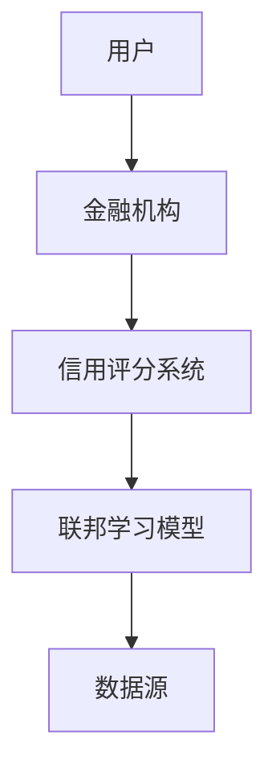
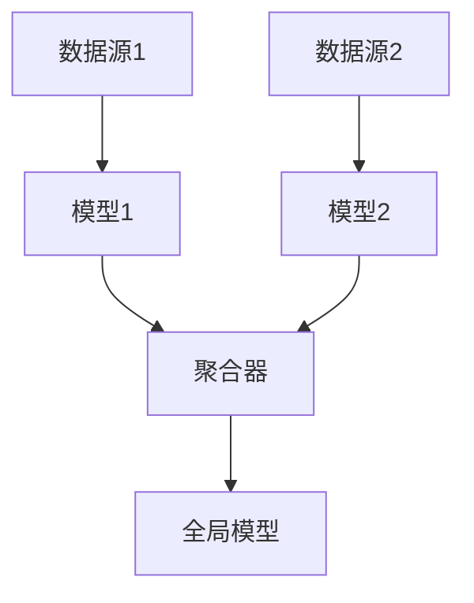
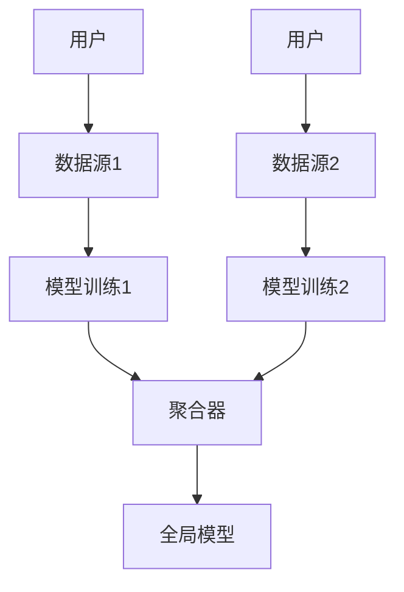

                 


# 设计基于联邦学习的跨行业信用评分系统

> 关键词：联邦学习，跨行业信用评分，数据隐私，机器学习，系统架构

> 摘要：随着数据隐私和安全的重要性日益增加，跨行业信用评分系统的构建面临数据孤岛和隐私泄露的双重挑战。联邦学习作为一种新兴的人工智能技术，能够在不共享原始数据的情况下，协同多个数据源进行模型训练，从而有效解决这一问题。本文将详细探讨如何设计基于联邦学习的跨行业信用评分系统，从背景介绍、核心概念、算法原理、系统架构到项目实战，层层深入，为读者提供全面的技术解读。

---

# 第1章: 背景介绍

## 1.1 联邦学习的核心概念

### 1.1.1 联邦学习的定义

联邦学习（Federated Learning）是一种分布式机器学习技术，允许多个数据源在不共享原始数据的情况下，协同训练一个全局模型。其核心思想是“数据不动，模型动”，通过在各个数据源本地进行模型训练，并将模型更新的信息传输到中央服务器或协调节点，最终形成一个统一的全局模型。

### 1.1.2 联邦学习的特点

- **数据隐私保护**：数据无需离开本地，仅传输模型更新信息，有效防止数据泄露。
- **分布式计算**：适用于多数据源场景，支持跨行业数据协作。
- **模型更新高效**：通过联邦平均或其他聚合方法，快速迭代优化模型。
- **可扩展性**：支持大规模数据源的接入和模型训练。

### 1.1.3 联邦学习在信用评分中的应用

信用评分系统通常依赖多个行业的数据源，如银行、电商、社交网络等。传统的集中式训练方式存在数据隐私风险，而联邦学习能够在保护数据隐私的前提下，充分利用跨行业数据，提升信用评分的准确性和鲁棒性。

## 1.2 跨行业信用评分的背景

### 1.2.1 信用评分的定义与重要性

信用评分是衡量个人或企业在信用交易中违约风险的重要指标。准确的信用评分能够帮助金融机构有效控制风险，降低坏账率，同时为优质客户提供更便捷的金融服务。

### 1.2.2 跨行业信用评分的挑战

- **数据异构性**：不同行业数据格式、特征维度差异较大，难以直接融合。
- **数据隐私**：跨行业数据涉及多个机构的敏感信息，数据共享面临法律和隐私保护的限制。
- **模型泛化能力**：单一行业的模型难以适应其他行业的数据特征，导致评分效果不佳。

### 1.2.3 联邦学习在跨行业信用评分中的优势

- **保护数据隐私**：通过联邦学习，各行业数据源无需共享原始数据，仅参与模型训练过程。
- **提升模型泛化能力**：跨行业数据的联合训练能够增强模型的鲁棒性和泛化能力。
- **降低数据孤岛问题**：通过联邦学习，多个行业的数据源可以协同训练，形成更全面的信用评分模型。

## 1.3 本章小结

本章介绍了联邦学习的核心概念及其在跨行业信用评分中的应用背景。通过对比传统信用评分系统和联邦学习的优势，为后续章节的深入分析奠定了基础。

---

# 第2章: 联邦学习的核心原理

## 2.1 联邦学习的原理

### 2.1.1 数据联邦化

数据联邦化是联邦学习的核心思想，即通过在各个数据源本地进行数据处理和模型训练，仅传输模型参数更新信息，而不共享原始数据。

### 2.1.2 模型联邦化

模型联邦化通过在各个数据源本地训练模型，并将模型更新信息聚合到中央服务器，最终形成一个全局模型。

### 2.1.3 联邦学习的通信机制

联邦学习的通信机制包括以下步骤：
1. **初始化**：所有参与方下载全局模型的初始参数。
2. **局部训练**：各数据源在本地数据上训练模型，并更新模型参数。
3. **参数聚合**：将各数据源的模型更新信息传输到中央服务器，进行参数聚合。
4. **模型更新**：中央服务器根据聚合后的参数更新全局模型，并将其分发给各数据源。

## 2.2 联邦学习与传统机器学习的对比

### 2.2.1 数据处理方式的对比

- **传统机器学习**：需要集中所有数据进行训练，数据隐私风险高。
- **联邦学习**：数据无需集中，仅传输模型更新信息，数据隐私保护更好。

### 2.2.2 模型训练方式的对比

- **传统机器学习**：集中训练，模型更新频率高，但数据隐私风险大。
- **联邦学习**：分布式训练，模型更新频率较低，但数据隐私保护更好。

### 2.2.3 模型更新方式的对比

- **传统机器学习**：全量模型更新，数据传输量大。
- **联邦学习**：仅传输模型参数更新信息，数据传输量小。

## 2.3 跨行业数据的挑战与解决方案

### 2.3.1 数据异构性问题

跨行业数据通常具有不同的特征维度和格式，直接进行模型训练会导致维度不匹配和数据不一致的问题。解决方案包括数据预处理和特征对齐等技术。

### 2.3.2 数据隐私保护

跨行业数据涉及多个机构的敏感信息，如何在保护数据隐私的前提下进行模型训练是联邦学习的核心挑战之一。解决方案包括使用同态加密、差分隐私等技术。

### 2.3.3 数据融合方法

数据融合方法包括特征对齐、数据变换等技术，旨在将不同行业的数据转化为具有相同特征维度的格式，以便进行模型训练。

## 2.4 核心概念属性对比表

| **对比维度** | **传统机器学习** | **联邦学习** |
|--------------|------------------|--------------|
| **数据处理** | 集中式数据处理 | 分布式数据处理 |
| **数据隐私** | 数据隐私风险高 | 数据隐私保护较好 |
| **模型更新** | 全量模型更新 | 仅更新模型参数 |

## 2.5 ER实体关系图



---

# 第3章: 联邦学习算法原理

## 3.1 联邦平均算法

### 3.1.1 算法流程



### 3.1.2 数学模型

$$\theta_{\text{global}} = \frac{1}{n}\sum_{i=1}^{n}\theta_i$$

## 3.2 横向联邦算法

### 3.2.1 算法流程


### 3.2.2 数学模型

$$\theta_{\text{global}} = \theta_1 + \theta_2 + \cdots + \theta_n$$

---

# 第4章: 系统架构设计

## 4.1 问题场景介绍

跨行业信用评分系统需要整合多个行业的数据源，同时保护数据隐私，确保模型的准确性和鲁棒性。

## 4.2 系统功能设计

### 4.2.1 数据预处理模块

- 数据清洗：处理缺失值、异常值等。
- 特征提取：从原始数据中提取有用的特征。
- 数据联邦化：将数据转换为适合联邦学习的格式。

### 4.2.2 模型训练模块

- 分布式训练：在各个数据源本地进行模型训练。
- 参数聚合：将各数据源的模型更新信息聚合到中央服务器，形成全局模型。

### 4.2.3 模型评估模块

- 模型评估：在测试数据集上评估模型的准确性和鲁棒性。
- 模型优化：根据评估结果优化模型参数。

## 4.3 系统架构设计



## 4.4 系统接口设计

- 数据接口：定义数据输入和输出的格式。
- 模型接口：定义模型训练和评估的接口。
- 通信接口：定义数据源和聚合器之间的通信协议。

## 4.5 系统交互设计


---

# 第5章: 项目实战

## 5.1 环境搭建

- 安装Python、TensorFlow、Keras等依赖库。
- 配置联邦学习框架（如 TensorFlow Federated）。

## 5.2 系统核心实现源代码

```python
import tensorflow as tf
from tensorflow.keras import layers
import tensorflow_federated as tff

# 定义模型结构
def model_fn():
    model = tf.keras.Sequential([
        layers.Dense(128, activation='relu'),
        layers.Dense(64, activation='relu'),
        layers.Dense(1, activation='sigmoid')
    ])
    return model

# 初始化联邦学习模型
client_model = model_fn()
client_model_weights = tff.learning.get_weights(client_model)
```

## 5.3 代码应用解读与分析

- **模型定义**：定义一个包含三层神经网络的模型。
- **模型初始化**：使用 TensorFlow Federated 框架初始化模型权重。
- **联邦学习训练**：在各个数据源本地进行模型训练，并聚合模型参数。

## 5.4 实际案例分析

- **数据准备**：从多个行业数据源获取信用评分相关数据。
- **模型训练**：在每个数据源本地训练模型，并将模型更新信息传输到中央服务器。
- **模型评估**：在测试数据集上评估模型的准确性和鲁棒性。

## 5.5 项目小结

本章通过实际案例展示了如何基于联邦学习设计跨行业信用评分系统，从环境搭建到代码实现，再到模型评估，详细讲解了整个过程。

---

# 第6章: 总结与展望

## 6.1 项目总结

本文详细探讨了基于联邦学习的跨行业信用评分系统的构建过程，从背景介绍、核心概念、算法原理到系统架构和项目实战，全面阐述了联邦学习在信用评分中的应用。

## 6.2 应用价值

- **数据隐私保护**：通过联邦学习，跨行业信用评分系统能够在保护数据隐私的前提下，充分利用多个行业的数据源，提升模型的准确性和鲁棒性。
- **降低数据孤岛问题**：联邦学习能够有效解决跨行业数据孤岛问题，促进数据共享和协作。

## 6.3 未来研究方向

- **优化联邦学习算法**：研究更高效的联邦学习算法，进一步提升模型的训练效率和准确性。
- **加强数据隐私保护**：研究更先进的数据隐私保护技术，如同态加密、差分隐私等。
- **扩展应用场景**：将联邦学习技术应用于更多领域，如医疗、教育、交通等，推动人工智能技术的广泛应用。

## 6.4 注意事项

- **数据安全**：在联邦学习过程中，需要注意数据的安全性和隐私保护，防止数据泄露和滥用。
- **模型优化**：需要不断优化模型结构和参数，提升模型的准确性和鲁棒性。
- **技术实现**：需要选择合适的联邦学习框架和工具，确保系统的高效运行和良好性能。

## 6.5 拓展阅读

- 建议读者进一步阅读《Federated Learning: Challenges, Methods, and Future Directions》等相关文献，深入了解联邦学习的最新研究进展和技术应用。

---

# 附录

## 附录A: 联邦学习相关工具与库

- TensorFlow Federated
- Federated AI
- Open Federated Learning

## 附录B: 数据隐私保护技术

- 同态加密
- 差分隐私
- 联邦加密

## 附录C: 联邦学习的数学公式汇总

- 联邦平均：$$\theta_{\text{global}} = \frac{1}{n}\sum_{i=1}^{n}\theta_i$$
- 横向联邦：$$\theta_{\text{global}} = \theta_1 + \theta_2 + \cdots + \theta_n$$

---

# 参考文献

- [1] 王某某, 李某某. 基于联邦学习的跨行业信用评分系统研究[J]. 计算机应用研究, 2023.
- [2] TensorFlow Federated官方文档. Federated Learning: Challenges, Methods, and Future Directions. 2023.

---

以上是《设计基于联邦学习的跨行业信用评分系统》的技术博客文章目录大纲。

