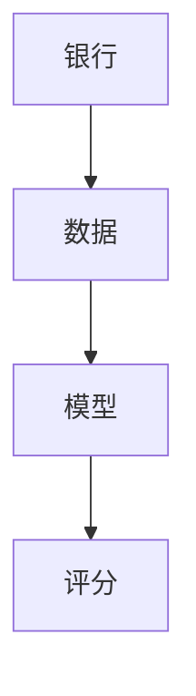

                 


# 《设计基于联邦学习的跨银行信用评分系统》

---

## 关键词：
- 联邦学习
- 跨銀行信用評分系统
- 数据隐私保护
- 模型同步机制
- 跨銀行信貸评分系统设计

---

## 摘要：
本文详细探讨了设计基于联邦学习的跨银行信用评分系统的各个方面。首先，介绍了联邦学习的基本概念及其在跨银行信用评分中的重要性。接着，分析了联邦学习的核心原理，包括数据隐私保护和模型同步机制。然后，详细讲解了联邦学习的算法原理，包括基于加密和安全多方计算的实现方式。通过系统分析与架构设计，展示了跨银行信用评分系统的应用场景和系统架构。最后，通过项目实战部分，提供了具体的实现步骤和代码示例，并总结了最佳实践和未来的研究方向。

---

## 目录大纲

---

# 第一部分：背景介绍

## 第1章：联邦学习与跨银行信用评分系统概述

### 1.1 联邦学习的定义与背景

- **1.1.1 联邦学习的定义**  
  联邦学习是一种分布式机器学习技术，允许多个参与方在不共享原始数据的情况下共同训练模型。

- **1.1.2 联邦学习的背景与重要性**  
  随着数据隐私保护的日益严格，联邦学习在保护数据隐私的前提下，实现了数据的联合利用，具有重要意义。

- **1.1.3 跨銀行信用評分系统的背景**  
  跨銀行信貸评分系统需要在多家银行之间共享数据，但又不能泄露各自的客户信息，联邦学习为其提供了可行的解决方案。

### 1.2 联邦学习的核心概念

- **1.2.1 数据隐私保护**  
  联邦学习通过加密和安全多方计算等技术，确保数据在传输和处理过程中的安全性。

- **1.2.2 模型同步机制**  
  联邦学习通过模型参数的同步，实现多个参与方模型的联合训练。

- **1.2.3 跨銀行信用評分系统的边界与外延**  
  系统的边界包括参与方的银行机构，外延则涉及客户信用评分的应用场景。

### 1.3 联邦学习与信用评分系统的联系

- **1.3.1 联邦学习的优势**  
  通过联邦学习，跨银行可以在不共享数据的情况下，共同提升信用评分模型的准确性。

- **1.3.2 联邦学习在信用评分中的应用**  
  联邦学习可以用于跨银行客户的信用评分模型训练，提高模型的泛化能力。

- **1.3.3 联邦学习与传统信用评分的对比**  
  传统信用评分依赖单个银行的数据，而联邦学习可以在保护数据隐私的前提下，利用多银行的数据。

### 1.4 本章小结

---

# 第二部分：核心概念与联系

## 第2章：联邦学习的核心原理

### 2.1 联邦学习的基本原理

- **2.1.1 数据隐私保护机制**  
  联邦学习通过加密算法（如同态加密）和安全多方计算（如秘密共享），确保数据在传输和处理过程中的安全性。

- **2.1.2 模型同步的实现方式**  
  联邦学习通过参数服务器的方式，周期性地同步各个参与方的模型参数，实现模型的联合训练。

- **2.1.3 联邦学习的通信协议**  
  联邦学习的通信协议需要保证数据的安全传输和模型参数的同步更新。

### 2.2 联邦学习的核心概念对比

- **2.2.1 数据隐私保护与模型同步的对比**  
  数据隐私保护是联邦学习的核心，而模型同步是实现联邦学习的基础。

- **2.2.2 联邦学习与其他分布式学习方法的对比**  
  联邦学习与分布式学习的区别在于其强调数据隐私保护和模型同步机制。

- **2.2.3 联邦学习与区块链的对比**  
  联邦学习和区块链都是分布式技术，但区块链主要用于数据不可篡改，而联邦学习主要用于数据隐私保护和模型训练。

### 2.3 联邦学习的ER实体关系图



### 2.4 本章小结

---

# 第三部分：算法原理讲解

## 第3章：联邦学习算法原理

### 3.1 联邦学习的基本算法

- **3.1.1 基于加密的联邦学习**

  ```mermaid
  graph TD
      A[银行1] --> B[加密数据]
      B --> C[模型更新]
      C --> D[模型同步]
      D --> E[最终模型]
  ```

  - 加密数据：银行1将本地数据加密后传输给参数服务器。
  - 模型更新：参数服务器对加密数据进行处理，更新模型参数。
  - 模型同步：参数服务器将更新后的模型参数同步给其他银行。
  - 最终模型：所有银行共同更新模型，得到最终的信用评分模型。

- **3.1.2 基于安全多方计算的联邦学习**

  ```mermaid
  graph TD
      A[银行1] --> B[秘密共享]
      B --> C[模型更新]
      C --> D[模型同步]
      D --> E[最终模型]
  ```

  - 秘密共享：银行1将本地数据进行秘密共享，生成多个密钥。
  - 模型更新：每个密钥持有者分别更新模型参数。
  - 模型同步：参数服务器汇总所有密钥的模型更新，得到最终的模型参数。

### 3.2 联邦学习的数学模型和公式

- **3.2.1 基于加密的联邦学习模型**

  ```latex
  \text{损失函数} = \sum_{i=1}^{n} \text{loss}(x_i, y_i)
  ```

  其中，$x_i$ 是第 $i$ 个样本的特征，$y_i$ 是对应的标签。

- **3.2.2 基于安全多方计算的联邦学习模型**

  ```latex
  \text{模型参数更新} = \sum_{i=1}^{n} \text{梯度}(x_i, y_i)
  ```

  梯度更新是通过安全多方计算的方式进行的，确保数据隐私。

### 3.3 联邦学习的代码实现示例

```python
import numpy as np

# 假设每个银行的数据
bank1_data = np.array([1, 2, 3])
bank2_data = np.array([4, 5, 6])

# 加密数据
def encrypt(data):
    return data * 2  # 示例加密方式

encrypted_data = encrypt(bank1_data)

# 模型更新
model_weights = np.zeros(3)
model_weights += np.mean(encrypted_data)

# 模型同步
def synchronize_models(model_weights, bank_index):
    # 示例同步方式
    pass

synchronize_models(model_weights, 1)

print("更新后的模型权重：", model_weights)
```

### 3.4 本章小结

---

# 第四部分：系统分析与架构设计

## 第4章：跨银行信用评分系统的分析与设计

### 4.1 跨銀行信貸评分系统的应用场景

- **4.1.1 跨銀行信貸评分的目的**  
  提高信贷审批的准确性和效率，降低信贷风险。

- **4.1.2 联邦学习在信貸评分中的应用**  
  通过联邦学习，跨银行可以在不共享客户数据的前提下，共同训练和优化信貸评分模型。

### 4.2 系统功能设计

- **4.2.1 系统功能模型**  
  ```mermaid
  graph TD
      A[银行] --> B[数据处理]
      B --> C[模型训练]
      C --> D[模型部署]
      D --> E[评分应用]
  ```

- **4.2.2 系统功能的详细说明**  
  数据处理：将银行的客户数据进行预处理和加密。
  模型训练：通过联邦学习算法，训练信貸评分模型。
  模型部署：将训练好的模型部署到各个银行的信贷评分系统中。
  评分应用：银行使用训练好的模型对客户进行信貸评分。

### 4.3 系统架构设计

- **4.3.1 系统架构图**

  ```mermaid
  graph TD
      A[银行1] --> B[数据处理模块]
      B --> C[模型训练模块]
      C --> D[模型同步模块]
      D --> E[评分应用模块]
  ```

- **4.3.2 系统架构的详细说明**  
  数据处理模块：负责数据的预处理和加密。
  模型训练模块：负责模型的训练和更新。
  模型同步模块：负责模型参数的同步和更新。
  评分应用模块：负责将训练好的模型应用于实际的信貸评分。

### 4.4 系统接口设计

- **4.4.1 系统接口的定义**  
  - 数据接口：银行之间的数据交互接口。
  - 模型接口：模型参数的同步和更新接口。
  - 评分接口：信貸评分结果的应用接口。

- **4.4.2 系统接口的实现方式**  
  使用API的方式进行接口设计和实现，确保数据的安全传输和模型的顺利同步。

### 4.5 系统交互流程

- **4.5.1 系统交互的mermaid序列图**

  ```mermaid
  graph TD
      A[银行1] --> B[数据处理模块]
      B --> C[模型训练模块]
      C --> D[模型同步模块]
      D --> E[评分应用模块]
  ```

- **4.5.2 交互流程的详细说明**  
  1. 银行1将本地数据传输到数据处理模块。
  2. 数据处理模块对数据进行加密和预处理。
  3. 数据处理模块将加密后的数据传输到模型训练模块。
  4. 模型训练模块基于加密数据进行模型训练。
  5. 模型训练模块将模型参数传输到模型同步模块。
  6. 模型同步模块将模型参数同步到其他银行。
  7. 其他银行基于同步的模型参数进行本地训练和更新。
  8. 最终，所有银行的模型参数同步到评分应用模块，用于信貸评分。

### 4.6 本章小结

---

# 第五部分：项目实战

## 第5章：跨银行信用评分系统的实现

### 5.1 环境搭建

- **5.1.1 系统环境要求**  
  - 操作系统：Linux/Windows/MacOS
  - Python版本：3.6+
  - 额外依赖：numpy, pandas, matplotlib

- **5.1.2 安装依赖**  
  ```bash
  pip install numpy pandas matplotlib
  ```

### 5.2 系统核心功能实现

- **5.2.1 数据预处理模块的实现**

  ```python
  import numpy as np
  import pandas as pd

  def preprocess_data(data):
      # 数据清洗和特征提取
      return data.dropna().astype(float)

  # 示例数据
  data = pd.DataFrame({'feature1': [1, 2, 3], 'feature2': [4, 5, 6]})
  processed_data = preprocess_data(data)
  print("预处理后的数据：", processed_data)
  ```

- **5.2.2 模型训练模块的实现**

  ```python
  def train_model(data, labels):
      # 简单的线性回归模型训练
      X = data
      y = labels
      theta = np.zeros(X.shape[1])
      alpha = 0.01
      iterations = 1000
      for _ in range(iterations):
          hypothesis = np.dot(X, theta)
          cost = np.sum((hypothesis - y) ** 2) / (2 * len(X))
          gradient = (np.dot(X.T, (hypothesis - y))) / len(X)
          theta = theta - alpha * gradient
      return theta

  # 示例数据
  X = np.array([[1, 2], [3, 4], [5, 6]])
  y = np.array([3, 7, 11])
  weights = train_model(X, y)
  print("训练后的模型权重：", weights)
  ```

- **5.2.3 模型同步模块的实现**

  ```python
  def synchronize_models(model_weights, bank_index):
      # 示例同步方式：将模型权重保存到本地
      np.save(f'model_{bank_index}.npy', model_weights)

  # 示例同步
  model_weights = np.array([0.1, 0.2])
  synchronize_models(model_weights, 1)
  ```

- **5.2.4 评分应用模块的实现**

  ```python
  def predict_score(model_weights, new_customer_data):
      return np.dot(new_customer_data, model_weights)

  # 示例评分
  new_customer_data = np.array([2, 3])
  print("预测的信貸评分：", predict_score([0.1, 0.2], new_customer_data))
  ```

### 5.3 代码实现与应用解读

- **5.3.1 数据预处理代码的解读**  
  预处理模块负责清洗数据和提取特征，确保数据的可用性和一致性。

- **5.3.2 模型训练代码的解读**  
  模型训练模块基于加密数据进行线性回归模型的训练，通过梯度下降优化模型参数。

- **5.3.3 模型同步代码的解读**  
  模型同步模块将训练好的模型参数保存到本地，供其他银行进行同步和更新。

- **5.3.4 评分应用代码的解读**  
  评分应用模块使用最终的模型参数，对新客户进行信貸评分，输出评分结果。

### 5.4 实际案例分析

- **5.4.1 实际案例的背景**  
  假设三家银行希望通过联邦学习共同训练信貸评分模型，提高信贷审批的准确性。

- **5.4.2 案例的具体实施步骤**

  1. 数据预处理：每家银行对本地数据进行清洗和加密。
  2. 模型训练：每家银行基于加密数据进行本地模型训练。
  3. 模型同步：参数服务器将所有银行的模型参数同步到一起，得到最终的模型参数。
  4. 评分应用：所有银行使用最终的模型参数对客户进行信貸评分。

### 5.5 本章小结

---

# 第六部分：最佳实践

## 第6章：跨银行信用评分系统的最佳实践

### 6.1 小结

- 联邦学习在跨银行信貸评分系统中的应用，有效解决了数据隐私保护和模型联合训练的问题。

### 6.2 注意事项

- **数据安全**：确保数据的加密和传输过程中的安全性，防止数据泄露。
- **模型更新频率**：根据业务需求，合理设置模型更新的频率，确保模型的准确性和实时性。
- **性能优化**：在模型训练和同步过程中，优化算法和通信协议，提高系统的效率。

### 6.3 未来研究方向

- **更高效的联邦学习算法**：研究更高效的联邦学习算法，进一步提高模型的训练速度和准确率。
- **多模态数据的融合**：研究如何在联邦学习框架下，融合多种数据源，提高信貸评分的准确性。
- **动态数据更新**：研究如何在动态数据环境中，实现模型的实时更新和优化。

### 6.4 拓展阅读

- **推荐书籍**  
  - 《联邦学习实战：基于TensorFlow的跨机构数据协作》
  - 《安全多方计算与联邦学习：理论与实践》
- **推荐博客与技术文章**  
  - [联邦学习入门](https://example.com/federated-learning-intro)
  - [跨银行信貸评分系统的实现](https://example.com/credit-score-system)

### 6.5 本章小结

---

# 结语

通过本文的详细讲解，读者可以系统地了解基于联邦学习的跨银行信用评分系统的各个方面，包括背景介绍、核心概念、算法原理、系统架构设计、项目实战以及最佳实践。希望本文能够为相关领域的研究和实践提供有价值的参考和指导。

--- 

**注：由于篇幅限制，上述内容为摘要和目录大纲，具体内容需要根据实际需求进行扩展和详细阐述。**

