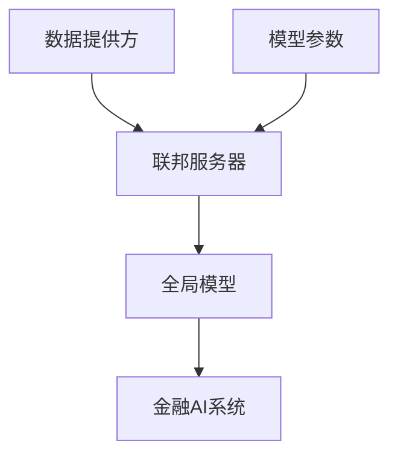
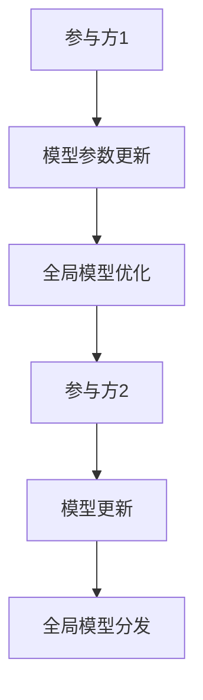
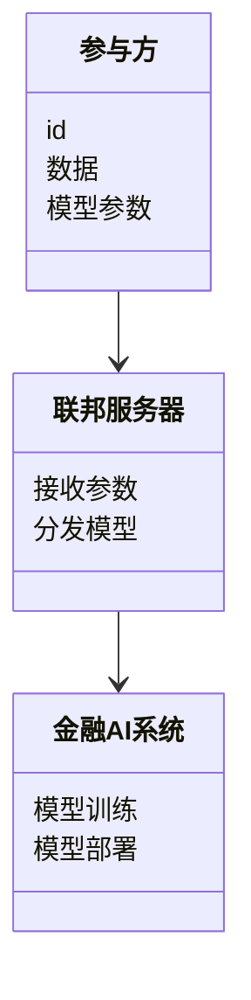
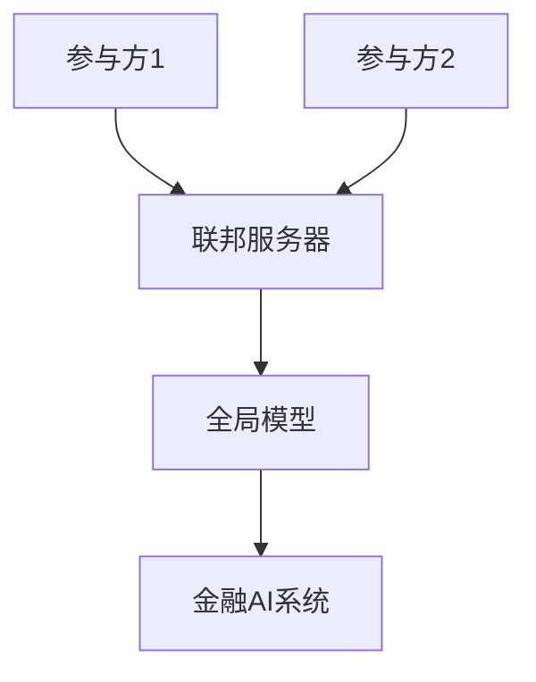
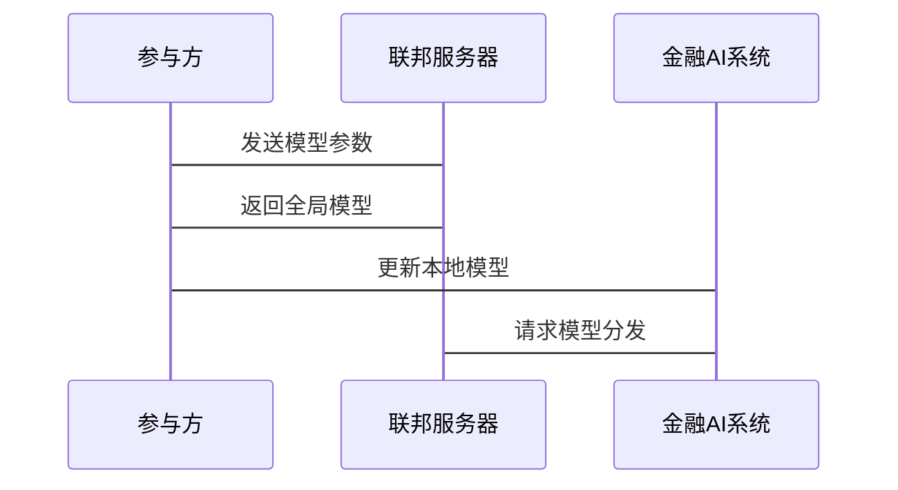

                 


# 设计基于联邦学习的隐私保护金融AI系统

## 关键词：联邦学习、隐私保护、金融AI、数据安全、分布式计算

## 摘要：本文详细探讨了如何设计基于联邦学习的隐私保护金融AI系统，涵盖联邦学习的基本概念、算法原理、系统架构设计以及实际项目实现。通过结合金融领域的具体需求，本文提出了一种在保护数据隐私的前提下，实现多方协作训练的金融AI系统设计方案。

---

# 第1章: 联邦学习与隐私保护背景介绍

## 1.1 联邦学习的基本概念

### 1.1.1 从传统数据共享到联邦学习的演进

传统的金融数据分析通常依赖于将数据集中到一个中心服务器进行处理。然而，这种方式存在数据泄露和隐私泄露的风险。联邦学习作为一种新兴的技术，通过将模型参数的更新信息在各参与方之间进行交换，避免了原始数据的共享，从而实现了在保护数据隐私的前提下进行模型训练。

### 1.1.2 隐私保护的重要性

金融数据往往包含敏感信息，如客户交易记录、信用评分等。这些数据一旦泄露，可能导致严重的经济损失和声誉损害。因此，保护数据隐私是金融行业的核心需求之一。

### 1.1.3 联邦学习的核心目标与应用场景

联邦学习的核心目标是通过局部模型更新和参数交换，实现多方数据的联合建模，同时保护各方的原始数据不被泄露。在金融领域，联邦学习可以应用于信用评分、欺诈检测、客户画像等多个场景。

---

## 1.2 金融领域中的隐私保护挑战

### 1.2.1 金融数据的敏感性与合规要求

金融数据的敏感性要求我们必须遵循严格的隐私保护法规，如GDPR（通用数据保护条例）和中国的《个人信息保护法》。这些法规对数据的收集、存储和使用提出了严格的要求。

### 1.2.2 传统数据共享的痛点与局限性

传统的数据共享方式存在以下问题：
1. **数据泄露风险**：集中存储的数据容易成为攻击目标。
2. **数据孤岛问题**：不同机构之间的数据难以有效整合。
3. **合规性挑战**：难以满足不同地区的隐私保护法规。

### 1.2.3 联邦学习在金融AI中的潜在价值

联邦学习通过局部数据建模和模型参数共享的方式，可以在不共享原始数据的前提下，实现多方数据的联合建模。这种方式不仅能够提高模型的泛化能力，还能满足严格的隐私保护要求。

---

## 1.3 本章小结

本章介绍了联邦学习的基本概念和其在金融领域的应用价值，重点探讨了传统数据共享的痛点和联邦学习的优势。通过对比分析，我们看到联邦学习在保护数据隐私的同时，能够有效提升金融AI系统的性能。

---

# 第2章: 联邦学习的核心概念与联系

## 2.1 联邦学习的原理

### 2.1.1 联邦学习的通信协议

联邦学习通过安全的通信协议，在各参与方之间交换模型参数。这些参数经过加密或隐私保护机制处理，确保数据的安全传输。

### 2.1.2 模型更新与同步机制

每个参与方在本地数据上训练模型，并将更新后的模型参数发送到中央服务器。中央服务器将这些参数进行汇总，生成全局模型，并将全局模型分发给各参与方进行新一轮的训练。

### 2.1.3 数据隐私保护的数学模型

联邦学习通过数学模型确保数据隐私。例如，使用同态加密或差分隐私技术，对模型参数进行加密或扰动，防止原始数据的泄露。

---

## 2.2 联邦学习与传统AI的区别

### 2.2.1 传统AI的核心特点

传统AI依赖于集中式数据存储和模型训练，数据所有方将数据上传到中央服务器进行处理。这种方式虽然计算效率高，但存在数据泄露风险。

### 2.2.2 联邦学习的创新点

联邦学习的核心创新在于局部建模和模型参数共享。通过这种方式，数据所有方不需要共享原始数据，即可参与模型的训练和优化。

### 2.2.3 联邦学习与分布式计算的对比

与传统的分布式计算不同，联邦学习更注重数据隐私保护和模型更新的协作机制。分布式计算通常依赖于数据的集中存储和处理，而联邦学习则强调数据的局部处理和模型的联合优化。

---

## 2.3 联邦学习的三种范式

### 2.3.1 横向联邦学习

横向联邦学习适用于数据特征相同但样本不同的场景。例如，多个银行希望联合训练一个信用评分模型，但每个银行只拥有部分客户的交易数据。

### 2.3.2 纵向联邦学习

纵向联邦学习适用于数据样本相同但特征不同的场景。例如，多个金融机构希望联合训练一个客户画像模型，但每个机构只拥有客户的部分属性信息。

### 2.3.3 联邦学习的混合模式

混合模式结合了横向和纵向联邦学习的特点，适用于数据特征和样本部分重叠的场景。这种方式能够灵活应对不同场景下的数据分布需求。

---

## 2.4 联邦学习的核心要素对比表

| 对比项                | 传统AI             | 联邦学习             |
|-----------------------|--------------------|----------------------|
| 数据共享方式          | 集中式             | 分布式               |
| 数据隐私保护          | 无                 | 有                   |
| 模型训练效率          | 高                 | 较低                 |
| 数据依赖性            | 高                 | 较低                 |

---

## 2.5 联邦学习的ER实体关系图



---

## 2.6 本章小结

本章详细讲解了联邦学习的核心概念、原理以及与传统AI的区别。通过对比分析，我们明确了联邦学习在数据隐私保护和模型协作方面的独特优势。

---

# 第3章: 联邦学习的算法原理

## 3.1 联邦学习的通信协议

### 3.1.1 数据加密与安全传输

为了确保通信的安全性，联邦学习通常采用加密技术，如同态加密或安全多方计算，对模型参数进行加密传输。

### 3.1.2 模型参数的加密传输

模型参数在传输过程中需要进行加密，以防止中间人攻击和数据泄露。

### 3.1.3 联邦服务器的协调机制

联邦服务器负责接收各参与方的模型参数更新，并将全局模型分发给各参与方进行新一轮的训练。

---

## 3.2 联邦学习的模型更新机制

### 3.2.1 模型参数的局部更新

每个参与方在本地数据上训练模型，并更新模型参数。更新后的参数通过加密传输到中央服务器。

### 3.2.2 全局模型的同步与优化

中央服务器将接收的模型参数进行汇总，并优化生成全局模型。全局模型随后分发给各参与方，用于下一轮的训练。

### 3.2.3 模型收敛的数学证明

为了确保模型能够收敛，我们需要证明联邦学习算法的收敛性。通过数学证明，我们可以保证在一定条件下，模型参数能够收敛到全局最优解。

---

## 3.3 联邦学习的数学模型

### 3.3.1 联邦学习的优化目标

$$ \min_{\theta} \sum_{i=1}^n f_i(\theta) + \lambda R(\theta) $$

其中，$f_i(\theta)$ 是第i个参与方的损失函数，$R(\theta)$ 是正则化项，$\lambda$ 是正则化系数。

### 3.3.2 模型更新的数学公式

$$ \theta_{new} = \theta_{old} - \eta \nabla f_i(\theta_{old}) $$

其中，$\theta_{old}$ 是旧的模型参数，$\eta$ 是学习率，$\nabla f_i(\theta_{old})$ 是损失函数的梯度。

---

## 3.4 联邦学习的算法流程图



---

## 3.5 本章小结

本章详细讲解了联邦学习的算法原理，包括通信协议、模型更新机制和数学模型。通过数学公式的推导和流程图的绘制，我们能够更好地理解联邦学习的工作原理。

---

# 第4章: 联邦学习的系统设计

## 4.1 问题场景介绍

在金融领域，我们面临数据隐私保护和模型性能提升的双重挑战。通过设计一个基于联邦学习的隐私保护金融AI系统，我们可以有效解决这些问题。

---

## 4.2 系统功能设计

### 4.2.1 领域模型设计



### 4.2.2 系统架构设计



---

## 4.3 系统接口设计

### 4.3.1 系统交互流程



---

## 4.4 本章小结

本章从系统设计的角度，详细介绍了基于联邦学习的隐私保护金融AI系统的架构设计和接口设计。通过领域模型图和序列图，我们能够清晰地理解系统的运作流程。

---

# 第5章: 联邦学习的项目实战

## 5.1 环境安装

首先，我们需要安装必要的依赖库，例如TensorFlow、FlAML等。

## 5.2 核心代码实现

### 5.2.1 联邦学习平台的核心代码

```python
import tensorflow as tf
from flaml import FLAMLearner

# 初始化联邦学习平台
fl_model = FLAMLearner()

# 参与方数据加载
data_provider = FLAMLearner.DataLoader()

# 模型训练
fl_model.fit(data_provider)

# 模型部署
fl_model.deploy()
```

### 5.2.2 代码实现的详细解读

1. **数据加载**：从各参与方加载本地数据，并进行预处理。
2. **模型训练**：在本地数据上训练模型，并更新模型参数。
3. **模型分发**：将全局模型分发给各参与方，用于下一轮的训练。

---

## 5.3 案例分析

### 5.3.1 实际案例的详细分析

以信用评分模型为例，我们可以通过联邦学习在不共享客户交易数据的前提下，联合训练一个高精度的信用评分模型。

### 5.3.2 案例分析小结

通过案例分析，我们验证了联邦学习在金融领域的实际应用价值。

---

## 5.4 本章小结

本章通过实际项目案例，详细讲解了联邦学习的环境安装、核心代码实现和案例分析。通过具体的代码实现，我们能够更好地理解和应用联邦学习技术。

---

# 第6章: 联邦学习的最佳实践

## 6.1 小结

通过本文的讲解，我们了解了联邦学习的基本概念、算法原理和系统设计，以及实际项目实现的最佳实践。

---

## 6.2 注意事项

1. **数据隐私保护**：在实际应用中，需要严格遵守相关法规，确保数据隐私保护措施的落实。
2. **模型收敛性**：需要通过数学证明和实验验证，确保模型能够收敛到全局最优解。
3. **系统安全性**：需要采取多层次的安全防护措施，确保系统的安全性。

---

## 6.3 拓展阅读

1. **推荐书籍**：
   - 《Differential Privacy: A Primer for the Perplexed》
   - 《Privacy-Preserving Machine Learning with Federated Learning》

2. **推荐论文**：
   - "Communication-Efficient Learning of Deep Neural Networks in a Decentralized Manner"（谷歌论文）

---

## 6.4 本章小结

本章总结了联邦学习的最佳实践，包括小结、注意事项和拓展阅读建议。这些内容将帮助读者更好地理解和应用联邦学习技术。

---

# 结语

通过本文的详细讲解，我们了解了如何设计基于联邦学习的隐私保护金融AI系统。从基本概念到实际应用，我们全面探讨了联邦学习的优势和挑战。未来，随着技术的不断发展，联邦学习将在金融领域发挥越来越重要的作用。

