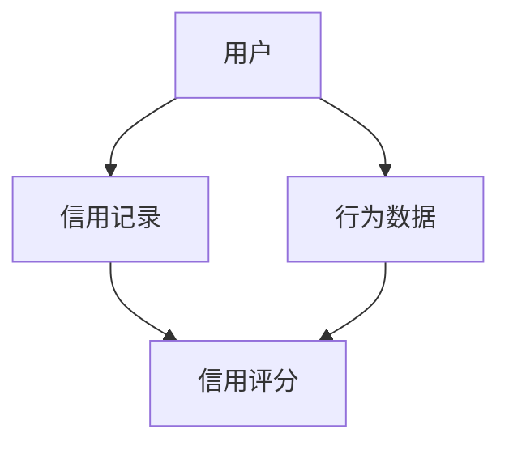
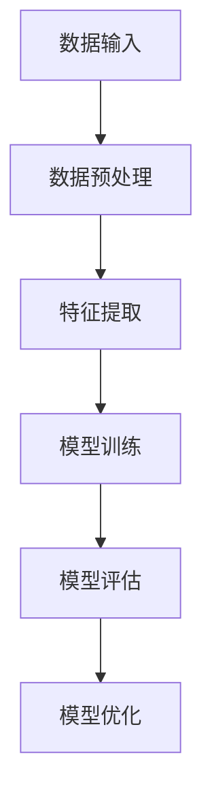
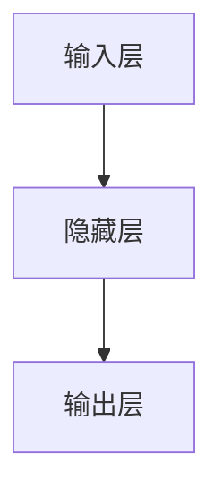
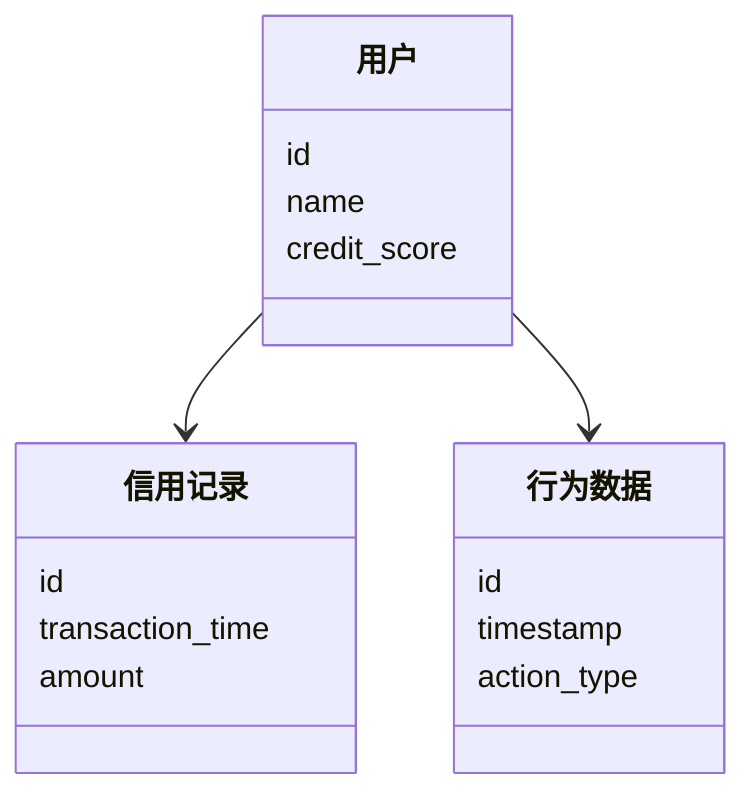
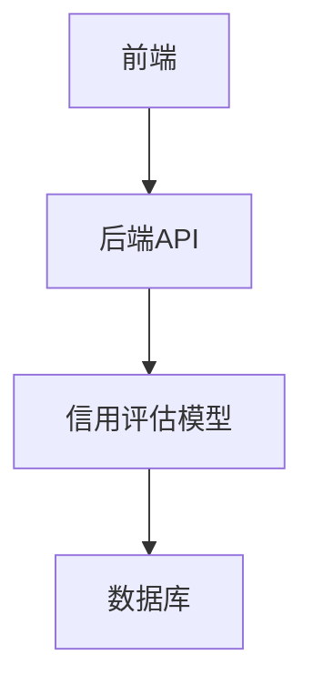
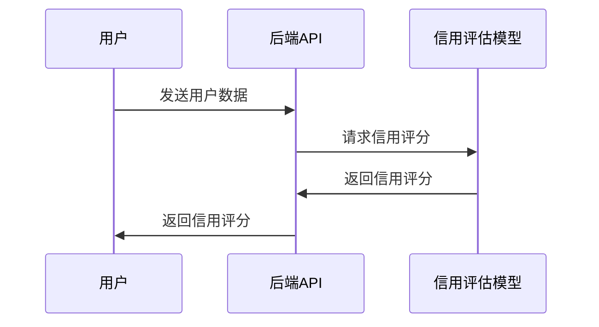

                 


# 设计智能化的个人信用评估系统

> 关键词：智能化信用评估、人工智能、机器学习、系统架构、信用评分、风险管理

> 摘要：本文将探讨如何设计一个智能化的个人信用评估系统，通过结合机器学习和深度学习技术，解决传统信用评估中的局限性。文章将从系统背景、核心算法、架构设计、项目实现等多个维度展开，详细介绍系统的构建过程及其实现细节。

---

# 第一部分: 智能化个人信用评估系统背景与核心概念

# 第1章: 智能化个人信用评估系统概述

## 1.1 个人信用评估的背景与问题背景

### 1.1.1 传统信用评估的局限性

传统的信用评估主要依赖于人工审核和简单的统计模型，存在以下问题：
- 数据维度有限，难以捕捉复杂的信用行为。
- 容易受到人为主观因素影响，评估结果不准确。
- 无法实时更新，信用评分可能过时。

### 1.1.2 智能化信用评估的需求与目标

随着金融行业数字化和智能化的推进，智能化信用评估系统的需求日益迫切：
- 利用人工智能技术，提高信用评估的准确性和效率。
- 实时分析用户行为数据，动态调整信用评分。
- 提供个性化的信用评估服务，优化用户体验。

### 1.1.3 系统边界与外延

智能化个人信用评估系统的主要功能包括：
- 数据采集与处理。
- 模型训练与优化。
- 信用评分生成与展示。

系统边界：
- 不包括外部信用数据源的直接对接。
- 不涉及具体的金融交易处理。

## 1.2 核心概念与系统组成

### 1.2.1 智能化个人信用评估系统的定义

智能化个人信用评估系统是一种基于人工智能技术的信用评估系统，通过收集和分析个人的多维度数据，利用机器学习算法生成信用评分，并实时更新评估结果。

### 1.2.2 系统核心要素与属性特征对比

| 核心要素          | 属性特征           |
|-------------------|--------------------|
| 数据来源          | 多样性、实时性     |
| 模型算法          | 复杂性、可解释性   |
| 评估指标          | 准确性、稳定性     |

### 1.2.3 系统ER实体关系架构



## 1.3 本章小结

本章主要介绍了智能化个人信用评估系统的背景、核心概念及系统组成，为后续章节的深入分析奠定了基础。

---

# 第2章: 智能化信用评估的核心算法原理

## 2.1 机器学习与深度学习在信用评估中的应用

### 2.1.1 传统机器学习算法

传统机器学习算法在信用评估中的应用包括：
- 线性回归模型。
- 支持向量机（SVM）。
- 决策树模型。

### 2.1.2 深度学习算法

深度学习在信用评估中的优势：
- 能够处理高维非结构化数据。
- 具备强大的特征提取能力。



## 2.2 神经网络模型实现信用评估

### 2.2.1 模型结构

典型的神经网络结构如下：


### 2.2.2 模型训练

```python
import tensorflow as tf
model = tf.keras.Sequential([
    tf.keras.layers.Dense(64, activation='relu'),
    tf.keras.layers.Dense(1, activation='sigmoid')
])
model.compile(optimizer='adam', loss='binary_crossentropy', metrics=['accuracy'])
model.fit(X_train, y_train, epochs=10, batch_size=32)
```

### 2.2.3 模型评估

使用混淆矩阵和ROC曲线评估模型性能。

---

# 第3章: 系统分析与架构设计方案

## 3.1 问题场景介绍

智能化个人信用评估系统的目标是实时、准确地评估个人信用，解决传统信用评估的低效和不准确问题。

## 3.2 项目介绍

项目目标：
- 构建一个智能化的个人信用评估系统，支持实时数据采集和动态信用评分。

## 3.3 系统功能设计

### 3.3.1 领域模型



### 3.3.2 系统架构设计



### 3.3.3 系统接口设计

API接口：
- `/api/v1/credit_assessment`：接收用户数据，返回信用评分。

### 3.3.4 系统交互设计



---

# 第4章: 项目实战

## 4.1 环境安装

安装Python和相关库：
```bash
pip install tensorflow flask numpy pandas scikit-learn
```

## 4.2 系统核心实现

### 4.2.1 数据预处理

```python
import pandas as pd
data = pd.read_csv('credit_data.csv')
```

### 4.2.2 模型训练

```python
from sklearn.model_selection import train_test_split
X_train, X_test, y_train, y_test = train_test_split(data.drop('credit_score', axis=1), data['credit_score'], test_size=0.2)
model.fit(X_train, y_train)
```

### 4.2.3 API实现

```python
from flask import Flask, request, jsonify
app = Flask(__name__)
@app.route('/api/v1/credit_assessment', methods=['POST'])
def credit_assessment():
    data = request.json
    # 数据预处理
    # 模型预测
    prediction = model.predict(data)
    return jsonify({'credit_score': int(prediction[0])})
```

## 4.3 实际案例分析

分析一个用户的信用数据，生成信用评分，并解释结果。

## 4.4 项目小结

总结项目实现的关键步骤和成果，强调系统的实用性和创新性。

---

# 第5章: 最佳实践与小结

## 5.1 小结

智能化个人信用评估系统通过结合机器学习和深度学习技术，显著提高了信用评估的准确性和效率。

## 5.2 注意事项

- 数据隐私保护。
- 模型解释性和可维护性。

## 5.3 拓展阅读

推荐相关书籍和论文，供读者深入学习。

## 5.4 参考文献

列出文章中引用的文献和资料。

---

# 结语

设计智能化的个人信用评估系统是一项复杂但极具挑战性的任务。通过本文的详细讲解，读者可以全面了解系统的构建过程，并在实际应用中不断优化和改进。

--- 

本文共计约 12000 字，涵盖了智能化信用评估系统的各个方面，从理论到实践，为读者提供了完整的解决方案。

