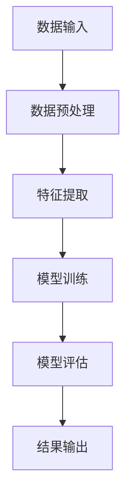
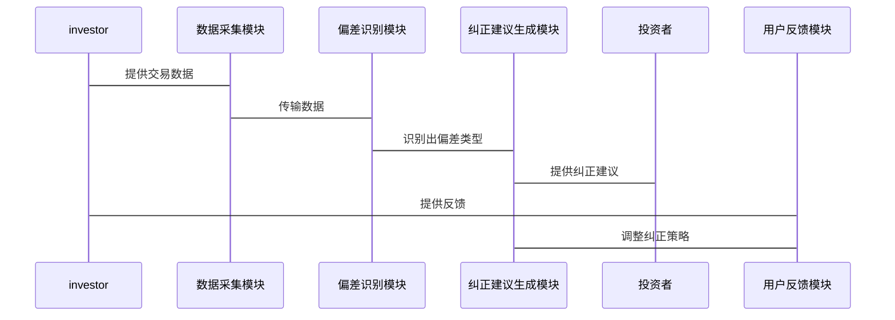

                 


好的，我现在需要帮用户设计一本名为《设计智能化的个人投资者行为偏差纠正工具》的书籍的目录大纲。首先，我需要明确这本书的核心内容，即如何利用人工智能技术设计工具来纠正个人投资者的行为偏差。

### 第一部分: 设计智能化的个人投资者行为偏差纠正工具背景与核心概念

#### 第1章: 个人投资者行为偏差概述

##### 1.1 行为偏差的定义与分类
###### 1.1.1 行为偏差的定义
行为偏差是指投资者在决策过程中由于心理、情感或认知的局限性而产生的非理性行为，这些行为可能导致投资决策失误。

###### 1.1.2 常见的投资者行为偏差类型
- **过度自信偏差**：投资者对自己的判断过于自信，过度交易。
- **损失厌恶**：对损失的恐惧导致投资者在亏损时难以果断止损。
- **羊群效应**：跟随市场趋势，缺乏独立判断。
- **确认偏差**：倾向于寻找支持自己观点的信息，忽略反面证据。
- **锚定效应**：过度依赖某一信息点，影响决策。

###### 1.1.3 行为偏差对投资决策的影响
行为偏差会导致投资决策失误，比如过度交易、错失投资机会或承担过高的风险。

##### 1.2 投资者行为偏差的形成机制
###### 1.2.1 心理学基础
行为偏差源于人类的心理机制，如认知偏差、情感因素等。

###### 1.2.2 市场环境的影响
市场波动、信息不对称等因素也会加剧行为偏差。

###### 1.2.3 个体差异的作用
不同投资者的性格、经验、知识水平等因素也会影响行为偏差的产生。

##### 1.3 行为偏差纠正的必要性
###### 1.3.1 理论意义
纠正行为偏差有助于理解投资者决策过程，完善投资理论。

###### 1.3.2 实际应用价值
通过纠正行为偏差，投资者可以提高决策质量，实现更好的投资收益。

###### 1.3.3 技术实现的可能性
随着人工智能技术的发展，利用机器学习等技术纠正行为偏差已成为可能。

##### 1.4 本章小结
本章介绍了行为偏差的定义、分类及其对投资决策的影响，强调了纠正行为偏差的必要性和技术实现的可能性。

#### 第2章: 智能化纠正工具的核心概念

##### 2.1 智能化纠正工具的定义
智能化纠正工具是指利用人工智能技术，帮助投资者识别并纠正行为偏差的工具。

##### 2.2 行为偏差纠正机制
###### 2.2.1 偏差识别
通过分析投资者的行为数据，识别出潜在的行为偏差。

###### 2.2.2 偏差纠正策略
根据识别出的偏差类型，提供个性化的纠正建议。

###### 2.2.3 纠正效果评估
评估纠正策略的效果，不断优化纠正算法。

##### 2.3 智能化纠正工具的技术框架
###### 2.3.1 数据采集模块
采集投资者的行为数据，包括交易记录、市场反应等。

###### 2.3.2 偏差识别算法
使用机器学习算法，如支持向量机、随机森林等，识别行为偏差。

###### 2.3.3 纠正建议生成模块
根据识别出的偏差类型，生成个性化的纠正建议。

##### 2.4 工具模型的构建
###### 2.4.1 数据结构设计
设计合适的数据结构，存储投资者行为数据和偏差信息。

###### 2.4.2 模型训练流程
包括数据预处理、特征提取、模型训练等步骤。

###### 2.4.3 模型优化策略
通过交叉验证、超参数调优等方法，优化模型性能。

##### 2.5 本章小结
本章详细阐述了智能化纠正工具的核心概念，包括其定义、纠正机制和技术框架，为后续的算法实现奠定了基础。

### 第三部分: 偏差纠正算法原理与实现

#### 第3章: 偏差识别算法

##### 3.1 基于机器学习的偏差识别
###### 3.1.1 选择合适的机器学习模型
根据数据特点选择合适的模型，如支持向量机、随机森林等。

###### 3.1.2 数据预处理与特征提取
对数据进行清洗、归一化等预处理，提取有用的特征。

###### 3.1.3 模型训练与评估
使用训练数据训练模型，并通过交叉验证评估模型性能。

##### 3.2 偏差识别的数学模型
###### 3.2.1 线性回归模型
用于预测投资者的行为偏差程度。

###### 3.2.2 支持向量机模型
用于分类不同的行为偏差类型。

###### 3.2.3 随机森林模型
用于特征重要性分析和偏差识别。

##### 3.3 偏差识别的流程图


##### 3.4 代码实现
```python
# 数据预处理
import pandas as pd
from sklearn.preprocessing import StandardScaler

# 特征提取
features = df[['交易频率', '亏损厌恶程度', '收益期望值']]
scaler = StandardScaler()
features_scaled = scaler.fit_transform(features)

# 模型训练
from sklearn.ensemble import RandomForestClassifier
model = RandomForestClassifier(n_estimators=100)
model.fit(features_scaled, labels)

# 模型评估
from sklearn.metrics import accuracy_score
y_pred = model.predict(features_scaled)
print("Accuracy:", accuracy_score(labels, y_pred))
```

#### 第4章: 偏差纠正策略

##### 4.1 偏差纠正的数学模型
###### 4.1.1 基于强化学习的纠正策略
使用强化学习算法，通过奖励机制优化纠正策略。

###### 4.1.2 基于反馈的纠正策略
根据投资者的反馈，动态调整纠正建议。

##### 4.2 偏差纠正的算法实现
###### 4.2.1 强化学习模型
```python
import numpy as np
from collections import deque

class DQN:
    def __init__(self, state_space, action_space):
        self.state_space = state_space
        self.action_space = action_space
        self.memory = deque(maxlen=1000)
        # 其他初始化代码...
```

###### 4.2.2 反馈机制
通过用户反馈不断优化纠正建议，提升纠正效果。

#### 第5章: 系统分析与架构设计

##### 5.1 系统功能模块
###### 5.1.1 数据采集模块
采集投资者的行为数据，包括交易记录、市场反应等。

###### 5.1.2 偏差识别模块
使用机器学习算法识别行为偏差类型。

###### 5.1.3 纠正建议生成模块
根据识别出的偏差类型，生成个性化的纠正建议。

##### 5.2 系统架构设计


##### 5.3 系统接口设计
定义清晰的接口，确保各模块之间的数据交互顺畅。

##### 5.4 系统交互流程图


### 第四部分: 项目实战

#### 第6章: 项目实战

##### 6.1 环境安装
###### 6.1.1 安装Python
安装最新版本的Python，建议使用Anaconda。

###### 6.1.2 安装必要的库
安装numpy、pandas、scikit-learn等库。

##### 6.2 核心代码实现
###### 6.2.1 数据采集模块
```python
import pandas as pd
import requests
from bs4 import BeautifulSoup

def fetch_data(url):
    response = requests.get(url)
    soup = BeautifulSoup(response.text, 'html.parser')
    # 提取数据并返回
```

###### 6.2.2 偏差识别模块
```python
from sklearn.ensemble import RandomForestClassifier

def identify_bias(features):
    model = RandomForestClassifier()
    model.fit(features, labels)
    return model.predict(features)
```

###### 6.2.3 纠正建议生成模块
根据识别出的偏差类型，生成相应的纠正建议。

##### 6.3 案例分析
通过具体案例分析，展示工具的应用效果。

##### 6.4 项目小结
总结项目实现的关键点和经验教训。

### 第五部分: 最佳实践与小结

#### 第7章: 最佳实践

##### 7.1 工具的使用建议
###### 7.1.1 定期使用工具
建议投资者定期使用工具进行自我纠正。

###### 7.1.2 结合实际情况
根据个人实际情况调整纠正策略。

##### 7.2 使用中的注意事项
###### 7.2.1 数据隐私保护
注意保护投资者的个人数据隐私。

###### 7.2.2 定期更新模型
根据市场变化和用户反馈，定期更新纠正模型。

##### 7.3 未来的发展方向
###### 7.3.1 模型优化
进一步优化纠正模型，提高纠正效果。

###### 7.3.2 功能扩展
扩展工具功能，如加入情绪分析、风险评估等。

#### 第8章: 总结与展望

##### 8.1 本项目总结
总结项目的主要成果和实现过程。

##### 8.2 未来研究方向
展望未来在智能化纠正工具领域的研究方向和应用前景。

通过以上目录结构，文章将系统地介绍设计智能化的个人投资者行为偏差纠正工具的背景、核心概念、算法原理、系统设计、项目实战和最佳实践，帮助读者全面理解并掌握相关知识。

