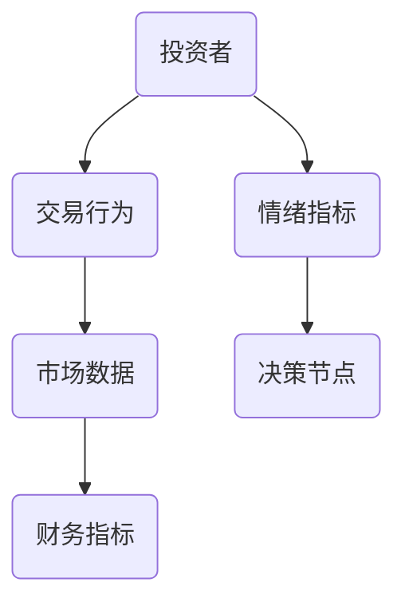
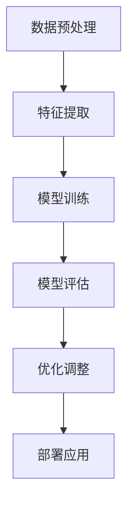
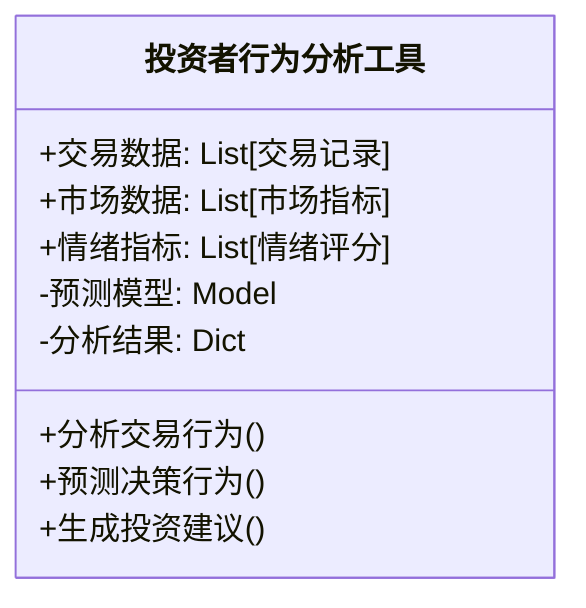
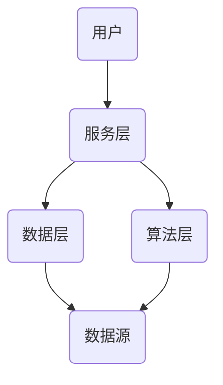
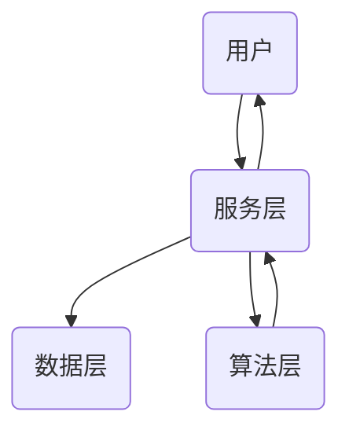

                 


# 设计智能化的个人投资者行为分析工具

## 关键词：投资者行为分析、人工智能、机器学习、自然语言处理、系统架构设计

## 摘要：
设计智能化的个人投资者行为分析工具旨在通过机器学习和自然语言处理等技术，全面分析投资者的历史交易数据和情感指标，揭示其行为模式和决策路径。本文从背景介绍、核心概念、算法原理、系统架构设计到项目实战，详细阐述了设计智能化投资者行为分析工具的全过程，为投资者提供了优化投资决策的支持。

---

# 第一部分：背景与核心概念

## 第1章：个人投资者行为分析工具的背景与问题描述

### 1.1 投资者行为分析的背景

#### 1.1.1 传统投资分析的局限性
传统的投资分析方法依赖于经验丰富的分析师对市场趋势的判断，这种主观性较强的分析方法难以捕捉到投资者个体的复杂行为模式。随着数据科学和人工智能技术的发展，智能化的投资分析工具逐渐成为可能。

#### 1.1.2 智能化投资工具的兴起
近年来，人工智能技术在金融领域的应用越来越广泛。通过机器学习算法，我们可以从海量数据中提取有价值的特征，帮助投资者做出更科学的决策。

#### 1.1.3 个人投资者行为分析的必要性
个人投资者的行为分析可以帮助投资者识别自身的投资习惯和潜在风险，从而优化投资策略。例如，通过分析投资者的历史交易数据，可以发现其是否存在过度交易或贪婪与恐惧情绪的影响。

### 1.2 问题背景与描述

#### 1.2.1 个人投资者行为的复杂性
投资者的行为受到多种因素的影响，包括市场环境、个人情绪、信息获取渠道等。这些因素使得投资者的行为分析具有一定的复杂性。

#### 1.2.2 行为分析的核心问题
行为分析的核心问题在于如何从复杂的行为数据中提取有用的特征，并建立有效的模型来预测投资者的决策行为。

#### 1.2.3 问题的边界与外延
本文将聚焦于个人投资者的交易行为和情绪指标，暂不考虑宏观经济因素和市场整体波动的影响。

### 1.3 核心概念与目标

#### 1.3.1 个人投资者行为分析工具的定义
个人投资者行为分析工具是一种基于机器学习和自然语言处理技术，分析投资者的历史交易数据、情绪指标和市场数据，揭示其行为模式和决策路径的智能化工具。

#### 1.3.2 核心目标与功能
- 提供投资者行为特征的可视化分析
- 预测投资者的决策行为
- 提供个性化投资建议

#### 1.3.3 边界与外延
本文仅关注个人投资者的行为分析，不涉及机构投资者和宏观经济因素。

## 第2章：核心概念与联系

### 2.1 投资者行为分析的核心要素

#### 2.1.1 数据来源与特征
- **交易数据**：包括买入、卖出、持仓等操作
- **市场数据**：如股票价格、指数走势
- **情绪指标**：如社交媒体上的投资者情绪分析

#### 2.1.2 行为模式与决策路径
- 投资者在不同市场环境下的交易频率
- 投资者对市场信号的反应速度

#### 2.1.3 情感分析与情绪识别
通过自然语言处理技术，分析投资者在社交媒体上的言论，识别其情绪状态。

### 2.2 核心概念的属性对比

| 对比维度 | 传统分析 | AI驱动分析 |
|----------|-----------|------------|
| 数据来源 | 有限数据 | 海量数据    |
| 分析方法 | 经验判断 | 数据驱动    |
| 结果输出 | 主观性高 | 客观性高    |

### 2.3 ER实体关系图



---

# 第二部分：算法原理与数学模型

## 第3章：算法原理与流程

### 3.1 机器学习算法基础

#### 3.1.1 监督学习与无监督学习
- **监督学习**：用于分类任务，如预测投资者的交易决策。
- **无监督学习**：用于聚类任务，如将投资者分为不同类型。

#### 3.1.2 深度学习与自然语言处理
- **深度学习**：用于处理复杂的非结构化数据，如文本评论。
- **自然语言处理**：用于分析投资者在社交媒体上的情绪。

#### 3.1.3 时间序列分析
用于分析投资者的历史交易数据，预测未来的行为。

### 3.2 算法流程图



### 3.3 数学模型与公式

#### 3.3.1 损失函数
$$L = \frac{1}{n}\sum_{i=1}^{n}(y_i - \hat{y_i})^2$$

#### 3.3.2 优化算法
$$\theta := \theta - \eta \cdot \frac{\partial L}{\partial \theta}$$

#### 3.3.3 案例分析
- **输入**：投资者的历史交易数据
- **输出**：投资者的交易模式和风险偏好

---

# 第三部分：系统分析与架构设计

## 第4章：系统分析与架构设计方案

### 4.1 问题场景介绍

#### 4.1.1 项目介绍
设计一个智能化的投资者行为分析工具，帮助个人投资者优化投资决策。

### 4.2 系统功能设计

#### 4.2.1 领域模型类图



### 4.3 系统架构设计

#### 4.3.1 系统架构图



### 4.4 系统接口设计

#### 4.4.1 系统交互流程图



---

# 第四部分：项目实战

## 第5章：项目实战

### 5.1 环境安装

```bash
pip install numpy pandas scikit-learn tensorflow
```

### 5.2 核心代码实现

```python
import numpy as np
import pandas as pd
from sklearn.model import Model
from tensorflow import keras

# 数据预处理
def preprocess_data(data):
    # 数据清洗和特征提取
    pass

# 模型训练
def train_model(data):
    model = keras.Sequential()
    # 模型定义
    model.compile(optimizer='adam', loss='mse')
    model.fit(data)
    return model

# 预测与评估
def evaluate_model(model, test_data):
    predictions = model.predict(test_data)
    return predictions
```

### 5.3 实际案例分析

#### 5.3.1 案例分析

```python
data = pd.read_csv('交易数据.csv')
model = train_model(preprocess_data(data))
predictions = evaluate_model(model, data)
print(predictions)
```

---

# 第五部分：最佳实践与总结

## 第6章：最佳实践与总结

### 6.1 小结

智能化的个人投资者行为分析工具通过机器学习和自然语言处理技术，帮助投资者更好地理解自身的行为模式和决策过程，从而优化投资策略。

### 6.2 注意事项

- 数据隐私问题需要高度重视
- 模型需要不断更新和优化
- 结果需要结合市场实际情况进行调整

### 6.3 拓展阅读

建议读者进一步阅读相关领域的最新研究成果，如强化学习在投资决策中的应用。

---

通过以上步骤，我们可以系统地设计和实现一个智能化的个人投资者行为分析工具，为投资者提供科学的决策支持。

