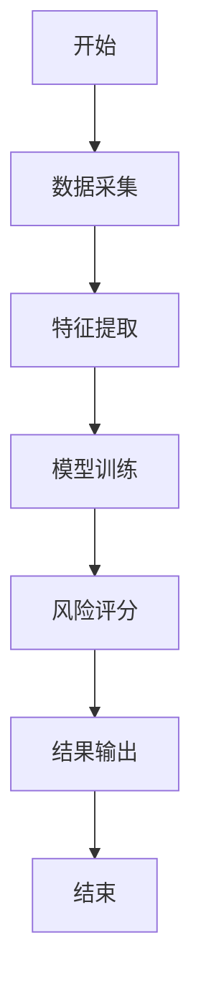
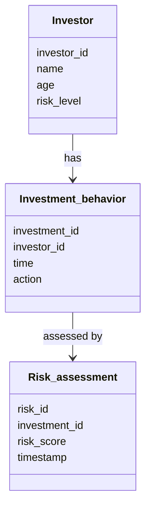
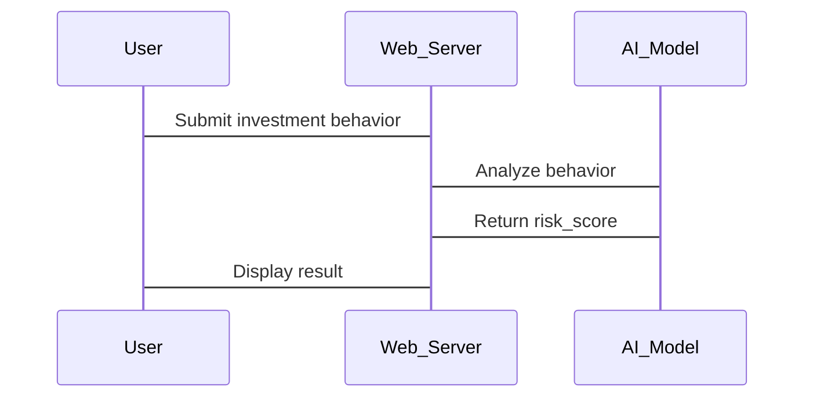

                 


# 设计智能化的个人投资者风险偏好动态评估工具

> 关键词：个人投资者、风险偏好、动态评估、人工智能、算法原理、系统架构、项目实战

> 摘要：本文详细探讨了设计智能化的个人投资者风险偏好动态评估工具的核心方法。通过分析投资者行为与市场变化的关系，结合机器学习算法和系统架构设计，提出了一套动态调整风险偏好的解决方案，并通过实际案例展示了工具的应用效果。本文适合对投资行为分析和人工智能技术感兴趣的读者阅读。

---

# 第一部分: 背景与核心概念

## 第1章: 个人投资者风险偏好评估的背景与问题描述

### 1.1 问题背景

#### 1.1.1 投资者风险偏好的重要性
在金融投资领域，风险偏好是投资者决策的核心因素之一。不同投资者对风险的承受能力不同，这直接影响其投资行为和资产配置策略。传统的静态风险评估方法难以捕捉市场环境和投资者行为的动态变化，导致评估结果的局限性。

#### 1.1.2 传统风险评估方法的局限性
传统的风险偏好评估方法通常基于静态问卷或历史数据，难以实时捕捉投资者情绪和市场波动的变化。这种方法在市场剧烈波动时，可能导致评估结果与实际情况严重偏离。

#### 1.1.3 智能化评估工具的必要性
随着人工智能和大数据技术的发展，智能化工具能够实时分析投资者行为和市场数据，动态调整风险偏好评估结果。这种动态评估方法能够更好地反映投资者的真实风险承受能力，为投资决策提供更精准的支持。

### 1.2 问题描述

#### 1.2.1 风险偏好动态变化的特征
投资者的风险偏好并非固定不变，它会受到市场环境、个人情绪、投资经历等多种因素的影响。例如，市场剧烈波动时，投资者可能会变得更加保守，而市场稳定时则可能趋向冒险。

#### 1.2.2 个人投资者行为与决策的影响
投资者的行为决策直接影响其投资收益和风险承受能力。例如，频繁的交易行为可能反映出投资者对市场的不确定性和较高的风险偏好。

#### 1.2.3 当前市场环境的复杂性
当前金融市场环境复杂多变，投资者需要面对各种不确定性因素，如全球经济波动、政策变化、技术革新等。这些因素使得传统的静态评估方法难以满足实际需求。

### 1.3 问题解决与边界

#### 1.3.1 动态评估的核心目标
动态评估的核心目标是通过实时分析投资者行为和市场数据，动态调整其风险偏好评分，从而提供更精准的投资建议和风险控制策略。

#### 1.3.2 边界与适用范围
动态评估工具适用于个人投资者，尤其是那些投资行为容易受到市场波动和情绪影响的投资者。工具的主要边界在于无法预测极端市场事件和投资者个体的极端行为。

#### 1.3.3 外延与潜在应用场景
动态评估工具不仅适用于个人投资者，还可以扩展应用于机构投资者、财富管理机构和金融咨询服务，帮助其更好地理解和管理客户的投资风险。

## 第2章: 核心概念与联系

### 2.1 核心概念原理

#### 2.1.1 风险偏好的定义与分类
风险偏好是指投资者在面对不确定性和潜在损失时的态度和行为。常见的风险偏好类型包括保守型、稳健型和冒险型。

#### 2.1.2 动态评估的关键要素
动态评估的关键要素包括投资者行为数据、市场数据、历史评估数据等。这些要素通过机器学习算法进行分析，生成动态风险偏好评分。

#### 2.1.3 智能化工具的核心机制
智能化工具的核心机制是通过实时数据采集、特征提取和模型训练，动态调整投资者的风险偏好评分，并提供相应的投资建议。

### 2.2 概念对比与ER图

#### 2.2.1 风险偏好与投资行为的对比
通过对比表格展示风险偏好与投资行为的主要区别和联系。

| 比较维度 | 风险偏好 | 投资行为 |
|----------|----------|----------|
| 定义     | 风险承受态度 | 投资决策和交易行为 |
| 影响因素 | 个人性格、市场环境 | 风险偏好、市场信息 |
| 表现形式 | 风险评分 | 交易频率、资产配置 |

#### 2.2.2 ER实体关系图展示
使用Mermaid绘制ER图，展示投资者、投资行为和风险评估之间的关系。

```mermaid
er
    Investor(investor_id, name, age, risk_level)
    Investment_behavior(investment_id, investor_id, time, action)
    Risk_assessment(risk_id, investment_id, risk_score, timestamp)
```

---

# 第二部分: 算法原理与数学模型

## 第3章: 动态评估算法原理

### 3.1 算法概述

#### 3.1.1 动态评估的基本流程
动态评估的基本流程包括数据采集、特征提取、模型训练和风险评分输出。

#### 3.1.2 数据驱动的特征提取
通过分析投资者的历史交易数据和市场数据，提取关键特征，如交易频率、资产配置比例、市场波动率等。

#### 3.1.3 模型训练与优化
使用机器学习算法（如随机森林、支持向量机等）对特征进行训练，优化模型性能，提高评估准确性。

### 3.2 数学模型与公式

#### 3.2.1 风险评分公式
$$ \text{Risk Score} = \alpha \cdot \text{Market Volatility} + \beta \cdot \text{Investor Behavior} $$

其中，$\alpha$ 和 $\beta$ 是模型训练得到的权重系数，$\text{Market Volatility}$ 表示市场波动率，$\text{Investor Behavior}$ 表示投资者行为特征。

#### 3.2.2 动态权重调整模型
$$ w(t) = w(t-1) + \gamma \cdot \Delta t $$

其中，$w(t)$ 表示时间 $t$ 的权重值，$\gamma$ 是调整系数，$\Delta t$ 是时间间隔。

### 3.3 算法流程图

使用Mermaid绘制算法流程图，展示从数据采集到风险评分输出的完整流程。



### 3.4 Python实现示例

以下是一个简单的Python代码示例，用于计算风险评分：

```python
import numpy as np
import pandas as pd

# 数据准备
data = {
    'investor_id': [1, 2, 3],
    'market_volatility': [0.15, 0.20, 0.10],
    'investor_behavior': [0.7, 0.3, 0.5]
}
df = pd.DataFrame(data)

# 计算风险评分
alpha = 0.5
beta = 0.5
df['risk_score'] = alpha * df['market_volatility'] + beta * df['investor_behavior']

print(df)
```

---

## 第4章: 系统分析与架构设计

### 4.1 系统功能设计

#### 4.1.1 领域模型类图
使用Mermaid绘制领域模型类图，展示投资者、投资行为和风险评估之间的关系。



#### 4.1.2 系统架构设计
使用Mermaid绘制系统架构图，展示系统的整体架构。


#### 4.1.3 系统接口设计
系统接口包括数据接口、用户接口和API接口。数据接口用于连接数据库，用户接口用于展示评估结果，API接口用于第三方集成。

#### 4.1.4 系统交互设计
使用Mermaid绘制系统交互序列图，展示用户与系统之间的交互流程。



---

## 第5章: 项目实战

### 5.1 环境安装

#### 5.1.1 安装Python和相关库
需要安装Python 3.8及以上版本，并安装numpy、pandas、scikit-learn等库。

#### 5.1.2 安装Jupyter Notebook
用于数据可视化和算法实现。

### 5.2 系统核心实现源代码

以下是一个完整的Python代码示例，展示如何实现风险偏好动态评估工具：

```python
import numpy as np
import pandas as pd
from sklearn.ensemble import RandomForestRegressor
from sklearn.metrics import mean_squared_error
from sklearn.model_selection import train_test_split

# 数据准备
data = {
    'market_volatility': [0.15, 0.20, 0.10, 0.25, 0.12],
    'investor_behavior': [0.7, 0.3, 0.5, 0.6, 0.4],
    'risk_score': [0.7, 0.4, 0.5, 0.6, 0.5]
}
df = pd.DataFrame(data)

# 数据分割
X = df[['market_volatility', 'investor_behavior']]
y = df['risk_score']

X_train, X_test, y_train, y_test = train_test_split(X, y, test_size=0.2, random_state=42)

# 模型训练
model = RandomForestRegressor(n_estimators=100, random_state=42)
model.fit(X_train, y_train)

# 模型评估
y_pred = model.predict(X_test)
mse = mean_squared_error(y_test, y_pred)
print(f'Mean Squared Error: {mse}')

# 风险评分计算
new_data = pd.DataFrame({
    'market_volatility': [0.18],
    'investor_behavior': [0.6]
})
risk_score = model.predict(new_data)
print(f'Risk Score: {risk_score[0]}')
```

### 5.3 实际案例分析与解读

#### 5.3.1 案例背景
假设有一位投资者在市场波动率为0.18，投资者行为评分为0.6的情况下，使用上述模型计算风险评分。

#### 5.3.2 数据分析与结果解读
通过模型计算得到的风险评分为0.65，说明该投资者的风险偏好较高，适合投资风险较高的资产。

---

## 第6章: 总结与最佳实践

### 6.1 小结

通过本文的详细讲解，我们了解了设计智能化的个人投资者风险偏好动态评估工具的核心方法和实现步骤。从背景分析到算法实现，再到系统设计和项目实战，我们全面探讨了如何利用人工智能技术提高风险评估的精准性和动态性。

### 6.2 注意事项

在实际应用中，需要注意以下几点：
1. 数据质量和完整性对模型性能影响重大，需确保数据来源可靠。
2. 模型需要定期更新和优化，以适应市场环境和投资者行为的变化。
3. 保护投资者隐私，确保数据安全。

### 6.3 扩展阅读

建议读者进一步学习以下内容：
1. 时间序列分析在投资行为预测中的应用。
2. 深度学习模型在风险评估中的应用。
3. 动态评估工具的实际应用案例研究。

---

通过本文的系统介绍，读者可以全面掌握设计智能化的个人投资者风险偏好动态评估工具的关键技术，为实际应用提供理论和实践指导。

