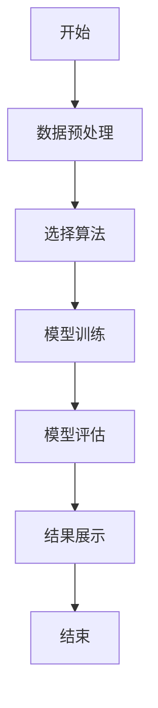
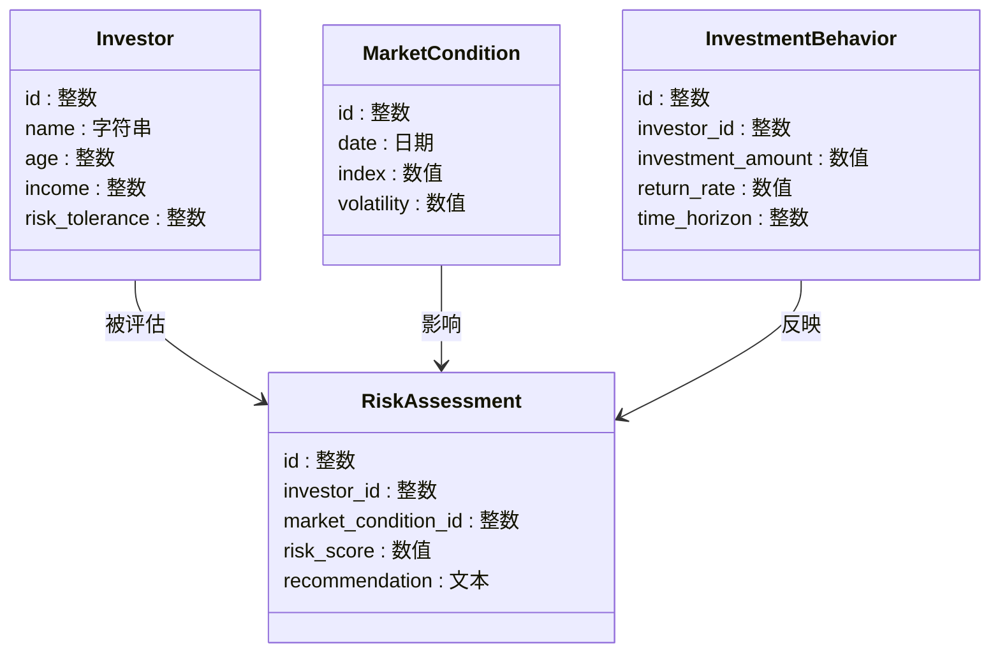

                 


```markdown
# 设计智能化的个人投资风险承受能力评估工具

## 关键词：个人投资、风险承受能力、人工智能、评估工具、算法设计、系统架构

## 摘要：  
本文旨在设计一个智能化的个人投资风险承受能力评估工具，结合金融学和人工智能技术，通过分析投资者的财务状况、风险偏好和市场环境，利用回归分析、聚类分析等算法，构建评估模型，并通过系统架构设计实现工具的开发。文章详细探讨了评估工具的核心概念、算法原理、系统设计、项目实现和最佳实践，为读者提供一个全面的解决方案。

---

## 第一部分：背景介绍与问题背景

### 第1章：背景介绍与问题背景

#### 1.1 个人投资风险承受能力评估的背景

##### 1.1.1 投资风险的基本概念
投资风险是指在投资过程中可能遭受的损失或收益波动的可能性。它与市场的波动性、经济周期、政策变化等多种因素相关。投资者在进行投资决策时，需要了解自己对风险的承受能力，以便选择合适的投资策略。

##### 1.1.2 风险承受能力的定义与重要性
风险承受能力是指投资者在面对投资损失时的心理和财务上的承受能力。它是投资决策的重要因素，直接影响投资组合的选择和风险管理策略。

##### 1.1.3 当前评估工具的局限性
传统的风险承受能力评估工具通常基于简单的问卷调查，缺乏动态调整和个性化分析。随着市场的变化和投资者需求的多样化，传统的评估方法已无法满足现代投资者的需求。

#### 1.2 问题描述与目标设定

##### 1.2.1 传统评估方法的不足
传统评估方法通常依赖静态的问卷调查，忽视了市场的动态变化和投资者的实时行为数据。此外，传统方法难以捕捉投资者的真实风险偏好和财务状况的变化。

##### 1.2.2 智能化评估工具的需求
为了更准确地评估投资者的风险承受能力，需要结合人工智能技术，利用大数据分析和动态模型，实时更新评估结果，提供个性化的投资建议。

##### 1.2.3 设计目标与预期效果
本工具旨在通过智能化的评估方法，准确识别投资者的风险承受能力，提供个性化的投资建议，帮助投资者做出更明智的投资决策。

#### 1.3 核心概念与边界

##### 1.3.1 风险承受能力的构成要素
风险承受能力由财务状况、风险偏好、投资目标和市场环境等因素构成。这些因素相互作用，影响投资者在不同市场条件下的风险承受能力。

##### 1.3.2 评估工具的边界与外延
评估工具主要关注投资者的内在因素和市场环境，不涉及具体的投资产品选择。其边界包括数据采集、模型构建和结果展示，但不包括实际的投资操作。

##### 1.3.3 核心概念的结构化分析
通过结构化分析，将风险承受能力分解为多个维度，如财务稳定性、风险容忍度和投资时间 horizon，构建一个多层次的评估框架。

## 第二部分：核心概念与理论基础

### 第2章：个人投资风险承受能力的核心概念

#### 2.1 风险承受能力的属性特征对比

##### 2.1.1 不同风险类型的特点对比（表格）

| 风险类型   | 定义                                | 主要影响因素                          | 评估方法                  |
|------------|------------------------------------|---------------------------------------|---------------------------|
| 市场风险    | 资产价格波动对投资组合的影响        | 市场波动、资产类别                    | 标准差、VaR、CVaR          |
| 信用风险    | 债务人违约对投资组合的影响          | 债务人信用状况、经济周期              | 信用评级、违约概率        |
| 流动性风险  | 资产变现能力对投资组合的影响          | 市场深度、资产类别                    | 流动性指标                |
| 操作风险    | 操作失误或内部流程问题对投资的影响    | 内部控制、员工素质                    | 内部审计、操作指标        |

##### 2.1.2 不同评估方法的优劣势对比（表格）

| 评估方法   | 优势                                | 劣势                                |
|------------|------------------------------------|-------------------------------------|
| 问卷调查法 | 简单易行、成本低                    | 结果主观、缺乏动态性                |
| 回归分析法 | 客观性强、可量化                    | 需要大量数据支持                    |
| 聚类分析法 | 适合分类、发现潜在模式              | 解释性较差                        |
| 神经网络法 | 高度自适应、非线性能力强            | 需要大量数据、解释性较差            |

#### 2.2 实体关系与数据模型

##### 2.2.1 ER实体关系图（Mermaid流程图）
```mermaid
erDiagram
    customer[投资者] {
        ++ id : 整数
        ++ name : 字符串
        ++ age : 整数
        ++ income : 整数
        ++ risk_tolerance : 整数
    }
    market_condition[市场环境] {
        ++ id : 整数
        ++ date : 日期
        ++ index : 数值
        ++ volatility : 数值
    }
    investment_behavior[投资行为] {
        ++ id : 整数
        ++ customer_id : 整数
        ++ investment_amount : 数值
        ++ return_rate : 数值
        ++ time_horizon : 整数
    }
    risk_assessment[风险评估] {
        ++ id : 整数
        ++ customer_id : 整数
        ++ market_condition_id : 整数
        ++ risk_score : 数值
        ++ recommendation : 文本
    }
    customer --> investment_behavior : 进行
    customer --> risk_assessment : 被评估
    market_condition --> risk_assessment : 影响
```

## 第三部分：算法原理与数学模型

### 第3章：评估算法的原理与实现

#### 3.1 风险评估的主要算法

##### 3.1.1 回归分析法
回归分析用于预测投资收益与风险之间的关系。通过建立线性回归模型，可以量化不同风险因素对投资收益的影响。

##### 3.1.2 聚类分析法
聚类分析用于将投资者分成不同的风险承受类别。通过分析投资者的财务状况和风险偏好，可以将他们分为保守型、稳健型和激进型投资者。

##### 3.1.3 神经网络模型
神经网络模型能够处理复杂的非线性关系，适合处理多维数据。通过训练神经网络，可以预测投资者的风险承受能力。

#### 3.2 算法原理的数学模型

##### 3.2.1 线性回归模型（公式：$$ y = \beta_0 + \beta_1x + \epsilon $$）
其中，$$ y $$ 是预测的风险评分，$$ x $$ 是影响风险的因素，$$ \beta_0 $$ 和 $$ \beta_1 $$ 是回归系数，$$ \epsilon $$ 是误差项。

##### 3.2.2 聚类分析的距离计算公式（公式：$$ d(x, y) = \sqrt{(x_1 - y_1)^2 + (x_2 - y_2)^2} $$）
距离公式用于计算两个样本之间的距离，常用于聚类分析中的相似性度量。

#### 3.3 算法实现的流程图（Mermaid流程图）



#### 3.4 代码实现示例

##### 3.4.1 Python代码示例

```python
import numpy as np
from sklearn.linear_model import LinearRegression
from sklearn.metrics import mean_squared_error

# 示例数据
X = np.array([[1], [2], [3], [4], [5]])
y = np.array([2, 4, 5, 4, 6])

# 创建回归模型
model = LinearRegression()
model.fit(X, y)

# 预测结果
y_pred = model.predict(X)

# 评估模型
 mse = mean_squared_error(y, y_pred)
 print(f"均方误差：{mse}")
```

##### 3.4.2 代码功能解读与分析
上述代码实现了线性回归模型，用于预测风险评分。首先，数据预处理包括数据清洗和特征选择。然后，选择线性回归算法并进行模型训练。最后，评估模型的性能并展示结果。

## 第四部分：系统分析与架构设计

### 第4章：系统分析与架构设计方案

#### 4.1 问题场景介绍

##### 4.1.1 用户需求分析
投资者需要一个个性化的风险评估工具，帮助他们了解自己的风险承受能力，并根据市场变化调整投资策略。

##### 4.1.2 功能需求概述
系统需要具备数据采集、模型训练、结果展示和用户交互等功能。

#### 4.2 系统功能设计

##### 4.2.1 领域模型（Mermaid类图）



#### 4.3 系统架构设计

##### 4.3.1 系统架构图（Mermaid架构图）

```mermaid
container InvestingRiskAssessmentTool {
    service RiskAssessmentService {
        component RiskModel
        component Database
    }
    service UserInterface {
        component WebInterface
        component MobileApp
    }
    service DataCollection {
        component API
        component Database
    }
}
```

#### 4.4 系统接口设计

##### 4.4.1 API接口
系统需要提供RESTful API，供其他系统或前端调用。例如，`/api/risk_assessment` 接口用于提交投资者信息并获取评估结果。

#### 4.5 系统交互流程

##### 4.5.1 用户注册与登录
用户通过网页或移动应用注册账户，登录后进入评估页面。

##### 4.5.2 数据采集与提交
用户填写问卷，提交财务数据和投资行为信息。

##### 4.5.3 模型评估与反馈
系统根据提交的数据，调用后端服务进行评估，返回风险评分和投资建议。

##### 4.5.4 结果展示与互动
评估结果以图表和文本形式展示，用户可以查看详细报告并进行互动操作，如调整投资组合。

## 第五部分：项目实战

### 第5章：项目实战

#### 5.1 环境安装与配置

##### 5.1.1 安装Python和相关库
安装Python 3.8及以上版本，使用pip安装numpy、scikit-learn、flask等库。

#### 5.2 系统核心实现

##### 5.2.1 数据采集模块
开发API接口，接收投资者数据并存储到数据库中。

##### 5.2.2 评估算法实现
实现回归分析和聚类分析算法，训练模型并生成评估结果。

##### 5.2.3 结果展示模块
开发网页或移动应用，展示评估结果和投资建议。

#### 5.3 代码实现与解读

##### 5.3.1 数据采集模块

```python
from flask import Flask, request, jsonify
import sqlite3

app = Flask(__name__)
app.config['JSON_AS_ASCII'] = False

@app.route('/api/risk_assessment', methods=['POST'])
def risk_assessment():
    data = request.json
    # 数据处理逻辑
    return jsonify({'status': 'success', 'message': '数据已接收'})

if __name__ == '__main__':
    app.run(debug=True)
```

##### 5.3.2 评估算法模块

```python
from sklearn.linear_model import LinearRegression
import pandas as pd

# 加载数据
data = pd.read_csv('investors.csv')

# 分割数据
X = data[['age', 'income', 'risk_tolerance']]
y = data['risk_score']

# 创建模型
model = LinearRegression()
model.fit(X, y)

# 预测
predictions = model.predict(X)
```

#### 5.4 实际案例分析

##### 5.4.1 案例一：保守型投资者
投资者A，年龄35岁，收入中等，风险偏好保守。评估结果显示，A的风险承受能力较低，建议选择低风险投资产品。

##### 5.4.2 案例二：激进型投资者
投资者B，年龄28岁，收入高，风险偏好激进。评估结果显示，B的风险承受能力较高，建议投资高风险高回报的资产。

## 第六部分：最佳实践与总结

### 第6章：最佳实践、小结与拓展阅读

#### 6.1 最佳实践 tips

##### 6.1.1 数据质量的重要性
确保数据的准确性和完整性，避免噪声数据影响评估结果。

##### 6.1.2 模型的可解释性
在复杂模型中，保持结果的可解释性，便于用户理解和调整投资策略。

##### 6.1.3 定期更新模型
根据市场变化和用户反馈，定期更新模型参数和算法，保持评估工具的有效性。

#### 6.2 小结

通过结合金融学和人工智能技术，本文设计了一个智能化的个人投资风险承受能力评估工具。该工具能够准确评估投资者的风险承受能力，提供个性化的投资建议，帮助投资者做出更明智的投资决策。

#### 6.3 注意事项

- 数据隐私保护：确保投资者数据的安全和隐私，遵守相关法律法规。
- 模型的局限性：评估工具的结果仅供参考，投资者应结合实际情况进行决策。
- 用户教育：向用户解释评估工具的工作原理和结果，帮助他们更好地理解投资风险。

#### 6.4 拓展阅读

- 《机器学习实战》
- 《投资学基础》
- 《风险管理与决策分析》

---

通过以上步骤，我们逐步构建了一个智能化的个人投资风险承受能力评估工具，结合理论与实践，为投资者提供了科学的决策支持。
```

