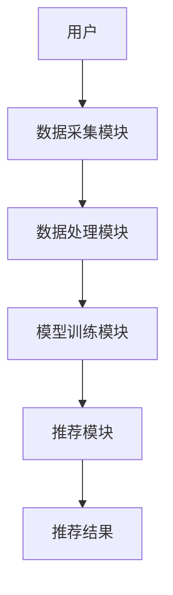

                 


# 设计智能化的个人消费行为分析系统

> 关键词：消费行为分析，智能化系统，推荐算法，数据挖掘，系统架构

> 摘要：本文详细探讨了设计智能化个人消费行为分析系统的各个方面，包括背景介绍、核心概念、算法原理、系统架构以及项目实战。通过结合数据挖掘、机器学习和系统设计等技术，提出了一个高效的消费行为分析框架，为实际应用提供了理论和实践指导。

---

## 目录

1. [背景介绍](#背景介绍)
   - [1.1 问题背景与描述](#11-问题背景与描述)
   - [1.2 问题解决与系统目标](#12-问题解决与系统目标)
   - [1.3 核心概念与系统结构](#13-核心概念与系统结构)

2. [核心概念与系统架构](#核心概念与系统架构)
   - [2.1 数据采集与处理](#21-数据采集与处理)
   - [2.2 消费行为分析模型](#22-消费行为分析模型)
   - [2.3 智能化推荐系统](#23-智能化推荐系统)
   - [2.4 系统架构设计](#24-系统架构设计)

3. [算法原理与实现](#算法原理与实现)
   - [3.1 数据预处理与特征提取](#31-数据预处理与特征提取)
   - [3.2 推荐算法实现](#32-推荐算法实现)
   - [3.3 算法优化与比较](#33-算法优化与比较)

4. [系统架构与设计](#系统架构与设计)
   - [4.1 系统功能模块设计](#41-系统功能模块设计)
   - [4.2 系统架构图](#42-系统架构图)
   - [4.3 系统接口设计](#43-系统接口设计)

5. [项目实战](#项目实战)
   - [5.1 环境搭建](#51-环境搭建)
   - [5.2 数据集准备](#52-数据集准备)
   - [5.3 系统实现](#53-系统实现)
   - [5.4 案例分析](#54-案例分析)

6. [总结与展望](#总结与展望)
   - [6.1 小结](#61-小结)
   - [6.2 最佳实践](#62-最佳实践)
   - [6.3 注意事项](#63-注意事项)
   - [6.4 拓展阅读](#64-拓展阅读)

---

## 正文

### 第1章 背景介绍

#### 1.1 问题背景与描述

随着互联网和移动设备的普及，消费者的购买行为变得越来越复杂。消费者在购物时受到多种因素的影响，例如价格、产品推荐、用户评价、促销活动等。传统的基于规则的推荐系统已经无法满足现代消费者的需求，因为它们无法动态适应消费者的偏好变化。

#### 1.2 问题解决与系统目标

智能化的个人消费行为分析系统的目标是通过分析消费者的购买历史、浏览记录、偏好和行为模式，生成个性化的推荐，提高消费者的购买满意度和企业的销售效率。系统的核心任务包括：

1. 数据采集与预处理
2. 消费行为建模
3. 推荐算法实现
4. 系统架构设计

#### 1.3 核心概念与系统结构

系统的核心概念包括：

- **消费者行为数据**：包括购买记录、浏览记录、点击行为等。
- **消费行为模型**：通过数据挖掘和机器学习方法构建的消费者行为预测模型。
- **推荐系统**：基于模型生成个性化推荐的系统。

系统结构包括数据采集模块、数据处理模块、模型训练模块和推荐模块。

### 第2章 核心概念与系统架构

#### 2.1 数据采集与处理

数据采集是消费行为分析的第一步。数据来源包括：

- **结构化数据**：如数据库中的交易记录。
- **非结构化数据**：如用户评论、社交媒体数据。

数据预处理包括：

- 数据清洗：去除无效数据。
- 数据转换：将数据标准化或归一化。
- 数据增强：通过数据扩展技术增加数据量。

#### 2.2 消费行为分析模型

消费行为分析模型的核心是通过机器学习算法预测消费者的购买行为。常用的算法包括：

- **协同过滤**：基于用户行为的相似性推荐。
- **聚类分析**：将消费者分为不同的群体，进行针对性推荐。

#### 2.3 智能化推荐系统

推荐系统是消费行为分析的核心模块。基于协同过滤的推荐算法：

1. **计算用户相似度**：使用余弦相似度。
2. **生成推荐列表**：基于相似用户的购买记录。

#### 2.4 系统架构设计

系统架构包括以下几个模块：

- **数据采集模块**：负责数据的采集和存储。
- **数据处理模块**：进行数据清洗和特征提取。
- **模型训练模块**：训练消费行为分析模型。
- **推荐模块**：生成个性化推荐。

### 第3章 算法原理与实现

#### 3.1 数据预处理与特征提取

数据预处理包括：

- 数据清洗：去除重复数据和无效数据。
- 数据转换：将数据转换为模型输入格式。
- 数据增强：增加数据的多样性和丰富性。

#### 3.2 推荐算法实现

协同过滤算法的实现步骤：

1. **计算用户相似度**：使用余弦相似度。
2. **生成推荐列表**：基于相似用户的购买记录。

协同过滤的数学公式：

$$ sim(u, v) = \frac{\sum_{i=1}^{n} u_i v_i}{\sqrt{\sum_{i=1}^{n} u_i^2} \cdot \sqrt{\sum_{i=1}^{n} v_i^2}} $$

#### 3.3 算法优化与比较

- **优化方法**：基于矩阵分解的协同过滤。
- **比较方法**：对比不同算法的性能和效果。

### 第4章 系统架构与设计

#### 4.1 系统功能模块设计

系统功能模块包括：

- 数据采集模块
- 数据处理模块
- 模型训练模块
- 推荐模块

#### 4.2 系统架构图



#### 4.3 系统接口设计

系统接口包括：

- 数据接口：与数据库交互。
- 推荐接口：提供个性化推荐。

### 第5章 项目实战

#### 5.1 环境搭建

安装必要的库：

```bash
pip install numpy pandas scikit-learn
```

#### 5.2 数据集准备

准备消费者行为数据，例如购买记录和浏览记录。

#### 5.3 系统实现

实现协同过滤算法：

```python
from sklearn.metrics.pairwise import cosine_similarity

def compute_similarity(matrix):
    return cosine_similarity(matrix)
```

#### 5.4 案例分析

通过具体案例分析推荐系统的性能和效果。

### 第6章 总结与展望

#### 6.1 小结

总结本文的主要内容和结论。

#### 6.2 最佳实践

给出系统设计和实现的最佳实践建议。

#### 6.3 注意事项

提醒读者在实际应用中需要注意的问题。

#### 6.4 拓展阅读

推荐进一步学习的资料和资源。

---

通过以上章节的详细讲解，我们全面探讨了设计智能化个人消费行为分析系统的核心概念、算法原理和系统架构。希望本文能够为相关领域的读者提供有价值的参考和指导。

