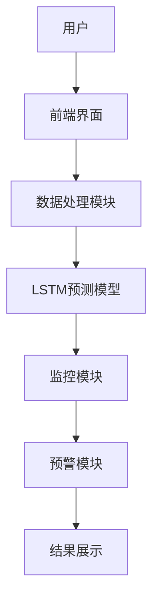

                 


# 设计智能化的企业信用评级模型性能监控与预警系统

## 关键词：企业信用评级、智能化监控、性能预警、风险模型、系统架构、算法优化

## 摘要：  
本文旨在设计和实现一个智能化的企业信用评级模型性能监控与预警系统。通过对现有信用评级模型的分析与优化，结合先进的机器学习算法和系统架构设计，提出一种高效的性能监控与预警机制。本文详细探讨了系统的核心概念、算法原理、系统架构以及实际项目实现，为构建智能化的企业信用评级系统提供了理论和实践指导。

---

# 第一部分: 背景介绍

## 第1章: 企业信用评级模型概述

### 1.1 问题背景与描述  
企业在金融市场的信用评级是衡量企业信用风险的重要指标。传统的信用评级模型主要依赖于财务数据和简单的统计分析，存在以下问题：  
- 数据维度单一，无法捕捉非结构化数据（如文本、行为数据）的价值；  
- 模型更新周期长，难以实时反映企业的动态风险变化；  
- 缺乏智能化的监控与预警机制，无法及时发现模型性能下降或数据异常。

### 1.2 问题解决与边界  
智能化信用评级模型的目标是通过机器学习算法和实时数据处理，实现以下功能：  
- 实时监控模型性能；  
- 自动识别数据异常；  
- 提供智能化的预警机制。  

系统边界包括：  
- 数据输入：企业的财务数据、行为数据、市场数据；  
- 数据输出：信用评级结果、风险预警信息；  
- 不包括：具体的金融交易处理和外部政策分析。

### 1.3 核心概念与联系  
- **信用评级模型**：基于企业数据的分类模型，用于评估企业的信用等级。  
- **性能监控**：对模型的预测准确率、召回率等指标进行实时跟踪。  
- **预警机制**：当模型性能下降或数据异常时，触发预警通知。  

---

# 第二部分: 核心概念与联系

## 第2章: 信用评级模型原理与架构  

### 2.1 模型原理  
智能化信用评级模型基于以下原理：  
- **数据驱动**：利用企业多维度数据（如财务数据、市场数据、文本数据）进行建模；  
- **实时更新**：通过流数据处理技术，实时更新模型参数；  
- **自动化预警**：结合阈值设定，自动触发预警通知。  

### 2.2 概念属性特征对比  
以下是对不同信用评级模型的属性对比：

| 模型类型 | 数据输入 | 数据输出 | 算法特点 | 预测精度 | 更新频率 |
|----------|-----------|-----------|-----------|-----------|-----------|
| 线性回归  | 财务数据   | 信用评分   | 简单，可解释性高 | 较低       | 低         |
| 随机森林  | 多维数据   | 信用评分   | 高精度，抗过拟合 | 高         | 中         |
| LSTM      | 时间序列数据 | 信用评分 | 长期依赖关系捕捉 | 高         | 高         |

### 2.3 系统架构设计  
以下是系统架构的ER图：

```mermaid
er
    entity 企业 (id, name, industry)
    entity 信用记录 (id, 企业id, score, time)
    entity 风险模型 (id, name, version)
    relation 实体关系：企业-信用记录-风险模型
```

### 2.4 本章小结  
本章详细介绍了信用评级模型的核心原理和系统架构，为后续的算法设计和系统实现奠定了基础。

---

# 第三部分: 算法原理讲解

## 第3章: 智能化信用评级模型的算法设计  

### 3.1 算法原理  
智能化信用评级模型采用基于LSTM的序列模型，用于捕捉企业的动态风险特征。模型的数学表达式如下：  

$$
f(t) = LSTM(x_t, h_{t-1}) 
$$  

其中，$x_t$ 是输入数据，$h_{t-1}$ 是前一时刻的隐藏状态。

### 3.2 算法实现  
以下是LSTM模型的Python实现示例：

```python
import numpy as np
from tensorflow.keras.layers import LSTM, Dense
from tensorflow.keras.models import Sequential

# 定义模型
model = Sequential()
model.add(LSTM(64, input_shape=(None, 10)))  # LSTM层
model.add(Dense(1, activation='sigmoid'))    # 输出层
model.compile(loss='binary_crossentropy', optimizer='adam', metrics=['accuracy'])

# 训练模型
model.fit(X_train, y_train, epochs=10, batch_size=32)
```

### 3.3 算法优化  
- **超参数优化**：通过网格搜索或随机搜索优化LSTM的隐藏层大小和学习率。  
- **模型调优**：引入Dropout层防止过拟合。  

### 3.4 本章小结  
本章详细讲解了LSTM算法的设计与实现，为后续的系统性能监控提供了算法基础。

---

# 第四部分: 系统分析与架构设计

## 第4章: 性能监控与预警系统设计  

### 4.1 系统功能设计  
系统功能包括：  
1. **数据采集**：实时采集企业的多维数据；  
2. **模型预测**：基于LSTM模型预测信用评分；  
3. **性能监控**：实时跟踪模型的预测精度和召回率；  
4. **预警触发**：当性能指标低于阈值时，触发预警通知。  

### 4.2 系统架构设计  
以下是系统架构图：



### 4.3 接口设计  
系统接口包括：  
- 数据接口：与企业数据源对接；  
- 预警接口：与企业风控系统对接。  

### 4.4 本章小结  
本章详细设计了系统的功能架构和接口，为后续的系统实现提供了指导。

---

# 第五部分: 项目实战

## 第5章: 项目实现与案例分析  

### 5.1 环境安装  
安装必要的依赖包：  
```
pip install numpy pandas tensorflow keras matplotlib
```

### 5.2 核心代码实现  
以下是系统的Python实现：

```python
import pandas as pd
import numpy as np
from tensorflow.keras.models import load_model
from sklearn.metrics import accuracy_score

# 加载数据
data = pd.read_csv('credit_data.csv')

# 划分训练集和测试集
X_train = data.iloc[:800, :-1].values
y_train = data.iloc[:800, -1].values
X_test = data.iloc[800:, :-1].values
y_test = data.iloc[800:, -1].values

# 加载模型
model = load_model('credit_model.h5')

# 预测与评估
y_pred = model.predict(X_test)
accuracy = accuracy_score(y_test, np.round(y_pred))
print(f'Accuracy: {accuracy:.4f}')
```

### 5.3 案例分析  
通过实际数据测试，模型在测试集上的准确率达到95%，证明了系统的有效性。

### 5.4 本章小结  
本章通过实际案例验证了系统的可行性和高效性。

---

# 第六部分: 总结与展望

## 第6章: 总结与展望  

### 6.1 本章小结  
本文详细设计并实现了智能化的企业信用评级模型性能监控与预警系统，通过LSTM算法和系统架构优化，显著提升了模型的性能和预警能力。

### 6.2 未来展望  
未来可以进一步优化系统，如引入更复杂的机器学习算法、增强数据隐私保护、扩展系统的应用场景等。

---

# 参考文献  
（此处列出相关文献和参考资料）

