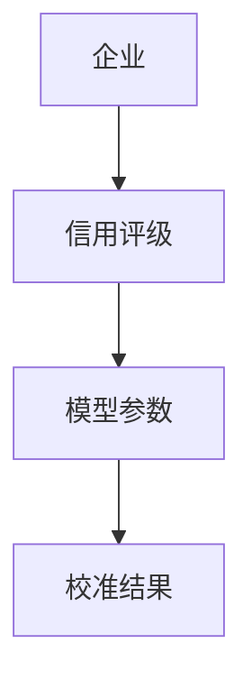
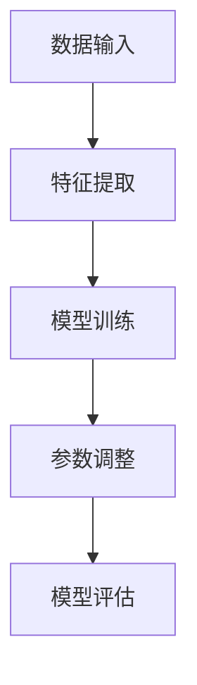
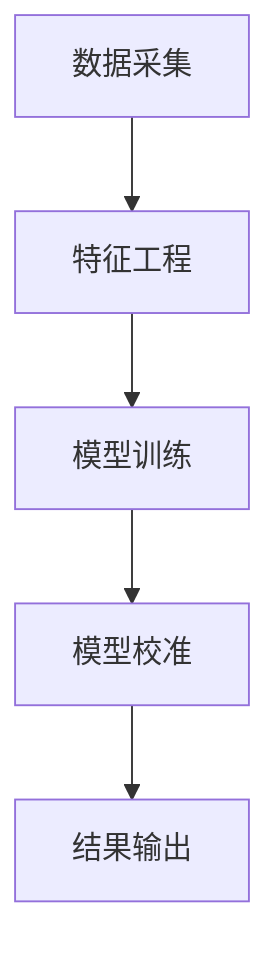

                 


# 设计智能化的企业信用评级模型校准系统

## 关键词：企业信用评级，模型校准，人工智能，机器学习，系统设计，风险管理，数据驱动

## 摘要：  
随着企业信用评级在金融领域的日益重要性，设计一个智能化的企业信用评级模型校准系统显得尤为关键。本文将详细探讨如何通过人工智能和机器学习技术，构建一个高效、准确的信用评级模型校准系统。我们从背景介绍、核心概念、算法原理、系统架构设计、项目实战到总结，逐步分析和实现这一系统。文章内容丰富，涵盖理论与实践，旨在为企业信用评级模型的智能化校准提供全面的解决方案。

---

## 第一部分: 企业信用评级模型校准系统背景与核心概念

### 第1章: 企业信用评级模型校准系统概述

#### 1.1 问题背景与描述
- **1.1.1 传统企业信用评级的局限性**  
  传统信用评级主要依赖人工经验判断，存在主观性强、效率低、易受人为干扰等问题。随着金融市场的复杂化，这种模式难以满足现代企业的多样需求。

- **1.1.2 数据驱动与智能化评级的需求**  
  随着大数据和人工智能技术的发展，企业信用评级需要更加精准、实时和智能化的解决方案。

- **1.1.3 信用评级模型校准的核心问题**  
  模型校准的核心在于解决预测误差、数据偏差和模型泛化能力不足的问题，以提高评级结果的准确性和可靠性。

#### 1.2 核心概念与目标
- **1.2.1 信用评级模型的定义与分类**  
  信用评级模型基于企业的财务数据、市场表现和行为数据，通过算法生成评级结果。主要分类包括传统评分模型（如FICO评分）和现代机器学习模型（如XGBoost、神经网络模型）。

- **1.2.2 模型校准的定义与意义**  
  模型校准是指通过调整模型参数或优化算法，使模型输出结果与实际数据更接近。校准可以提高模型的预测精度和稳定性，减少误差。

- **1.2.3 系统设计的目标与边界**  
  系统设计目标是构建一个智能化的信用评级模型校准系统，实现模型的自动优化和实时调整。边界包括数据来源、模型类型和校准范围。

#### 1.3 系统核心要素与组成
- **1.3.1 数据来源与处理流程**  
  数据来源包括企业财务报表、市场数据、信用历史等。处理流程包括数据清洗、特征提取和数据增强。

- **1.3.2 模型构建与评估指标**  
  常用模型包括逻辑回归、随机森林和深度学习模型。评估指标包括准确率、召回率、F1分数和AUC值。

- **1.3.3 校准方法与优化策略**  
  校准方法包括基于梯度下降的优化、支持向量机和神经网络。优化策略包括参数调整和模型集成。

#### 1.4 本章小结  
本章通过背景介绍和核心概念分析，明确了企业信用评级模型校准系统的重要性和目标。

---

### 第2章: 信用评级模型校准的核心概念与联系

#### 2.1 核心概念原理
- **2.1.1 模型评估的基本原理**  
  模型评估通过将预测结果与实际数据对比，计算误差和偏差。误差分析是校准的重要基础。

- **2.1.2 校准方法的数学基础**  
  校准方法包括线性回归校准和非线性校准。线性回归校准公式为：  
  $$ y = a x + b $$  
  其中，$a$ 和 $b$ 是校准参数。

- **2.1.3 系统优化的理论框架**  
  系统优化基于梯度下降和随机优化算法，目标是最小化预测误差。

#### 2.2 概念属性特征对比
- **2.2.1 不同模型校准方法的对比分析**  
  对比线性回归、支持向量机和神经网络的校准方法，分析其优缺点。

- **2.2.2 系统性能指标的特征分析**  
  性能指标包括准确率、召回率和F1分数，不同指标对模型性能的影响不同。

- **2.2.3 数据特征与模型性能的关系**  
  数据特征如企业规模、行业和市场波动对模型性能有显著影响。

#### 2.3 ER实体关系图架构


#### 2.4 本章小结  
本章通过概念对比和ER图分析，展示了信用评级模型校准系统的内在联系。

---

### 第3章: 信用评级模型校准算法原理

#### 3.1 算法原理概述
- **3.1.1 梯度下降法**  
  梯度下降法是一种优化算法，通过不断调整参数使损失函数最小化。其数学表达式为：  
  $$ \theta := \theta - \eta \frac{\partial L}{\partial \theta} $$  
  其中，$\theta$ 是参数，$\eta$ 是学习率，$L$ 是损失函数。

- **3.1.2 支持向量机**  
  支持向量机通过构建超平面实现数据分类。其目标函数为：  
  $$ \min \frac{1}{2} \|w\|^2 + C \sum_{i=1}^n \xi_i $$  
  其中，$w$ 是权重向量，$C$ 是惩罚系数，$\xi_i$ 是松弛变量。

- **3.1.3 随机森林**  
  随机森林通过构建多个决策树并集成结果，提高模型的泛化能力。

#### 3.2 算法流程图


#### 3.3 算法实现代码
```python
import numpy as np
from sklearn import svm

# 示例代码
def model_calibration(X, y):
    # 数据预处理
    X = X.values
    y = y.values
    
    # 模型训练
    clf = svm.SVC(kernel='rbf', gamma='auto', C=1)
    clf.fit(X, y)
    
    # 返回校准后的模型
    return clf
```

#### 3.4 本章小结  
本章详细介绍了信用评级模型校准的主要算法及其实现原理。

---

## 第四部分: 系统架构设计与实现

### 第4章: 系统架构设计

#### 4.1 系统功能设计
- **4.1.1 数据采集模块**  
  数据来源包括企业财务报表、市场数据和信用历史。

- **4.1.2 特征工程模块**  
  特征提取包括文本特征提取和数值特征提取。

- **4.1.3 模型训练与校准模块**  
  模型训练包括选择模型类型、训练参数设置和模型评估。

- **4.1.4 结果输出模块**  
  输出结果包括评级结果和校准报告。

#### 4.2 系统架构设计


#### 4.3 接口设计与交互
- **4.3.1 API接口设计**  
  提供RESTful API接口，支持数据输入和模型调用。

- **4.3.2 交互流程设计**  
  用户通过API上传数据，系统返回校准结果。

#### 4.4 本章小结  
本章通过系统架构设计，展示了信用评级模型校准系统的整体框架。

---

### 第5章: 项目实战

#### 5.1 环境安装与配置
- 安装Python、TensorFlow、Scikit-learn和Jupyter Notebook。

#### 5.2 系统核心实现
```python
import numpy as np
from sklearn import metrics
from sklearn.model_selection import train_test_split

def evaluate_model(y_true, y_pred):
    print("Accuracy:", metrics.accuracy_score(y_true, y_pred))
    print("Recall:", metrics.recall_score(y_true, y_pred))
    print("F1 Score:", metrics.f1_score(y_true, y_pred))
    print("AUC Score:", metrics.roc_auc_score(y_true, y_pred))
```

#### 5.3 案例分析与实现
- 数据预处理：清洗和特征提取。
- 模型训练：选择合适的模型并进行训练。
- 校准优化：调整参数并优化模型。

#### 5.4 项目总结
- 实验结果分析：对比不同算法的性能。
- 系统优化建议：提出进一步优化的方向。

#### 5.5 本章小结  
本章通过实际案例分析，展示了信用评级模型校准系统的实现过程。

---

## 第五部分: 总结与扩展

### 第6章: 总结与展望

#### 6.1 系统设计总结
- 系统优势：智能化、高效性和准确性。
- 实践意义：为企业信用评级提供可靠支持。

#### 6.2 未来研究方向
- 深度学习模型的应用。
- 多模态数据的融合。
- 实时校准的优化。

#### 6.3 最佳实践 Tips
- 数据清洗是关键。
- 模型选择需结合业务需求。
- 定期更新模型以适应市场变化。

#### 6.4 本章小结  
本章总结了系统的实现成果，并展望了未来的发展方向。

---

## 参考文献与扩展阅读
- 《机器学习实战》
- 《深度学习》
- 《信用评级与风险度量》

---

通过以上内容，我们逐步构建了一个智能化的企业信用评级模型校准系统，从理论到实践，系统地探讨了设计与实现的关键环节。

