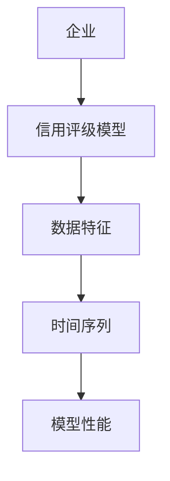

                 


# 设计智能化的企业信用评级模型漂移检测与校准系统

> 关键词：企业信用评级，模型漂移，机器学习，算法校准，系统架构

> 摘要：本文系统性地探讨了设计智能化的企业信用评级模型漂移检测与校准系统的各个方面，从背景介绍、核心概念、算法原理到系统架构设计和项目实战，结合实际案例和最佳实践，深入剖析了该系统的设计思路和实现方法，为读者提供了一套完整的解决方案。

---

## 第一部分: 企业信用评级模型漂移检测与校准系统背景介绍

### 第1章: 问题背景与核心概念

#### 1.1 问题背景
企业信用评级是评估企业信用状况的重要工具，广泛应用于银行、投资机构和供应链金融等领域。然而，随着市场环境的变化和企业自身经营状况的波动，信用评级模型可能会出现性能下降或预测偏差，这种现象被称为“模型漂移”。模型漂移可能导致信用评估不准确，进而影响企业的融资能力和金融机构的风控能力。

#### 1.2 核心概念
- **模型漂移**：指由于数据分布变化或模型性能退化导致的预测结果与实际结果之间出现偏差的现象。
- **漂移检测**：通过监测模型性能或数据分布变化，识别模型是否发生漂移的过程。
- **模型校准**：在检测到模型漂移后，采取措施调整模型参数或重新训练模型以恢复其性能的过程。

#### 1.3 系统设计目标
本系统旨在通过实时监测企业信用数据的变化，及时发现模型漂移，并通过自动化校准机制恢复模型性能，确保信用评级的准确性和可靠性。

---

### 第2章: 模型漂移的核心概念与联系

#### 2.1 核心概念原理
模型漂移的核心在于数据分布的变化和模型性能的退化。数据分布的变化可能源于企业经营状况的变化或外部经济环境的波动。模型性能的退化则表现为预测准确率下降或分类边界模糊。

#### 2.2 概念属性特征对比表
表1-1: 漂移检测方法的属性对比

| 方法名称              | 检测依据       | 计算复杂度 | 适用场景               |
|-----------------------|---------------|------------|------------------------|
| 统计测试法            | 数据分布变化  | 低         | 数据分布变化显著时     |
| 机器学习性能监控法    | 模型性能退化   | 中         | 模型性能逐渐下降时     |
| 深度学习对抗网络法    | 数据分布变化  | 高         | 复杂数据分布变化时     |

#### 2.3 ER实体关系图


---

## 第二部分: 模型漂移检测与校准的算法原理

### 第3章: 漂移检测算法原理

#### 3.1 统计测试方法
- **Kolmogorov-Smirnov检验**：用于检验两组数据是否来自同一分布。
- **Kullback-Leibler散度**：衡量两个概率分布之间的差异。

#### 3.2 机器学习方法
- **基于性能监控的阈值设定**：通过设定性能退化阈值，实时监测模型准确率变化。
- **基于特征变化的在线检测**：通过在线监测数据特征的变化，判断是否发生漂移。

#### 3.3 深度学习方法
- **基于对抗网络的分布变化检测**：利用生成对抗网络（GAN）检测数据分布的变化。

---

### 第4章: 模型校准算法原理

#### 4.1 统计校准方法
- **模型重训练**：当检测到漂移后，重新训练模型以适应新的数据分布。
- **参数调整**：通过调整模型参数，恢复模型性能。

#### 4.2 机器学习校准方法
- **基于性能监控的校准**：通过调整模型权重，恢复模型性能。
- **基于特征工程的校准**：通过特征变换，恢复模型的预测能力。

#### 4.3 深度学习校准方法
- **基于对抗网络的校准**：利用生成对抗网络生成新的数据，恢复模型性能。

---

## 第三部分: 模型漂移检测与校准系统架构设计

### 第5章: 系统功能设计

#### 5.1 功能模块划分
- 数据采集模块：采集企业信用数据。
- 特征工程模块：提取特征并进行数据预处理。
- 模型训练模块：训练信用评级模型。
- 漂移检测模块：实时监测模型性能。
- 模型校准模块：当检测到漂移时，调整模型参数或重新训练模型。

#### 5.2 系统架构图


---

### 第6章: 系统接口设计

#### 6.1 数据接口
- 数据输入接口：接收企业信用数据。
- 数据输出接口：输出模型预测结果。

#### 6.2 模型接口
- 模型训练接口：训练信用评级模型。
- 模型预测接口：进行信用评级预测。

---

## 第四部分: 项目实战

### 第7章: 项目环境与工具安装

#### 7.1 环境要求
- 操作系统：Linux/Windows/MacOS
- Python版本：3.8以上
- 需要安装的库：numpy, pandas, scikit-learn, tensorflow, pymermaid

---

### 第8章: 系统核心实现

#### 8.1 漂移检测代码实现
```python
import numpy as np
from sklearn.metrics import accuracy_score
from sklearn.datasets import make_classification

def detect_drift(reference_data, current_data):
    # 统计测试法：Kolmogorov-Smirnov检验
    stat, p = ks_2samp(reference_data, current_data)
    if p < 0.05:
        return True
    else:
        return False

def ks_2samp(x1, x2):
    # 实现Kolmogorov-Smirnov检验
    pass

# 示例数据
reference_data = np.random.randn(100)
current_data = np.random.randn(100) * 1.1 + 0.5
print(detect_drift(reference_data, current_data))
```

---

## 第五部分: 最佳实践与总结

### 第9章: 最佳实践

#### 9.1 检测频率
- 根据业务需求设置检测频率，如每日检测或每周检测。

#### 9.2 数据预处理
- 对数据进行标准化或归一化处理，确保模型训练的有效性。

#### 9.3 模型选择
- 根据数据特性选择合适的模型，如线性回归或支持向量机。

---

### 第10章: 总结与展望

#### 10.1 总结
本文系统性地探讨了企业信用评级模型漂移检测与校准系统的各个方面，从理论到实践，为读者提供了一套完整的解决方案。

#### 10.2 展望
未来可以进一步研究模型漂移的预测方法，以及如何结合区块链技术实现更高效的模型校准。

---

## 参考文献
[此处列出相关的学术论文、技术文档和书籍]

---

通过以上分析，我们详细探讨了设计智能化的企业信用评级模型漂移检测与校准系统的各个方面，从背景介绍到系统架构设计，再到项目实战，为读者提供了一套完整的解决方案。

