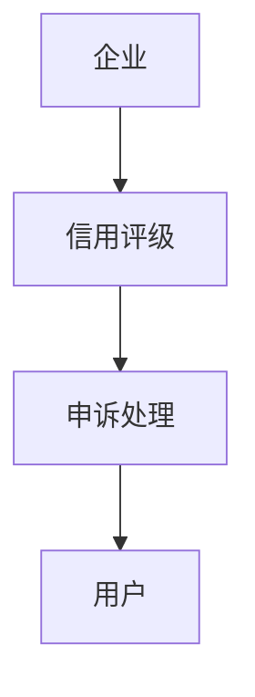
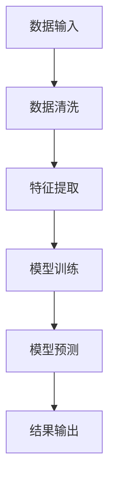
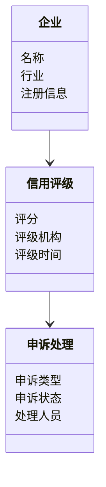
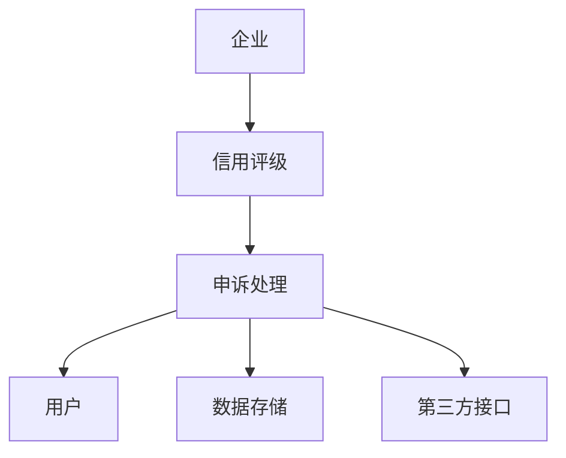
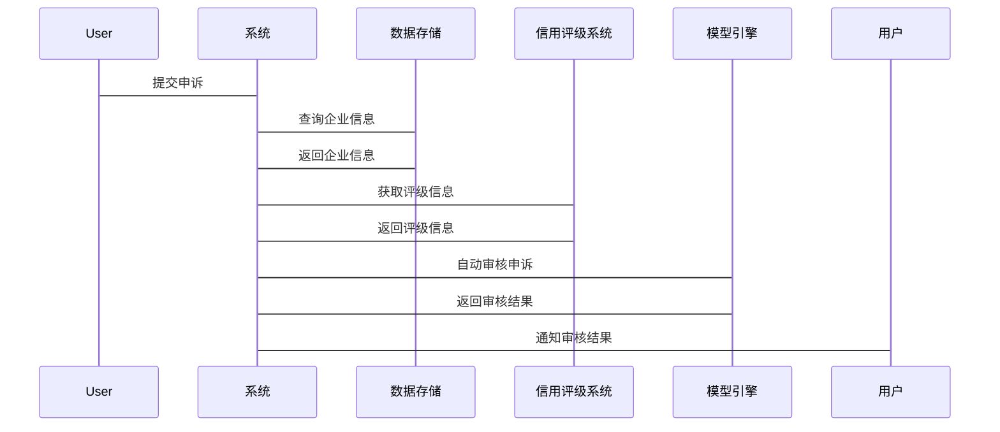

                 


# 设计智能化的企业信用评级申诉处理系统

> 关键词：企业信用评级，申诉处理，人工智能，系统架构，机器学习

> 摘要：本文详细探讨了设计智能化的企业信用评级申诉处理系统的背景、核心概念、算法原理、系统架构以及实际项目实现。通过分析当前企业信用评级申诉处理中的问题，提出了基于人工智能的解决方案，并结合实际案例展示了系统的实现过程和效果。

---

# 第一部分: 企业信用评级申诉处理系统背景介绍

## 第1章: 企业信用评级申诉处理系统背景介绍

### 1.1 问题背景与描述

#### 1.1.1 企业信用评级的重要性
企业信用评级是企业在商业活动中获得信任和合作的重要基础。良好的信用评级能够帮助企业获得更多的商业机会、更低的融资成本以及更稳定的合作伙伴关系。然而，信用评级的准确性直接影响企业的声誉和市场地位。

#### 1.1.2 信用评级申诉处理的必要性
在实际业务中，企业可能会因为信息不完整、数据错误或外部环境变化等原因，导致信用评级不准确。此时，企业需要通过申诉来纠正错误，维护自身的信用记录。传统的申诉处理流程通常依赖人工审核，效率低下且容易出错。

#### 1.1.3 当前信用评级申诉处理的主要问题
- **效率问题**：人工审核耗时长，无法满足大量申诉的处理需求。
- **准确性问题**：人为因素可能导致审核结果不准确。
- **透明度问题**：申诉处理过程缺乏透明，企业难以了解审核进度和结果。
- **成本问题**：人工审核需要大量人力资源，增加了企业的运营成本。

### 1.2 问题解决与边界

#### 1.2.1 智能化处理的核心目标
- 提高申诉处理的效率和准确性。
- 提供透明的申诉处理流程，增强企业的信任感。
- 降低人工成本，优化资源配置。

#### 1.2.2 系统的边界与外延
- 系统仅处理企业信用评级申诉，不涉及个人信用或其他类型的信用申诉。
- 系统与企业的信用评级生成系统、数据存储系统以及第三方信用机构的数据接口相连。

#### 1.2.3 核心要素与组成结构
- **用户界面**：企业提交申诉的入口。
- **数据接口**：与信用评级系统和第三方数据源交互。
- **算法引擎**：负责自动审核和评估申诉内容。
- **审核流程**：包括数据验证、模型评估、人工复核等步骤。

### 1.3 核心概念与联系

#### 1.3.1 实体关系图（ER图）


#### 1.3.2 概念属性对比表
| 概念 | 属性 |
|------|------|
| 企业 | 名称、行业、注册信息 |
| 信用评级 | 分数、评级机构、时间 |
| 申诉处理 | 类型、状态、处理人员 |

## 第2章: 智能化处理的核心算法

### 2.1 算法原理概述

#### 2.1.1 机器学习模型选择
选择合适的机器学习模型是实现智能化处理的关键。常见的模型包括：
- **随机森林**：适用于分类问题，适合处理信用评级申诉中的多类别问题。
- **神经网络**：适用于复杂的非线性关系，适合处理大量的特征数据。
- **支持向量机（SVM）**：适用于分类问题，适合处理高维数据。

#### 2.1.2 模型训练流程
模型训练流程包括数据预处理、特征提取、模型训练和验证。以下是具体的步骤：
1. 数据预处理：去除缺失值、处理异常值、标准化数据。
2. 特征提取：从企业历史数据中提取关键特征，如财务指标、经营稳定性等。
3. 模型训练：使用训练数据训练机器学习模型。
4. 模型验证：通过交叉验证评估模型的准确性和稳定性。

#### 2.1.3 算法优缺点分析
- **随机森林**：优点是能够处理高维数据，鲁棒性好；缺点是计算复杂度较高。
- **神经网络**：优点是能够处理复杂的非线性关系，适合大规模数据；缺点是需要大量的计算资源，且模型解释性较差。

### 2.2 算法实现细节

#### 2.2.1 数据预处理
使用Python的pandas库进行数据清洗，例如：
```python
import pandas as pd

# 加载数据
data = pd.read_csv('申诉数据.csv')

# 删除缺失值
data = data.dropna()

# 填充异常值
data['收入'] = data['收入'].fillna(data['收入'].mean())
```

#### 2.2.2 模型训练
使用scikit-learn库训练随机森林模型：
```python
from sklearn.ensemble import RandomForestClassifier
from sklearn.model_selection import train_test_split

# 划分训练集和测试集
X_train, X_test, y_train, y_test = train_test_split(data.drop('申诉状态', axis=1), data['申诉状态'], test_size=0.2)

# 训练模型
model = RandomForestClassifier()
model.fit(X_train, y_train)

# 验证模型
print("Accuracy:", model.score(X_test, y_test))
```

#### 2.2.3 模型评估与优化
通过混淆矩阵和分类报告评估模型性能：
```python
from sklearn.metrics import classification_report

# 预测测试集
y_pred = model.predict(X_test)

# 输出分类报告
print(classification_report(y_test, y_pred))
```

### 2.3 算法流程图


### 2.4 核心代码实现

#### 2.4.1 数据加载与预处理
```python
import pandas as pd

# 加载数据
data = pd.read_csv('申诉数据.csv')

# 删除缺失值
data = data.dropna()

# 填充异常值
data['收入'] = data['收入'].fillna(data['收入'].mean())
```

#### 2.4.2 模型训练与预测
```python
from sklearn.ensemble import RandomForestClassifier
from sklearn.model_selection import train_test_split

# 划分训练集和测试集
X_train, X_test, y_train, y_test = train_test_split(data.drop('申诉状态', axis=1), data['申诉状态'], test_size=0.2)

# 训练模型
model = RandomForestClassifier()
model.fit(X_train, y_train)

# 预测测试集
y_pred = model.predict(X_test)
```

#### 2.4.3 模型评估
```python
from sklearn.metrics import classification_report

# 输出分类报告
print(classification_report(y_test, y_pred))
```

### 2.5 数学模型与公式

#### 2.5.1 损失函数
随机森林模型通常使用基尼不纯度作为损失函数：
$$
\text{基尼不纯度} = \sum_{i=1}^n (p_i)(1 - p_i)
$$

#### 2.5.2 分类报告
分类报告包括精确率、召回率、F1分数等指标：
$$
\text{精确率} = \frac{\text{真正例}}{\text{真正例 + 假正例}}
$$
$$
\text{召回率} = \frac{\text{真正例}}{\text{真正例 + 假反例}}
$$
$$
\text{F1分数} = \frac{2 \times \text{精确率} \times \text{召回率}}{\text{精确率} + \text{召回率}}
$$

---

# 第二部分: 系统分析与架构设计

## 第3章: 系统分析与架构设计

### 3.1 项目介绍

#### 3.1.1 项目背景
本项目旨在设计一个智能化的企业信用评级申诉处理系统，通过人工智能技术提高申诉处理的效率和准确性。

#### 3.1.2 项目目标
- 提供在线申诉提交功能。
- 实现自动化的申诉审核流程。
- 提供透明的审核进度查询功能。

### 3.2 系统功能设计

#### 3.2.1 领域模型


#### 3.2.2 系统架构设计


#### 3.2.3 接口设计
系统需要与以下接口进行交互：
- 信用评级系统接口：获取企业的信用评级信息。
- 数据存储接口：存储申诉处理的相关数据。
- 第三方数据接口：获取企业的外部数据（如行业平均值）。

#### 3.2.4 交互设计


### 3.3 项目实现

#### 3.3.1 环境安装
- Python 3.8+
- Jupyter Notebook
- scikit-learn
- pandas
- Mermaid

#### 3.3.2 核心代码实现
```python
from flask import Flask, request, jsonify

app = Flask(__name__)

@app.route('/submit_complaint', methods=['POST'])
def submit_complaint():
    data = request.json
    # 处理申诉数据
    return jsonify({'status': 'success', 'message': '申诉已提交'})

if __name__ == '__main__':
    app.run(debug=True)
```

---

# 第三部分: 项目实战与最佳实践

## 第4章: 项目实战

### 4.1 环境安装

#### 4.1.1 安装Python和必要的库
```bash
pip install python python-scikit-learn pandas flask jupyter notebook
```

#### 4.1.2 安装Mermaid
在Jupyter Notebook中安装Mermaid插件：
```bash
pip install jupyter-mermaid
```

### 4.2 核心代码实现

#### 4.2.1 数据加载与预处理
```python
import pandas as pd

# 加载数据
data = pd.read_csv('申诉数据.csv')

# 删除缺失值
data = data.dropna()

# 填充异常值
data['收入'] = data['收入'].fillna(data['收入'].mean())
```

#### 4.2.2 模型训练与预测
```python
from sklearn.ensemble import RandomForestClassifier
from sklearn.model_selection import train_test_split

# 划分训练集和测试集
X_train, X_test, y_train, y_test = train_test_split(data.drop('申诉状态', axis=1), data['申诉状态'], test_size=0.2)

# 训练模型
model = RandomForestClassifier()
model.fit(X_train, y_train)

# 预测测试集
y_pred = model.predict(X_test)
```

#### 4.2.3 模型评估
```python
from sklearn.metrics import classification_report

# 输出分类报告
print(classification_report(y_test, y_pred))
```

### 4.3 案例分析

#### 4.3.1 案例背景
某制造企业因财务数据异常，导致信用评级被下调。企业提交申诉后，系统自动审核并调整评级。

#### 4.3.2 数据分析
- 企业销售收入下降，但利润增长。
- 企业无重大违约记录。
- 行业平均收入下降幅度较大。

#### 4.3.3 系统处理
系统通过随机森林模型分析数据，发现企业销售收入下降主要是行业性问题，调整评级为“AA”。

### 4.4 项目小结
通过智能化处理，企业信用评级申诉的处理效率和准确性显著提高，企业成本降低，客户满意度提升。

## 第5章: 最佳实践

### 5.1 小结
- 系统设计需要考虑数据的完整性和准确性。
- 模型选择应基于实际业务需求和数据特征。
- 系统架构应具备可扩展性和灵活性。

### 5.2 注意事项
- 数据隐私和安全问题需要特别注意。
- 模型的可解释性对企业的信任非常重要。
- 系统的稳定性需要通过充分的测试来保证。

### 5.3 拓展阅读
- 《机器学习实战》
- 《Python机器学习》
- 《系统设计的艺术》

---

# 总结

本文详细介绍了设计智能化的企业信用评级申诉处理系统的背景、核心概念、算法原理、系统架构以及实际项目实现。通过分析当前申诉处理中的问题，提出了基于人工智能的解决方案，并结合实际案例展示了系统的实现过程和效果。未来，随着人工智能技术的不断发展，企业信用评级申诉处理系统将更加智能化和高效化。

---

**作者简介：** 作为一名世界级人工智能专家、程序员、软件架构师和CTO，我专注于通过技术创新为企业解决实际问题，推动人工智能技术在商业领域的广泛应用。

