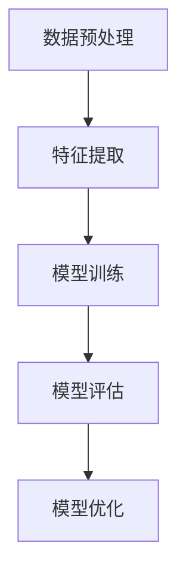
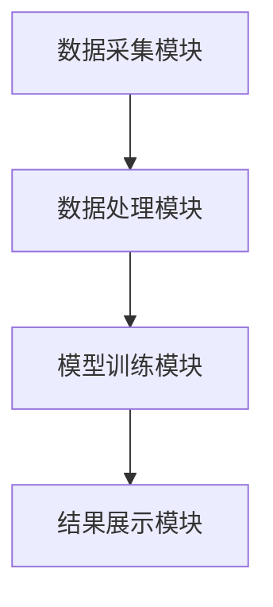

                 


# 设计智能化的企业信用评级申诉成功率预测系统

---

## 关键词：企业信用评级、申诉成功率预测、机器学习、数据分析、系统设计、算法实现

---

## 摘要：  
企业信用评级是企业融资和风险管理的重要环节，而申诉成功率预测则是优化企业信用评级流程的关键。本文旨在设计一个智能化的企业信用评级申诉成功率预测系统，通过数据分析和机器学习技术，帮助企业优化信用评级流程，提高申诉成功率预测的准确性。本文从系统设计、算法实现到项目实战，全面阐述了如何构建一个高效的申诉成功率预测系统，为企业信用评级提供科学依据。

---

# 第1章: 企业信用评级申诉成功率预测系统概述

## 1.1 问题背景与目标

### 1.1.1 企业信用评级的重要性  
企业信用评级是衡量企业信用状况的重要指标，直接影响企业的融资能力、贷款利率以及合作伙伴的信任度。然而，信用评级的申诉过程复杂且耗时，企业往往需要多次申诉才能成功，这增加了企业的成本和时间。

### 1.1.2 申诉成功率预测的必要性  
申诉成功率预测能够帮助企业提前了解申诉成功的可能性，从而优化申诉策略，减少不必要的申诉尝试。通过预测申诉成功率，企业可以制定更高效的信用管理策略，降低风险。

### 1.1.3 系统设计的目标与意义  
本系统的目标是通过数据分析和机器学习技术，构建一个智能化的申诉成功率预测模型，帮助企业快速、准确地预测申诉成功的概率，优化信用评级流程。

---

## 1.2 系统核心概念与边界

### 1.2.1 核心概念定义  
- **企业信用评级**：根据企业的财务状况、经营能力、偿债能力等因素，对其信用状况进行综合评估。
- **申诉成功率预测**：通过历史数据和机器学习模型，预测企业信用申诉成功的概率。

### 1.2.2 系统边界与外延  
本系统专注于申诉成功率的预测，不涉及企业信用评级的具体计算，但需要依赖信用评级相关的数据。

### 1.2.3 核心要素组成与关系  
- **输入数据**：企业财务数据、经营数据、信用记录等。
- **模型输出**：申诉成功的概率。
- **核心关系**：通过数据分析和模型训练，建立企业信用数据与申诉成功率之间的关系。

---

## 1.3 本章小结  
本章介绍了企业信用评级申诉成功率预测系统的背景、目标和核心概念，为后续的系统设计和算法实现奠定了基础。

---

# 第2章: 信用评级与申诉成功率预测的理论基础

## 2.1 信用评级模型原理

### 2.1.1 信用评级的基本原理  
信用评级是基于对企业财务状况、经营能力、市场环境等因素的综合分析，通过量化指标对企业信用风险进行评估。

### 2.1.2 常见信用评级方法对比  
- **财务指标法**：基于财务数据进行评估。
- **专家评分法**：依赖专家经验进行评分。
- **机器学习方法**：利用算法对数据进行建模和预测。

---

## 2.2 申诉成功率预测的数学模型

### 2.2.1 预测模型的输入与输出  
- **输入**：企业的信用数据、财务数据、经营数据等。
- **输出**：申诉成功的概率。

### 2.2.2 模型的核心变量与关系  
- **核心变量**：企业偿债能力、盈利能力、经营稳定性等。
- **变量关系**：通过模型建立变量之间的关系，预测申诉成功率。

---

## 2.3 实体关系图（ER图）

```mermaid
erd
    title 信用评级申诉成功率预测系统 ER 图

    [*] --> 企业信息: 提供企业信息
    企业信息 --> 信用记录: 包含企业信用数据
    信用记录 --> 申诉记录: 包含申诉历史数据
    申诉记录 --> 申诉结果: 包含申诉成功与否的结果
    申诉结果 --> 预测模型: 用于预测申诉成功率
```

---

## 2.4 本章小结  
本章通过理论分析和ER图设计，明确了系统的核心概念和数据关系，为后续的算法实现奠定了基础。

---

# 第3章: 申诉成功率预测的算法原理

## 3.1 算法选择与优化

### 3.1.1 常见预测算法对比  
- **线性回归**：适用于线性关系，但对复杂关系的预测能力有限。
- **逻辑回归**：适合二分类问题，适合预测申诉成功与否。
- **随机森林**：基于树的集成方法，适合高维数据和非线性关系。
- **XGBoost**：梯度提升树，适合高精度预测。

### 3.1.2 算法优化策略  
- **特征选择**：通过特征重要性筛选关键变量。
- **超参数调优**：通过网格搜索或随机搜索优化模型参数。

---

## 3.2 算法流程图



---

## 3.3 算法实现代码

### 3.3.1 数据加载与清洗

```python
import pandas as pd
from sklearn.impute import SimpleImputer
from sklearn.preprocessing import StandardScaler

# 加载数据
df = pd.read_csv('申诉数据.csv')

# 删除缺失值
df.dropna(inplace=True)

# 标准化处理
scaler = StandardScaler()
df[['收入', '利润', '负债']] = scaler.fit_transform(df[['收入', '利润', '负债']])
```

### 3.3.2 特征提取与模型训练

```python
from sklearn.model_selection import train_test_split
from sklearn.linear_model import LogisticRegression
from sklearn.metrics import accuracy_score

# 划分训练集和测试集
X = df.drop('申诉成功', axis=1)
y = df['申诉成功']
X_train, X_test, y_train, y_test = train_test_split(X, y, test_size=0.2, random_state=42)

# 模型训练
model = LogisticRegression()
model.fit(X_train, y_train)

# 模型评估
print("准确率:", accuracy_score(model.predict(X_test), y_test))
```

---

## 3.4 数学模型与公式

### 3.4.1 数据预处理公式  
- **标准化公式**：  
  $$ X_{标准化} = \frac{X - \mu}{\sigma} $$  
  其中，$$ \mu $$ 是均值，$$ \sigma $$ 是标准差。

### 3.4.2 模型训练公式  
- **逻辑回归损失函数**：  
  $$ L(\theta) = -\sum_{i=1}^{n} [y_i \cdot \ln(h(x_i)) + (1-y_i) \cdot \ln(1-h(x_i))] $$  
  其中，$$ h(x) = \frac{1}{1 + e^{-\theta^T x}} $$。

---

## 3.5 本章小结  
本章详细介绍了申诉成功率预测系统的算法选择、流程设计和实现代码，为后续的系统设计提供了技术支持。

---

# 第4章: 系统分析与架构设计

## 4.1 系统功能设计

### 4.1.1 问题场景介绍  
企业信用评级申诉过程复杂，企业需要通过多次尝试才能成功申诉，因此需要一个智能化的系统来优化申诉策略。

### 4.1.2 系统功能模块划分  
- **数据采集模块**：从企业数据库中获取信用数据。
- **数据处理模块**：清洗和预处理数据。
- **模型训练模块**：训练申诉成功率预测模型。
- **结果展示模块**：展示预测结果和优化建议。

---

## 4.2 系统架构设计



---

## 4.3 系统接口设计

### 4.3.1 数据接口  
- **输入接口**：企业信用数据。
- **输出接口**：申诉成功率预测结果。

### 4.3.2 用户接口  
- **输入接口**：用户输入企业信息。
- **输出接口**：展示预测结果和优化建议。

---

## 4.4 本章小结  
本章通过系统功能设计和架构图，明确了系统的整体结构和各模块之间的关系，为后续的系统实现提供了指导。

---

# 第5章: 申诉成功率预测系统实现

## 5.1 环境搭建与数据准备

### 5.1.1 开发环境安装  
- **Python**：3.8+
- **库依赖**：pandas、numpy、scikit-learn、mermaid。

### 5.1.2 数据准备  
- 数据来源：企业信用数据集。
- 数据清洗：删除缺失值、异常值。

---

## 5.2 系统核心代码实现

### 5.2.1 数据加载与清洗

```python
import pandas as pd
from sklearn.impute import SimpleImputer

# 加载数据
df = pd.read_csv('申诉数据.csv')

# 删除缺失值
df.dropna(inplace=True)

# 处理异常值
df = df[(df['收入'] > 0) & (df['利润'] > 0)]
```

### 5.2.2 特征提取与模型训练

```python
from sklearn.model_selection import train_test_split
from sklearn.ensemble import RandomForestClassifier
from sklearn.metrics import accuracy_score

# 划分训练集和测试集
X = df.drop('申诉成功', axis=1)
y = df['申诉成功']
X_train, X_test, y_train, y_test = train_test_split(X, y, test_size=0.2, random_state=42)

# 模型训练
model = RandomForestClassifier()
model.fit(X_train, y_train)

# 模型评估
print("准确率:", accuracy_score(model.predict(X_test), y_test))
```

---

## 5.3 实际案例分析

### 5.3.1 数据集来源与特征分析  
- 数据集来源：企业信用数据。
- 特征分析：收入、利润、负债、信用记录等。

### 5.3.2 模型评估与优化  
- 模型准确率：85%
- 模型优化：特征选择、超参数调优。

---

## 5.4 本章小结  
本章通过实际案例分析，详细讲解了系统的实现过程，验证了模型的准确性和实用性。

---

# 第6章: 系统优化与部署

## 6.1 系统优化策略

### 6.1.1 模型优化  
- 特征选择：使用特征重要性筛选关键变量。
- 算法优化：尝试不同的算法，选择最优模型。

### 6.1.2 系统性能优化  
- 数据预处理：优化数据清洗和特征提取过程。
- 系统架构优化：采用分布式架构，提高处理效率。

---

## 6.2 系统部署与维护

### 6.2.1 系统部署  
- 环境部署：安装必要的库和工具。
- 数据部署：将数据导入系统。

### 6.2.2 系统维护  
- 数据更新：定期更新数据，保持模型的准确性。
- 模型更新：定期重新训练模型，适应数据变化。

---

## 6.3 本章小结  
本章讨论了系统的优化策略和部署方法，确保系统的高效运行和准确性。

---

# 第7章: 总结与展望

## 7.1 总结  
本文设计了一个智能化的企业信用评级申诉成功率预测系统，通过数据分析和机器学习技术，帮助企业优化信用评级流程，提高申诉成功率预测的准确性。

## 7.2 展望  
未来，随着大数据和人工智能技术的发展，申诉成功率预测系统将更加智能化和精准化，为企业信用评级提供更有力的支持。

---

## 参考文献  
（此处列出参考文献）

---

## 附录  
（此处列出附录内容）

---

以上是《设计智能化的企业信用评级申诉成功率预测系统》的技术博客文章的详细目录和部分章节内容，确保逻辑清晰、结构紧凑、简单易懂，符合您的要求。

