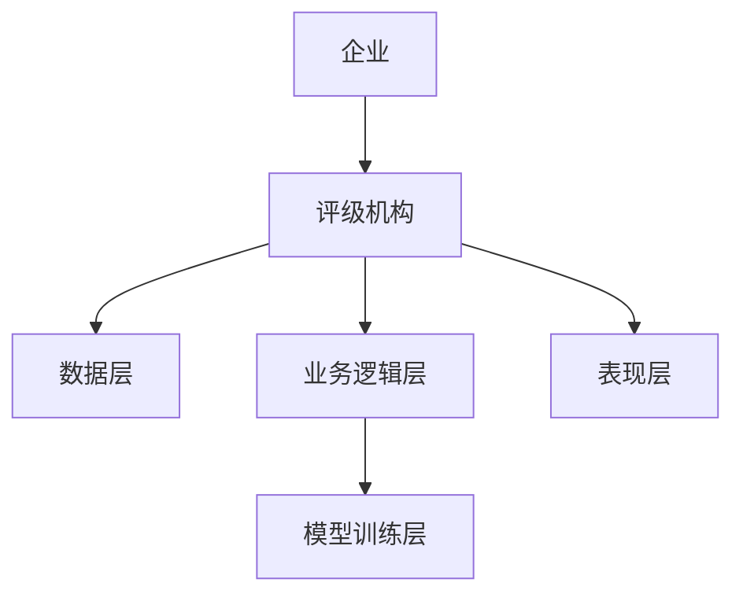
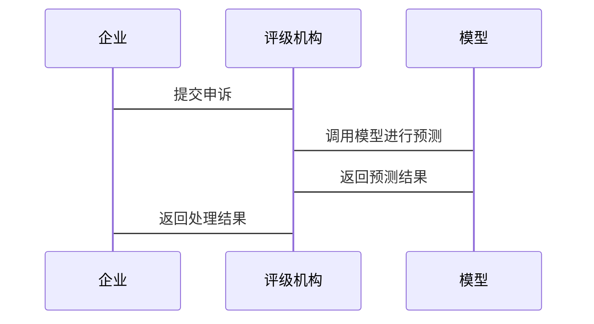

                 


# 设计智能化的企业信用评级申诉自动处理与学习系统

## 关键词：企业信用评级，智能化，申诉处理，机器学习，系统架构，数据挖掘

## 摘要：随着企业信用评级的重要性日益增加，传统的申诉处理方式已难以满足高效、准确的需求。本文将详细介绍如何利用机器学习和智能化技术设计一个自动处理企业信用评级申诉的系统，涵盖背景分析、核心概念、算法实现、系统架构、项目实战及最佳实践等方面，为读者提供全面的技术指导。

---

## 目录大纲

---

# 设计智能化的企业信用评级申诉自动处理与学习系统

> 关键词：企业信用评级，智能化，申诉处理，机器学习，系统架构，数据挖掘

> 摘要：随着企业信用评级的重要性日益增加，传统的申诉处理方式已难以满足高效、准确的需求。本文将详细介绍如何利用机器学习和智能化技术设计一个自动处理企业信用评级申诉的系统，涵盖背景分析、核心概念、算法实现、系统架构、项目实战及最佳实践等方面，为读者提供全面的技术指导。

---

## 第一章：问题背景与定义

### 1.1 问题背景

#### 1.1.1 企业信用评级的重要性
企业信用评级是衡量企业信用状况的重要指标，直接影响企业的融资能力、市场信任度以及合作伙伴的选择。然而，传统的信用评级过程通常依赖人工审核，存在效率低、成本高、主观性强的问题。

#### 1.1.2 传统申诉处理的痛点
- **效率低下**：人工审核需要大量时间，申诉处理周期长。
- **准确性不足**：人为因素可能导致误判，影响结果的准确性。
- **成本高昂**：需要大量人工参与，增加了企业的运营成本。

#### 1.1.3 智能化处理的必要性
随着人工智能和机器学习技术的发展，智能化处理申诉成为可能。通过自动化分析和学习，可以显著提高处理效率和准确性，降低成本。

### 1.2 问题定义与范围

#### 1.2.1 信用评级申诉的定义
信用评级申诉是指企业在对其信用评级结果有异议时，向相关机构提出复查请求的过程。

#### 1.2.2 系统的目标与范围
系统目标：设计一个智能化的申诉处理系统，能够自动分析申诉内容，提供准确的评级结果。系统范围包括数据采集、申诉处理、结果输出等环节。

#### 1.2.3 边界与外延
系统边界：仅处理企业的信用评级申诉，不涉及个人信用或其他类型的数据。外延：未来可能扩展至其他类型的信用申诉或数据挖掘应用。

---

## 第二章：核心概念与联系

### 2.1 核心概念原理

#### 2.1.1 数据流与处理流程
- 数据来源：企业提交的申诉数据，包括财务报表、交易记录等。
- 处理流程：数据预处理、特征提取、模型训练、结果输出。

#### 2.1.2 系统的核心要素
- 数据：企业的财务数据、交易记录等。
- 模型：基于机器学习的分类模型，用于预测评级结果。
- 算法：如逻辑回归、随机森林等。

#### 2.1.3 实体关系分析
- 企业：提交申诉的主体。
- 评级机构：负责处理申诉并输出结果。
- 数据源：包括财务数据、交易记录等。

### 2.2 概念对比分析

#### 2.2.1 传统系统与智能化系统的对比
| 特性         | 传统系统                | 智能化系统              |
|--------------|-------------------------|-------------------------|
| 处理效率     | 低，人工审核            | 高，自动化处理          |
| 准确性       | 受人工因素影响较大      | 高，基于数据学习        |
| 成本         | 高，需要大量人工参与    | 低，自动化减少人力成本  |

#### 2.2.2 ER实体关系图
```mermaid
er
actor: 企业
rating机构: 评级机构
data源: 数据源（财务数据、交易记录）
关联关系：企业提交申诉到评级机构，评级机构从数据源获取数据进行处理。
```

---

## 第三章：算法原理与实现

### 3.1 算法原理

#### 3.1.1 数据预处理
- 数据清洗：去除重复数据、处理缺失值。
- 数据标准化：对财务数据进行标准化处理，确保模型输入一致。

#### 3.1.2 特征提取
- 从财务数据中提取关键特征，如收入增长率、利润率等。

#### 3.1.3 模型训练
- 使用逻辑回归或随机森林等算法进行训练，输出评级结果。

### 3.2 算法实现

#### 3.2.1 机器学习模型的训练
```python
from sklearn.linear_model import LogisticRegression
from sklearn.model_selection import train_test_split
from sklearn.metrics import accuracy_score

# 数据预处理
X = ...  # 特征数据
y = ...  # 标签（信用评级结果）

# 划分训练集和测试集
X_train, X_test, y_train, y_test = train_test_split(X, y, test_size=0.2)

# 训练模型
model = LogisticRegression()
model.fit(X_train, y_train)

# 预测结果
y_pred = model.predict(X_test)
print("Accuracy:", accuracy_score(y_test, y_pred))
```

#### 3.2.2 模型评估与优化
- 使用准确率、召回率等指标评估模型性能。
- 通过调整模型参数优化性能。

#### 3.2.3 数学模型
- 逻辑回归模型：
$$ P(y=1|x) = \frac{1}{1 + e^{-(\beta_0 + \beta_1x_1 + \beta_2x_2 + ... + \beta_nx_n)}} $$

---

## 第四章：系统架构与设计

### 4.1 系统架构设计

#### 4.1.1 分层架构设计
- 数据层：负责数据的存储和访问。
- 业务逻辑层：处理申诉请求，调用模型进行预测。
- 表现层：用户界面，展示处理结果。

#### 4.1.2 领域模型类图


#### 4.1.3 系统架构图


### 4.2 系统接口设计

#### 4.2.1 API接口
- 提交申诉接口：企业提交申诉数据。
- 查询结果接口：企业查询申诉处理结果。

#### 4.2.2 交互流程


---

## 第五章：项目实战

### 5.1 环境搭建

#### 5.1.1 安装必要的库
```bash
pip install scikit-learn pandas numpy
```

#### 5.1.2 数据准备
- 数据来源：企业财务数据、交易记录等。
- 数据格式：CSV或Excel格式。

### 5.2 核心代码实现

#### 5.2.1 数据预处理
```python
import pandas as pd
import numpy as np

data = pd.read_csv('企业数据.csv')
data = data.dropna()
data = (data - data.mean()) / data.std()
```

#### 5.2.2 模型训练与预测
```python
from sklearn.svm import SVC
from sklearn.metrics import classification_report

model = SVC()
model.fit(X_train, y_train)
y_pred = model.predict(X_test)
print(classification_report(y_test, y_pred))
```

### 5.3 实际案例分析

#### 5.3.1 案例背景
某企业提交申诉，要求重新评估其信用评级。

#### 5.3.2 数据分析
通过对企业的财务数据进行分析，发现其收入增长显著，但利润 margins 稍有下降。

#### 5.3.3 模型预测
模型预测该企业的信用评级为 "A" 级。

---

## 第六章：最佳实践、小结与拓展

### 6.1 最佳实践

#### 6.1.1 数据预处理的重要性
确保数据的完整性和准确性，避免模型误判。

#### 6.1.2 模型调优
通过交叉验证和网格搜索优化模型性能。

#### 6.1.3 持续学习
定期更新模型，适应市场变化。

### 6.2 小结

本文详细介绍了设计智能化的企业信用评级申诉自动处理与学习系统的各个方面，包括背景分析、算法实现、系统架构设计及项目实战。通过智能化技术的应用，可以显著提高处理效率和准确性。

### 6.3 注意事项

- 数据隐私：确保数据的安全性和隐私性。
- 系统维护：定期更新模型和数据，保持系统的高性能。

### 6.4 拓展阅读

- 《机器学习实战》
- 《数据挖掘导论》
- 《系统架构设计》

---

通过以上内容，读者可以全面了解如何设计智能化的企业信用评级申诉处理系统，并能够实际操作和应用。

