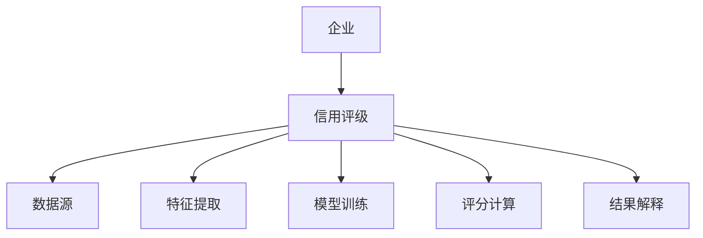
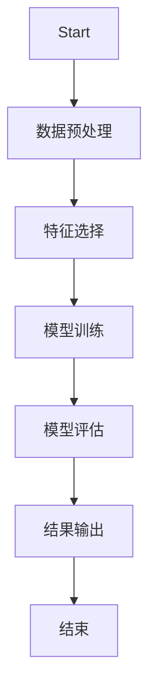
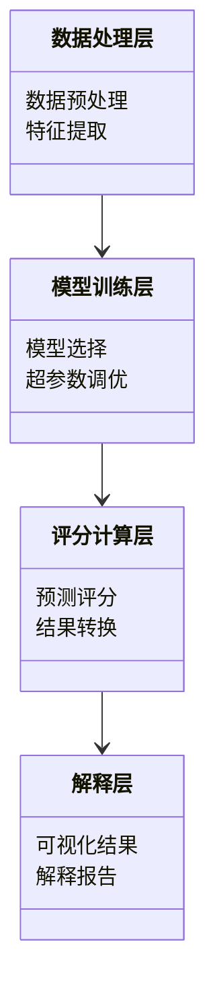

                 


# 设计智能化的企业信用评级解释系统

## 关键词：
企业信用评级、智能化解释系统、机器学习、可解释性、数据驱动

## 摘要：
本文详细探讨了设计智能化的企业信用评级解释系统的各个方面，从背景分析到系统架构设计，再到算法实现和项目实战。通过结合机器学习和可解释性方法，本文提出了一种高效、准确且易于理解的信用评级解决方案。文章旨在为读者提供从理论到实践的全面指导，帮助他们在企业信用评级领域实现智能化升级。

## 第一部分: 背景与需求

### 第1章: 企业信用评级的现状与挑战

#### 1.1 企业信用评级的定义与意义
- 企业信用评级是评估企业信用状况的重要手段，帮助企业获得融资、合作伙伴选择和风险管理。
- 信用评级的准确性直接影响企业的财务健康和市场信任。

#### 1.2 传统信用评级的局限性
- 数据获取困难：传统方法依赖有限的财务数据，难以捕捉企业全貌。
- 人工分析低效：依赖专家经验，效率低下且主观性强。
- 方法单一：主要依赖财务指标，忽视市场动态和非结构化数据。

#### 1.3 智能化信用评级的必要性
- 技术进步：大数据和机器学习的兴起提供了新的可能性。
- 市场需求：企业对高效、准确评级的需求日益增长。
- 提高效率和准确性：通过自动化和智能化方法提升评级质量。

## 第二部分: 核心概念与联系

### 第2章: 企业信用评级解释系统的构成

#### 2.1 核心概念的定义
- 数据源：企业公开的财务数据、市场信息、新闻等。
- 特征提取：从数据中提取关键特征，如财务比率、市场表现等。
- 模型训练：使用机器学习算法训练信用评级模型。
- 评分计算：基于模型输出信用评分。
- 结果解释：将评分转化为可理解的解释，帮助用户理解结果。

#### 2.2 核心概念的属性对比
| 概念       | 数据来源 | 数据类型 | 处理方式 |
|------------|----------|----------|----------|
| 数据源     | 公开数据 | 结构化/非结构化 | 预处理 |
| 特征提取   | 数据特征 | 数值型 | 选择/降维 |
| 模型训练   | 特征数据 | 标签数据 | 训练/调优 |
| 评分计算   | 模型输出 | 数值型 | 转换/解释 |
| 结果解释   | 可视化结果 | 文本/图表 | 用户友好 |

#### 2.3 实体关系图



## 第三部分: 算法原理讲解

### 第3章: 基于机器学习的评分模型

#### 3.1 算法选择与原理
- 选择逻辑回归和梯度提升树作为主要算法，因其在分类任务中的优秀表现。
- 逻辑回归适合处理二分类问题，梯度提升树适合处理非线性关系。

#### 3.2 算法流程图



#### 3.3 数学模型与公式

- 逻辑回归模型：
  $$ P(y=1|x) = \frac{e^{\beta_0 + \beta_1x}}{1 + e^{\beta_0 + \beta_1x}} $$
- 梯度提升树模型：
  $$ y = \sum_{i=1}^{n} \alpha [h_1(x) + h_2(x) + ... + h_n(x)] $$

## 第四部分: 系统分析与架构设计

### 第4章: 系统架构设计

#### 4.1 系统功能设计
- 数据处理层：数据清洗、特征工程。
- 模型训练层：模型训练、调优。
- 评分计算层：预测评分、结果转换。
- 解释层：结果可视化、解释生成。

#### 4.2 系统架构图



## 第五部分: 项目实战

### 第5章: 项目实战

#### 5.1 环境配置
- 安装必要的库：pandas、numpy、scikit-learn、xgboost。

#### 5.2 核心代码实现

```python
import pandas as pd
from sklearn.model_selection import train_test_split
from sklearn.linear_model import LogisticRegression
from sklearn.metrics import accuracy_score

# 数据加载与预处理
data = pd.read_csv('企业数据.csv')
X = data.drop('信用评级', axis=1)
y = data['信用评级']

# 特征选择
selected_features = ['营收增长率', '净利润率', '资产负债率']
X = data[selected_features]

# 数据分割
X_train, X_test, y_train, y_test = train_test_split(X, y, test_size=0.2, random_state=42)

# 模型训练
model = LogisticRegression()
model.fit(X_train, y_train)

# 预测与评估
y_pred = model.predict(X_test)
print("准确率:", accuracy_score(y_test, y_pred))
```

#### 5.3 案例分析
- 使用真实企业数据，展示模型训练、预测和解释的全过程。
- 通过可视化工具展示评分分布和影响因素。

## 第六部分: 最佳实践与小结

### 第6章: 最佳实践 tips

#### 6.1 系统优化
- 使用分布式计算提升处理能力。
- 集成外部数据源如新闻 sentiment 分析。

#### 6.2 小结
- 本文详细介绍了设计智能化企业信用评级系统的各个方面，从理论到实践，提供了全面的解决方案。
- 通过机器学习和可解释性方法，系统能够高效、准确地进行信用评级，为企业的风险管理提供有力支持。

### 参考文献
- [1] 刘军, 《机器学习实战》, 人民邮电出版社, 2018.
- [2] 张涛, 《Python机器学习：基于Scikit-learn和TensorFlow》, 清华大学出版社, 2020.

通过以上结构，文章详细探讨了设计智能化企业信用评级解释系统的各个方面，从背景分析到系统设计、算法实现、项目实战，为读者提供了从理论到实践的全面指导。

