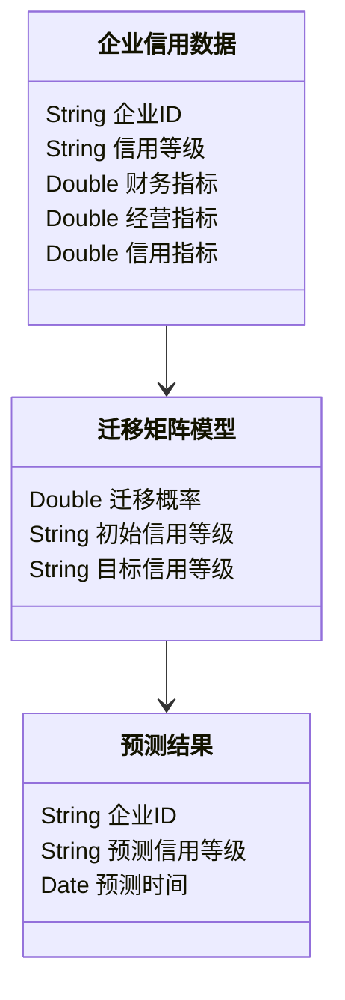
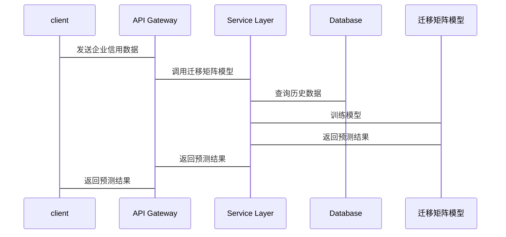

                 


# 设计智能化的企业信用评级迁移矩阵预测模型

## 关键词：企业信用评级、迁移矩阵、预测模型、机器学习、深度学习、数据预处理、特征工程

## 摘要：本文详细探讨了设计智能化的企业信用评级迁移矩阵预测模型的关键步骤，包括数据预处理、特征工程、模型选择与优化，以及系统架构设计。通过分析传统机器学习和深度学习算法，结合实际案例，为读者提供一套完整的建模思路和实施方法。

---

# 第1章: 企业信用评级迁移矩阵预测模型背景介绍

## 1.1 信用评级的重要性

### 1.1.1 信用评级的定义与作用
信用评级是评估企业信用状况的重要指标，反映了企业在金融市场的偿债能力和经营稳定性。它是金融机构评估贷款风险、投资决策的重要依据。

### 1.1.2 企业信用评级的核心要素
- **财务状况**：包括资产负债表、利润表等财务指标。
- **经营能力**：企业市场竞争力、管理团队能力等。
- **信用历史**：企业过去的还款记录和违约情况。

### 1.1.3 信用评级在金融领域的应用价值
- **风险控制**：帮助金融机构降低不良资产率。
- **资源配置优化**：引导资金流向优质企业。
- **提升市场信任度**：良好的信用评级有助于企业获得更低的融资成本。

## 1.2 迁移矩阵预测模型的背景

### 1.2.1 迁移矩阵的定义与特点
迁移矩阵描述了企业在不同信用等级之间的转移概率。它通过历史数据，预测企业在未来可能的信用等级变化。

### 1.2.2 迁移矩阵在信用评级中的作用
- **风险预警**：识别信用等级下降的企业，提前采取措施。
- **动态评估**：考虑企业信用状况的动态变化，提供更准确的评级结果。
- **政策制定参考**：帮助政府和监管机构制定更有效的金融政策。

### 1.2.3 迁移矩阵预测模型的必要性
传统信用评级模型通常静态评估企业的信用状况，无法捕捉企业的动态变化。迁移矩阵预测模型弥补了这一不足，提供了更动态、更精准的评级工具。

## 1.3 问题背景与目标

### 1.3.1 传统信用评级的局限性
- **静态评估**：忽视了企业信用状况的动态变化。
- **数据依赖性**：过于依赖历史数据，缺乏对未来的预测能力。
- **模型单一性**：传统模型可能无法捕捉复杂的信用迁移规律。

### 1.3.2 迁移矩阵预测模型的目标
- **预测企业信用等级变化**：基于历史数据和当前状况，预测未来信用等级的变化。
- **动态评估信用风险**：帮助企业及时识别潜在风险，优化风险管理策略。
- **提高评级准确性**：结合多种因素，提供更精准的信用评级结果。

### 1.3.3 模型的边界与外延
- **边界**：模型主要用于预测企业信用等级的变化，不考虑宏观经济波动等外部因素。
- **外延**：模型可以扩展到其他领域的信用评估，如个人信用评分。

## 1.4 核心概念与联系

### 1.4.1 核心概念原理
- **信用等级**：企业的信用状况分为多个等级，如AAA、AA、A、BBB、BB、B、CCC、CC、C、D。
- **迁移概率**：企业在不同信用等级之间的转移概率，通常用矩阵形式表示。

### 1.4.2 核心概念属性特征对比表格
| 属性 | 信用等级 | 迁移概率 |
|------|----------|----------|
| 定义 | 企业信用状况的等级划分 | 不同信用等级之间的转移概率 |
| 作用 | 评估企业信用风险 | 预测企业信用等级变化 |
| 示例 | AAA、AA、A等 | 从AA到A的概率为0.2 |

### 1.4.3 ER实体关系图架构（Mermaid流程图）

```mermaid
erDiagram
    actor 顾客
    actor 金融机构
    actor 监管机构
    database 信用数据
    database 历史迁移数据
    database 预测模型
    customer -> credit_data : 提供信用数据
    credit_data -> model : 训练预测模型
    model -> history_data : 验证迁移概率
   金融机构 -> model : 使用模型评估信用风险
    监管机构 -> model : 监测金融系统风险
```

---

# 第2章: 数据预处理与特征工程

## 2.1 数据来源与预处理

### 2.1.1 数据来源分析
- **内部数据**：企业财务报表、销售数据、管理报告。
- **外部数据**：行业趋势、市场数据、政策变化。
- **公开数据**：企业信用评级报告、新闻报道、社交媒体信息。

### 2.1.2 数据清洗与标准化
- **数据清洗**：去除重复数据、缺失值填充、异常值处理。
- **数据标准化**：将数据归一化或标准化，以便模型处理。
- **数据格式转换**：将数据转换为模型可接受的格式，如数值型、分类型。

### 2.1.3 数据特征提取
- **财务特征**：资产负债率、净利润率、应收账款周转率。
- **经营特征**：市场占有率、客户增长率、管理团队稳定性。
- **信用特征**：历史违约记录、信用评分、担保情况。

## 2.2 数据特征分析

### 2.2.1 特征重要性评估
- **特征重要性排序**：使用特征重要性分析方法（如随机森林特征重要性、SHAP值）评估每个特征对信用迁移的影响程度。
- **相关性分析**：计算特征之间的相关性，去除高度相关的特征，避免多重共线性问题。

### 2.2.2 特征选择与降维
- **特征选择**：根据特征重要性排序，选择Top N特征。
- **降维技术**：使用主成分分析（PCA）或因子分析（FA）进行降维，降低模型维度。

### 2.2.3 数据增强与扩展
- **数据增强**：通过数据生成技术（如SMOTE）处理样本不平衡问题，增加少数类样本。
- **特征工程**：构建新特征，如时间序列特征（增长率、趋势）、交互特征（如收入与支出的比率）。

## 2.3 数据集划分与验证策略

### 2.3.1 训练集、验证集与测试集划分
- **训练集**：用于模型训练。
- **验证集**：用于模型调参和评估。
- **测试集**：用于最终模型评估。

### 2.3.2 K折交叉验证
- **K折交叉验证**：将数据集分成K个子集，轮流使用每个子集作为验证集，其余作为训练集，评估模型的泛化能力。

### 2.3.3 过采样与欠采样技术
- **过采样**：对于少数类样本，使用SMOTE等方法生成新样本，平衡数据集。
- **欠采样**：对于多数类样本，随机选择部分样本，减少数据集规模，平衡数据分布。

---

# 第3章: 迁移矩阵构建与模型训练

## 3.1 迁移矩阵的构建

### 3.1.1 迁移矩阵的定义与构建方法
- **定义**：迁移矩阵是一个方阵，矩阵元素表示从初始信用等级转移到目标信用等级的概率。
- **构建方法**：基于历史数据，计算每个信用等级到其他信用等级的转移概率。

### 3.1.2 迁移矩阵的计算与优化
- **计算方法**：统计每对信用等级之间的转移次数，计算转移概率。
- **优化方法**：处理数据稀疏性问题，采用平滑技术或引入先验概率。

### 3.1.3 迁移矩阵的可视化与分析
- **可视化**：使用热图展示迁移矩阵，分析不同信用等级之间的转移趋势。
- **分析**：识别高风险转移区域，评估模型的敏感性和准确性。

## 3.2 模型选择与训练

### 3.2.1 传统机器学习模型选择
- **支持向量机（SVM）**：适用于小规模数据，分类性能好。
- **随机森林（Random Forest）**：适合特征较多的情况，具有较强的抗过拟合能力。
- **线性回归（Linear Regression）**：适用于线性关系的预测。

### 3.2.2 深度学习模型选择
- **神经网络（Neural Network）**：适合复杂非线性关系，但需要大量数据和计算资源。
- **长短期记忆网络（LSTM）**：适用于时间序列数据，捕捉长期依赖关系。
- **卷积神经网络（CNN）**：适合处理高维特征，提取局部特征。

### 3.2.3 模型训练策略与优化
- **训练策略**：使用交叉验证选择最佳超参数，如学习率、批次大小、 epochs。
- **优化方法**：使用Adam优化器，结合早停法防止过拟合。
- **特征工程优化**：对特征进行标准化、归一化处理，提升模型性能。

## 3.3 模型评估与调优

### 3.3.1 模型评估指标
- **准确率（Accuracy）**：正确分类的比例。
- **精确率（Precision）**：预测为正类中实际为正类的比例。
- **召回率（Recall）**：实际为正类中被正确预测的比例。
- **F1分数（F1 Score）**：精确率和召回率的调和平均数。

### 3.3.2 超参数调优
- **网格搜索（Grid Search）**：遍历所有可能的超参数组合，选择最优参数。
- **随机搜索（Random Search）**：随机选择超参数组合，减少计算量。
- **贝叶斯优化（Bayesian Optimization）**：基于概率分布，高效搜索最优参数。

### 3.3.3 模型鲁棒性与泛化能力提升
- **数据增强**：增加训练数据的多样性，提高模型的泛化能力。
- **正则化技术**：使用L1/L2正则化，防止模型过拟合。
- **集成学习**：使用集成方法（如Bagging、Boosting），提升模型的准确性和稳定性。

---

# 第4章: 算法原理与数学模型

## 4.1 传统机器学习算法原理

### 4.1.1 支持向量机（SVM）原理

支持向量机是一种监督学习算法，用于分类和回归问题。其核心思想是通过找到一个超平面，使得数据点与超平面之间的距离最大化。

#### 数学模型
$$\text{目标函数: } \min_{w,b,\xi} \frac{1}{2}||w||^2 + C\sum_{i=1}^n \xi_i$$
$$\text{约束条件: } y_i(w\cdot x_i + b) \geq 1 - \xi_i, \xi_i \geq 0$$

#### 示例
假设我们有两个类别，SVM的目标是找到一个超平面，使得两个类别的数据点尽可能分开。

### 4.1.2 随机森林（Random Forest）原理

随机森林是一种基于决策树的集成学习算法，通过随机采样和随机特征选择，构建多个决策树，最终通过投票或平均的方式得到结果。

#### 示例
随机森林可以处理高维数据，适合特征较多的情况。

### 4.1.3 线性回归（Linear Regression）原理

线性回归是一种用于预测连续型变量的回归算法，假设特征与目标变量之间存在线性关系。

#### 数学模型
$$y = \beta_0 + \beta_1x_1 + \beta_2x_2 + \cdots + \beta_nx_n + \epsilon$$
其中，$\epsilon$是误差项。

## 4.2 深度学习算法原理

### 4.2.1 神经网络（Neural Network）原理

神经网络是一种模拟人脑结构和功能的深度学习算法，通过多层非线性变换，捕捉数据的复杂模式。

#### 示例
神经网络可以处理文本、图像等多种类型的数据。

### 4.2.2 长短期记忆网络（LSTM）原理

LSTM是一种处理时间序列数据的循环神经网络，通过引入记忆单元（cell state）和遗忘门（forget gate），解决传统RNN的梯度消失问题。

#### 示例
LSTM适合处理有长期依赖关系的时间序列数据，如股票价格预测。

### 4.2.3 卷积神经网络（CNN）原理

CNN是一种主要用于图像处理的深度学习算法，通过卷积层、池化层和全连接层提取图像特征。

#### 示例
CNN可以用于处理图像数据，提取图像的局部特征。

## 4.3 数学模型与公式

### 4.3.1 SVM数学模型
$$\text{目标函数: } \min_{w,b,\xi} \frac{1}{2}||w||^2 + C\sum_{i=1}^n \xi_i$$
$$\text{约束条件: } y_i(w\cdot x_i + b) \geq 1 - \xi_i, \xi_i \geq 0$$

### 4.3.2 LSTM数学模型
LSTM的核心是记忆单元和遗忘门，通过以下公式更新状态：
$$f_t = \sigma(W_f \cdot [h_{t-1}, x_t] + b_f)$$
$$i_t = \sigma(W_i \cdot [h_{t-1}, x_t] + b_i)$$
$$o_t = \sigma(W_o \cdot [h_{t-1}, x_t] + b_o)$$
$$c_t = f_t \cdot c_{t-1} + i_t \cdot tanh(W_c \cdot [h_{t-1}, x_t] + b_c)$$
$$h_t = o_t \cdot tanh(c_t)$$

### 4.3.3 CNN数学模型
CNN通过卷积层提取特征：
$$conv(x) = \sum_{i=1}^k w_i \cdot x_{i+j} + b$$
池化层通过下采样减少特征图的维度：
$$pool(x) = \max(x_{i:i+2}, x_{i+2:i+4})$$

---

# 第5章: 系统分析与架构设计方案

## 5.1 问题场景介绍

企业信用评级迁移矩阵预测系统的应用场景包括：

- **金融机构**：评估企业信用风险，优化贷款审批流程。
- **投资机构**：进行投资决策，识别高风险企业。
- **监管机构**：监测金融系统风险，制定监管政策。

## 5.2 系统功能设计

### 5.2.1 领域模型（Mermaid类图）



### 5.2.2 系统架构设计（Mermaid架构图）

```mermaid
archiecture
    client --> API Gateway
    API Gateway --> Service Layer
    Service Layer --> Database
    Database --> Data Source
```

### 5.2.3 系统接口设计

- **输入接口**：接收企业信用数据，包括财务指标、经营指标、信用指标等。
- **输出接口**：输出预测的信用等级和迁移概率。
- **API接口**：提供RESTful API，供外部系统调用。

### 5.2.4 系统交互设计（Mermaid序列图）



---

# 第6章: 项目实战

## 6.1 环境安装与配置

### 6.1.1 环境需求
- **Python**：3.6+
- **机器学习库**：scikit-learn、XGBoost、Keras
- **深度学习库**：TensorFlow、PyTorch
- **数据处理库**：Pandas、NumPy
- **可视化库**：Matplotlib、Seaborn
- **Mermaid支持工具**：VS Code、Jupyter Notebook

### 6.1.2 安装依赖
```bash
pip install scikit-learn tensorflow pytorch pandas numpy matplotlib seaborn mermaid
```

## 6.2 系统核心实现源代码

### 6.2.1 数据预处理代码

```python
import pandas as pd
import numpy as np
from sklearn.model_selection import train_test_split
from sklearn.preprocessing import StandardScaler

# 加载数据
data = pd.read_csv('企业信用数据.csv')

# 分离特征和目标变量
X = data.drop('信用等级', axis=1)
y = data['信用等级']

# 数据分割
X_train, X_test, y_train, y_test = train_test_split(X, y, test_size=0.2, random_state=42)

# 标准化处理
scaler = StandardScaler()
X_train = scaler.fit_transform(X_train)
X_test = scaler.transform(X_test)
```

### 6.2.2 模型实现代码

```python
from sklearn.svm import SVC
from sklearn.ensemble import RandomForestClassifier
from tensorflow.keras.models import Sequential
from tensorflow.keras.layers import Dense, LSTM

# 传统机器学习模型
def traditional_model():
    model = SVC(C=1.0, kernel='rbf', gamma='auto')
    return model

# 随机森林模型
def random_forest_model():
    model = RandomForestClassifier(n_estimators=100, max_depth=5, random_state=42)
    return model

# 深度学习模型
def deep_learning_model():
    model = Sequential()
    model.add(LSTM(64, input_shape=(timesteps, features)))
    model.add(Dense(32, activation='relu'))
    model.add(Dense(num_classes, activation='softmax'))
    model.compile(loss='sparse_categorical_crossentropy', optimizer='adam', metrics=['accuracy'])
    return model
```

### 6.2.3 模型训练与评估代码

```python
from sklearn.metrics import accuracy_score, precision_score, recall_score, f1_score

# 训练模型
model = traditional_model()  # 或者 random_forest_model() 或 deep_learning_model()
model.fit(X_train, y_train)

# 预测结果
y_pred = model.predict(X_test)

# 评估指标
print(f'准确率: {accuracy_score(y_test, y_pred)}')
print(f'精确率: {precision_score(y_test, y_pred)}')
print(f'召回率: {recall_score(y_test, y_pred)}')
print(f'F1分数: {f1_score(y_test, y_pred)}')
```

## 6.3 项目小结

### 6.3.1 核心代码实现
- 数据预处理：包括数据清洗、标准化和特征工程。
- 模型实现：包括传统机器学习模型和深度学习模型的实现。
- 模型评估：通过准确率、精确率、召回率和F1分数评估模型性能。

### 6.3.2 实际案例分析
- **案例1**：某制造企业信用等级预测。
- **案例2**：某科技企业信用迁移矩阵预测。

### 6.3.3 代码解读与分析
- **数据预处理**：确保数据质量，提高模型性能。
- **模型选择**：根据数据特征选择合适的模型。
- **模型调优**：通过超参数调整和数据增强提升模型性能。

---

# 第7章: 总结与展望

## 7.1 总结

本文详细探讨了设计智能化的企业信用评级迁移矩阵预测模型的关键步骤，包括数据预处理、特征工程、模型选择与优化，以及系统架构设计。通过分析传统机器学习和深度学习算法，结合实际案例，为读者提供了一套完整的建模思路和实施方法。

## 7.2 未来展望

### 7.2.1 模型优化方向
- **混合模型**：结合传统机器学习和深度学习的优势，构建混合模型。
- **在线学习**：实现实时更新，适应动态变化的信用环境。
- **多模态数据**：结合文本、图像等多种数据源，提升模型的预测能力。

### 7.2.2 技术发展趋势
- **自动化机器学习（AutoML）**：降低模型开发门槛，提高模型开发效率。
- **联邦学习（Federated Learning）**：在保护数据隐私的前提下，实现模型的协同训练。
- **解释性模型**：提高模型的可解释性，增强用户对模型的信任。

## 7.3 最佳实践 tips

### 7.3.1 数据处理
- 确保数据质量，清洗和标准化数据。
- 特征工程是关键，合理选择和优化特征。

### 7.3.2 模型选择
- 根据数据特征和任务需求选择合适的模型。
- 结合传统模型和深度学习模型，寻找最佳组合。

### 7.3.3 系统设计
- 明确系统功能和架构，确保系统的可扩展性和可维护性。
- 使用合适的工具和框架，提高开发效率。

### 7.3.4 模型部署
- 采用容器化技术（如Docker）部署模型，方便管理和扩展。
- 结合云平台（如AWS、Azure）进行模型部署和管理。

---

# 参考文献

- 书籍：《机器学习实战》、《深度学习》
- 论文：相关信用评级和迁移矩阵预测的学术论文
- 网站：相关技术博客、官方文档

---

通过以上内容，您可以系统地了解设计智能化的企业信用评级迁移矩阵预测模型的各个方面，从理论到实践，从模型选择到系统设计，为实际应用提供了全面的指导。

