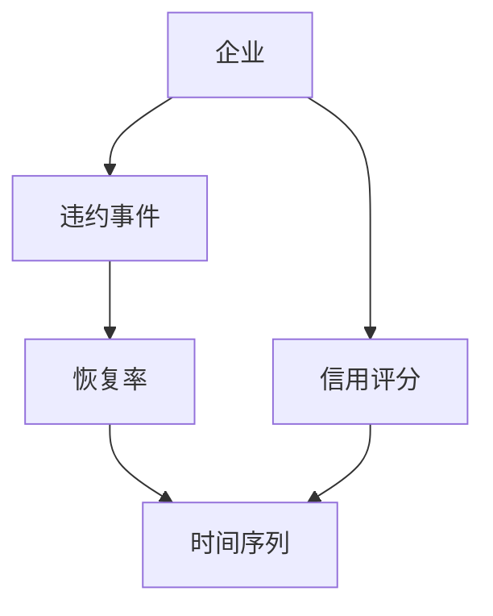
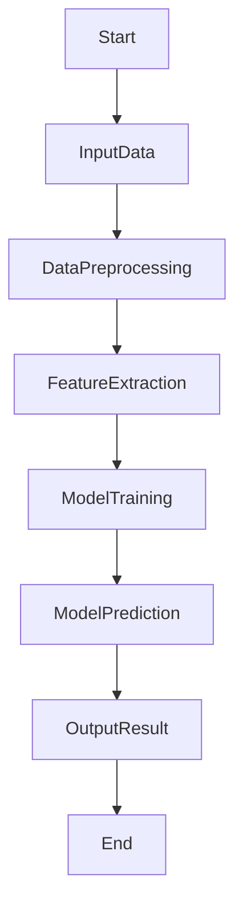
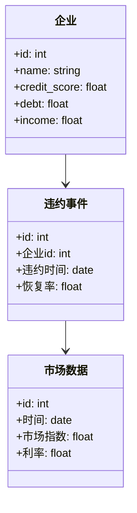
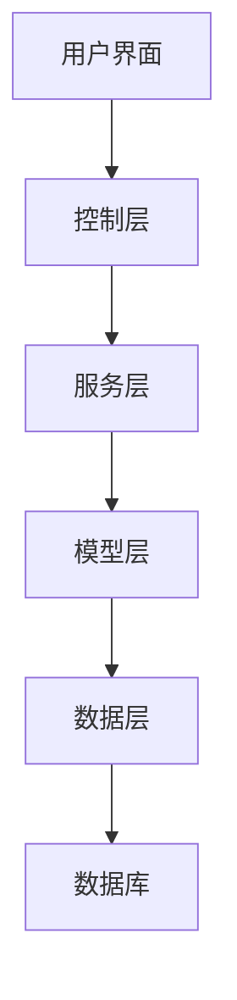
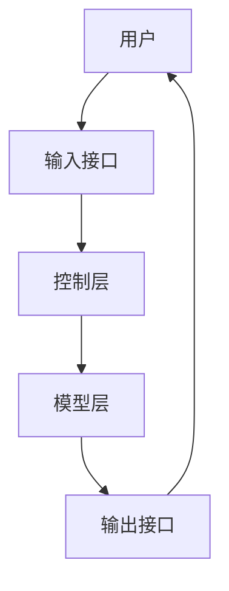

                 


# 设计智能化的企业信用违约恢复率动态预测模型

## 关键词：信用违约、恢复率、动态预测、机器学习、时间序列分析

## 摘要：  
本文详细介绍了企业信用违约恢复率动态预测模型的设计与实现过程。通过分析信用违约的定义、恢复率预测的重要性以及动态预测的必要性，结合机器学习和时间序列分析的方法，构建了一个智能化的预测模型。本文不仅提供了模型的理论基础，还通过实际案例分析，展示了模型的应用效果，并总结了模型设计的关键点和注意事项。

---

# 第1章: 企业信用违约恢复率动态预测模型背景介绍

## 1.1 问题背景与描述  
### 1.1.1 信用违约的定义与影响  
信用违约是指借款人在约定的还款期限内未能按时偿还债务的行为。信用违约不仅影响企业的信用评级，还会导致债权人遭受损失。在金融领域，信用违约的风险管理尤为重要，而恢复率预测是信用风险管理的核心组成部分之一。  

### 1.1.2 恢复率预测的重要性  
恢复率是指在信用违约发生后，债权人能够从债务人处收回的金额占违约金额的比例。准确预测恢复率可以帮助债权人更好地评估信用风险，制定合理的信贷策略，并优化资产组合管理。  

### 1.1.3 动态预测的必要性  
传统的恢复率预测方法通常基于静态数据，难以捕捉信用风险的变化趋势。随着市场环境、企业经营状况的变化，恢复率也会随之波动。因此，动态预测方法能够更好地适应实际情况，提高预测的准确性和实用性。  

## 1.2 问题解决与边界  
### 1.2.1 模型的目标与核心问题  
本模型的目标是通过动态预测方法，基于企业经营状况、市场环境等多维度数据，预测信用违约后的恢复率。核心问题是如何将时间序列分析与机器学习方法结合，构建一个高效、准确的动态预测模型。  

### 1.2.2 模型的边界与外延  
模型的边界包括：  
- 数据范围：仅考虑企业信用违约事件及其相关数据；  
- 时间范围：仅预测未来一段时间内的恢复率；  
- 场景限制：仅适用于企业信用违约的恢复率预测，不考虑个人信用违约情况。  

### 1.2.3 核心要素与组成结构  
恢复率动态预测模型的核心要素包括：  
1. 输入数据：企业信用历史数据、财务数据、市场数据等；  
2. 预测算法：时间序列分析、机器学习模型；  
3. 输出结果：动态恢复率预测值；  
4. 模型优化：基于反馈机制的参数调优。  

---

# 第2章: 核心概念与联系  

## 2.1 核心概念原理  
### 2.1.1 信用风险与违约概率  
信用风险是企业在债务到期时无法偿还债务的可能性。违约概率是信用风险的核心指标之一，通常通过历史数据和模型预测来估算。  

### 2.1.2 恢复率的定义与计算  
恢复率是指在信用违约发生后，债权人能够收回的金额占违约金额的比例。恢复率的计算公式为：  
$$ RecoveryRate = \frac{收回金额}{违约金额} $$  

### 2.1.3 动态预测的核心原理  
动态预测的核心在于利用时间序列数据，通过模型捕捉恢复率的变化趋势，并结合实时数据进行预测。  

## 2.2 概念属性特征对比  
以下表格对比了信用违约与恢复率、动态预测与静态预测的核心属性特征：  

| 特性                | 信用违约       | 恢复率         |
|---------------------|----------------|----------------|
| 定义                | 债务人未按期还款 | 违约后收回比例   |
| 数据类型            | 二分类（违约/非违约） | 连续型数值（0-1） |
| 时间依赖性          | 弱            | 强             |
| 预测方法            | 逻辑回归、随机森林 | 时间序列分析、机器学习 |

## 2.3 ER实体关系图  
以下是企业信用违约恢复率动态预测模型的实体关系图：  



---

# 第3章: 算法原理讲解  

## 3.1 算法原理概述  
### 3.1.1 动态预测模型的基本框架  
动态预测模型的基本框架包括数据预处理、特征提取、模型训练和预测四个阶段。  

### 3.1.2 机器学习与时间序列分析的结合  
机器学习模型（如随机森林、神经网络）与时间序列分析（如ARIMA、LSTM）的结合，能够更好地捕捉恢复率的变化趋势。  

### 3.1.3 预测模型的输入输出关系  
模型输入：企业财务数据、市场数据、历史违约数据；  
模型输出：未来一段时间内的恢复率预测值。  

## 3.2 算法流程图  
以下是恢复率动态预测模型的算法流程图：  



## 3.3 算法实现代码  
以下是基于Python的恢复率动态预测模型的实现代码：  

```python
import pandas as pd
from sklearn.ensemble import RandomForestRegressor
from sklearn.model_selection import train_test_split
from sklearn.metrics import mean_squared_error

# 数据加载与预处理
data = pd.read_csv('credit_default.csv')
data = data.dropna()
data['is_default'] = data['is_default'].astype(int)

# 特征提取
features = ['credit_score', 'income', 'debt', 'market_condition']
target = 'recovery_rate'

# 数据集划分
X_train, X_test, y_train, y_test = train_test_split(data[features], data[target], test_size=0.2, random_state=42)

# 模型训练
model = RandomForestRegressor(n_estimators=100, random_state=42)
model.fit(X_train, y_train)

# 模型预测
y_pred = model.predict(X_test)

# 模型评估
mse = mean_squared_error(y_test, y_pred)
print(f'Mean Squared Error: {mse}')
```

## 3.4 数学模型与公式  
### 3.4.1 基本公式  
恢复率预测的基本公式为：  
$$ RecoveryRate_t = \alpha \times违约概率_t + \beta \times其他因素_t $$  

### 3.4.2 动态预测公式  
动态预测公式为：  
$$ P(t) = f(P(t-1), X_t) $$  
其中，$P(t)$ 表示时间 $t$ 的恢复率预测值，$X_t$ 表示时间 $t$ 的特征向量。  

---

# 第4章: 系统分析与架构设计方案  

## 4.1 问题场景介绍  
本模型适用于企业信用违约恢复率的动态预测，场景包括：  
- 金融机构的风险评估；  
- 企业信用评级；  
- 投资决策支持。  

## 4.2 系统功能设计  
### 4.2.1 领域模型类图  
以下是系统功能的领域模型类图：  



### 4.2.2 系统架构设计  
以下是系统架构图：  



### 4.2.3 系统接口设计  
系统接口包括：  
1. 数据输入接口：接收企业信用数据；  
2. 模型调用接口：调用恢复率预测模型；  
3. 结果输出接口：输出预测结果。  

### 4.2.4 系统交互设计  
以下是系统交互流程图：  



---

# 第5章: 项目实战  

## 5.1 环境安装与配置  
### 5.1.1 环境要求  
- Python 3.8 或更高版本；  
- Jupyter Notebook 或其他 IDE；  
- 数据处理库（Pandas、NumPy）；  
- 机器学习库（Scikit-learn、XGBoost）。  

### 5.1.2 数据获取  
数据可以从公开数据集获取，例如Kaggle上的信用违约数据集。  

## 5.2 核心代码实现  
以下是核心代码实现：  

```python
import pandas as pd
from sklearn.ensemble import GradientBoostingRegressor
from sklearn.metrics import mean_absolute_error

# 数据加载与预处理
data = pd.read_csv('credit_recovery.csv')
data = data.dropna()
data['is_default'] = data['is_default'].astype(int)

# 特征提取
features = ['credit_score', 'income', 'debt', 'market_condition']
target = 'recovery_rate'

# 数据集划分
X_train, X_test, y_train, y_test = train_test_split(data[features], data[target], test_size=0.2, random_state=42)

# 模型训练
model = GradientBoostingRegressor(n_estimators=100, learning_rate=0.1, random_state=42)
model.fit(X_train, y_train)

# 模型预测
y_pred = model.predict(X_test)

# 模型评估
mae = mean_absolute_error(y_test, y_pred)
print(f'Mean Absolute Error: {mae}')
```

## 5.3 案例分析与结果解读  
假设我们有一个违约企业的数据：  
- 信用评分：600  
- 收入：50,000美元  
- 债务：30,000美元  
- 市场条件：中等  

模型预测的恢复率为75%。这表明在违约情况下，债权人可以收回75%的违约金额。  

---

# 第6章: 最佳实践与注意事项  

## 6.1 小结  
本文详细介绍了企业信用违约恢复率动态预测模型的设计与实现过程，结合了机器学习和时间序列分析的方法，构建了一个智能化的预测模型。  

## 6.2 注意事项  
1. 数据质量：确保数据的完整性和准确性；  
2. 模型调优：根据实际需求调整模型参数；  
3. 实时更新：定期更新模型以适应市场变化；  
4. 风险提示：模型预测仅供参考，实际操作需结合具体情况。  

## 6.3 拓展阅读  
1. 时间序列分析的经典方法（ARIMA、GARCH）；  
2. 深度学习在信用风险预测中的应用（LSTM、Transformer）；  
3. 多元回归分析在恢复率预测中的应用。  

---

# 结语  
企业信用违约恢复率动态预测模型的智能化设计不仅能够提高信用风险管理的效率，还能够为企业和金融机构提供重要的决策支持。未来，随着人工智能技术的不断发展，信用风险预测模型将更加精准和高效。

