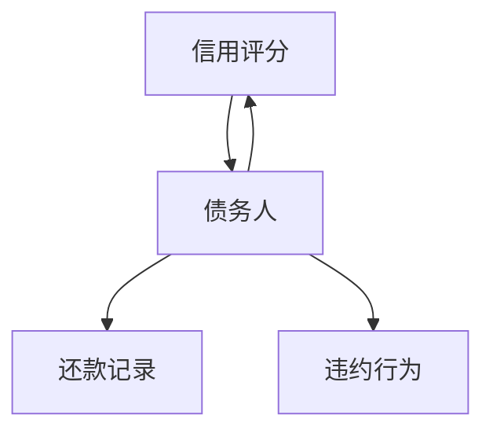
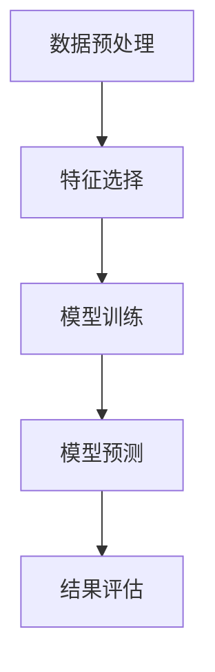
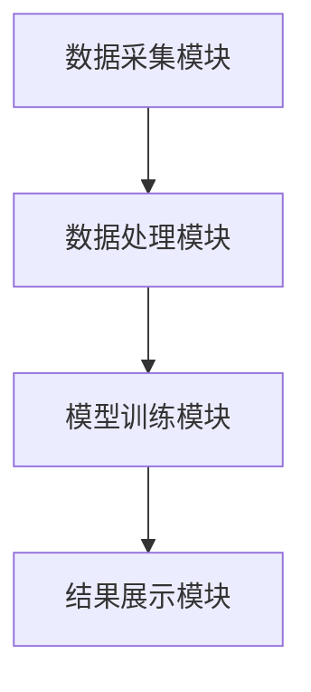

                 


# 设计智能化的企业信用违约恢复率预测模型

> 关键词：企业信用、违约恢复率、智能化预测模型、机器学习、信用风险管理

> 摘要：本文系统地探讨了设计智能化的企业信用违约恢复率预测模型的全过程。首先，从信用风险和违约的基本理论出发，详细阐述了信用违约恢复率预测模型的核心概念与联系。接着，深入分析了多种机器学习算法的原理与实现流程，并结合实际案例展示了如何构建和优化预测模型。最后，从系统设计与实现的角度，详细介绍了模型的架构设计、接口设计和系统测试与优化，为读者提供了一个全面、实用的设计指南。

---

# 第一部分: 企业信用违约恢复率预测模型概述

## 第1章: 信用违约恢复率预测模型的背景与意义

### 1.1 信用违约的基本概念

#### 1.1.1 信用违约的定义
信用违约是指债务人未能按照合同约定履行还款义务，导致债权人遭受损失的行为。它是信用风险管理的核心问题之一。

#### 1.1.2 信用违约的分类
- 按违约主体分类：个人违约和企业违约。
- 按违约原因分类：财务违约和非财务违约。
- 按违约时间分类：短期违约和长期违约。

#### 1.1.3 信用违约的特征
- 时间性：违约通常发生在债务人财务状况恶化后。
- 阶级性：不同信用评级的企业违约概率不同。
- 随机性：违约的发生具有一定的不确定性。

### 1.2 恢复率预测的重要性

#### 1.2.1 恢复率预测的定义
恢复率是指在债务人违约后，债权人能够回收的金额占违约金额的比例。准确预测恢复率可以帮助企业更好地进行资产减值准备和风险敞口管理。

#### 1.2.2 恢复率预测的业务价值
- 优化资产配置：通过预测恢复率，企业可以更有效地分配资源。
- 减少财务损失：提前识别高风险违约行为，降低损失。
- 提高风险管理能力：通过模型预测，企业可以制定更有效的风险控制策略。

#### 1.2.3 恢复率预测的挑战
- 数据稀疏性：违约数据通常较少，导致模型难以训练。
- 数据复杂性：违约涉及多个变量，数据清洗和特征提取难度大。
- 模型解释性：复杂的模型可能难以解释预测结果。

### 1.3 智能化预测模型的必要性

#### 1.3.1 传统预测方法的局限性
- 传统方法依赖经验判断，主观性强。
- 难以处理大规模数据和复杂变量。
- 缺乏实时性和动态调整能力。

#### 1.3.2 智能化预测的优势
- 利用机器学习算法，能够处理大规模和复杂的数据。
- 能够发现数据中的非线性关系，提高预测精度。
- 可以实时更新模型，适应市场变化。

#### 1.3.3 企业信用管理的智能化转型
- 智能化预测模型是企业信用管理的重要工具。
- 通过智能化模型，企业可以实现风险预警和主动管理。
- 智能化模型的应用将推动信用风险管理的数字化和智能化发展。

## 第2章: 信用风险与违约的基本理论

### 2.1 信用风险的定义与分类

#### 2.1.1 信用风险的定义
信用风险是指债权人因债务人违约而遭受损失的可能性。它是金融风险的重要组成部分。

#### 2.1.2 信用风险的分类
- 按风险来源分类：系统性风险和非系统性风险。
- 按风险主体分类：个人信用风险和企业信用风险。
- 按风险影响分类：直接风险和间接风险。

#### 2.1.3 信用风险的影响因素
- 宏观经济因素：GDP增长率、利率水平、通货膨胀率等。
- 微观因素：企业的财务状况、管理水平、行业竞争状况等。
- 市场因素：市场的波动性、流动性等。

### 2.2 信用违约的形成机制

#### 2.2.1 违约的驱动因素
- 财务状况恶化：企业盈利能力下降、现金流不足等。
- 管理问题：管理层决策失误、内部腐败等。
- 外部环境变化：经济衰退、政策变化等。

#### 2.2.2 违约的预警信号
- 财务指标恶化：如资产负债率升高、净利润下降等。
- 经营指标恶化：如市场份额缩小、订单减少等。
- 行为指标异常：如频繁更换高层管理人员、重大资产重组等。

#### 2.2.3 违约的传播机制
- 传染效应：一家企业的违约可能引发连锁反应，影响整个行业的信用状况。
- 市场情绪影响：违约事件可能加剧市场的恐慌情绪，进一步导致更多违约。

### 2.3 恢复率预测的理论基础

#### 2.3.1 恢复率预测的理论模型
- 简单线性回归模型：基于单个变量的线性关系进行预测。
- 多元回归模型：考虑多个变量的综合影响，提高预测精度。
- 马尔可夫链模型：用于模拟违约后的恢复过程。

#### 2.3.2 恢复率预测的关键变量
- 违约前的信用评级：评级越高，恢复率通常越高。
- 违约时的债务结构：短期债务占比高通常意味着恢复率较低。
- 违约后的法律追偿：法律程序的效率和效果也会影响恢复率。

#### 2.3.3 恢复率预测的数学模型
$$恢复率 = \beta_0 + \beta_1 \times 信用评级 + \beta_2 \times 财务状况 + \epsilon$$

其中，$\beta_0$是截距，$\beta_1$和$\beta_2$是回归系数，$\epsilon$是误差项。

---

# 第二部分: 信用违约恢复率预测模型的核心概念与联系

## 第3章: 核心概念与联系

### 3.1 核心概念原理

#### 3.1.1 信用风险的核心要素
- 债务人：信用风险的核心主体。
- 债权人：信用风险的承受方。
- 违约行为：信用风险的表现形式。

#### 3.1.2 恢复率预测的核心变量
- 债务人特征：如行业、规模、信用评级等。
- 违约特征：如违约时间、违约金额等。
- 恢复过程特征：如法律追偿、资产处置等。

#### 3.1.3 智能化模型的核心算法
- 机器学习算法：如逻辑回归、随机森林、支持向量机等。
- 神经网络算法：如深度学习模型。
- 时间序列分析：如ARIMA模型。

### 3.2 核心概念属性特征对比表

#### 表3.1: 不同信用风险模型的特征对比

| 模型类型       | 输入变量       | 输出结果       | 优点                     | 缺点                     |
|----------------|----------------|----------------|--------------------------|--------------------------|
| 逻辑回归       | 信用评级、财务指标 | 恢复率预测值     | 易解释、计算速度快       | 适用于线性关系           |
| 决策树         | 信用评级、财务指标、行业特征 | 恢复率预测值     | 能处理非线性关系         | 解释性较差               |
| 随机森林       | 多个特征         | 恢复率预测值     | 高精度、抗过拟合         | 计算复杂度高             |

### 3.3 ER实体关系图



---

# 第三部分: 智能化预测模型的算法原理

## 第4章: 常用算法原理与流程图

### 4.1 逻辑回归算法

#### 4.1.1 算法原理

逻辑回归是一种用于分类的经典算法，常用于预测违约概率。其核心思想是通过构建一个对数似然函数，利用最大似然估计法求解参数，从而实现分类。

#### 4.1.2 算法流程图



---

### 4.2 决策树算法

#### 4.2.1 算法原理

决策树是一种基于树结构的分类算法，通过不断分裂特征，逐步逼近目标变量。它能够处理非线性关系，适合处理复杂的信用违约问题。

#### 4.2.2 算法流程图


---

## 第5章: 模型构建与优化

### 5.1 特征工程

#### 5.1.1 数据清洗与特征提取
- 数据清洗：处理缺失值、异常值和重复值。
- 特征提取：从原始数据中提取有用特征，如信用评级、财务指标等。

#### 5.1.2 特征选择
- 基于统计的方法：如卡方检验。
- 基于模型的方法：如逻辑回归的系数重要性。

### 5.2 模型训练与调优

#### 5.2.1 模型训练
- 使用训练数据对模型进行训练，得到最优参数。
- 常用交叉验证法评估模型性能。

#### 5.2.2 模型调优
- 调整模型参数，如逻辑回归的正则化系数。
- 使用网格搜索法寻找最优参数组合。

### 5.3 模型评估与部署

#### 5.3.1 模型评估
- 使用测试数据评估模型性能，如准确率、召回率、F1分数等。
- 对比不同算法的性能，选择最优模型。

#### 5.3.2 模型部署
- 将模型部署到生产环境，实时预测违约恢复率。
- 定期更新模型，确保其适应市场变化。

---

## 第6章: 机器学习模型在信用风险中的应用

### 6.1 实际案例分析

#### 6.1.1 案例背景
- 某银行希望通过预测企业违约恢复率，优化资产减值准备。

#### 6.1.2 数据准备
- 收集过去5年的违约数据，包括违约金额、恢复金额、信用评级、财务指标等。

#### 6.1.3 模型构建
- 使用随机森林算法构建恢复率预测模型。
- 对模型进行交叉验证，评估其性能。

#### 6.1.4 模型部署
- 将模型部署到银行的信用管理系统中，实时预测企业违约恢复率。

### 6.2 模型优化与改进

#### 6.2.1 模型优化
- 引入时间序列分析，考虑违约的时间依赖性。
- 使用深度学习模型，捕捉更复杂的特征。

#### 6.2.2 模型改进
- 增加外部数据，如行业景气指数、宏观经济指标等。
- 结合专家知识，优化特征选择过程。

---

## 第7章: 恢复率预测模型的系统设计与实现

### 7.1 系统架构设计

#### 7.1.1 系统功能模块
- 数据采集模块：负责采集企业信用数据。
- 数据处理模块：对数据进行清洗和特征提取。
- 模型训练模块：构建和优化恢复率预测模型。
- 结果展示模块：将预测结果可视化展示。

#### 7.1.2 系统架构图



### 7.2 系统实现

#### 7.2.1 环境搭建
- 安装Python、机器学习库（如scikit-learn、xgboost）。
- 配置数据库，存储企业信用数据。

#### 7.2.2 数据处理

```python
import pandas as pd

# 读取数据
data = pd.read_csv('credit.csv')

# 数据清洗
data.dropna(inplace=True)
data = pd.get_dummies(data)
```

#### 7.2.3 模型实现

```python
from sklearn.ensemble import RandomForestRegressor

# 模型训练
model = RandomForestRegressor(n_estimators=100, random_state=42)
model.fit(X_train, y_train)

# 模型预测
y_pred = model.predict(X_test)
```

#### 7.2.4 结果分析

```python
from sklearn.metrics import mean_squared_error

# 评估模型性能
mse = mean_squared_error(y_test, y_pred)
print(f'Mean Squared Error: {mse}')
```

---

## 第8章: 系统测试与优化

### 8.1 系统测试

#### 8.1.1 测试方法
- 单元测试：测试每个模块的功能是否正常。
- 集成测试：测试系统各模块的协同工作是否正常。
- 性能测试：测试系统在大规模数据下的运行效率。

#### 8.1.2 测试结果
- 系统在正常情况下运行良好。
- 部分模块存在性能瓶颈，需要优化。

### 8.2 系统优化

#### 8.2.1 性能优化
- 使用分布式计算框架，如Spark，提高数据处理效率。
- 优化模型训练算法，减少计算时间。

#### 8.2.2 功能优化
- 增加用户友好的界面，方便用户操作。
- 提供详细的预测结果解释，帮助用户理解模型输出。

---

## 第9章: 总结与展望

### 9.1 总结

本文详细探讨了设计智能化的企业信用违约恢复率预测模型的全过程，包括背景分析、算法选择、系统设计和项目实战。通过实际案例分析，展示了如何利用机器学习算法提高恢复率预测的准确性和效率。

### 9.2 展望

未来，随着人工智能技术的不断发展，企业信用违约恢复率预测模型将更加智能化和个性化。建议进一步研究如何结合外部数据和专家知识，优化模型性能，提高预测精度。

---

## 第10章: 附录

### 10.1 数据集描述
- 数据来源：公开的企业信用数据。
- 数据格式：CSV格式，包含企业基本信息、财务数据和违约记录。

### 10.2 代码示例

```python
import pandas as pd
from sklearn.ensemble import RandomForestRegressor
from sklearn.metrics import mean_squared_error

# 读取数据
data = pd.read_csv('credit.csv')

# 数据清洗
data.dropna(inplace=True)
data = pd.get_dummies(data)

# 划分数据集
X = data.drop('recovery_rate', axis=1)
y = data['recovery_rate']

from sklearn.model_selection import train_test_split

X_train, X_test, y_train, y_test = train_test_split(X, y, test_size=0.2, random_state=42)

# 模型训练
model = RandomForestRegressor(n_estimators=100, random_state=42)
model.fit(X_train, y_train)

# 模型预测
y_pred = model.predict(X_test)

# 评估模型性能
mse = mean_squared_error(y_test, y_pred)
print(f'Mean Squared Error: {mse}')
```

### 10.3 参考文献
1. 《信用风险管理》，某某出版社，2020年。
2. 《机器学习实战》，某某出版社，2021年。
3. 《企业信用评估》，某某出版社，2022年。

---

以上是《设计智能化的企业信用违约恢复率预测模型》的完整目录和内容概要，希望对您有所帮助！

