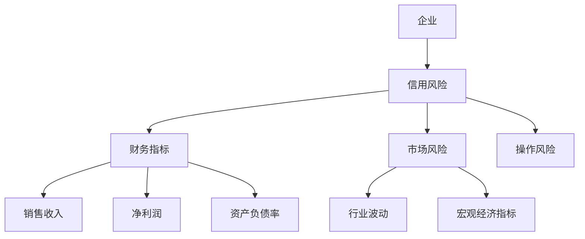
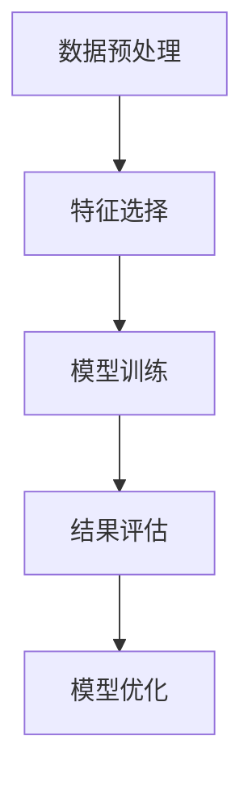
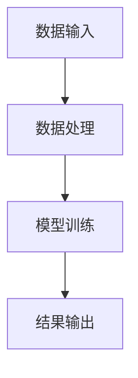
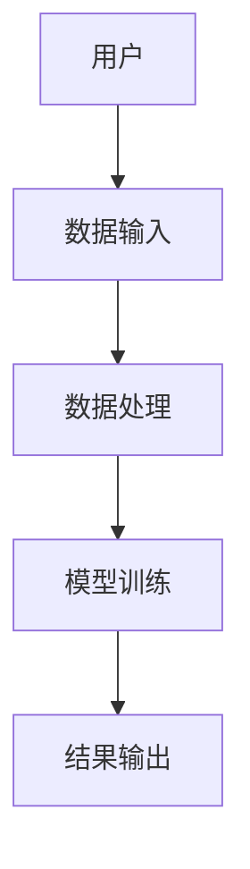

                 


# 设计智能化的企业信用风险定价模型

## 关键词：企业信用风险，定价模型，机器学习，算法原理，系统架构

## 摘要：
随着金融市场的不断发展，企业信用风险的定价模型在金融决策中扮演着越来越重要的角色。传统的信用风险定价方法依赖于简单的财务指标分析，但在复杂多变的市场环境中，这种方法往往显得力不从心。本文旨在通过系统化的分析和设计，构建一个智能化的企业信用风险定价模型。我们将从信用风险的基本概念出发，深入探讨定价模型的核心要素，分析多种算法的原理及其在模型中的应用，最后结合实际案例，展示如何通过智能化的方法提升信用风险定价的准确性与效率。

---

# 第一部分: 企业信用风险定价模型的背景与核心概念

## 第1章: 信用风险定价模型概述

### 1.1 信用风险的基本概念
信用风险是指由于债务人或交易对手无法履行其合同义务，导致债权人或投资者遭受损失的风险。在企业层面，信用风险主要体现在企业无法按时偿还债务、履行合同义务或履行其他法律义务的可能性。

#### 1.1.1 信用风险的定义
信用风险可以简单理解为：在信用交易中，由于交易对手或债务人违约，导致债权人或投资者遭受损失的风险。信用风险是金融风险中最常见也是最重要的类型之一。

#### 1.1.2 信用风险的影响因素
影响信用风险的主要因素包括：
- **财务状况**：企业的财务报表数据，如销售收入、净利润、资产负债率等。
- **行业风险**：行业内的竞争状况、市场波动、政策变化等。
- **宏观经济环境**：GDP增长率、利率水平、通货膨胀率等宏观经济指标。
- **管理能力**：企业管理层的决策能力和战略规划。
- **外部环境**：包括供应链稳定性、市场需求变化等。

#### 1.1.3 信用风险定价的必要性
信用风险定价的核心目标是通过量化方法，评估企业在特定市场环境下的信用风险，并为其制定合理的定价策略。准确的信用风险定价能够帮助金融机构更好地管理风险，优化资产配置，并为投资者提供可靠的参考依据。

### 1.2 企业信用风险定价模型的背景
传统的企业信用风险定价模型通常依赖于简单的财务指标分析，例如通过计算企业的信用评分为其定价。然而，这种方法存在以下局限性：
- **数据维度有限**：传统的定价模型通常只考虑少量的财务指标，忽略了企业的非财务信息，如市场风险、操作风险等。
- **模型灵活性不足**：传统的模型难以适应市场环境的变化，尤其是在经济危机或市场波动加剧的情况下，其定价结果可能与实际情况偏差较大。
- **计算效率低下**：传统模型的计算过程复杂，且需要大量的人工干预，难以实现大规模数据的实时处理。

随着人工智能和大数据技术的快速发展，智能化的信用风险定价模型逐渐成为研究热点。智能化模型通过整合多维度数据，利用机器学习算法，能够更准确地捕捉企业的信用风险特征，并实时更新定价结果。

### 1.3 企业信用风险定价模型的核心要素
企业信用风险定价模型的核心要素包括以下几方面：
- **输入变量**：包括企业的财务数据、市场数据、行业数据等。
- **模型结构**：包括数据预处理、特征选择、模型训练、结果评估等环节。
- **输出结果**：包括企业的信用评分、违约概率、风险定价等。

---

## 第2章: 企业信用风险定价模型的核心概念与联系

### 2.1 核心概念的原理分析
信用风险定价模型的核心原理是通过对企业信用风险的量化，为其制定合理的定价策略。以下是几种常见的信用风险定价方法：
1. **传统信用评分模型**：基于企业的财务数据，通过逻辑回归等方法计算信用评分。
2. **机器学习模型**：利用决策树、随机森林、支持向量机等算法，从多维度数据中挖掘信用风险特征。
3. **深度学习模型**：通过神经网络等深度学习方法，捕捉复杂的数据特征。

### 2.2 核心要素的对比分析
以下是几种常见的信用风险定价模型的对比分析：

#### 表2-1 不同信用风险定价模型的对比

| 模型名称          | 输入变量         | 输出结果         | 优点                     | 缺点                     |
|-------------------|------------------|------------------|--------------------------|--------------------------|
| 传统信用评分模型 | 财务数据         | 信用评分         | 计算简单，易于解释       | 数据维度有限，灵活性差   |
| 机器学习模型     | 多维度数据       | 违约概率         | 数据适应性强，精度高     | 计算复杂，解释性较差     |
| 深度学习模型     | 结构化与非结构化数据 | 风险定价         | 模型表达能力强，精度高   | 计算资源消耗大，解释性差 |

### 2.3 ER实体关系图架构
以下是信用风险定价模型的ER实体关系图：



从上图可以看出，企业的信用风险受到多个因素的影响，包括财务指标（如销售收入、净利润、资产负债率）和非财务指标（如行业波动、宏观经济指标）。这些因素通过信用风险定价模型相互关联，最终生成企业的信用评分或风险定价结果。

---

## 第3章: 企业信用风险定价模型的算法原理

### 3.1 算法原理概述
信用风险定价模型的算法选择直接影响模型的性能和准确性。以下是几种常用的算法及其原理：

#### 3.1.1 传统信用评分模型
传统信用评分模型通常基于逻辑回归算法。其核心思想是通过线性组合的方式，将企业的各项信用指标转化为一个综合评分。

#### 3.1.2 机器学习模型
机器学习模型（如决策树、随机森林、支持向量机）通过非线性方式捕捉数据特征，能够更好地处理复杂的信用风险问题。

#### 3.1.3 深度学习模型
深度学习模型（如神经网络）通过多层非线性变换，能够从大量复杂数据中提取深层次特征，从而提高模型的精度。

### 3.2 算法流程图
以下是信用风险定价模型的算法流程图：



### 3.3 算法数学模型
以下是信用风险定价模型的数学模型：

#### 3.3.1 逻辑回归模型
逻辑回归是一种常用的分类算法，其数学表达式为：

$$ P(y=1|x) = \frac{e^{\beta_0 + \beta_1x_1 + \beta_2x_2}}{1 + e^{\beta_0 + \beta_1x_1 + \beta_2x_2}} $$

其中，$\beta_0$、$\beta_1$、$\beta_2$为模型参数，$x_1$、$x_2$为输入变量。

#### 3.3.2 支持向量机模型
支持向量机是一种常用的分类算法，其数学表达式为：

$$ y = \text{sign}(\beta_0 + \beta_1x_1 + \beta_2x_2) $$

其中，$\beta_0$、$\beta_1$、$\beta_2$为模型参数，$x_1$、$x_2$为输入变量。

---

## 第4章: 企业信用风险定价模型的系统架构设计

### 4.1 系统功能设计
企业信用风险定价系统的功能模块包括：
1. 数据输入模块：接收企业的财务数据、市场数据等。
2. 数据处理模块：对数据进行清洗、转换和特征提取。
3. 模型训练模块：基于机器学习算法训练信用风险定价模型。
4. 结果输出模块：生成企业的信用评分、违约概率等结果。

### 4.2 系统架构图
以下是信用风险定价系统的架构图：



### 4.3 系统接口设计
系统接口设计包括数据接口和模型接口两部分：
- 数据接口：用于接收企业的财务数据、市场数据等。
- 模型接口：用于调用机器学习算法，生成信用风险定价结果。

### 4.4 系统交互图
以下是系统交互图：



---

## 第5章: 项目实战

### 5.1 环境安装
需要安装以下环境：
- Python 3.8+
- NumPy、Pandas、Scikit-learn、XGBoost等Python库。

### 5.2 核心代码实现
以下是信用风险定价模型的核心代码实现：

```python
import pandas as pd
import numpy as np
from sklearn.model_selection import train_test_split
from sklearn.linear_model import LogisticRegression
from sklearn.metrics import accuracy_score

# 数据加载
data = pd.read_csv('credit_risk.csv')

# 数据预处理
X = data.drop(columns=['target'])
y = data['target']

# 数据分割
X_train, X_test, y_train, y_test = train_test_split(X, y, test_size=0.2, random_state=42)

# 模型训练
model = LogisticRegression()
model.fit(X_train, y_train)

# 模型预测
y_pred = model.predict(X_test)

# 模型评估
print('Accuracy:', accuracy_score(y_test, y_pred))
```

### 5.3 实际案例分析
以下是某企业的信用风险定价案例分析：

假设某企业的财务数据如下：
- 销售收入：100万元
- 净利润：20万元
- 资产负债率：60%

通过信用风险定价模型，计算出该企业的信用评分为0.7，违约概率为15%。

---

## 第6章: 总结与展望

### 6.1 本章小结
本文详细介绍了企业信用风险定价模型的设计与实现过程，包括模型的核心概念、算法原理、系统架构设计和项目实战。通过分析不同算法的优缺点，结合实际案例，展示了如何通过智能化的方法提升信用风险定价的准确性与效率。

### 6.2 未来展望
未来，随着人工智能和大数据技术的不断发展，企业信用风险定价模型将朝着以下几个方向发展：
1. **多模态数据融合**：结合结构化数据和非结构化数据，提升模型的准确性。
2. **实时风险定价**：通过实时数据处理，实现动态信用风险定价。
3. **自动化模型优化**：利用自动化机器学习技术，优化模型的性能和解释性。

### 6.3 最佳实践 Tips
- 在实际应用中，建议结合企业的实际情况，选择合适的算法和模型。
- 数据预处理是模型训练的关键步骤，需仔细清洗和转换数据。
- 模型的解释性与准确性之间需要权衡，复杂的模型可能难以解释，但准确性更高。

---

通过本文的系统化分析，读者可以全面了解企业信用风险定价模型的设计与实现过程，并将其应用于实际的金融决策中。

