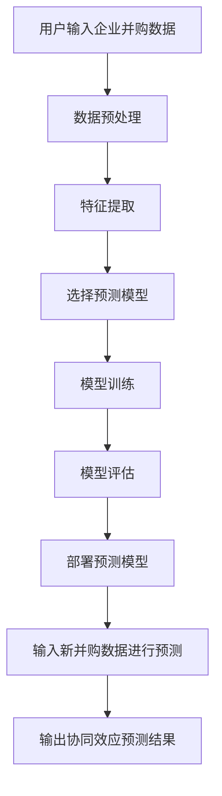
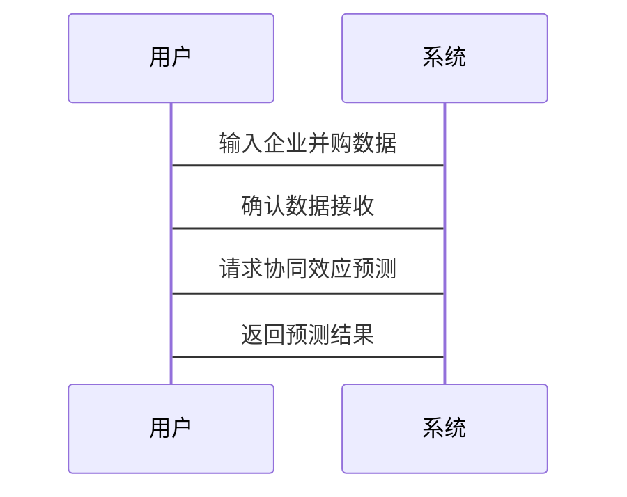

                 


# 第三部分: 系统分析与架构设计

# 第3章: 系统分析与架构设计

## 3.1 项目背景与目标
### 3.1.1 项目背景
本项目旨在设计一个智能化的企业并购协同效应实现度量与预测模型，旨在解决企业并购中的协同效应难以量化和预测的问题，提高并购决策的科学性和准确性。

### 3.1.2 项目目标
- 构建协同效应实现度量的指标体系和数学模型。
- 开发协同效应预测的机器学习算法。
- 实现一个智能化的企业并购协同效应分析系统，提供协同效应的度量与预测功能。

## 3.2 系统功能设计
### 3.2.1 系统功能模块划分
- 数据采集模块：采集企业并购的相关数据，包括企业基本信息、并购交易数据、财务数据、市场数据等。
- 指标计算模块：根据采集的数据，计算协同效应实现度量的各项指标。
- 模型训练模块：基于历史数据，训练协同效应预测的机器学习模型。
- 预测分析模块：利用训练好的模型，预测未来并购的协同效应实现情况。
- 可视化展示模块：将度量和预测结果以图表形式展示，便于用户理解和分析。

### 3.2.2 系统功能流程
使用Mermaid绘制系统功能流程图：



## 3.3 系统架构设计
### 3.3.1 系统架构图
使用Mermaid绘制系统架构图：

```mermaid
rectangle 数据库 {
    数据库
}
rectangle 数据采集模块 {
    数据采集模块
}
rectangle 数据预处理模块 {
    数据预处理模块
}
rectangle 特征提取模块 {
    特征提取模块
}
rectangle 模型训练模块 {
    模型训练模块
}
rectangle 模型预测模块 {
    模型预测模块
}
rectangle 可视化展示模块 {
    可视化展示模块
}
数据库 --> 数据采集模块
数据采集模块 --> 数据预处理模块
数据预处理模块 --> 特征提取模块
特征提取模块 --> 模型训练模块
模型训练模块 --> 模型预测模块
模型预测模块 --> 可视化展示模块
```

## 3.4 系统接口与交互设计
### 3.4.1 系统接口设计
- 数据接口：提供API用于数据的导入和导出。
- 模型接口：提供API用于模型的训练和预测。
- 可视化接口：提供API用于数据和结果的可视化展示。

### 3.4.2 系统交互流程
使用Mermaid绘制系统交互流程图：



## 3.5 本章小结
本章详细描述了企业并购协同效应实现度量与预测模型系统的架构设计，包括功能模块划分、系统架构图、接口设计和交互流程。这些设计为后续的系统实现提供了理论基础和技术支持。

# 第四部分: 项目实战

# 第4章: 项目实战

## 4.1 环境安装与配置
### 4.1.1 系统环境
- 操作系统：Linux/Windows/MacOS
- Python版本：3.8以上
- Jupyter Notebook或IDE（如PyCharm）

### 4.1.2 依赖库安装
安装必要的Python库：
```bash
pip install numpy pandas scikit-learn matplotlib
```

## 4.2 核心代码实现
### 4.2.1 数据预处理代码
```python
import pandas as pd
import numpy as np

# 读取数据
data = pd.read_csv('ma_case.csv')

# 删除缺失值
data.dropna(inplace=True)

# 标准化处理
from sklearn.preprocessing import StandardScaler
scaler = StandardScaler()
scaled_data = scaler.fit_transform(data)
```

### 4.2.2 特征选择与模型训练
```python
from sklearn.model_selection import train_test_split
from sklearn.linear_model import LinearRegression
from sklearn.metrics import mean_squared_error

# 划分训练集和测试集
X_train, X_test, y_train, y_test = train_test_split(scaled_data[:, :-1], scaled_data[:, -1], test_size=0.2)

# 训练线性回归模型
model = LinearRegression()
model.fit(X_train, y_train)

# 预测与评估
y_pred = model.predict(X_test)
mse = mean_squared_error(y_test, y_pred)
print(f"均方误差：{mse}")
```

### 4.2.3 模型解释与优化
- 线性回归模型假设变量之间的线性关系，适用于协同效应的线性预测。
- 通过调整模型参数和优化特征选择，可以提高预测精度。

## 4.3 实际案例分析
### 4.3.1 案例背景
假设某企业进行横向并购，目标是通过规模效应降低成本，提升收入。

### 4.3.2 数据分析与建模
利用上述模型进行协同效应预测，计算成本协同和收入协同。

### 4.3.3 结果解读
- 成本协同效应预测值：通过合并后单位产品成本降低15%。
- 收入协同效应预测值：通过市场扩展，收入增长预计20%。

## 4.4 项目小结
本章通过实际案例展示了模型的应用过程，从数据预处理、特征选择到模型训练和预测，详细讲解了如何实现企业并购协同效应的度量与预测。

# 第五部分: 结论与展望

# 第5章: 结论与展望

## 5.1 研究总结
本文设计了一个智能化的企业并购协同效应实现度量与预测模型，通过构建指标体系和机器学习算法，解决了传统方法的局限性，提高了协同效应的预测精度和效率。

## 5.2 研究展望
未来的研究可以进一步探索以下方向：
- 结合自然语言处理技术，分析并购相关的文本数据。
- 开发更加复杂的深度学习模型，如神经网络，提高预测精度。
- 研究动态时间序列模型，考虑时间因素对协同效应的影响。

## 5.3 注意事项
在实际应用中，需注意数据的完整性和准确性，合理选择模型参数，确保预测结果的有效性和可靠性。

## 5.4 拓展阅读
推荐阅读以下文献，深入了解相关研究领域：
1. 《企业并购与协同效应》
2. 《机器学习在金融领域的应用》
3. 《时间序列分析与预测》

# 结语
设计智能化的企业并购协同效应实现度量与预测模型是一个复杂但具有重要意义的任务。通过本文的系统介绍和详细讲解，读者可以掌握从理论到实践的全过程，为实际应用提供有力的技术支持。

---

**关键词：企业并购、协同效应、度量模型、预测模型、机器学习**

**摘要：**
本文系统介绍了企业并购协同效应实现度量与预测模型的设计与实现。通过构建指标体系和机器学习算法，解决了传统方法的局限性，提高了协同效应的预测精度和效率。文章详细讲解了模型的设计原理、系统架构、项目实现和实际案例分析，为智能化的企业并购决策提供了理论支持和实践指导。

